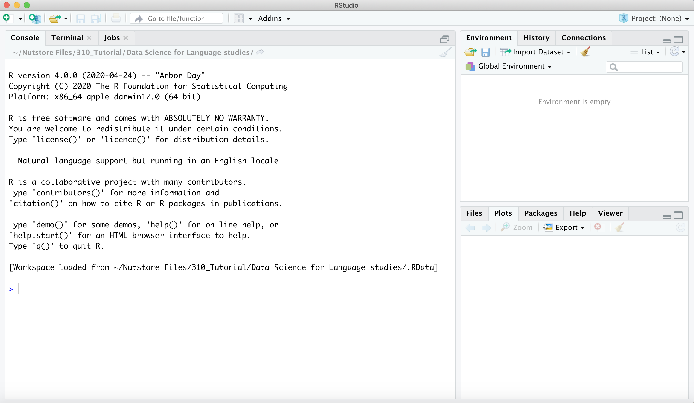
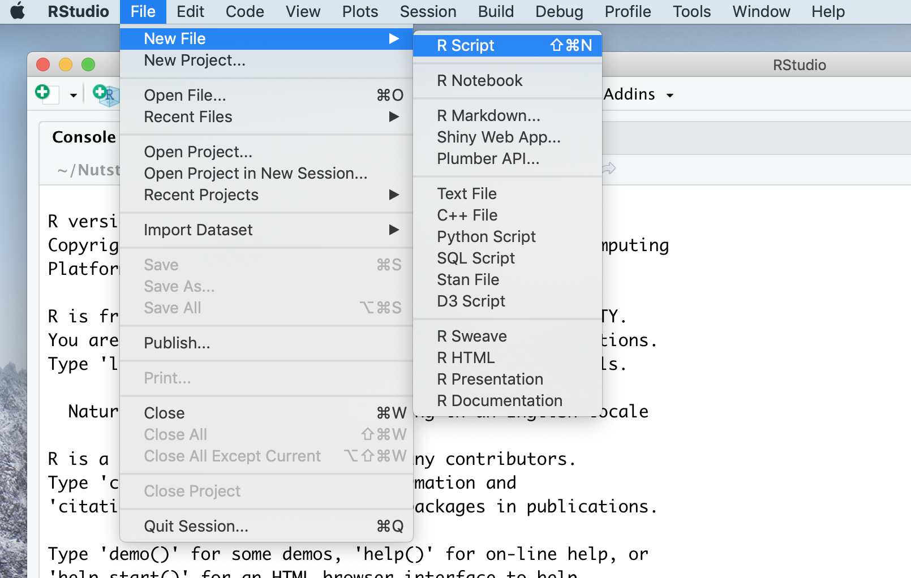
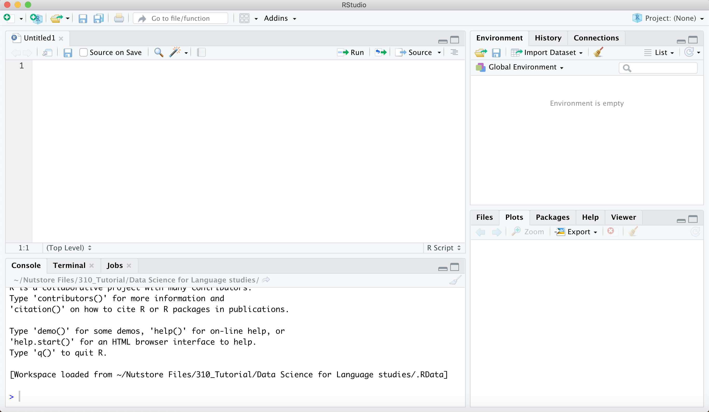

# 第二章 R语言简介


## R语言发展简史


## R、R-Studio、R软件包的安装简介
&emsp;&emsp;R语言的安装
使用这个链接https://cloud.r-project.org/来下载R语言软件。根据你的电脑操作系统，选择相应的版本。

&emsp;&emsp;R语言可以在计算机上通过终端命令直接运行，也有自己的图形界面。但是RStudio 是最适用于初学者的R 编程的集成开发环境(integrated development environment，IDE)。使用者可以从 http://www.rstudio.com/download 下载并安装。其中免费版已经可以满足数据科学的需求了。

&emsp;&emsp;它提供了许多功能，如代码编辑器、调试器、数据可视化和包管理器等，使得R语言的学习和使用变得更加方便和高效。R-Studio被广泛用于数据科学、统计分析、机器学习和数据可视化等领域。

> 不同软件包使用：https://github.com/JuqiangJ/cheatsheets




&emsp;&emsp;首先，初始界面有3个区域。在图中左侧区域是输入和运行代码区域，右侧上部的区域目前选中的是environment也就是环境变量的显示窗口。当前并没有输入任何代码，所以环境变量的窗口是空白。在右侧下部，对窗口有5个不同的按键：文件（File），制图（Plots），程序包（Packages），帮助（Help），视图（Viewer）。目前选中的是作图窗口。
在代码运行窗口，我们可以输入命令，然后按回车键即可运行命令。如果我们想要将命令写成脚本，方便重复使用，修改，那需要新建一个脚本文件。

&emsp;&emsp;我们推荐两种方式书写脚本，一种是把脚本文件格式，另外一种是Rmarkdown文件格式。
脚本文件格式




&emsp;&emsp;当我们新建了一个脚本文件，就会出现一个窗口。原先的代码运行窗口，变换到了左边的下部，而在左边上部出现了一个新的窗口。这就是脚本书写窗口。在这里书写的脚本，我们可以通过选中来运行。



安装一个软件包package
```{r}

install.packages("tidyverse")

```


## R语言的数据结构

&emsp;&emsp;在R中，基本的数据结构有向量（vector），数组（array），列表（list），数据框（data frame）和因子（factor）。

### 向量（vector）

&emsp;&emsp;向量是一种最基本的一维数据结构，可以包含*相同类型*的元素（data element）。元素的类型有数值型、字符串型、布尔型。可以通过使用c()函数创建向量，并且可以使用一系列基本函数索引、访问和修改向量中的元素。

```{r eval=F, echo=T, collapse = TRUE}
#创建一个包含整数的向量
vector <- c(1, 2, 3, 4, 5)

# 创建不同类型的向量
# 数值型
a = 8:17

b <- c(9, 10, 100, 38)

# 布尔型
c = c (TRUE, FALSE, TRUE, FALSE)

c = c (T, F, T, F)

# 字符型
d = c ("TRUE", "FALSE", "FALSE")

# 改变向量的类型

as.vector(b, mode = "character")

```


&emsp;&emsp;值得注意的是，如果不同类型的数据被放入同一个向量，数据类型会发生改变。数值型数据会强制改变为字符型数据或布尔型数据。

```{r eval=F, echo=T}
e = c(9,10, "ab", "cd")

f = c(10, 11, T, F)
```

除了单个输入之外，我们可以借助R语言的一些函数，批量生成向量中的元素。

```{r eval=F, echo=T}
A = 9:20 + 1 # A 是一个从9到20的向量，并且每个元素都加上了1。

B = seq(1, 10)# B 是一个从1到10的向量，其中的数字是连续的。

C = seq(1, 20, by = 2)#C 是一个从1到20的向量，步长为2，也就是只包含奇数。

D = rep(5, 4)# D 是一个包含了4个5的向量。

E = rep(c(1, 2, 3), 4)# E 是一个重复了4次的向量，其中包含了1、2、3这三个元素。

G = rep(c(1, 2, 3), each = 4)# G 是一个重复了4次的向量，其中每个元素都重复了4次，即先重复1四次，然后重复2四次，最后重复3四次。

```


&emsp;&emsp;R语言中的一些基本函数，可以对包含不同类型数据的向量进行操作。

```{r eval=F, echo=T}
#length(): 返回向量的长度。
vector <- c(1, 2, 3, 4, 5)

length(vector)

# is.na(): 检查向量中是否存在缺失值（NA）。
vector<- c(1, NA, 3, NA, 5)
is.na(vector)

# which(): 返回满足条件的元素在向量中的索引。
vector<- c(1, 2, 6, 7, 8)
which(vector > 3)

# sample(): 随机从向量中抽取元素。可以用于实验随机抽样。
vector <- c(1:100)
sample(vector, size = 3)

```

&emsp;&emsp;针对数值型向量的简单计算函数

```{r eval=F, echo=T}
# sum(): 计算向量中所有元素的和。
vector <- c(1:50)
sum(vector)

# mean(): 计算向量的平均值。

mean(vector)

# median(): 计算向量的中位数。

median(vector)

# min(): 返回向量中的最小值。

min(vector)

# max(): 返回向量中的最大值。

max(vector)

# sort(): 将向量中的元素按升序排序。

sort(vector)

# rev(): 反转向量中元素的顺序。

rev(vector)

# unique(): 返回向量中唯一的元素。
vector = c(1,2,33,4,4,4,5,6,345)
unique(vector)

# range(): 返回向量的取值范围（最小值和最大值）。
range(vector )

quantile(vector)

round(sd(vector), 2)

```

针对字符串型向量的函数

```{r eval=F, echo=T}
# paste(): 将向量中的元素连接为一个字符串。
vector <- c("我", "爱", "XXX!")
paste(vector, collapse = " ")

# tolower(): 转换向量中的字符为小写。
vector <- c("HELLO", "WORLD", "!")
tolower(vector)

# toupper(): 转换向量中的字符为大写。
vector <- c("hello", "world", "!")
toupper(vector)

# grep(): 在向量中搜索满足条件的模式，并返回其索引。
vector <- c("苹果", "香蕉", "胡萝卜", "橙子")
grep("果", vector)

```
### 列表（list）

&emsp;&emsp;列表是一种可以包含不同类型的元素的数据结构。列表可以使用list()函数创建，可以使用索引或元素名称来访问和修改列表中的元素。

```{r eval=F, echo=T}

# 创建一个包含整数、字符和向量的列表：
my_list <- list(1, "a", c(2, 3, 4))

my_list
```


&emsp;&emsp;列表的简单操作

```{r eval=F, echo=T}
# unlist() 函数：将list转换为向量。
my_list <- list("apple", "banana", "orange")

unlist(my_list) 

# lapply()：对list中的每个元素应用一个函数。
my_list <- list(1:3, 4:6, 7:9)

lapply(my_list, mean)

# sapply()：对list中的每个元素应用一个函数，并将结果简化为向量。
my_list <- list(1:3, 4:6, 7:9)
sapply(my_list, mean)

```

&emsp;&emsp;在建立回归模型后，可以将结果存储在一个列表中。

```{r eval=F, echo=T}
# 这行代码使用R中的lm()函数（线性模型）来拟合一个线性回归模型。模型的目标（因变量）是mpg（每加仑英里数），预测变量（自变量）是hp（马力）。数据源是R自带的mtcars数据集。
model <- lm(mpg ~ hp, data = mtcars)
# 这行代码创建一个列表，其中包含了线性模型的系数（coefficients）、残差（residuals）和拟合值（fitted.values）。
model_summary <- list(coefficients = model$coefficients, 
                      residuals = model$residuals, 
                      fitted.values = model$fitted.values)
#这行代码返回并打印model_summary列表的内容。
model_summary
```


### 矩阵（matrix）

&emsp;&emsp;矩阵是一个二维数组，其中的所有元素都具有相同的模式（数字、字符或逻辑）。你可以通过matrix()函数来创建矩阵。


```{r eval=F, echo=T}

# 创建一个3行2列的矩阵：

data <- 1:6
matrix1 <- matrix(data, nrow = 3, ncol = 2)
print(matrix1)

```

&emsp;&emsp;在这个示例中，我们首先创建了一个从1到6的向量 data，然后我们创建了一个3行2列的矩阵 matrix1，并将这个向量的数据按列存入矩阵。输出的结果会是一个3行2列的矩阵，元素值按列从1到6。


### 数据框（data frame）

&emsp;&emsp;数据框是一种表格形式的数据结构。数据框可以包含不同类型的列，但是每列长度必须相同。数据框可以使用data.frame()函数创建，并可以使用列名称或索引来访问和修改数据框中的数据。

例如，创建一个包含姓名和年龄的数据框：
```{r }
# 创建一个数据框
df <- data.frame(
  name = c("John", "Mary", "Peter"),
  age = c(25, 32, 45),
  gender = c("Male", "Female", "Male")
)
```

```{r eval=F, echo=T}
# summary()：用于查看数据框的统计信息。
summary(df) #（输出df的基本统计信息，包括均值、中位数、最大值、最小值等。）

```

&emsp;&emsp;对于字符类型（如 name 和 gender），summary() 函数会显示变量长度。

&emsp;&emsp;对于数值类型（如 age），summary() 函数会显示最小值（Min.）、第一四分位数（1st Qu.）、中位数（Median）、平均值（Mean）、第三四分位数（3rd Qu.）和最大值（Max.）。

```{r }
# 查看数据框的结构
str(df)
```
在输出结果中，以下是每一部分的含义：

- 'data.frame'：这是 df 的数据类型，即数据框（data frame）。

- 3 obs. of 3 variables：这表示 df 有3个观察值（即行）和3个变量（即列）。

接下来的部分列出了数据框的每一个变量（列）：

- name : chr "John" "Mary" "Peter"： name 表示 df 的一个变量是 name，: chr 表示 name 变量的数据类型是字符型 (character)，接着的 "John" "Mary" "Peter" 是 name 变量的前几个观察值。

- age : num 25 32 45：age 表示 df 的另一个变量是 age，: num 表示 age 变量的数据类型是数值型 (numeric)，接着的 25 32 45 是 age 变量的前几个观察值。

- gender: chr "Male" "Female" "Male"：gender 表示 df 的另一个变量是 gender，: chr 表示 gender 变量的数据类型是字符型 (character)，接着的 "Male" "Female" "Male" 是 gender 变量的前几个观察值。

```{r eval=F, echo=T}
# nrow()：用于计算数据框的行数。
nrow(df) #（输出df的行数。）

# ncol()：用于计算数据框的列数。
ncol(df) #（输出df的列数。）

# head()：用于查看数据框的前几行数据。
head(df, n = 2) #（输出df的前10行数据。）

# tail()：用于查看数据框的后几行数据。
tail(df, n = 2) #（输出df的后5行数据。）

# unique()：用于去重并输出数据框中唯一的值。
unique(df$gender) #（输出df中gender列的唯一值。）

```

&emsp;&emsp;矩阵和数据框都是二维数据结构。有时候，我们可能需要将数据框转换为矩阵格式，以便于进行某些特定的数据处理（比如进行归一化处理）。很多机器学习算法（例如SVM、KNN等）在训练时，需要数据以矩阵形式输入。此外，在文本分析中，词频-文档矩阵通常非常稀疏，也就是说，矩阵中的大部分元素都是零（因为每个文档只包含词汇表中的一小部分词语）。而在R中，数据框不支持稀疏数据，如果我们尝试将一个大的稀疏矩阵存储为数据框，那么它将占用大量的内存。相反，词频-文档矩阵通常以稀疏矩阵的形式存储，这种格式只存储非零元素，从而大大节省了内存。在文本分析中，我们经常需要对词频-文档矩阵进行各种矩阵运算，例如矩阵乘法、转置等。在R中，数据框不支持这些矩阵运算，如果我们尝试对数据框执行这些操作，那么我们需要先将其转换为矩阵。

### 数组（array）
&emsp;&emsp;数组是一个可以存储具有相同数据类型元素的多维数据结构。可以使用array()函数创建数组。

```{r eval=F, echo=T}
# 创建一个一维数组：
data <- 1:10
array1 <- array(data, dim = c(10))
print(array1)
# 在这个示例中，我们首先创建了一个从1到10的向量 data，然后我们创建了一个一维数组 array1，并将这个向量的数据存入数组。输出的结果会是1到10的一维数组。

# 创建一个二维数组：
data <- 1:12
array2 <- array(data, dim = c(3, 4))
print(array2)
# 在这个示例中，我们创建了一个二维数组 array2，它有3行4列。输出的结果会是一个3行4列的二维数组，元素值从1到12。

# 创建一个三维数组：
data <- 1:24
array3 <- array(data, dim = c(2, 3, 4))
print(array3)
# 在这个示例中，我们创建了一个三维数组 array3，它有2个2行3列的面。输出的结果会是一个2行3列，共有2个面的三维数组，元素值从1到24。
```
&emsp;&emsp;在数据科学实践中，尽管数组可能不如数据框或列表那么常用，但它们在某些特定的情况下是非常有用的。例如，数据以多维形式出现时，数组可以是理想的数据结构。例如，不同时间、不同地点收集到了大气温度数据，可以存储在一个三维数组中，其中一个维度代表时间，另一个维度代表经度，第三个维度代表纬度。在这种情况下，使用数组可以使数据的处理和分析更加直观和方便。

|Dimensions|Homogenous|Heterogeneous|
|---|---|---|
|1D|Vector|List|
|2D|Matrix|Data frame|
|nD|Array	|

&emsp;&emsp;在R语言中，有五种主要的数据结构：向量（vector）、矩阵（matrix）、数组（array）、列表（list）和数据框（data frame）。这些数据结构是R编程中非常常用的，可以帮助我们有效地组织和处理数据。每种数据结构都有其特定的用途，适用于处理不同类型和维度的数据。

