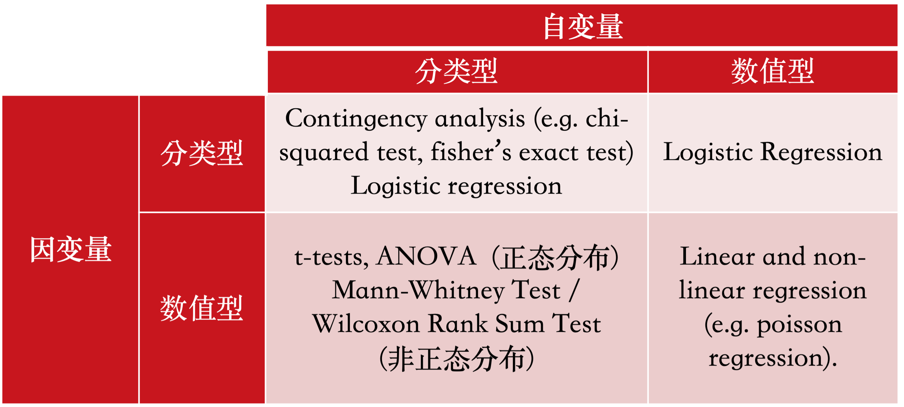

# 第八章 统计建模

在之前的章节中，我们介绍了数据的描述性统计和可视化方法。这些方法可以帮助我们对数据本身的基本趋势有所了解。然而在科学研究中，我们收集到的数据是我们研究问题中研究对象的样本。如何将我们在样本数据上观察到的结果推广到总体中去呢？这个时候我们需要借助推断性统计（inferential statistics）。

统计建模中，我们不仅需要明确变量是分类变量还是连续变量，还有明确变量之间的关系（因变量和自变量）。

因变量（Dependent Variable）是研究中被测量或观察的变量，它是研究者感兴趣的结果。因变量的变化被假设为由自变量的变化引起的。在实验或研究中，因变量通常是研究者希望解释或预测的现象。

自变量（Independent Variable）
自变量是研究中被操纵或分类的变量，它是研究者用来影响因变量的因素。自变量是研究中主动改变或控制的条件，用于测试其对因变量的影响。在一个研究咖啡因对学习成绩影响的实验中，咖啡因的摄入量就是自变量，学生的学习成绩就是因变量。

此外，在选择统计模型时我们还要考虑数据本身的特点是否满足一些模型的需要。参数统计检验（Parametric Statistical Tests）和非参数统计检验（Non-Parametric Statistical Tests）是统计分析中两类主要的方法，它们在假设前提和应用场景上有所不同。
参数统计检验，通常假设数据来自一个正态分布（即正态性假设），并且数据为连续型。这类检验依赖于数据参数（如均值和标准差），因此得名为参数统计检验。常见的参数检验：t检验（t-test，用于比较两个样本均值之间的差异）、方差分析（ANOVA，用于比较多个样本均值之间的差异）、线性回归（Linear Regression，用于分析两个或多个变量之间的线性关系）。
在假设满足的情况下，参数统计检验通常具有更高的统计效率（即更强的检验能力）。如果假设不满足，结果可能不可靠。


非参数统计检验不依赖于数据的特定分布假设，适用于数据不满足参数统计检验的假设前提的情况，特别是当数据为分类数据时。


常见的非参数检验：Mann-Whitney U检验（用于比较两组独立样本的秩次）、Wilcoxon符号秩检验（用于比较两组配对样本的秩次）、 斯皮尔曼相关系数（Spearman's Rank Correlation，用于分析两个变量之间的秩次相关性）。

非参数统计检验能处理小样本和异常值。但是统计效率通常低于参数统计检验，可能需要更大的样本量来达到相同的统计检验能力。




```{r message=FALSE}
library(tidyverse)
setwd("~/Nutstore Files/310_Tutorial/LanguageDS-e")
```


## 因变量和自变量均为分类变量

如果统计建模的因变量和自变量均为分类变量，我们可以使用卡方检验（Chi-Square Test）。卡方检验是一种常用的非参数统计检验方法，通过比较观察频数和期望频数来判断变量之间是否存在显著关系。
卡方独立性检验用于检验两个分类变量之间是否存在关联，通常适用于二维列联表（contingency table）。它回答的问题是：一个变量的分类是否依赖于另一个变量的分类。

```{r }
library(languageR)

data("lexdec")

tbl= table(lexdec$Correct, lexdec$PrevType)

tbl
# 卡方检验
chisq.test(tbl) 

```

## 因变量为连续变量而自变量为分类变量

当因变量为分类变量而自变量为连续变量时，我们可以使用逻辑回归（Logistic Regression）。逻辑回归是一种广泛使用的统计模型，特别适用于处理分类问题，尤其是二分类问题。它通过建立自变量和因变量之间的关系来预测因变量的类别概率。逻辑回归通过一个逻辑函数（Logistic Function），也称为Sigmoid函数，将自变量的线性组合转换为一个概率值。它输出的结果是一个在0到1之间的概率值，用来表示某个事件发生的可能性。

```{r }

#fit logistic regression model
model <- glm(Correct ~ Frequency+FamilySize, 
             family="binomial", 
             data=lexdec)

#disable scientific notation for model summary
options(scipen=999)

#view model summary
summary(model)

caret::varImp(model)

```

## 因变量为连续变量，自变量为分类变量

如果自变量只有两层，可以使用t检验（T-tests）。t检验是一种常见的统计检验方法，用于比较两个样本均值之间的差异。单样本t检验（One-Sample T-test）用于比较一个样本的均值与一个已知的总体均值之间的差异。应用前提是，数据是从正态分布的总体中抽取的。样本是独立随机抽取的。比如，假设某学校声称其学生的平均IQ为100。我们抽取一个班级的学生进行IQ测试，想验证这个班级的平均IQ是否显著不同于100。

独立样本t检验（Independent Samples T-test），用于比较两个独立样本的均值是否显著不同。应用前提是两个样本来自正态分布的总体。两个样本是独立的，即每个样本中的观测值不依赖于另一个样本的观测值。
两个样本的方差相等（同方差性假设）。当不满足同方差性假设时，可以使用Welch’s t检验。
比如，我们想比较男性和女性的平均工资，抽取了一组男性和女性的工资数据，检验两者的平均工资是否有显著差异。

配对样本t检验（Paired Samples T-test）用于比较两个相关样本的均值是否显著不同。通常用于前后测量或配对设计。应用前提是配对差值（即每对观测值的差值）来自正态分布。样本是成对的，每对数据之间有某种相关性。比如，我们想比较一组学生在参加培训前后的考试成绩，检查培训是否对考试成绩有显著影响。


```{r }
# 检测数据是否符合正态分布，P<0.05 不符合正态分布

shapiro.test(lexdec$RT)

plot(density(lexdec$RT))

# 参与者母语是否是英语
t.test(RT ~ NativeLanguage, data=lexdec)

# 汇报Mann–Whitney U test 更好
wilcox.test(RT ~ NativeLanguage, data=lexdec)

```

当自变量有两个以上，或者自变量超过两个水平，我们可以使用方差分析（Analysis of Variance, ANOVA）。方差分析通过分析数据中的变异来源，确定不同组之间的均值是否有显著差异。ANOVA的主要优势在于它能够同时比较多个组的均值，而无需进行多次t检验，从而减少第一类错误的概率。

单因素方差分析（One-Way ANOVA）：用于比较一个因子（自变量）下的多个组（水平）的均值是否存在显著差异。
比如比较不同教学方法对学生成绩的影响。

双因素方差分析（Two-Way ANOVA）：用于比较两个因子（自变量）及其交互作用对因变量的影响。
适用场景：研究不同教学方法和不同学习时间对学生成绩的影响。

重复测量方差分析（Repeated Measures ANOVA）：用于处理同一组受试者在不同时间点或不同条件下的测量数据。比如，同一组学生在不同教学方法下的成绩变化等。

ANOVA 的基本原理是通过将总变异分解为组间变异和组内变异，来判断不同组的均值是否存在显著差异。

在发现整体组间均值存在显著差异后，进一步确定哪些具体组之间存在差异需要使用事后比较（Post-Hoc Comparisons）。因为ANOVA只告诉我们至少有一组均值不同，但不能明确指出哪些组之间存在差异。事后比较中，我们要控制多重比较带来的第一类错误（即假阳性）。常见的方法有Tukey's HSD（Honestly Significant Difference）检验、Bonferroni检验等。


```{r }

lex.aov = aov (RT ~ PrevType + Class, data = lexdec)

summary(lex.aov)

TukeyHSD(lex.aov)

```

## 因变量与自变量均为连续变量

当我们为两个或以上连续型变量建模时，我们可以使用相关分析和线性回归。

相关分析确定一个变量是否随着另一个变量的变化而系统地变化。它不指定哪个变量是因变量，哪个变量是自变量。比较合适观察数据集中哪些变量彼此相关。Pearson, Spearman 和 Kendall 是三种常见的相关性检验方法，主要用于衡量两个变量之间的相关程度。尽管它们都用于相关性分析，但它们有不同的假设和适用场景。

Pearson相关系数（Pearson Correlation Coefficient）是最常用的相关性测量方法，用于衡量两个变量之间的线性关系。假设前提：数据是连续的，符合正态分布，数据之间存在线性关系。数据是独立的。简单易计算，结果易于解释。在数据符合正态分布且有线性关系时，效果最好。对异常值敏感。不能有效处理非线性关系。

Spearman相关系数（Spearman Rank Correlation Coefficient）是基于数据排序的非参数检验方法，用于衡量两个变量之间的单调关系。假设前提有数据是连续的或离散的。数据不需要符合正态分布。数据之间存在单调关系。适用于衡量两个变量之间的单调关系，例如学生成绩排名和运动成绩排名的关系。对异常值不敏感。可以处理非线性关系。对于完全线性关系，效率不如Pearson相关系数。

```{r }

cor.test( ~ RT + Frequency,
         data = lexdec,
         method = "pearson")

cor.test( ~ RT + Frequency,
         data = lexdec,
         method = "kendall")


cor.test( ~ RT + Frequency,
         data = lexdec,
         method = "spearman")
```

线性回归指定一个变量为自变量，另一个为因变量。所得模型用线性关系来描述这些变量之间的关系。线性回归是参数检验，假设残差的正态性、同方差性和独立性，以及两个变量之间的线性关系。如果模型中有多个区间/比例类型的自变量，那么线性回归将扩展为多元回归。如果自变量是分类变量，那么线性回归将变成单因素方差分析。可以使用 lm 函数来执行线性回归，这与我们用于方差分析的函数相同。

```{r }
lm.model = lm(RT ~ Frequency,
               data = lexdec)

summary(lm.model)

```
lm模型对象的summary函数包括对模型参数（截距和斜率）的估计，以及模型的R平方值和模型的p值。

如何解读模型？
模型产生了截距的系数（6.5）和斜率的系数（-0.04）；

每个系数还伴随着其他三个数字：其标准误差、t值和p值。p值告诉我们系数是否显著不同于零。

如果预测变量的系数为零，则预测变量与因变量之间没有任何关系，因此作为预测变量是毫无价值的。为了确定系数是否显著不同于零，从而具有潜在的预测能力，进行双侧t检验，使用t值和相关的自由度。

t值本身是系数除以其标准误差得到的值。这个标准误差是系数估计的确定程度的衡量。标准误差越小，估计周围的置信区间就越小，接受区域中包含零的可能性就越小，因此系数可能为零的概率也越小。

残差标准误差是模型不成功的度量；它衡量了我们无法通过预测变量处理的因变量的变异性。模型越好，其残差标准误差就越小。

多重R平方为0.8115。这个R平方是平方相关系数r²，它在0到1的范围内量化了模型解释的方差的比例。


