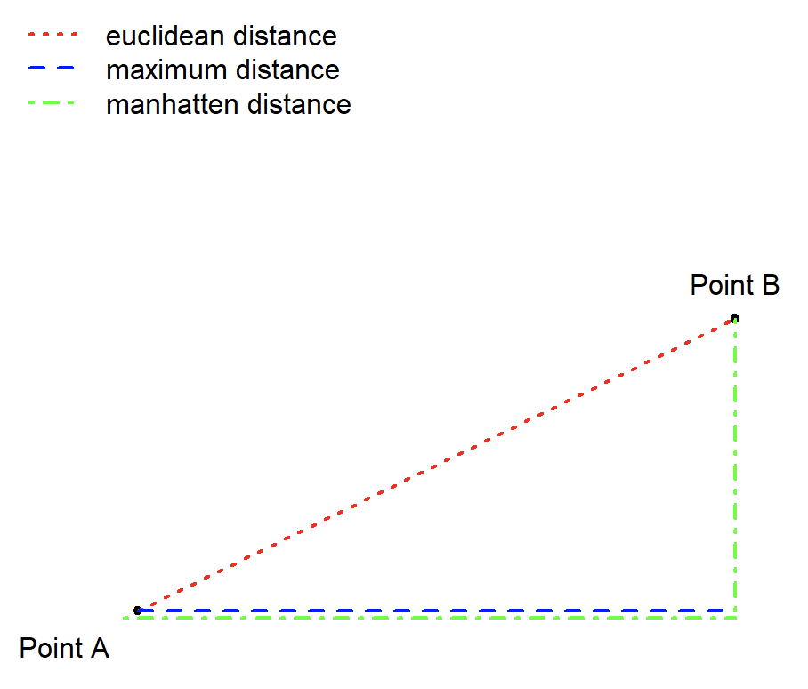

---
output:
  bookdown::word_document2:
    toc: true
  bookdown::pdf_document2:
    keep_tex: true
  bookdown::html_document2: default
---

# 第九章 机器学习建模基础

&emsp;&emsp;对于某一个观测对象收集多个不同的变量（或者叫特征）形成的数据称为多元数据（Multivariate Data） 。例如，在一个关于学生成绩的研究中，你可能会同时记录每个学生的多门课程成绩（如数学、语文、英语等），这些不同课程的成绩就构成了多变量数据。

&emsp;&emsp;多元数据的分析可以通过统计建模，也可以通过机器学习建模。

&emsp;&emsp;在本章中，我们讨论了两种发现多变量数据集结构的方法。在一种方法中，我们试图通过观测值的分组来发现数据中的结构。这些技术是无监督的（unsupervised），因为我们并不预先规定应该存在什么样的分组。我们将在“聚类（clustering）”这个标题下讨论这些技术。另一种方法中，我们理论上知道存在哪些分组，问题在于数据是否支持这些分组。这第二类技术可以被描述为监督式的（supervised），因为这些技术在分析数据时使用的是由分析师强加于数据的分组。我们将这些技术称为分类方法（methods for classification）。


&emsp;&emsp;机器学习（Machine Learning）是人工智能（Artificial Intelligence, AI）的一个重要分支，其主要目标是使计算机通过学习经验数据自动改进和发展。机器学习使计算机从数据中学习模式和规律，从而做出预测或决策，而无需显式地编程。机器学习主要分为2种主要类型，监督学习（Supervised Learning）和无监督学习（Unsupervised Learning）。

&emsp;&emsp;根据学习方式和目标任务的不同，它们各自解决不同类型的问题。监督学习是一种通过已标记的训练数据来训练模型，从而预测或估计新数据的输出。在监督学习中，训练数据包含了输入特征和相应的标签。模型学习从输入到标签之间的映射关系，以便对未知数据进行预测。监督学习的任务可以分为分类（Classification）任务即预测离散类别标签，如垃圾邮件检测、疾病诊断。典型算法包括支持向量机（SVM）、逻辑回归、决策树、随机森林等。回归（Regression）任务则是预测连续数值，如房价预测、销售预测。典型算法包括，线性回归、多项式回归、支持向量回归（SVR）等。

&emsp;&emsp;无监督学习使用未标记的数据，没有预先定义的输出，其目标是发现数据中的隐藏结构或模式。这种学习方法通常用于探索数据的内在关系，发现数据的聚类、降维或异常检测等特征。常见的无监督学习包括聚类分析（Clustering）和降维（Dimensionality Reduction）。聚类分析将数据集划分为不同的组（簇），使每个组内的数据点相似度最大化，而组间的相似度最小化。典型算法包括K均值聚类、层次聚类等。降维减少数据的特征维度，保留最重要的信息，以便更好地可视化和理解数据，同时降低计算复杂度。典型算法包括主成分分析（PCA）、因子分析、独立成分分析（ICA）等。

## 监督学习


&emsp;&emsp;下面将用一个二语语音研究的例子讲解如何使用支持向量机（SVM）和随机森林来对中国英语学习者的焦点语音实现进行自动评估。

&emsp;&emsp;传统的统计建模（如广义线性模型）在大多数先前研究中用于调查信息焦点的语音实现，这些研究检查整个数据集，并通过离散指标检测焦点类型的效果。通常，基于不同的声学测量构建几个模型，以测试不同焦点和语言组的效果，但很难得到全面的图景。而人类听众则逐一听取话语并据此作出判断。这个过程可以通过机器学习算法来模拟，这些算法输入一组特征并基于这些特征输出分类结果。

&emsp;&emsp;支持向量机（SVM）和随机森林模型被用于基于不同的声学测量集分类鼻音元音和口音元音。我们理解，计算感知与人类感知并不完全相同，但计算感知在语音研究中的优势在于它纯粹基于声学特征，因此可以剔除句法或词汇的影响。此外，与识别元音或辅音不同，仅仅给听众一些目标词并测试他们如何识别不同的焦点是困难的。机器学习算法可以在没有上下文的情况下识别不同的焦点，从而从感知的角度接近这个问题。
焦点是话语中提供信息的部分，与句子的背景信息形成对比。为了进一步解释焦点在话语中的作用，以下是具体例子：

(a) **广泛焦点（Broad Focus, BF）**
   - A: 你明天有什么计划？
   - B: 我想去纽约。

在这个例子中，B的整个回答都在提供新信息，因此整个句子是焦点。

(b) **狭窄焦点（Narrow Focus, NF）**
   - A: Karel想带你去哪里？
   - B: 他想带我去纽约。

在这个例子中，焦点是“纽约”，因为这是B回答A的问题“哪里”的特定信息。

(c) **纠正焦点（Corrective Focus, CF）**
   - A: 你妈妈想送你去芝加哥吗？
   - B: 不，她想送我去纽约。

&emsp;&emsp;在这个例子中，焦点也是“纽约”，但这次是为了纠正A的问题中的错误信息“芝加哥”。通过这些例子可以看出，焦点的范围和功能可以根据对话中的具体信息需求和信息状态有所不同。

&emsp;&emsp;不同语言的母语者使用不同语音手段（如音高重音分布、短语边界、音高范围和持续时间）来表达不同焦点条件下的意义。本研究采用两种机器学习模型，支持向量机（SVM）和随机森林（Random Forest），来探讨基于语音特征的不同类型信息焦点。我们还比较了美国英语母语者（AE）与低熟练度的中国英语学习者（CE1）和高熟练度的中国英语学习者（CE2）在分类准确性和不同语音特征排名方面的差异。此外，我们使用AE的语音数据训练了两个模型，并用CE1和CE2的数据进行测试，以模拟AE听者如何感知非母语者在不同信息焦点下的语音产出。

&emsp;&emsp;我们在本研究中使用了两种机器学习分类器，随机森林（RandomForests）和支持向量机（SVM）。随机森林是一种机器学习模型，由一组在数据的随机子集上训练和测试的决策树组成。在本研究中，我们在所有随机森林模型中使用了500棵树，如[9]所述。随机森林分类器检查每棵决策树的输出，并产生分类准确率。此外，随机森林分类器为每个模型提供了直接的特征重要性度量。本研究中使用了R语言中的randomForest包[10]来构建分类器。

&emsp;&emsp;然而，随机森林为了其可解释性在分类中牺牲了一些准确性。为了弥补这一点，我们使用了SVM，这在机器学习领域中整体表现良好。SVM通过找到最佳分离数据中不同类别的线来工作。当数据不是线性可分时，可以使用核函数来处理非线性关系。在本研究中，使用了“径向基函数”（radial）核。然而，使用核函数时我们无法得到特征权重。因此，我们主要依赖随机森林来指示每个语音特征的重要性。

&emsp;&emsp;此外，由于数据集相对较小（从机器学习的角度来看），我们使用了“10折交叉验证”，即对数据运行10次分析，每次使用不同的9/10数据作为“训练”集，剩余的1/10作为“测试”集。本研究中使用了R语言中的e1071包[11]来构建SVM分类器。

### 数据导入

```{r message=FALSE}
library(tidyverse)
library(languageR)
setwd("~/Nutstore Files/310_Tutorial/LanguageDS-e")
library(cluster)
library(factoextra)

```

```{r message=FALSE}


# install.packages('caTools')
library(caTools)
set.seed(123)

# 美国英语本族语者数据
datasetAE <- read_csv("data/ch9/datasetAE.CSV")
# 中国英语学习者大一
datasetCE1 = read_csv("data/ch9/datasetCE1.CSV")
# 中国英语学习者大三
datasetCE2 = read_csv("data/ch9/datasetCE2.CSV")


datasetAE$focus_type = as.factor(datasetAE$focus_type)
datasetCE1$focus_type = as.factor(datasetCE1$focus_type)
datasetCE2$focus_type = as.factor(datasetCE2$focus_type)


# install.packages('e1071')
library(e1071)

```


### 构建SVM模型

```{r }


svm_AE = svm(formula = focus_type ~ .,
                 data = datasetAE,
                 #regression or classification
                 type = 'C-classification', 
                 kernel = 'radial',
                 cost = "2",
                 cross = 10)

# 交叉验证（Cross Validation）是一种用于评估和验证机器学习模型性能的方法，通过将数据集划分为多个子集，交替进行训练和测试，以确保模型在不同的数据集上都具有良好的泛化能力。最常见的方法是K折交叉验证（K-Fold Cross Validation），将数据集划分为K个大小大致相同的子集，每个子集轮流作为验证集，其余子集作为训练集，重复K次后将结果平均，作为模型的最终性能评估指标。交叉验证可以充分利用数据，提高模型评估的可靠性，防止过拟合问题，是机器学习和数据挖掘中广泛应用的技术。

summary(svm_AE)

svm_AE$tot.accuracy

svm_AE$accuracies

```

### random forest

```{r }

library(randomForest)

set.seed(123)

#AE
RF_AE = randomForest(focus_type ~ .,
                    ntree = 500, 
                    data = datasetAE, 
                    importance = TRUE)
importance(RF_AE)   

varImpPlot(RF_AE, n.var= 5, main ="AE")

# 在构建随机森林的过程中，每棵决策树都是通过对原始训练数据进行有放回抽样（Bootstrap Sampling）得到的子样本训练出来的。剩下样本则没有被该树用于训练，这些样本就是袋外样本。利用那些没有进行训练的数据来进行预测。

RF_AE$confusion

```

&emsp;&emsp;为了模拟美国英语（AE）听众如何感知由中国英语（CE1和CE2）学习者发出的焦点目标词语，使用所有AE数据特征训练了一个支持向量机（SVM）模型，并分别使用两个中国英语学习者组的数据进行测试。

```{r }
#Cross langauge preception
#svm
y_predCE1 = predict(svm_AE, newdata = datasetCE1[-1])
y_predCE2 = predict(svm_AE, newdata = datasetCE2[-1])
#output the data
#install.packages("caret")

library(caret)

conf_ce1 = confusionMatrix(as.factor(datasetCE1$focus_type), y_predCE1)
conf_ce2 = confusionMatrix(as.factor(datasetCE2$focus_type), y_predCE2)

CE1.TEST = as.data.frame(conf_ce1$table)%>%
  group_by(Reference)%>%
  mutate(accuracy = Freq/sum(Freq),
         LANG = "CE1")

CE2.TEST = as.data.frame(conf_ce2$table)%>%
  group_by(Reference)%>%
  mutate(accuracy = Freq/sum(Freq),
         LANG = "CE2")

# 总体准确率在CE1和CE2两组中均高于随机水平，且两组之间的差异较小。在每个组内，BF类词汇相对容易分类，而NF和CF类词汇则较难分类，反映在较低的准确率上。

rbind(CE1.TEST, CE2.TEST)%>%
  filter(Prediction == Reference)


```

&emsp;&emsp;根据机器学习算法，仅基于目标词的语音特征对不同信息焦点进行分类的总体准确率并不高。这从感知的角度支持了目标词本身没有稳健的语音线索来区分广义、狭义和对比焦点的观点。然而，与持续时间相关的特征在重要性指数中的高排名与之前的文献一致。然而，目标词焦点中缺乏稳健的语音特征并不意味着语音信息不能足以建模信息焦点。相反，目标词以外的语音信息可能有助于区分不同的焦点。在文献[3]中，所有焦点后的词的f0峰值均低于这些词在中性焦点句子中的f0峰值。包含焦点后词的语音信息可能会提高分类准确率。

&emsp;&emsp;使用AE数据训练的SVM模型对第二语言学习者的发音进行分类，生成的准确率与对AE发音进行分类的结果相当。这表明尽管AE和CE之间存在语音差异，但两个CE组的目标词至少在SVM模型区分这些词的能力上与AE相当。两个CE组之间的差异非常小，表明英语水平并未改变CE学习者的焦点实现模式。


## 非监督学习

| |类别数据|连续数据|
|:----|:----|:----|
|非距离矩阵| |PCA, FA|
|距离矩阵|CA, cluster|MDS, cluster|

从数据的角度，非监督学习中的多元变量可以是连续型或者类别型。连续型变量中有一种特殊的是距离变量。据此我们介绍不同的非监督学习方法。

### principal components analysis

Xiaofei Lu 的句法复杂性测量是一套用于评估书面或口语语言中句法结构复杂性的量化指标。这些测量广泛应用于二语习得（SLA）研究和应用语言学领域，用于评估学习者在语言产出中的句法复杂性发展情况。

| **Measure**                          | **Definition**                                                                                   |
|--------------------------------------|--------------------------------------------------------------------------------------------------|
| **MLS (Mean Length of Sentence)**    | The average number of words per sentence.                                                        |
| **MLT (Mean Length of T-unit)**      | The average number of words per T-unit.                                                          |
| **MLC (Mean Length of Clause)**      | The average number of words per clause.                                                          |
| **C/S (Clauses per Sentence)**       | The ratio of the total number of clauses to the total number of sentences.                       |
| **VP/T (Verb Phrases per T-unit)**   | The ratio of the total number of verb phrases to the total number of T-units.                    |
| **C/T (Clauses per T-unit)**         | The ratio of the total number of clauses to the total number of T-units.                         |
| **DC/C (Dependent Clauses per Clause)** | The ratio of the total number of dependent clauses to the total number of clauses.              |
| **DC/T (Dependent Clauses per T-unit)** | The ratio of the total number of dependent clauses to the total number of T-units.              |
| **T/S (T-units per Sentence)**       | The ratio of the total number of T-units to the total number of sentences.                       |
| **CT/T (Complex T-units per T-unit)** | The ratio of the total number of complex T-units (T-units with dependent clauses) to T-units.   |
| **CP/C (Coordinate Phrases per Clause)** | The ratio of the total number of coordinate phrases to the total number of clauses.            |
| **CP/T (Coordinate Phrases per T-unit)** | The ratio of the total number of coordinate phrases to the total number of T-units.            |
| **CN/C (Complex Nominals per Clause)** | The ratio of the total number of complex nominals to the total number of clauses.              |
| **CN/T (Complex Nominals per T-unit)** | The ratio of the total number of complex nominals to the total number of T-units.              |
| **SWT/T (Sentence Weight per T-unit)** | The ratio of the total number of sentence weight (content words) to the total number of T-units. |

```{r}
metrics_SCA <- read_csv("data/ch9/metrics_SCA.CSV")

sc.pr = prcomp(metrics_SCA[, c(-1,-16)])

names(sc.pr)
round(sc.pr$sdev, 4)
summary(sc.pr)

props = round((sc.pr$sdev^2/sum(sc.pr$sdev^2)), 3)

barplot(props, col = as.numeric(props > 0.05), 
        xlab = "principal components", 
        ylab = "proportion of variance explained") 
abline(h = 0.05)


sc.pr$x[, 1:3]

library(lattice)
super.sym = trellis.par.get("superpose.symbol")

splom(data.frame(sc.pr$x[,1:3]), 
        groups = metrics_SCA$Registers, 
        panel = panel.superpose, 
        key = list( title = "texts in productivity space", 
                      text = list(c("trans", "writing")), 
                      points = list(pch = super.sym$pch[1:2], 
                                      col = super.sym$col[1:2])))

dim(sc.pr$rotation)

sc.pr$rotation[1:10, 1:3]

biplot(sc.pr, scale = 0, var.axes = F, 
       col = c("darkgrey", "black"), 
       cex = c(0.9, 1.2))

sc.pr = prcomp(metrics_SCA[ ,c(-1,-16)], 
               scale = T, center = T)
biplot(sc.pr, var.axes = F, col = c("darkgrey", "black"), 
       cex = c(0.6, 1), xlim = c(-0.42, 0.38))

```


```{r}
# k-means clustering [assume 3 clusters]

sc.pr$x[,1:3]
km = kmeans(sc.pr$x[,1:3], centers=2, nstart=5)

# fviz_cluster(km, data = metrics_SCA[, c(-1,-16)],
#              palette = c("#2E9FDF", "#00AFBB", "#E7B800"), 
#              geom = "point",
#              ellipse.type = "convex", 
#              ggtheme = theme_bw()
#              )

# km.df <- data.frame(sc.pr$x[,1:3], 
#                      Cluster=km$cluster, 
#                      Register = metrics_SCA$Registers)

# Coordinates of individuals
ind.coord <- as.data.frame(get_pca_ind(sc.pr)$coord)
# Add clusters obtained using the K-means algorithm
ind.coord$cluster <- factor(km$cluster)
# Add Species groups from the original data sett
ind.coord$Registers <- metrics_SCA$Registers
ind.coord$text <- metrics_SCA$text

# Percentage of variance explained by dimensions
eigenvalue <- round(get_eigenvalue(sc.pr), 1)
variance.percent <- eigenvalue$variance.percent
head(eigenvalue)

library(ggpubr)

ggscatter(ind.coord, x = "Dim.1", y = "Dim.2",
  color = "cluster", 
  palette = "npg", 
  ellipse = TRUE, 
  ellipse.type = "convex",
  label = "text",
  shape = "Registers", size = 1.5,  legend = "right", 
  ggtheme = theme_bw(),
  xlab = paste0("PC 1 (", variance.percent[1], "% )" ),
  ylab = paste0("PC 2 (", variance.percent[2], "% )" )) 


# ggplot(ggdata) +
#   geom_point(aes(x=PC1, y=PC2, 
#                  color=factor(Register)), 
#              size=5, shape=20) +
#   # stat_ellipse(aes(x=PC1,y=PC2,fill=factor(Cluster)),
#   #              geom="polygon", level=0.95, alpha=0.2) +
#   guides(color=guide_legend("Register"),fill=guide_legend("Cluster"))
```


### 因子分析
主成分分析（Principal Components Analysis，简称PCA）的扩展方法是探索性因子分析（Exploratory Factor Analysis，简称EFA）。在主成分分析中，总方差被分配到各个主成分（PCs）中。因此，某个主成分解释的方差比例由该主成分的方差除以所有主成分的总方差得出。然而，在因子分析中，模型中加入了一个误差项，以考虑数据中可能存在的噪音。因此，不再有唯一的一组主成分（现在称为因子）和载荷。相反，通过因子旋转（Factor Rotation）技术，可以获得各种备选的因子（及其载荷）。因子旋转的目的是尽可能简化因子模型的解释。如果变量在少数几个因子上具有高载荷，并且在某一维度上的载荷要么很大要么接近于零，解释将变得更加直观。

```{r}


sc.fac = factanal(metrics_SCA[ ,c(-1,-16)], factors = 3)

loadings = loadings(sc.fac) 

plot(loadings, type = "n", xlim = c(-0.4, 1)) 

text(loadings, rownames(loadings), cex = 0.8)


sc.fac2 = factanal(metrics_SCA[ ,c(-1,-16)], factors = 3, rotation = "promax") 
loadings2 = loadings(sc.fac2) 
plot(loadings2, type = "n", xlim = c(-0.4, 1)) 
text(loadings2, rownames(loadings)) 
abline(h = -0.1, col = "darkgrey")


```

### Correspondence analysis

适用于频数数据。Correspondence analysis, MDS和hierarchical cluster analysis都基于distance matrix。Correspondence analysis是MDS的一种特殊情况。

在对应分析（Correspondence Analysis）中，我们将行向量（或列向量）视为“城市”的轮廓，并计算它们之间的距离。可以用多种方式计算向量之间的距离（或不相似度），在 `dist()` 函数的在线帮助页面中记录了多种选项。在对应分析中使用的距离度量是所谓的卡方距离（chi-squared distance）。给定一个包含20行和5列的列联表，对应分析构建了两个距离矩阵，一个是20x20的矩阵，指定行之间的距离，另一个是5x5的矩阵，指定列之间的距离。

对应分析的第二步是尽可能忠实地将这些距离表示在二维散点图中，即低维地图中。两行之间的距离越大，它们在行的地图中应该越远。同样，不相似的列应该相距较远，而相似的列在列的地图中应该彼此接近。在对应分析中，我们将行图和列图叠加，这类似于双标图（biplot）中主成分得分（PC scores）和这些主成分上的载荷的叠加。由于卡方距离度量，我们可以确保在合并的地图中行和列之间的接近程度尽可能好地近似于行和列之间的相关性。


```{r message=FALSE}
library(stylo)

# 导入文本数据
style.corpus <- load.corpus(files = "all", 
                            corpus.dir = "data/ch6/detectives",
         encoding = "UTF-8")

# 对文本进行分词
tokenized.corpus <- txt.to.words.ext(style.corpus, 
                                     preserve.case = TRUE)

# 根据研究目的我们可以设置一个词表去除一些干扰词。比如我们想排除文本中高频专有名词的干扰。
#proper.noun = c("DEE","Judge","Dee","")

# clean.corpus = delete.stop.words(tokenized.corpus, 
#                                   stop.words = proper.noun)

# 一些研究认为代词对于计算文体风格有干扰，比如如果是一个大女主的小说，那么女性代词就会很多。但是这些不能代表作者风格，只能代表作品风格。
clean.corpus = delete.stop.words(tokenized.corpus,
                                  stop.words = stylo.pronouns(corpus.lang = "English"))


corpus.char.1 <- txt.to.features(clean.corpus, 
                                       ngram.size = 1, 
                                       features = "w")

# 将数据划分成1000个词一份
sliced.corpus.char.1 <- make.samples(corpus.char.1, 
                              sampling = "normal.sampling", 
                              sample.size = 1000)
# 提取词频特征
features1 <- make.frequency.list(sliced.corpus.char.1)

# 制作词频特征表
freqs1 <- make.table.of.frequencies(sliced.corpus.char.1, 
                                   features = features1)


# Culling
# 通过删选，用户可以指定特征在语料库中的出现比例，以决定其是否被纳入分析。在语料库中未达到指定比例的词语将被忽略。
culled.freqs1 <- perform.culling(freqs1, culling.level = 80)

wd.df = as.data.frame(culled.freqs1)

detect.ca = corres.fnc(wd.df)

summary(detect.ca, head = TRUE)
plot(detect.ca)


plot(detect.ca, 
     #rlabels = oldFrenchMeta$Genre, 
     #rcol = as.numeric(oldFrenchMeta$Genre), 
     rcex = 0.4, 
     extreme = 0.1, ccol = "blue")

```


### Multi-demensional scaling
&emsp;&emsp; 多维尺度分析（Multidimensional Scaling, MDS）是一种用于在距离矩阵中发现结构的技术。类似于主成分分析（Principal Components Analysis, PCA），它是一种用于降维的技术，通常将数据降到二维或三维。与对应分析（Correspondence Analysis）类似，实际上对应分析是多维尺度分析的一种特殊情况，其核心思想是在一个平面（例如）中创建一个表示，使得平面中各点之间的距离尽可能准确地反映原始多维空间中各点之间的距离。

&emsp;&emsp;下面我们基于词频特征计算两个文本的文体风格特征并通过不同的非监督学习的方法对两个不同的文本进行分类。
```{r}
wd.df.d = dist(wd.df,                 # create distance matrix
               method = "euclidean")  

wd.mds = cmdscale( wd.df.d, k = 3)

```

### Cluster


#### 检测数据是否可以聚类

&emsp;&emsp;我们通过测试数据是否包含非随机性来评估数据是否“可聚类”（clusterable）。为此，我们计算Hopkins统计量，该统计量表示数据与随机分布的相似程度。

- Hopkins值为0.5表明数据是随机的，且没有内在的聚类。

- 如果Hopkins统计量接近1，则说明数据高度可聚类。

- Hopkins值为0表示数据是均匀分布的 (Aggarwal 2015, 158)。

```{r}


# apply get_clust_tendency to cluster object
clusttendency <- get_clust_tendency(wd.df,    
                                    # define number of points from sample space
                                    n = 9,      
                   gradient = list(
                     # define color for low values
                     low = "steelblue",
                     # define color for high values
                     high = "white")) 


clusttendency[1]
```

#### 数据预处理
```{r}
# clust <- na.omit(clust)     # remove missing values
# clean data
# clusm <- as.matrix(clus)
# clust <- t(clusm)            # transpose data
# clust <- na.omit(clust)     # remove missing values
# clusts <- scale(clust)      # standardize variables
# clusts <- as.matrix(clusts) # convert into matrix
wd.dfs <- scale(wd.df)
```

#### 计算距离矩阵


```{r}
clustd <- dist(wd.dfs,                 # 计算距离
               method = "euclidean")   # use euclidean (!) distance

## 计算距离的各种方法
# # create distance matrix (euclidean method: not good when dealing with many dimensions)
# clustd <- dist(clusts, method = "euclidean")
# # create distance matrix (maximum method: here the difference between points dominates)
# clustd_maximum <- round(dist(clusts, method = "maximum"), 2)
# # create distance matrix (manhattan method: most popular choice)
# clustd_manhatten <- round(dist(clusts, method = "manhattan"), 2) 
# # create distance matrix (canberra method: for count data only - focuses on small differences and neglects larger differences)
# clustd_canberra <- round(dist(clusts, method = "canberra"), 2)
# # create distance matrix (binary method: for binary data only!)
# clustd_binary <- round(dist(clusts, method = "binary"), 2) 
# # create distance matrix (minkowski method: is not a true distance measure)
# clustd_minkowski <- round(dist(clusts, method = "minkowski"), 2) 
# # distance method for words: daisy (other possible distances are "manhattan" and "gower")
# clustd_daisy <- round(daisy(clusts, metric = "euclidean"), 2)
```

#### 创建聚类
最常见的聚类方法称为**ward.D**或**ward.D2**。这两种连接函数都旨在最小化方差。也就是说，它们以一种使方差最小化的方式进行聚类（类似于普通最小二乘法设计中的回归线）。
```{r}
# create cluster object
cd <- hclust(clustd, method="ward.D2") 
# display dendrogram              
plot(cd, hang = -1)        

# 创建cluster的方法
# # single linkage: cluster with nearest data point
# cd_single <- hclust(clustd, method="single") 
# # create cluster object (ward.D linkage)
# cd_wardd <- hclust(clustd, method="ward.D")
# # create cluster object (ward.D2 linkage): 
# # cluster in a way to achieve minimum variance
# cd_wardd2 <- hclust(clustd, method="ward.D2")
# # average linkage: cluster with closest mean
# cd_average <- hclust(clustd, method="average") 
# # mcquitty linkage
# cd_mcquitty <- hclust(clustd, method="mcquitty") 
# # median linkage: cluster with closest median
# cd_median <- hclust(clustd, method="median")
# # centroid linkage: cluster with closest prototypical point of target cluster
# cd_centroid <- hclust(clustd, method="centroid") 
# # complete linkage: cluster with nearest/furthest data point of target cluster
# cd_complete <- hclust(clustd, method="complete")  

```

### 确定最佳的聚类数量
&emsp;&emsp;现在，我们基于轮廓宽度（silhouette widths）来确定最佳的聚类数量。轮廓宽度显示了聚类内部相似性与聚类之间相似性的比率。如果轮廓宽度的值低于0.2，这表明聚类可能不合适（Levshina 2015, 311）。下面的函数显示了2到8个聚类的轮廓宽度值。
```{r}
optclus <- sapply(2:8, function(x) summary(silhouette(cutree(cd, k = x), clustd))$avg.width)
optclus # inspect results

# 最佳的聚类数量是具有最高轮廓系数（silhouette width）的聚类方案。我们将树状图剪切为最佳的聚类数量，并绘制结果。
optnclust <- which(optclus == max(optclus)) # determine optimal number of clusters
groups <- cutree(cd, k=optnclust) # cut tree into optimal number of clusters


plot(cd, hang = -1, cex = .75)             # plot result as dendrogram
#rect.hclust(cd, k=optnclust, border="red") # draw red borders around clusters
```
#### 确定影响因素

在下一步中，我们旨在确定哪些因素对聚类特别重要——这一步骤类似于推理设计中测量效应大小的过程。
```{r}
# which factors are particularly important
celtic <- wd.dfs[c(1,2),]
others <- wd.dfs[-c(1,2),]
# calculate column means
celtic.cm <- colMeans(celtic)
others.cm <- colMeans(others)
# calculate difference between celtic and other englishes
diff <- celtic.cm - others.cm
sort(diff, decreasing = F)

plot(sort(diff),           # y-values
  1:length(diff),       # x-values 
  type= "n",            # plot type (empty)
  cex.axis = .75,       # axis font size
  cex.lab = .75,        # label font size
  xlab ="Prototypical for Non-Celtic Varieties (Cluster 2) <-----> Prototypical for Celtic Varieties (Cluster 1)", # x-axis label
  yaxt = "n",           # no y-axis tick marks
  ylab = "")            # no y-axis label
text(sort(diff), 1:length(diff), names(sort(diff)), cex = .75) # plot text into plot
```

#### 检验分类是否合理
现在我们将通过使用自助法（bootstrapping）验证聚类解决方案，测试聚类是否合理。
```{r cache=TRUE}
library(pvclust)
res.pv <- pvclust(t(wd.dfs),                     # apply pvclust method to clus data
                  method.dist="euclidean",  # use eucledian distance
                  method.hclust="ward.D2",  # use ward.d2 linkage
                  nboot = 100)              # use 100 bootstrap runs

plot(res.pv, cex = .75)
pvrect(res.pv)
library(gplots)
# 
# install.packages("vcd")
# install.packages("exact2x2")
library(ape)
# library(vcd)
# library(exact2x2)
plot(as.phylo(cd),      # plot cluster object
     cex = 0.75,        # .75 font size
     label.offset = .5) # .5 label offset

# plot as unrooted tree
plot(as.phylo(cd),      # plot cluster object
     type = "unrooted", # plot as unrooted tree
     cex = .75,         # .75 font size
     label.offset = 1)  # .5 label offset
```

#### 类别型数据聚类分析

```{r}

tone.phon <- read.csv("data/ch9/tone-phonology.CSV")

row.names(tone.phon)=tone.phon$language
#tone.phon = select(tone.phon, -language)
# convert into factors
tone.phon <- apply(tone.phon, 1, function(x){
  x <- as.factor(x) })
# clean data
tone.phon.mtr  <- t(as.matrix(tone.phon))
# create distance matrix
tone.phon.mtr.d<- dist(tone.phon.mtr[,-1] , method = "binary")   # create a distance object with binary (!) distance
# create cluster object (ward.D2 linkage)   : cluster in a way to achieve minimum variance
tone.phon.mtr.cd <- hclust(tone.phon.mtr.d, method="ward.D2")
# plot result as dendrogram
plot(tone.phon.mtr.cd , hang = -1)              # display dendogram
```


### 文本聚类分析

```{r message=FALSE}
# 主成分分析
stylo(frequencies = culled.freqs1, 
      analysis.type = "PCR",
      custom.graph.title = "Judge Dee and Sherlock", 
      pca.visual.flavour = "technical", 
      write.png.file = TRUE, gui = FALSE)


# 显示两本书在第一第二主成分空间的分布
stylo(frequencies = culled.freqs1, 
      analysis.type = "PCR", 
      mfw.min = 100, mfw.max = 500,
      custom.graph.title = "Judge Dee and Sherlock", 
      write.png.file = FALSE, gui = FALSE)


# 显示不同高频词的权重loadings
stylo(frequencies = culled.freqs1, 
      analysis.type = "PCR", 
      custom.graph.title = "Judge Dee and Sherlock",
      pca.visual.flavour = "loadings", 
      write.png.file = FALSE, 
      gui = FALSE)

# cluster analysis
stylo(frequencies = culled.freqs1, 
      analysis.type = "CA", 
      write.png.file = FALSE,  
      custom.graph.title = "Judge Dee and Sherlock", 
      gui = FALSE)


```
