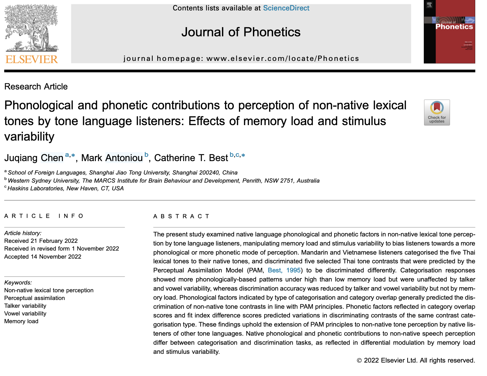

# 语言实验项目案例




## 案例10.1 不同认知负荷条件下声调感知同化实验  {-}

```{r setup, include=FALSE}
library(tidyverse)
library(lme4)
library(lsmeans)
library(DT)
# for cleaning up stats
library(broom)
# calculate confidence intervals
library(rcompanion)
library(cowplot)
library(flextable)
# remove scientific notation
install.packages()
options(scipen=999)
#setwd("/Users/chenjuqiang/Nutstore Files/310_Tutorial/LanguageDS-MS/认知科学与数据挖掘")

library(dplyr)
library(tidyr)


# processed.dir = "data/processed/"
# tbl.fig = "data/tbl_fig/"

```

### 研究背景  {-}

### 研究问题及假设 {-}


### 研究方法  {-}

#### 数据收集  {-}

#### 数据加工  {-}

```{r eval=F, echo=T}
# 数据导入
md32 <- read.delim("data/session2/md_assim_32_final.txt")

```

&emsp;&emsp;此时我们得到一个4800行，137列的数据框，里面包含了13名汉语普通话母语者感知不同泰语声调，并将其同化为普通话四个声调的数据。

&emsp;&emsp;在正式实验之前，我们让被试进行了几个试次的练习。因此，首先我们需要去掉被试在练习时的数据。原始数据中每列的名称受到E-prime编程和运行的影响，有很多列是没有用的。为了方便后续数据处理，我们选择需要的列（即刺激和对于的选择和反应时数据），并去除被试没有作答的试次。

```{r eval=F, echo=T}
## 数据整理
assim.clean = md32%>%
   filter(Procedure.Block. != "pracproc") %>%
    mutate(isi = str_extract(ExperimentName, "2000|500"),
           isi = dplyr::recode(isi, "500" = "Low", "2000"="High"))%>%
    select(subject = "Subject",
                  stimuli = "tone.Trial.",
                  response = "insex1.RESP",
                  response_rt = "insex1.RT",
                  rating = "exprate.RESP",
                  rating_rt = "exprate.RT",
                  block = "Procedure.Block.", isi)%>%
    filter(., response !="")%>%
    mutate(., response_rt = response_rt,
           rating_rt = rating_rt -1000)%>%
    mutate(cgload = dplyr::recode(block, block1 = "ss", block2 = "ss",
                                  block3 = "sd", block4 = "sd",
                                  block5 = "ds", block6 = "ds",
                                  block7 = "dd"),
           stimuli = dplyr::recode(stimuli, "45" = "T45", "33" = "T33", "21" = "T21",
                         "315" = "T315","241" = "T241"))
  
```

**函数的基本结构：**

- function_name 是你定义的函数名称。

- function(arg1, arg2, ...) 定义了函数的参数。

- 函数体包含了函数的逻辑和操作。

- return(result) 是返回值，表示函数的输出。如果省略return，R会自动返回最后计算的值。

```{r eval=F, echo=T}

function_name <- function(arg1, arg2, ...) {
  # 函数体
  # 这里是你想让函数执行的代码
  return(result)
}

# cleaning assimilation data
data.clean = function(rawdata){ 
  filter(rawdata, Procedure.Block. != "pracproc") %>%
    mutate(isi = str_extract(ExperimentName, "2000|500"),
           isi = dplyr::recode(isi, "500" = "Low", "2000"="High"))%>%
    select(subject = "Subject",
                  stimuli = "tone.Trial.",
                  response = "insex1.RESP",
                  response_rt = "insex1.RT",
                  rating = "exprate.RESP",
                  rating_rt = "exprate.RT",
                  block = "Procedure.Block.", isi)%>%
    filter(., response !="")%>%
    mutate(., response_rt = response_rt,
           rating_rt = rating_rt -1000)%>%
    mutate(cgload = dplyr::recode(block, block1 = "ss", block2 = "ss",
                                  block3 = "sd", block4 = "sd",
                                  block5 = "ds", block6 = "ds",
                                  block7 = "dd"),
           stimuli = dplyr::recode(stimuli, "45" = "T45", "33" = "T33", "21" = "T21",
                         "315" = "T315","241" = "T241"))->clean_data
  return(clean_data)
}

# Data cleanning 
md.cat.cln = data.clean(md32)

# write.csv(md.cat.cln, # for multinomial analysis
#           file = paste(processed.dir, 
#                        paste("md.cat.cln",
#                              Sys.Date(),
#                              "csv",
#                              sep = "."),
#                        sep = "") ,row.names = FALSE)

# 计算缺失值比例
missing.cat.md = 1-length(md.cat.cln$stimuli)/4480

```


&emsp;&emsp;下面我们希望能够先计算每个人在听到泰语五个声调时的选择模式和反应时。然后基于此计算出汉语普通话组的选择模式和反应时。

```{r eval=F, echo=T}

md.cat.fnl<- md.cat.cln%>%
  mutate(counter = 1)%>%
  mutate(response = dplyr::recode(response, 
                                  f = "M55", g = "M35", h = "M214", j = "M51"),
         stimuli = as.factor(stimuli))%>%
  # add cgload if necessary
  group_by(subject, stimuli, response, isi)%>% 
  summarise(counter = sum(counter), 
            response_rt = mean(response_rt, na.rm = TRUE),
            rating = mean(rating, na.rm = TRUE), 
            rating_rt =  mean(rating_rt,na.rm = TRUE))%>%
  # add cgload if necessary
  group_by(subject, stimuli)%>% 
  mutate(percentage = counter/sum(counter),
         sum = sum(counter))

# write.csv(md.cat.fnl, 
#           file = paste(processed.dir, 
#                        paste("md.cat.fnl",
#                              Sys.Date(),
#                              "csv",
#                              sep = "."),
#                        sep = "") ,row.names = FALSE)

# md.cat.fnl = read.csv(paste(dir.processed, 
#                        paste("md.cat.fnl",
#                              "2020-08-04",
#                              "csv",
#                              sep = "."),
#                        sep = ""))%>%
#             mutate(isi = fct_relevel(isi, "Low","High"),
#                    response = as_factor(response),
#                    response = fct_relevel(response, "M55","M35","M214","M51"))


```


### 研究结果  {-}

#### 描述性图表  {-}

```{r eval=F, echo=T}
md.cat.tbl = md.cat.fnl%>%
 select(subject, isi, rating, stimuli, response, percentage)%>% 
    # add cgload if necessary
    group_by(isi, stimuli, response)%>%
    summarise(cat.mean = round(sum(percentage)/16, 3)*100,
              rate.mean = round(mean(rating),1))%>%
    gather(temp, score, ends_with(".mean")) %>%
    unite(temp1, stimuli, temp, sep = "_")%>% 
    spread(temp1, score)%>%
    select("isi","response", "T45_cat.mean","T45_rate.mean",
           "T33_cat.mean", "T33_rate.mean", "T21_cat.mean","T21_rate.mean",
           "T315_cat.mean", "T315_rate.mean","T241_cat.mean", "T241_rate.mean")

# generating cat & rate table
cat.table = function(catdata){
  catdata %>%
    select(subject, isi, rating, stimuli, response, percentage)%>% 
    # add cgload if necessary
    group_by(isi, stimuli, response)%>%
    summarise(cat.mean = round(sum(percentage)/16, 3)*100,
              rate.mean = round(mean(rating),1))%>%
    gather(temp, score, ends_with(".mean")) %>%
    unite(temp1, stimuli, temp, sep = "_") %>% 
    spread(temp1, score)%>%
    select("isi","response", "T45_cat.mean","T45_rate.mean",
           "T33_cat.mean", "T33_rate.mean", "T21_cat.mean","T21_rate.mean",
           "T315_cat.mean", "T315_rate.mean","T241_cat.mean", "T241_rate.mean")->catdata2
  return(catdata2)
}

# percentage of choice table
md.cat.tbl = cat.table(md.cat.fnl)


library(flextable)
flextable(md.cat.tbl)
```

#### 可视化  {-}

&emsp;&emsp;两个分类变量的另一种可视化方法是热力图。我们可以用泰语的刺激作为横轴，普通话声调类别作为纵轴，用色块的深浅表示评分的高低。

```{r eval=F, echo=T}
  
md.cat.fnl %>%
  group_by(isi, stimuli,response)%>%
  summarise(percent = round(sum(percentage)/16, 3)*100,
              # 计算评分的均值
            rate.mean = round(mean(rating,na.rm = TRUE),1))%>%
  mutate(text.color = (stimuli== response))%>%
  # 构建xy轴
  ggplot(aes(stimuli,response))+
  # 构建热力图
  geom_tile(aes(fill = percent ))+
  # 将评分作为标记填入，并设置相应的颜色、大小
  # geom_text(aes(label = round(rate.mean, 1)), 
  #           color = "red",
  #           size = 4) +
    geom_text(aes(label = round(percent, 1)), 
            color = "red",
            size = 4) +
  scale_colour_manual(values=c("black", "white"))+
  scale_x_discrete(name = "Thai stimuli (%)")+
  scale_y_discrete(name = "Mandarin responses (%)")+
  scale_fill_gradient(name="%",low = "white", high = "black") +
  theme(axis.text.x = element_text(face="bold", size=8),
        axis.title.x = element_text(face="bold", size=10),
        axis.title.y = element_text(face="bold", size=10),
        #axis.title.y = element_blank(),
        axis.text.y = element_text(face="bold", size=8),
        #axis.text.y = element_blank(),
        axis.ticks.y = element_blank(),
        axis.ticks.x = element_blank())+
   facet_grid(. ~ isi)

  
```

#### 数据建模  {-}


```{r eval=F, echo=T}
# 筛选母语选项超过随机水平

# 低记忆负荷 500ms
thresh.md.low = md.cat.fnl%>%
  filter(isi == "Low")%>%
  select(subject, stimuli, response, percentage)%>%
  # 计算个体选择比率
  group_by(subject, stimuli, response)%>%
  summarise(percentage = round (mean(percentage), 3))%>%
  group_by(stimuli, response)%>%
  # 计算同组人平均值
  summarise(cat.mean = round (sum(percentage)/16, 3))%>%
  mutate(key = paste(response, stimuli, sep = "_"))%>%
  filter(cat.mean > 0.25)

# 高记忆负荷 2000ms
thresh.md.high = md.cat.fnl%>%
  filter(isi == "High")%>%
  select(subject, stimuli, response, percentage)%>% 
  #add cgload if necessary
  group_by(subject, stimuli, response)%>%
  summarise(percentage = round (mean(percentage), 3))%>%
  group_by(stimuli, response)%>%
  summarise(cat.mean = round (sum(percentage)/16, 3))%>%
  mutate(key = paste(response, stimuli, sep = "_"))%>%
  filter(cat.mean > 0.25)

# convert responses above chance to vectors
thresh.md.low = as.vector(thresh.md.low$key)
thresh.md.high = as.vector(thresh.md.high$key)

# 用T检验验证选项是否显著大于0.25
# 低记忆负荷 500ms
md.t.test.low = md.cat.fnl%>%
  filter(isi == "Low")%>%
  mutate(key = paste(response, stimuli, sep = "_"))%>%
  filter(key %in% thresh.md.low )%>%
  group_by(stimuli, response)%>% 
  #add cgload if necessary
  summarise(res = list(tidy(t.test(percentage, 
                                   mu =0.25,
                                   alternative="greater"))))%>%
  unnest()%>%
  mutate(memory = "Low")

# 高记忆负荷 2000ms
md.t.test.high = md.cat.fnl%>%
  filter(isi == "High")%>%
  mutate(key = paste(response, stimuli, sep = "_"))%>%
  filter(key %in% thresh.md.high )%>%
  group_by(stimuli, response)%>%
  summarise(res = list(tidy(t.test(percentage, 
                                   mu =0.25,
                                   alternative="greater"))))%>%
  unnest()%>%
  mutate(memory = "High")

md.t.test.all = rbind(md.t.test.low, md.t.test.high)


```

```{r eval=F, echo=T}
library(car)
# 检验每个泰语声调对应母语选项是否存在显著差异

# 此处需要每个被试、每个泰语声调的每个母语选项，即使一些为0。

md.rsp.stim.matrix.low = data.frame(
  expand.grid(isi = "Low",
              response2 = c("M55", "M35","M214","M51"), 
              stimuli2 = c("T315","T241","T21","T33","T45"), 
              c = unique(md.cat.fnl[md.cat.fnl$isi== "Low", ]$subject)))%>%
  mutate(id = paste(response2, stimuli2,c, sep = "_"))

md.rsp.stim.matrix.high = data.frame(
  expand.grid(isi = "High",
              response2 = c("M55", "M35","M214","M51"), 
              stimuli2 = c("T315","T241","T21","T33","T45"), 
              c = unique(md.cat.fnl[md.cat.fnl$isi== "High", ]$subject)))%>%
  mutate(id = paste(response2, stimuli2,c, sep = "_"))

# combining the dataframe with percentage data
md.cat.test.low = md.cat.fnl%>%
  filter(isi == "Low")%>%
  mutate(id = paste(response, stimuli, subject, sep = "_"))%>%
  left_join(md.rsp.stim.matrix.low,.)%>%
  mutate(percentage = ifelse(is.na(percentage), 0, percentage))

md.cat.test.high = md.cat.fnl%>%
  filter(isi == "High")%>%
  mutate(id = paste(response, stimuli,subject, sep = "_"))%>%
  left_join(md.rsp.stim.matrix.high,.)%>%
  mutate(percentage = ifelse(is.na(percentage), 0, percentage))

md.cat.test.all = rbind(md.cat.test.low, md.cat.test.high)

# 混合效应模型

# 构建模型
cat.model <- function(df) {
  # c = subject
  lmer(percentage ~ response2 +(1|c), data = df )
  }

# 获取P值
cat.anova =  function(model) {
  Anova(model, test = "F")
}
# 多重比较
cat.pair = function(model){
  lsmeans(model, pairwise ~ response2)
}

# 批量建模
md.cat.mdl = md.cat.test.all%>%
  group_by(isi, stimuli2)%>%
  nest() %>%
  mutate(model = map(data, cat.model ))

# 批量提取P值 
md.cat.mdl.Ftest = md.cat.mdl%>%
  mutate(anova = map(model, cat.anova))%>%
  unnest(anova)%>%
  select(isi, stimuli2, 5:8)%>%
  mutate( F= round(F, 2))

colnames(md.cat.mdl.Ftest) = c("ISI", "Thai_stimulus","F","df","df","p") 

md.cat.mdl.Ftest$p = round(md.cat.mdl.Ftest$p, 5)

# write.csv(md.cat.mdl.Ftest, 
#           file = paste(dir.tbl, 
#                        paste("md.cat.mdl.Ftest",
#                              Sys.Date(),
#                              "csv",
#                              sep = "."),
#                        sep = "") ,row.names = FALSE)

## mutiple comparison

extract.contrast = function(df){
  contrast = df$contrasts
  contrast = data.frame(contrast)
}

md.cat.mdl.mltpl = md.cat.mdl%>%
                    mutate(pair = map(model, cat.pair))%>%
                    mutate(contrast = map(pair, extract.contrast))%>%
                    unnest(contrast)%>%
                    select(stimuli2,contrast, estimate, 
                           SE, t.ratio, df, p.value)%>%
                    mutate(estimate = round(estimate, 3),
                                SE = round(SE, 3),
                            t.ratio = round(t.ratio, 2),
                            p.value = round(p.value, 3))


# write.csv(md.cat.mdl.mltpl, 
#           file = paste(dir.tbl, 
#                        paste("md.cat.mdl.mltpl",
#                              Sys.Date(),
#                              "csv",
#                              sep = "."),
#                        sep = "") ,row.names = FALSE)

```


```{r eval=F, echo=T}
### multinomial analysis ###
require(foreign)
require(nnet)
library(mlogit)

# create dataframe for multinomial analysis

md.cat.cln = md.cat.cln %>%
            mutate(response = dplyr::recode(response, 
                          f = "M55", g = "M35", h = "M214", j = "M51"),
                   isi = fct_relevel(isi, "Low","High"),
                   stimuli = as.factor(stimuli),
                   response = as_factor(response),
                   response = fct_relevel(response, "M55","M35","M214","M51"),
                   speaker = str_extract(cgload, "^[a-z]{1}"),
                   vowel = str_extract(cgload, "[a-z]{1}$"))


md.cat.cln$ref <- relevel(md.cat.cln$response, ref = "M55")

md.mdl.mltnm.1 = multinom(ref ~  isi*speaker *vowel * stimuli, 
                  data = md.cat.cln )

md.mdl.mltnm.2 = multinom(ref ~  speaker * vowel * stimuli, 
                  data = md.cat.cln )
# effect of isi
anova(md.mdl.mltnm.1 , md.mdl.mltnm.2)

# effect of speaker
md.mdl.mltnm.3 = multinom(ref ~  isi * vowel * stimuli, data = md.cat.cln)
anova(md.mdl.mltnm.1 , md.mdl.mltnm.3)

# effect of vowel
md.mdl.mltnm.4 = multinom(ref ~  isi*speaker*stimuli, data = md.cat.cln )
anova(md.mdl.mltnm.1 , md.mdl.mltnm.4)

# effect of Thai tones
md.mdl.mltnm.5 = multinom(ref ~  isi*speaker *vowel, data = md.cat.cln )
anova(md.mdl.mltnm.1 , md.mdl.mltnm.5)

```

### 研究结论  {-}

&emsp;&emsp;在感知同化任务中，在高记忆负荷条件下，听者以更偏音系的模式处理刺激，从而产生更多基于母语音系的同化；而在低记忆负荷下，听者的判断则更多基于刺激的语音特性。另一方面，说话人变异性与元音环境变异性并未影响感知同化，说明听者可借助母语音位范畴对这类音系无关的变化进行调节与适应。


##  案例 10.2 不同认知负荷条件下声调区分实验  {-}

### 研究背景  {-}

### 研究问题及假设  {-}

### 研究方法  {-}

#### 数据收集  {-}

#### 数据加工  {-}

```{r eval=F, echo=T}
## 导入数据
md.s1.dis.cln = read_csv("~/Nutstore Files/310_Tutorial/LanguageDS-MS/认知科学与数据挖掘/data/tbl_fig/md.s1.dis.cln.2025-05-06.csv")

md.s2.dis.cln = read_csv("~/Nutstore Files/310_Tutorial/LanguageDS-MS/认知科学与数据挖掘/data/tbl_fig/md.s2.dis.cln.2025-05-06.csv")

```

```{r eval=F, echo=T}


## calculating d prime
dprime = function(inputdata){
  inputdata%>%
    select(ISI, Subject, cgload,Tone_contrast, n_hit,n_fa,n_miss,n_cr,insexp.RT )%>%
    group_by(Subject, ISI, cgload,Tone_contrast)%>%
    mutate(Tone_contrast = dplyr::recode(Tone_contrast, 
                                  "33-45" = "T33-T45","21-241" ="T241-T21",
                                  "315-45" = "T315-T45", "21-33" = "T33-T21",
                                  "33-241" = "T33-T241" ))%>%
    summarise(n_hit = sum(n_hit),
              n_fa = sum (n_fa),
              n_miss = sum (n_miss),
              n_cr = sum (n_cr) ,
              dis_rt = mean(insexp.RT))%>%
    mutate (n_hit = n_hit + 0.5, n_miss = n_miss + 0.5,
            n_fa = n_fa + 0.5, n_cr = n_cr + 0.5)%>%
    mutate(hit_rate =  round(n_hit/(n_hit+n_miss), 2),
           fa_rate = round(n_fa/(n_fa+n_cr),2),
           z_hit = qnorm(hit_rate, 0, 1),
           z_fa = qnorm(fa_rate, 0, 1))%>%
    mutate(dprime = z_hit - z_fa)->outputdata
  return(outputdata)
}

md.s1.dis.fnl = dprime(md.s1.dis.cln)

md.s2.dis.fnl = dprime(md.s2.dis.cln)

#combine two sessions
md.dis.all = rbind(md.s1.dis.fnl, md.s2.dis.fnl)%>%
             mutate(speaker = str_extract(cgload, "^[a-z]{2}"),
                    speaker = dplyr::recode(speaker, "ss" = "Constant", "ds"="Variable"),
                    vowel = str_extract(cgload, "[a-z]{2}$"),
                    vowel = dplyr::recode(vowel, "sv"="Constant", "dv" = "Variable"),
                    language = "Mandarin")
# detection theory
ax_df <- read_csv("data/session2/ax_df2.csv")
ax_df.new = ax_df%>%
            gather(., fa_rate, dprime2, -hit_rate)%>%
            mutate(fa_rate = as.numeric(fa_rate))

# new dprime with difference rules
md.dis.all= left_join(md.dis.all, ax_df.new, by = c("hit_rate","fa_rate"))

missing.md.dis = (20480 - (length(md.s1.dis.cln$block_con)+length(md.s2.dis.cln$sounda)))/20480

# write.csv(md.dis.all, 
#           file = paste(processed.dir, 
#                        paste("md.dis.all",
#                              Sys.Date(),
#                              "csv",
#                              sep = "."),
#                        sep = "") ,row.names = FALSE)

```

### 研究结果  {-}

#### 数据建模  {-}

统计建模

```{r eval=F, echo=T}

md.dis.all = md.dis.all%>%
             mutate(speaker = paste(speaker, "S", sep = "_"),
                    vowel = paste(vowel, "V", sep = "_"))

## md d'
# dprime2 = new measures

md.dis.mdl0 = lmer(dprime2 ~ ISI * speaker * vowel* Tone_contrast + 
                    (1|Subject), 
                    data = md.dis.all)

md.dis.mdl1 = lmer(dprime2 ~ ISI * speaker * vowel* Tone_contrast + 
                    (1+ISI+speaker+vowel|Subject), 
                    data = md.dis.all)

AIC(md.dis.mdl0, md.dis.mdl1)
anova(md.dis.mdl0, md.dis.mdl1)

md.dis.mdl = lmer(dprime2 ~ ISI * speaker * vowel* Tone_contrast +
                      (1 + speaker|Subject)+(1 + vowel|Subject), 
                    data = md.dis.all)

anova(md.dis.mdl, md.dis.mdl0)
AIC(md.dis.mdl,md.dis.mdl0)

# 最终选择 md.dis.mdl 
md.mdl.smry = data.frame(coef(summary(md.dis.mdl)))
md.mdl.smry$variable = rownames(md.mdl.smry)

# write.csv(md.mdl.smry, 
#           file = paste(dir.tbl, 
#                        paste("md.mdl.smry",
#                              Sys.Date(),
#                              "csv",
#                              sep = "."),
#                        sep = "") ,row.names = FALSE)


#calculation the main effects and interactions
#Anova(md.dis.mdl, test = "F")

md.dis.mdl.tbl = data.frame(Anova(md.dis.mdl, test = "F"))

md.dis.mdl.tbl$variable = rownames(md.dis.mdl.tbl)
flextable(md.dis.mdl.tbl)
# write.csv(md.dis.mdl.tbl, 
#           file = paste(dir.tbl, 
#                        paste("md.dis.mdl.tbl",
#                              Sys.Date(),
#                              "csv",
#                              sep = "."),
#                        sep = "") ,row.names = FALSE)


#pair-wise comparison
lsmeans(md.dis.mdl, pairwise ~ Tone_contrast)
lsmeans(md.dis.mdl, pairwise ~ speaker:vowel)

md.dis.mdl.tone = data.frame(language = "Mandarin",
                              lsmeans(md.dis.mdl, 
                              pairwise ~ Tone_contrast)$contrasts)

md.dis.mdl.vwl.tlk = data.frame(language = "Mandarin",
                                lsmeans(md.dis.mdl, 
                                pairwise ~ speaker:vowel)$contrasts)


# write.csv(md.dis.mdl.tone, 
#           file = paste(dir.tbl, 
#                        paste("md.dis.mdl.tone",
#                              Sys.Date(),
#                              "csv",
#                              sep = "."),
#                        sep = "") ,row.names = FALSE)
# 
# 
# write.csv(md.dis.mdl.vwl.tlk, 
#           file = paste(dir.tbl, 
#                        paste("md.dis.mdl.vwl.tlk",
#                              Sys.Date(),
#                              "csv",
#                              sep = "."),
#                        sep = "") ,row.names = FALSE)


```


### 研究结论  {-}

&emsp;&emsp;与感知同化任务不同，在感知区分任务中，高刺激变异性会促使听者采纳音系感知模式，而记忆负荷则无显著作用。尽管如感知同化模型（PAM）所预测的那样，母语影响仍为主导因素，但本研究发现，记忆负荷与刺激变异性分别以不同方式影响感知同化与感知区分任务中感知模式的倾向（音系 vs. 语音），这一发现与ASP的理论原则一致。

