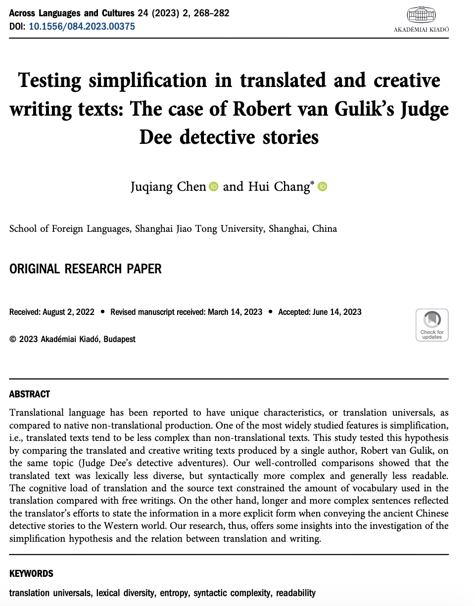
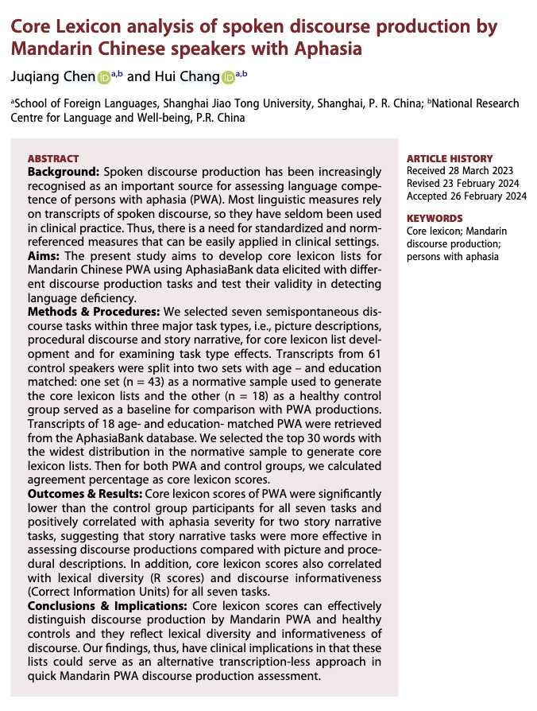

# 文本语料数据分析案例

## 案例一、狄仁杰小说翻译文体风格

### 研究背景



&emsp;&emsp;罗伯特·范·古利克（Robert Van Gulik）是一位荷兰小说家和汉学家。他的《狄公案》侦探小说系列（总共17本）在1949年至1968年间陆续出版。该系列的第一本书，即《狄公奇案》（Celebrated Cases of Judge Dee），是从一本中文书《狄公案》翻译而来。狄公或狄仁杰是一位真实存在的历史上的侦探和政治家，生活在公元630年至700年之间，即唐代（公元618年至907年）。这部翻译作品激发了译者对中国侦探故事的兴趣，并为他自己的侦探小说（其余16本）创造了狄仁杰这一角色。

&emsp;&emsp;在翻译的前言中，作者声称他保留了原文中的所有中国元素，并谴责那些涉及过多改写并扭曲中国文化和历史现实的伪造“中国”故事。相反，在创作中，作者在第15册中承认，尽管他在创作后来的故事时借用了一些古代中国刑侦文学的元素，但这些故事本身是完全虚构的，即非翻译作品。于是，一个想法诞生了。

<p style="text-align:center;">**对于同一个主题故事，翻译和创造的文本语言上有什么不同呢？**</p>


&emsp;&emsp;我收集了这17本书，进行了文本分析，从词汇丰富度、可读性、和句法复杂度进行了研究。

### 数据处理

```{r message=FALSE, warning=FALSE }
library(lme4)
library(lsmeans)
setwd("~/Nutstore Files/310_Tutorial/LanguageDS-e")

library(tidyverse)

# 显示小数点后很多位
options(scipen=999)

# 计算置信区间
library(rcompanion)

# 改变y轴度量
library(scales)

# 组合图
library(cowplot)

library(tidytext)
require(readtext)
library(rstatix)
library(flextable)

library(quanteda)
library(quanteda.textstats)

```


#### 词汇复杂度特征
```{r}

dee.raw =readtext("data/ch11/*txt", docvarsfrom = "filenames")

dee.corpus = corpus(dee.raw)

dee.corpus.summary = data.frame(summary(dee.corpus))

dee.dfm <- dfm(dee.corpus, 
               remove_numbers = TRUE, 
               remove_punct = TRUE, 
               remove_symbols = TRUE
               #remove = stopwords("english")
               )


dee.corpus.summary%>%
    flextable()%>%
    set_caption(caption = "Table 1. Number of types, tokens, and sentences of each book in the Judge Dee series.")


lexical.diversity <- textstat_lexdiv(dee.dfm, measure = "all")


lexical.diversity%>%
    flextable()%>%
    set_caption(caption = "词汇复杂度指标.")

# 信息熵
textstat_entropy(dee.dfm)$entropy


```

```{r}
readability <- textstat_readability(dee.corpus, measure = "all")

readability.df = readability%>%
   as.data.frame()%>%
   select(document, ARI, Flesch, FOG, Coleman.Liau.short, Dale.Chall, Spache)

```


#### 句法特征提取

句法复杂度分析器，L2SCA

> L2 Syntactic Complexity Analyzer (“L2SCA”) is a tool that allows ESL and EFL teachers and researchers to analyze the syntactic complexity of written English language samples produced by advanced English learners. L2SCA was developed by Xiaofei Lu at The Pennsylvania State University (“PSU”), University Park, PA, USA. Unless stated otherwise, these Terms of Service apply to all usage of L2SCA, including those currently offered as well as any new products or services that we may add in the future.

<p style="text-align:center;">[陆小飞老师的官网](http://www.personal.psu.edu/xxl13/downloads/l2sca.html)</p>


&emsp;&emsp;需要注意的是，这个句法复杂度分析器是基于英语笔语开发的，基本的要求是句法分词和标注是准确的。如果是中文，标注正确率一般不如英文，如果是口语，转写时如何确定句子的单位边界也是问题。

&emsp;&emsp;由于文本数据处理需要一定时间，此处我们导入已经处理完成的词汇和句法数据进行分析。

```{r}
lexical.diversity.df = read_csv("data/ch11/lexical.diversity.df.2022-07-21.CSV")
  

readability.df = read.csv("data/ch11/readability.df.2022-07-21.CSV")
  
metrics_SCA <- read_csv("data/ch11/metrics_SCA.csv")
```


### 数据可视化


### 统计建模
```{r}

t.test(lexical.diversity.df$TTR[2:17], mu = lexical.diversity.df$TTR[1], alternative = "greater")

# t.test(lexical.diversity.df$C[2:17], mu = lexical.diversity.df$C[1], alternative = "greater")
# 
# t.test(lexical.diversity.df$R[2:17], mu = lexical.diversity.df$R[1], alternative = "greater")
# 
# t.test(lexical.diversity.df$MATTR[2:17], mu = lexical.diversity.df$MATTR[1], alternative = "greater")
# 
# lexical.diversity.stat = lexical.diversity.df%>%
#   as.data.frame()%>%
#   mutate(id = 1:n())%>%
#   select("document", "id","TTR","C","R")%>%
#   mutate(txt.type = case_when(id < 2  ~ "ref",
#                               id > 1 ~ "freewriting"))%>%
#   gather("measures", "values", -c("document", "id","txt.type"))%>%
#   mutate(measures = as.factor(measures),
#          measures = fct_relevel(measures, "TTR","C","R"))%>%
#   filter(measures == "TTR")%>%
#   group_by(measures)%>% 
#   rstatix::t_test(values ~ 1, mu = "ref") 
# %>% 
#   rstatix::adjust_pvalue() %>%
#   rstatix::add_significance("p.adj")


```

```{r}


metrics_SCA.ci = metrics_SCA%>%
  filter(text !="01.txt")%>%
  gather("measures", "values", -c("text"))%>%
  groupwiseMean(values ~ measures,
                data = .,
                conf = 0.95,
                digits = 3)

  

# mean length of clause (MLC): number of words divided by number of clauses;
t.test(metrics_SCA$MLC[2:17], mu = metrics_SCA$MLC[1],  alternative = "less")

t.test(metrics_SCA$MLS[2:17], mu = metrics_SCA$MLS[1], alternative = "less")
# 
# t.test(metrics_SCA$MLT[2:17], mu = metrics_SCA$MLT[1], alternative = "less")
# 
# t.test(metrics_SCA$"C/S"[2:17], mu = metrics_SCA$"C/S"[1], alternative = "less")
# 
# t.test(metrics_SCA$"C/T"[2:17], mu = metrics_SCA$"C/T"[1], alternative = "less")
# 
# t.test(metrics_SCA$"CT/T"[2:17], mu = metrics_SCA$"CT/T"[1], alternative = "less")
# 
# t.test(metrics_SCA$"DC/C"[2:17], mu = metrics_SCA$"DC/C"[1], alternative = "less")
# 
# t.test(metrics_SCA$"DC/T"[2:17], mu = metrics_SCA$"DC/T"[1], alternative = "less")
# 
# t.test(metrics_SCA$"CP/C"[2:17], mu = metrics_SCA$"CP/C"[1], alternative = "less")
# 
# t.test(metrics_SCA$"CP/T"[2:17], mu = metrics_SCA$"CP/T"[1], alternative = "less")
# 
# t.test(metrics_SCA$"T/S"[2:17], mu = metrics_SCA$"T/S"[1], alternative = "less")
# 
# t.test(metrics_SCA$"CN/C"[2:17], mu = metrics_SCA$"CN/C"[1], alternative = "less")
# 
# t.test(metrics_SCA$"CN/T"[2:17], mu = metrics_SCA$"CN/T"[1], alternative = "less")
# 
# t.test(metrics_SCA$"VP/T"[2:17], mu = metrics_SCA$"VP/T"[1], alternative = "less")


```

```{r}


t.test(readability.df$ARI[2:17], mu = readability.df$ARI[1], alternative = "less")

t.test(readability.df$Flesch[2:17], mu = readability.df$Flesch[1], alternative = "greater")

t.test(readability.df$FOG[2:17], mu = readability.df$FOG[1], alternative = "less")

t.test(readability.df$Coleman.Liau.short[2:17], mu = readability.df$Coleman.Liau.short[1], alternative = "less")

t.test(readability.df$Dale.Chall[2:17], mu = readability.df$Dale.Chall[1], alternative = "greater")

t.test(readability.df$Spache[2:17], mu = readability.df$Spache[1], alternative = "less")


```

我们发现，**翻译文本和创作文本相比，词汇丰富性较低。**


**翻译文本和创作文本相比，句法复杂度较高。**


可读性指标显示，**翻译文本的可读性比创作文本差。**


### 结论
&emsp;&emsp;根据受限语言理论（the constrained language theory,），翻译中的复杂认知过程，如激活两种语言系统和不断进行编码切换，给翻译者增加了额外的认知负担并降低了他的工作记忆容量，促使他采用简化等策略。此外，源文本在翻译过程中也可能限制了他可用的词汇资源。相反，作家能够充分发挥他的语言库，因此产生了更丰富的词汇多样性的文本。

&emsp;&emsp;然而，翻译文本的句法结构比创作的更为复杂。这不能归因于翻译过程的内在限制，因为翻译者需要面对更大的认知需求，并且预计他们将使用降低认知负担的策略，导致更短或更简单的句子。

&emsp;&emsp;于是，我们考虑英汉语的差异性。原生的汉语往往更依赖意义而不是功能词或结构来连接从句和句子，而西方语言则依靠丰富的句法手段。因此，受源语言影响的翻译汉语相对于原生汉语展现出更复杂的句法结构。在本研究中，翻译的方向是从古代汉语到英语，因此源文本的语言结构不太可能在整体上导致更复杂的目标文本句子。

&emsp;&emsp;抛开这一解释，我们认为罗伯特·范·古利克作为翻译者特别意识到自己作为中介者的角色，希望承担起让古代中国侦探故事为西方世界所理解的责任。为了实现这一目标，他在翻译中使用了符合西方风格的句法手段，可能**过度使用**了它们。我们还可以推测，翻译文本中更复杂的句子可能与显性化效应有关。也就是说，翻译者仔细说明了原始古代中国故事中包含的信息，这些故事发生在地理和文化上与他的读者相距甚远的国家。

&emsp;&emsp;可读性指标显示，翻译文本可能比创作文本更难阅读。这表明翻译文本中的句子可能要么更长，要么词更难，要么两者兼而有之。考虑到翻译文本的词汇多样性较低，我们推断句法复杂性在相对较低的可读性中发挥了更大的作用。正如我们所论证的，翻译中更复杂的句子可能表明翻译者在传达源文本信息时的努力，导致可读性的下降是无意的。尽管罗伯特·范·古利克作为翻译者和小说作家将目标读者放在心中，但似乎作为翻译者，他受到了源文本的限制，并在跨越语言和文化传达古代中国侦探故事时在一定程度上牺牲了可读性。翻译者和读者在翻译/阅读来自不同文化和非常古老时期的故事时可能不得不付出代价。

## 案例二、汉语失语症话语产出



### 研究背景
&emsp;&emsp;口语话语产出越来越被视为评估失语症患者（PWA）语言能力的重要来源。如果有相关话语产出的转录本，一些语言学指标，如类型-标记比（TTR）或平均语句长度，可以自动化处理，以辅助PWA的话语分析。其他类型的指标，如主要概念（Dalton & Richardson, 2015; Dalton & Richardson, 2019; Kong, 2009; Nicholas & Brookshire, 1995; Richardson & Dalton, 2016; Richardson et al., 2021）、内容单元（Yorkston & Beukelman, 1980）、正确信息单元（CIUs，Nicholas & Brookshire, 1993）和主要事件（Capilouto et al., 2005），则需要经过训练的标注员进行主观判断。虽然这些指标在揭示PWA语言能力和缺陷的不同方面具有重要意义，但它们通常涉及到劳动密集且耗时的过程，如转录和标注，因此很少在临床实践中实时使用。因此，需要一种可以在临床环境中轻松应用的标准化和有参照的指标。

&emsp;&emsp;最近，核心词汇分析被开发并提出作为一种可行且易于使用的PWA评估方法（Dalton & Richardson, 2015; Kim, Berube et al., 2022; Kim et al., 2019; Kim & Wright, 2020）。核心词汇分析的基本假设是，通过一组典型词汇或核心词汇（MacWhinney et al., 2010），可以评估在话语产出任务中PWA的功能性沟通能力。基于健康控制组在特定任务中的产出生成的核心词汇列表可以作为指标，衡量PWA在该任务中检索词汇的能力。这种任务特定且有参照的核心词汇列表在临床环境中非常有用，因为临床医生可以通过实时检查该列表来评估PWA的口语话语产出。核心词汇列表已被证明在区分PWA与对照组以及失语症亚型方面有效（S. G. Dalton & Richardson, 2015; Kim et al., 2021, 2019）。它们还与其他语言学指标（如正确信息单元、词汇多样性、句法复杂性（Kim & Wright, 2020）、主要概念（Dalton & Richardson, 2015）、主题单元和连贯性指标（Kim & Wright, 2020））显著相关，显示出良好的同时效度。即使对于经验和训练时间非常有限的评分员来说，核心词汇列表也表现出了可接受的评分员间信度（Kim & Wright, 2020）。因此，与大多数传统指标（如TTR）需要录音、转录和标注话语产出相比，核心词汇列表节省了时间，而且比其他需要长期训练且难以维持评分员一致性的指标（如主要概念）更为客观。


&emsp;&emsp;到目前为止，关于普通话失语症患者（PWA）话语产出的核心词汇研究仅有一项。江及其同事使用普通话失语症语料库数据（Jiang et al., 2023），为三种不同的任务类型（即图片描述、故事叙述和程序性话语）开发了核心名词和动词列表。研究发现，PWA产生的核心词汇少于对照组参与者，但核心词汇的使用与失语症的严重程度之间没有相关性。作为该领域的开创性工作，他们的研究总体上支持了核心词汇分析在评估普通话口语话语产出中的可行性和适用性。然而，核心词汇评分是否以及如何与其他语言学指标（如词汇多样性）以及话语信息性指标（如正确信息单元，Nicholas & Brookshire, 1993）相关，仍然未得到解决。

&emsp;&emsp;从方法论上讲，江等人（2023）研究中高频词被提取为核心词汇，但如果某个特定参与者频繁使用某个单词，这可能会导致偏差。此外，在计算核心词汇评分时，特定任务类型中的任务被合并。例如，在他们的研究中，“破窗事件”、“拒绝的雨伞”、“营救小猫”和“洪水事件”被组合为图片描述任务，而“龟兔赛跑”和“狼来了”则作为故事叙述任务的一部分。然而，考虑到核心词汇列表不仅是任务特定的，而且对引发材料敏感，不同具体任务之间可能存在重要的差异。此外，江及其同事并未将功能词纳入其核心词汇列表中，而这些词已被证明与普通话PWA的语言产出相关（Wang et al., 2019）。

&emsp;&emsp;因此，本研究报告了我们针对每个具体任务开发的核心词汇列表，包括内容词和功能词，并使用普通话失语症语料库中的PWA数据。此外，我们假设核心词汇评分评估了词汇层面的语言产出能力和话语信息性。通过对核心词汇评分、词汇多样性指标和CIU进行相关性分析，我们检验了这些假设。


```{r message = FALSE, warning = FALSE}

library(tidyverse)
library(tidytext)
library(quanteda)
library(stringr)
library(jiebaR)
library(readtext)
library(rstatix)
# for cleaning up stats
library(broom)
# calculate confidence intervals
library(rcompanion)
library(cowplot)
library(flextable)
# remove scientific notation
options(scipen=999)

# add r values in regression lines
library(ggpubr)
# show chinese characters in ggplot
library(showtext)
showtext_auto()

#filter function
`%!in%` <- Negate(`%in%`)

setwd("~/Nutstore Files/310_Tutorial/LanguageDS-e")


```

### Jieba 分词

```{r message = FALSE, warning = FALSE}

text = "口语话语产出越来越被视为评估失语症患者（PWA）语言能力的重要来源。"
# 创建一个默认的分词器
seg1 <- worker()
# 使用seg1进行分词
segment(text, seg1)
# 
# seg3 <- worker(user = "demo_data/dict-ch-user-demo.txt", #设置自定义词典
#                # 设置停用词
#                stop_word = "demo_data/stopwords-ch-demo.txt")
# 
# segment(text, seg3)


```


### 汉语失语症语料分词

```{r message = FALSE, warning = FALSE}
# 导入被试信息

subjects_all <- read_csv("data/ch11/subjects.all4corelexV2.csv", 
                         na = "NA")

## 导入语料
df.clean <- read_csv("data/ch11/df.all.clean.2022-10-05.csv")%>%
  mutate(subject = dplyr::recode(subject,"/JiangLin40a2.cha"="/JiangLin40a.cha",
                          "/JiangLin40a1.cha"="/JiangLin40a.cha",
                          "/JiangLin01a2.cha"="/JiangLin01a.cha",
                          "/JiangLin01a1.cha"="/JiangLin01a.cha",
                          "/JiangLin70a1.cha"="/JiangLin70a.cha",
                          "/JiangLin70a2.cha"="/JiangLin70a.cha",
                          "/JiangLin08a2.cha"= "/JiangLin08a.cha",
                          "/JiangLin08a1.cha"= "/JiangLin08a.cha"))%>%
  filter(!is.na(task))%>%
  mutate(subject = str_remove(subject,"\\/"),
         subject = str_remove(subject,".cha"))%>%
  left_join(subjects_all)%>%
  mutate(normative = as.character(normative))%>%
  filter(normative != "0")%>%
  filter(include == "Y")%>%
  select(-Onset_Date, -Video_Date, -Informed_Consent)

## 批量分词

my_seg <- worker(bylines = T, 
                 #user = "demo_data/dict-ch-user-demo.txt", 
                 symbol=T)

df.tokenised =  df.clean%>%
  mutate(clean = str_replace_all(clean_new, 
                                 c(" 一 个 " = " 一个 ", " 一 条 " = "一条"," 一 场 " = " 一场 ",
                                    " 一 把 " = " 一把 ", " 一 群 " = " 一群 ", " 一 次 " = " 一次 ",
                                    " 一 辆 " = " 一辆 ", " 一 只 " = " 一只 ", " 一 天 " = " 一天 ",
                                   " 一 下 " = " 一下 ", " 一 张 " = " 一张 ", " 一 道 " = " 一道 ",
                                   " 一 起 " = " 一起 "," 一 步 " = " 一步 "," 一 看 " = " 一看 ",
                                   " 一 匹 " = " 一匹 "," 一 觉 " = " 一觉 "," 一 件 " = " 一件 ",
                                   "一 位" = "一位","一 架" = "一架","一 项" = "一项",
                                   " 发 洪水 " = " 发洪水 "," 发 大水 " = " 发大水 ", 
                                   " 一 队 " = " 一队 ")))%>%
  # 分词
  unnest_tokens(word, ## new tokens unnested
                clean, ## original larger units
                token = function(x)   ## self-defined tokenization method
                segment(x, jiebar = my_seg)
                 )%>%
  #filter non-words
  filter(str_detect(word, "\\w"))%>%
  #filter english words
  filter(!str_detect(word, "[a-zA-Z]"))%>%
  filter(word !="_")%>%
  mutate(task = dplyr::recode(task, "@task2"="Pic-Window","@task3"="Pic-Umbrella",
                       "@task4"="Pic-CatRescue","@task5"="Pic-Flood",
                       "@task6"="S-TortioseHare",
                       "@task7"="S-CryWolf","@task8"="Proc-FriedRice"))%>%
  filter(task %!in% c("@task1", "@task10", "@task11", "@task9"))

## 计算被试年龄和教育程度
age.aq.edu.stroke = df.tokenised%>%
    select(subject, Age, Gender, group, normative, Education_Level, 
           PostOnsetMonth, Aphasia_Type, AQ)%>%
    distinct()%>%
    mutate(AQ = as.numeric(AQ))%>%
    group_by( normative)%>%
    summarise(n = n(),
            mean.age = round(mean(Age),1),
            max.age = round(max(Age),1),
            min.age = round(min(Age),1),
            sd.age = round(sd(Age),1),
            mean.edu = round(mean(Education_Level, na.rm = TRUE),1),
            sd.edu = round(sd(Education_Level,  na.rm = TRUE),1),
            max.edu= round(max(Education_Level, na.rm = TRUE),1),
            min.edu = round(min(Education_Level, na.rm = TRUE),1),
            mean.AQ = round(mean(AQ, na.rm = TRUE),1),
            sd.AQ = round(sd(AQ, na.rm = TRUE),1),
            max.AQ= round(max(AQ, na.rm = TRUE),1),
            min.AQ = round(min(AQ, na.rm = TRUE),1),
            mean.stroke = round(mean(PostOnsetMonth, na.rm = TRUE),1),
            sd.stroke = round(sd(PostOnsetMonth, na.rm = TRUE),1))

## 被试年龄和教育程度统计分析
age.aq.edu.stroke.t.test = df.tokenised%>%
    select(subject, Age, Gender, group, normative, Education_Level, Aphasia_Type)%>%
    distinct()%>%
    gather(measures, values, c("Age", "Education_Level"))%>%
    filter(normative %in%c("1","2","3"))%>%
    group_by(measures)%>%
    rstatix::t_test(values~ normative)

age.aq.edu.stroke%>%
  filter(normative != "4")%>%
    flextable()%>%
    set_caption(caption = "Table 1 Demographic information for all individuals. ")

age.aq.edu.stroke.t.test%>%
    flextable()%>%
    set_caption(caption = "Table 2. Statistical tests of age and years of education among three groups.")

```


### 计算词汇丰富度

```{r message = FALSE, warning = FALSE}
chinese.TTR = df.tokenised%>%
    mutate(word2 = dplyr::recode(word,
                        #task 2
                        "电视机"="电视","窗"="窗户","电视机"="电视",
                        "男孩"="小孩","小朋友"="小孩","足球"="球",
                        #task3
                        "雨伞"="伞","孩子"="小孩","小孩子"="小孩",
                        "母亲"="妈妈","电视机"="电视","电视机"="电视",
                        #task4
                        "女孩"="小孩","女儿"="小孩","孩子"="小孩",
                        "父亲"="爸爸","车子"="消防车","电视机"="电视",
                        #task5
                        "大水"="洪水","女"="小孩","消防员"="战士","发大水"="发洪水",
                        "解放军"="战士","电视机"="电视","电视机"="电视",
                        #task 6 
                        "兔"="兔子","龟"="乌龟","白兔"="兔子",
                        #task 7
                        "孩子"="小孩","农民"="村民","电视机"="电视"
                        ))%>%
  select(subject, normative, group, task, word2)%>%
  mutate(token = 1,
         character = nchar(word2))%>%
  group_by(subject, normative, task)%>%
  summarise(token = sum(token),
            character = sum(character),
            type = n_distinct(word2),
            ttr = type/token,
            c = log(type)/log(token),
            r = type/sqrt(token))%>%
  filter(normative %in% c("1","2","3"))%>%
  group_by(normative, task)%>%
  get_summary_stats(token, type, character, ttr,c,r, type = "mean_sd")%>%
  select(-n)%>%
  gather(stats, value, -(normative:variable))%>%
  mutate(value = round(value, 1))%>%
  unite(temp, variable, stats)%>%
  spread(temp, value)%>%
  select( "task", "normative","character_mean", "character_sd", "type_mean", "type_sd",
          "token_mean", "token_sd", "ttr_mean", "ttr_sd", "c_mean", "c_sd", "r_mean", "r_sd")
   
chinese.TTR.test = df.tokenised%>%
    mutate(word2 = dplyr::recode(word,
                        #task 2
                        "电视机"="电视","窗"="窗户","电视机"="电视",
                        "男孩"="小孩","小朋友"="小孩","足球"="球",
                        #task3
                        "雨伞"="伞","孩子"="小孩","小孩子"="小孩",
                        "母亲"="妈妈","电视机"="电视","电视机"="电视",
                        #task4
                        "女孩"="小孩","女儿"="小孩","孩子"="小孩",
                        "父亲"="爸爸","车子"="消防车","电视机"="电视",
                        #task5
                        "大水"="洪水","女"="小孩","消防员"="战士","发大水"="发洪水",
                        "解放军"="战士","电视机"="电视","电视机"="电视",
                        #task 6 
                        "兔"="兔子","龟"="乌龟","白兔"="兔子",
                        #task 7
                        "孩子"="小孩","农民"="村民","电视机"="电视"
                        ))%>%
  select(subject, normative, group, task, word2)%>%
  mutate(token = 1,
         character = nchar(word2))%>%
  group_by(subject, normative, task)%>%
  summarise(token = sum(token),
            character = sum(character),
            type = n_distinct(word2),
            ttr = type/token,
            c = log(type)/log(token),
            r = type/sqrt(token))%>%
  #filter(normative%in%c("2"))%>%
  #group_by(normative, task)%>%
    gather(measures, values, c("token", "character","type","ttr","c","r"))%>%
    filter(normative %in% c("1","2","3"))%>%
    group_by(measures, task)%>%
    rstatix::wilcox_test(values~ normative)%>%
  mutate(p.adj = round(p.adj,4))%>%
  select(-p)

chinese.TTR%>%
  filter(normative != "4")%>%
  select(-c("ttr_mean","ttr_sd","c_mean","c_sd","r_mean","r_sd"))%>%
  arrange(task)%>%
    flextable()%>%
    set_caption(caption = "Table 3. Number of characters, word types, and tokens for each task and each group.  ")

chinese.TTR.test%>%
    filter(measures %!in% c("c","r","ttr"))%>%
    flextable()%>%
    set_caption(caption = "Table 4 Statistical comparisions of linguistic variables among normative, control and PWA goups.")
```

### 提取核心词汇
```{r  message = FALSE, warning = FALSE}

core.lex.raw = df.tokenised%>%
  filter(normative == "1")%>%
  ## filter some functional words
  # anti_join(fWord)%>%
  #merge some  words
  mutate(word2 = dplyr::recode(word,
                        #task 2
                        "电视机"="电视","窗"="窗户","电视机"="电视",
                        "男孩"="小孩","小朋友"="小孩","足球"="球",
                        #task3
                        "雨伞"="伞","孩子"="小孩","小孩子"="小孩",
                        "母亲"="妈妈","电视机"="电视","电视机"="电视",
                        #task4
                        "女孩"="小孩","女儿"="小孩","孩子"="小孩",
                        "父亲"="爸爸","车子"="消防车","电视机"="电视",
                        #task5
                        "大水"="洪水","女"="小孩","消防员"="战士", "发大水"="发洪水",
                        "解放军"="战士","电视机"="电视","电视机"="电视",
                        #task 6 
                        "兔"="兔子","龟"="乌龟","白兔"="兔子",
                        #task 7
                        "孩子"="小孩","农民"="村民","电视机"="电视",
                        "饭"="米饭"
                        ))%>%
  group_by(subject,task)%>%
  count(word2, sort = TRUE)

core.lex.freq = core.lex.raw%>%
  group_by(task, word2)%>%
  summarise(freq = sum(n))


# number of controls
n.ctr = df.tokenised%>%
  filter(normative == "1")%>%
  distinct(subject)%>%
  nrow()

core.lex.ctrl = core.lex.raw%>%
  mutate(present = 1)%>%
  group_by(task, word2)%>%
  summarise(x1distribute = sum(present)/n.ctr)%>%
  mutate(x1distribute = round(x1distribute, 2)*100)%>%
  arrange(desc(x1distribute))  %>%
  mutate(top.no = 1:n())%>%
  #filter(distribute > 0.5)
  filter(top.no < 31)%>%
  mutate(x2chinese = case_when(
      word2 == "了" ~ "FC1", word2 == "的" ~ "FC2", word2 == "一" ~ "one",
      word2 == "树" ~ "tree", word2 == "上" ~ "up", word2 == "猫" ~ "cat",
      word2 == "在" ~ "in", word2 == "狗" ~ "dog", word2 == "小" ~ "small",
      word2 == "救" ~ "save", word2 == "有" ~ "have", word2 == "下来" ~ "come down",
      word2 == "这个" ~ "this",word2 == "是" ~ "link verb",word2 == "然后" ~ "then",
      word2 == "一个" ~ "classifier (one)",word2 == "一只" ~ "classifier (one)",
      word2 == "不" ~ "negative marker",
      word2 == "把" ~ "FC3", word2 == "来" ~ "come", word2 == "梯子" ~ "ladder",
      word2 == "爬" ~ "climb", word2 == "到" ~ "arrive", word2 == "小孩" ~ "kid",
      word2 == "就" ~ "FC4", word2 == "着" ~ "FC5", word2 == "这" ~ "this",
      word2 == "下" ~ "down", word2 == "想" ~ "think", word2 == "也" ~ "too",
      word2 == "叫" ~ "shout", word2 == "她" ~ "she", word2 == "树枝" ~ "branch",
      word2 == "被" ~ "FC6", word2 == "水" ~ "water", word2 == "吧" ~ "FC7",
      word2 == "就是" ~ "be exactly", word2 == "一" ~ "one", word2 == "发" ~ "flooding",
      word2 == "个" ~ "classifier", word2 == "里" ~ "inside", word2 == "伞" ~ "umbrella",
      word2 == "妈妈" ~ "mum", word2 == "他" ~ "he", word2 == "下雨" ~ "raining",
      word2 == "带" ~ "carry", word2 == "雨" ~ "rain", word2 == "上学" ~ "go to school",
      word2 == "走" ~ "go", word2 == "淋" ~ "get wet (by rain)", word2 == "去" ~ "go",
      word2 == "要" ~ "want", word2 == "时候" ~ "time", word2 == "跑" ~ "run",
      word2 == "没" ~ "none", word2 == "给" ~ "give", word2 == "说" ~ "say",
      word2 == "窗户" ~ "window", word2 == "看" ~ "look", word2 == "玻璃" ~ "glass",
      word2 == "踢" ~ "kick", word2 == "球" ~ "ball", word2 == "人" ~ "man",
      word2 == "电视" ~ "TV", word2 == "那个" ~ "that", word2 == "家" ~ "home",
      word2 == "我" ~ "I", word2 == "火腿肠" ~ "sausage", word2 == "油" ~ "oil",
      word2 == "蛋炒饭" ~ "egg fried rice", word2 == "放" ~ "put", word2 == "先" ~ "first",
      word2 == "锅" ~ "wok", word2 == "鸡蛋" ~ "egg", word2 == "再" ~ "then",
      word2 == "切" ~ "cut", word2 == "倒" ~ "pour", word2 == "米饭" ~ "rice",
      word2 == "可以" ~ "can", word2 == "米饭" ~ "that", word2 == "家" ~ "home",
      word2 == "好" ~ "good", word2 == "做" ~ "do", word2 == "进去" ~ "into",
      word2 == "盐" ~ "salt", word2 == "一下" ~ "one time", word2 == "那个" ~ "that",
      word2 == "狼" ~ "wolf", word2 == "羊" ~ "sheep", word2 == "都" ~ "all",
      word2 == "喊" ~ "shout", word2 == "吃" ~ "eat", word2 == "真的" ~ "real",
       word2 == "次" ~ "(this) time", word2 == "又" ~ "again", word2 == "山" ~ "hill",
       word2 == "兔子" ~ "rabbit", word2 == "乌龟" ~ "tortoise", word2 == "它" ~ "it",
       word2 == "赛跑" ~ "race", word2 == "过" ~ "FC9", word2 == "和" ~ "and",
       word2 == "得" ~ "FC8", word2 == "快" ~ "quick", word2 == "睡" ~ "sleep",
       word2 == "喊" ~ "shout", word2 == "吃" ~ "eat", word2 == "终点" ~ "end",
       word2 == "很" ~ "very", word2 == "森林" ~ "forest", word2 == "比赛" ~ "games",
       word2 == "听" ~ "hear", word2 == "已经" ~ "already",word2 == "开始" ~ "begin",
       word2 == "洪水" ~ "flood", word2 == "炒" ~ "stir fry", word2 == "村民" ~ "villager",
      word2 == "里面" ~ "inside",
      TRUE                      ~ "####"))


core.lex.ctrl.wide = core.lex.ctrl%>%
  ungroup()%>%
  gather(measures, value, c("word2", "x1distribute", "x2chinese"))%>%
  mutate(measures = paste(task, measures, sep = "-"))%>%
  select(-task)%>%
  spread(measures, value)

core.lex.ctrl.wide%>%
    flextable()%>%
    set_caption(caption = "Table 5 Core lexicon for different tasks")


```


### 比较核心词汇分数

```{r  message = FALSE, warning = FALSE}

core.score.pwa.ctrl = df.tokenised%>%
  #filter(Age > 20 & Age < 65 )%>%
  filter(normative %in% c("2","3"))%>%
  select(subject,group,task,word, AQ, Aphasia_Type, include)%>%
  filter(include == "Y")%>%
  ## filter some functional words
  #anti_join(fWord)%>%
  #merge some  words
  mutate(word2 = dplyr::recode(word,
                        #task 2
                        "电视机"="电视","窗"="窗户","电视机"="电视",
                        "男孩"="小孩","小朋友"="小孩","足球"="球",
                        #task3
                        "雨伞"="伞","孩子"="小孩","小孩子"="小孩",
                        "母亲"="妈妈","电视机"="电视","电视机"="电视",
                        #task4
                        "女孩"="小孩","女儿"="小孩","孩子"="小孩",
                        "父亲"="爸爸","车子"="消防车","电视机"="电视",
                        #task5
                        "大水"="洪水","女"="小孩","消防员"="战士","发大水"="发洪水",
                        "解放军"="战士","电视机"="电视","电视机"="电视",
                        #task 6 
                        "兔"="兔子","龟"="乌龟","白兔"="兔子",
                        #task 7
                        "孩子"="小孩","农民"="村民","电视机"="电视"
  ))%>%
  select(-word)%>%
  distinct()%>%
  inner_join(core.lex.ctrl, by = c("task","word2"))%>%
  mutate(present = 1)%>%
  group_by(subject, group, task)%>%
  filter(task!="@task1" & task != "@task9")%>%
  summarise(score = sum(present))%>%
  mutate(id = paste(subject, group, sep = "_"))


cn.matrix = data.frame(
  expand.grid(task2 = unique(core.score.pwa.ctrl$task), 
              id2 = unique(core.score.pwa.ctrl$id)))%>%
  mutate(unique_id = paste(id2, task2, sep = "_"))

fig.core.score = core.score.pwa.ctrl %>% 
  mutate(unique_id = paste(id, task, sep = "_"))%>%
  right_join(cn.matrix)%>%
  mutate(subject= str_extract(id2, "^\\w*_"),
         subject = str_remove(subject,"_"),
         task = task2,
         group = str_extract(id2, "control|patient"))%>%
  # replace na with 0
  mutate(score = coalesce(score, 0))%>%
  groupwiseMean(score ~ group + task,
                data = .,
                conf = 0.95,
                digits = 3) %>%
  ggplot(.,aes(task, Mean, fill = group))+
  geom_bar(colour = "black",
           stat = "identity", position = position_dodge(.9))+
  geom_errorbar(aes(ymin = Trad.lower,
                    ymax = Trad.upper),
                width = .2, size = 0.7, 
                position = position_dodge(.9))+
  scale_fill_manual(values=c("grey75", "white"),
                    name="Participants",
                    labels=c("Control",
                             "PWA"))+
  labs(y = "Core Lexicon scores",
       x = "Task")+
  theme_bw()

fig.core.score

## 统计分析

core.score.pwa.ctrl.df = core.score.pwa.ctrl %>%
  mutate(unique_id = paste(id, task, sep = "_"))%>%
  right_join(cn.matrix)%>%
  mutate(subject= str_extract(id2, "^\\w*_"),
         subject = str_remove(subject,"_"),
         task = task2,
         group = str_extract(id2, "control|patient"))%>%
  # replace na with 0
  mutate(score = coalesce(score, 0))


stat.test.normality = core.score.pwa.ctrl.df  %>%
  group_by(task)%>%
  rstatix::shapiro_test(score)%>% 
  rstatix::add_significance("p")

core.lex.wilcox = core.score.pwa.ctrl.df  %>%
  group_by(task)%>%
  rstatix::wilcox_test(score ~ group)%>% 
  rstatix::add_significance("p")

core.lex.wilcox.effectsize = core.score.pwa.ctrl.df  %>%
  group_by(task)%>%
  wilcox_effsize(score ~ group)

core.lex.wilcox.result = core.lex.wilcox%>%
  select(task, n1, n2, statistic, p, p.signif)%>%
  left_join(core.lex.wilcox.effectsize)%>%
  select(task, n1, n2, statistic, p, p.signif, effsize, magnitude)%>%
  mutate(effsize = round(effsize,2),
         statistic = round(statistic, 0))

core.lex.wilcox.result%>%
    flextable()%>%
    set_caption(caption = "Table 7 Statistical comparisons of core lexicon scores between healthy controls and PWA in each discourse production task. ")


```

### 核心词汇分数和词汇丰富度相关性分析

```{r  message = FALSE, warning = FALSE}

### correlation with aphasia severity
score.aq.correlation  = core.score.pwa.ctrl.df %>% 
  left_join(subjects_all)%>%
  filter(group == "patient")%>%
  select(subject, group, task, AQ, score)%>%
  mutate(AQ = as.numeric(AQ),
         task = dplyr::recode(task, "@task2"="Pic-Window","@task3"="Pic-Umbrella",
                       "@task4"="Pic-CatRescue","@task5"="Pic-Flood",
                       "@task6"="S-TortioseHare",
                       "@task7"="S-CryWolf","@task8"="Proc-FriedRice"))%>%
  group_by(task)%>%
  cor_test(AQ, score, method = "spearman")


### linguistic variables
linguistic = df.tokenised%>%
    mutate(word2 = dplyr::recode(word,
                        #task 2
                        "电视机"="电视","窗"="窗户","电视机"="电视",
                        "男孩"="小孩","小朋友"="小孩","足球"="球",
                        #task3
                        "雨伞"="伞","孩子"="小孩","小孩子"="小孩",
                        "母亲"="妈妈","电视机"="电视","电视机"="电视",
                        #task4
                        "女孩"="小孩","女儿"="小孩","孩子"="小孩",
                        "父亲"="爸爸","车子"="消防车","电视机"="电视",
                        #task5
                        "大水"="洪水","女"="小孩","消防员"="战士","发大水"="发洪水",
                        "解放军"="战士","电视机"="电视","电视机"="电视",
                        #task 6 
                        "兔"="兔子","龟"="乌龟","白兔"="兔子",
                        #task 7
                        "孩子"="小孩","农民"="村民","电视机"="电视"
                        ))%>%
  select(subject, normative, group, task, word2)%>%
  mutate(token = 1,
         character = nchar(word2))%>%
  group_by(subject, normative, task)%>%
  summarise(token = sum(token),
            character = sum(character),
            type = n_distinct(word2),
            ttr = type/token,
            c = log(type)/log(token),
            r = type/sqrt(token))%>%
  filter(normative %in% c("2","3"))%>%
  mutate(group = dplyr::recode(normative,
                        "2"="control","3"="patient"))

score.linguistic.correlation.full = core.score.pwa.ctrl.df%>% 
  #filter(group == "patient")%>%
  left_join(linguistic)%>%
  mutate_all(~ifelse(is.na(.), 0, .))%>%
  left_join(subjects_all, by = c("subject", "group"))%>%
  mutate(AQ = as.numeric(AQ))%>%
  group_by(group, task)%>%
  cor_test(token, character, type, ttr, score, c,r,AQ, method = "spearman")

score.linguistic.cor.final = score.linguistic.correlation.full%>%
  mutate(var = paste(var1, var2, sep = "-"),
         statistic = round(statistic, 0),
         p = round(p,4))%>%
  filter(group == "patient")%>%
  filter(var %in% c("score-ttr","score-c","score-r","score-AQ",
                    "ttr-AQ","c-AQ","r-AQ"))


```


```{r  message = FALSE, warning = FALSE}

score.aq.correlation %>%
    flextable()%>%
    set_caption(caption = "Table 8 Correlations of core lexicon scores with aphasia serverity. ")


chinese.TTR %>%
    select("task","normative","ttr_mean","ttr_sd","c_mean","c_sd","r_mean","r_sd")%>%
    arrange(task)%>%
    flextable()%>%
    set_caption(caption = "Table 9. Lexical diversity measures of each group per task. ")


chinese.TTR.test %>%
    filter(measures %in% c("c","r","ttr"))%>%
    flextable()%>%
    set_caption(caption = "Table 10 Statistical comparisions of lexical diversity measures among normative, control and PWA goups per task. ")

score.linguistic.cor.final %>%
    flextable()%>%
    set_caption(caption = "Table 11. Correlations of core lexicon scores with lexical diversity R.")


```
