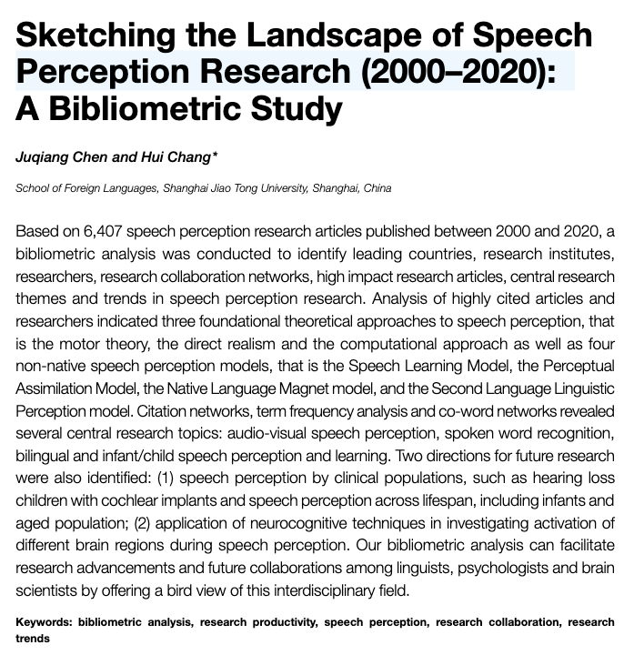
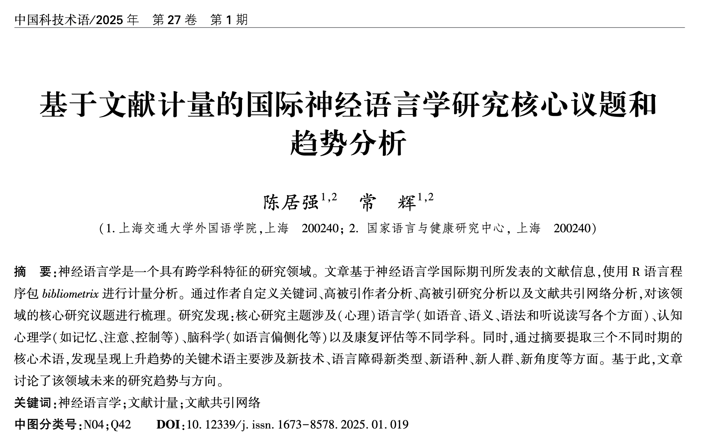

# 文献计量研究案例

## 案例14.1 语音感知文献计量研究 {-}





### 研究背景 {-}

### 研究问题及假设 {-}

### 研究方法 {-}

#### 数据收集 {-}

#### 数据处理 {-}


```{r echo=FALSE, include=FALSE}
library(tidyverse)

setwd("~/Nutstore Files/310_Tutorial/LanguageDS-e")

library(bibliometrix)
library(cowplot)

```


```{r  eval= FALSE, cache = TRUE }
## 数据导入及整理
filenames = list.files(path = "data/ch14/data-24-02-2021", 
                       pattern = "txt", 
                       full.names = TRUE)

# converting to bibliometric data frame
speech.data = convert2df(filenames, 
                         dbsource = "wos", 
                         format = "plaintext")

# use only research articles
speech.data = speech.data%>%
  filter(PY != 2021 & !is.na(PY))%>%
  filter(DT == "ARTICLE")

speech.df = select(speech.data, "AU", "AF","CR","AB" )%>%
  mutate(AB = tolower(AB))
```


```{r eval=F, echo=T}

result.bib = biblioAnalysis(speech.data, sep = ";")

bib.dscrp = summary(result.bib, k= 20)

```

### 研究结果  {-}

#### 数据可视化与展示 {-}


```{r eval=F, echo=T}

### 语音感知研究概况(2000-2020)
knitr::kable(bib.dscrp$MainInformationDF)

```


```{r eval=F, echo=T}
### 语音感知研究发表最多的杂志
# most relevant sources (journals)
knitr::kable( head(bib.dscrp$MostRelSources, n=20))

# write.csv(bib.dscrp$MostRelSources,
#           file =  paste("MostRelSources",
#                              Sys.Date(),
#                              "csv",
#                              sep = ".") ,row.names = FALSE)

```


```{r eval=F, echo=T}
### 研究能产性分析

### 语音感知研究产出量 (2000-2020).
pd.year = data.frame(bib.dscrp$AnnualProduction)

pd.year = speech.data%>%
  select(PY, SC)%>%
  group_by(PY)%>%
  summarise(n = n())

pd.year.fig = ggplot(data=pd.year, 
                        aes(x = PY, y = n, 
                            group = 1)) +
                        geom_point()+
                        geom_line()+
  xlab("Years")+
  ylab("Number of publications")+
  #ggtitle("Publications per year 2000-2020") +
  theme_bw()+
  theme(panel.background = element_blank())


# jpeg(paste( paste("year.pub",Sys.Date(),"jpeg",sep = "."), sep = ""),
#     units="in", width=4, height=3, res=600)
#  
  plot(pd.year.fig)
# 
#  dev.off()


```


```{r eval=F, echo=T}
### 语音感知研究数量最高的10个国家（地区） (2000-2020). 

# SCP = 单一国家发表; MCP = 多个国家合作发表 
pd.ctry = bib.dscrp$MostProdCountries

knitr::kable(pd.ctry)
# write.csv(pd.ctry,
#           file =  paste("pd.ctry",
#                              Sys.Date(),
#                              "csv",
#                              sep = ".") ,row.names = FALSE)

# total citations per country
# bib.dscrp$TCperCountries
# 
# pd.ct = cbind(pd.ctry, bib.dscrp$TCperCountries)

# write.csv(pd.ct,
#           file =  paste("pd.ct",
#                              Sys.Date(),
#                              "csv",
#                              sep = ".") ,row.names = FALSE)

```


```{r eval=F, echo=T }

### 发表量最大的10个国家发表趋势 
# a list of top ten countries

list.ctry = c("USA","UNITED KINGDOM" ,"CANADA" ,
              "GERMANY","FRANCE" ,"NETHERLANDS",
              "CHINA" ,"AUSTRALIA", "JAPAN" ,"SPAIN")

speech.meta = metaTagExtraction(speech.data, Field = "AU_CO", sep = ";")

pd.year.ctry = speech.meta%>%
  tibble::rownames_to_column(., "paper")%>%
  select(paper, PY, AU_CO)%>%
  transform(AU_CO= strsplit(AU_CO, ";")) %>%
  unnest(AU_CO)%>%
  # reduce repetition of multi-author paper
  group_by(paper, AU_CO)%>%
  mutate(order = 1:n())%>%
  filter(order == 1)%>%
  ungroup()%>%
  count(PY, AU_CO, sort = TRUE)%>%
  filter(AU_CO%in%list.ctry)%>%
  group_by(AU_CO)%>%
  mutate(total = sum(n))


pd.year.ctry.fig = ggplot(data=pd.year.ctry, 
                          aes(x = PY, y = n, 
                            group = AU_CO,color = AU_CO)) +
                        geom_point()+
                        geom_line()+
  xlab("Years")+
  ylab("Number of publications")+
  ggtitle("Publications per year 2000-2020") +
  theme_bw()+
  theme(panel.background = element_blank())

# jpeg(paste( paste("year.pub.ctry",Sys.Date(),"jpeg",sep = "."), sep = ""),
#     units="in", width=6, height=3, res=600)
# 
 plot(pd.year.ctry.fig)
# 
# dev.off()

```


```{r eval=F, echo=T }
### 语音感知领域发表量最高20位学者(2000-2020). 
au.pd =gsub(","," ",names(result.bib$Authors)[1:20])

h.pub.au <- Hindex(speech.data, 
                  field = "author", 
                  elements= au.pd,
                  sep = ";", years = 50)

h.au = as.data.frame(h.pub.au$H)%>%
  select(-3,-4,-7)

knitr::kable(h.au)

# write.csv(h.pub.au$H,
#           file =  paste("MostPdAU",
#                              Sys.Date(),
#                              "csv",
#                              sep = ".") ,row.names = FALSE)

```


```{r eval=F, echo=T}
### 语音感知领域发表量最高20位学者每年发表和引用趋势(2000-2020). . 

# TC = 所有发表. 圆圈大小代表发表数量；颜色深度表示引用数数量。


topAU10 <- authorProdOverTime(speech.data, k = 20)

# plot(topAU10$graph)

# jpeg(paste( paste("MostPdAU",Sys.Date(),"jpeg",sep = "."), sep = ""),
#     units="in", width=8, height=4, res=600)
# 
# topAU10
# 
# dev.off()

```

&emsp;&emsp; 语音感知研究中最活跃的20所大学/研究机构及其合作网络。网络中的每个节点代表一个不同的大学/研究机构，节点的直径与该机构与其他机构的合作强度成正比。节点之间的连线表示这些大学或研究机构之间的合作路径。

```{r eval=F, echo=T }
### 合作情况


uni.coc <- biblioNetwork(speech.data, 
                         analysis = "collaboration",  
                         network = "universities", 
                         sep = ";")

# jpeg(paste("edu.collab",Sys.Date(),"jpeg",sep = "."),
#     units="in", width=6, height=4, res=600)

uni.coc.plot = networkPlot(uni.coc,
                n = 50,
                #Title = "Collaborations among universities/institutes",
                type = "sphere",
                size=10,size.cex=T,
                remove.multiple=F,
                label.n = 20,
                edgesize = 3,labelsize=0.6,
                # plot or not
                verbose = FALSE)


# dev.off()


```

```{r eval=F, echo=T }

plot(uni.coc.plot$graph)

```


&emsp;&emsp;语音感知研究中前20个国家的合作网络。


&emsp;&emsp;网络中的每个节点代表一个不同的国家，节点的直径与该国家与其他国家合作的强度成正比。节点之间的连线表示国家之间的合作路径。

```{r eval=F, echo=T}

# country.coc = metaTagExtraction(speech.data, Field = "AU_CO", sep = ";")
# 
# country.collab <- biblioNetwork(country.coc, 
#                            analysis = "collaboration", 
#                            network = "countries", sep = ";")
# 
# # Plot the network
# 
# # jpeg(paste("ctry.collab",Sys.Date(),"jpeg",sep = "."),
# #     units="in", width=6, height=4, res=600)
# #
# country.collab.plot = networkPlot(country.collab, n = dim(country.collab)[1],
#                 Title = "Country collaborations",
#                 type = "sphere", size=TRUE,
#                 remove.multiple=F,
#                 label.n = 15,
#                 labelsize=0.7,
#                 verbose = FALSE)
# #
# # dev.off()


```

```{r eval=F, echo=T}

# plot(country.collab.plot$graph)

```


```{r eval=F, echo=T}
### 研究影响力

# 最高被引研究

ct.artcl = citations(speech.data, 
                      field = "article", 
                      sep = ";")

hot.papers = data.frame(ct.artcl$Cited[1:20],
                        ct.artcl$Year[1:20], 
                        ct.artcl$Source[1:20])%>%
  select(1,2)%>%
  rename(Researcher = CR,
         Citations = Freq)%>%
  separate(Researcher, c("Researcher","Year", "source","p1","p2","DOI"), ",")%>%
  select(-p1,-p2)

knitr::kable(hot.papers)

# write.csv(hot.papers,
#           file =  paste("hot.papers",
#                              Sys.Date(),
#                              "csv",
#                              sep = ".") ,row.names = FALSE)

```


```{r eval=F, echo=T }

# 语音感知高被引作者
ct.athr = citations(speech.data, 
                    field = "author", 
                    sep = ";")

hot.authors = data.frame(ct.athr$Cited[1:20])%>%
  rename(Authors = CR,
         Citations = Freq)

knitr::kable(hot.authors)
# h.cite.au = Hindex(speech.data, 
#                     field = "author", 
#                     elements= hot.authors$CR,
#                     sep = ";", years = 100)

# au.impact = cbind(hot.authors, h.cite.au$H)
# 
# write.csv(hot.authors,
#           file =  paste("hot.authors",
#                              Sys.Date(),
#                              "csv",
#                              sep = ".") ,row.names = FALSE)

```

&emsp;&emsp; 语音感知研究的共引网络。节点代表研究文章。每个节点的标签颜色与其所在的集群相同，节点的大小与其共引度成正比。

```{r eval=F, echo=T }

# article co-citation network
co.cite <- biblioNetwork(speech.data, 
                         analysis = "co-citation", 
                         network = "references", 
                         sep = ";")

# jpeg( paste("co-citation.network",Sys.Date(),"jpeg",sep = "."),
#      units="in", width=8, height=6, res=600)
#  
cocitation = networkPlot(co.cite, n = 30,
                Title = "Co-citation network",
                type = "auto", size=T,
                remove.isolates = T,
                remove.multiple=FALSE,
                labelsize=0.7,edgesize = 5,
                verbose = FALSE)
#  
#  dev.off()

```

```{r eval=F, echo=T}

plot(cocitation$graph)
knitr::kable( cocitation$cluster_res)

# write.csv(cocitation$cluster_res,
#           file =  paste("co-cite.stats",
#                              Sys.Date(),
#                              "csv",
#                              sep = ".") ,row.names = FALSE)
```


&emsp;&emsp;语音感知研究的文献耦合网络，其中节点代表研究文章。每个节点的标签颜色与其所在的集群相同，节点的大小与其文献耦合度成正比。

```{r eval=F, echo=T }

# article coupling network
article.cpl = biblioNetwork(speech.data, 
                           analysis = "coupling", 
                           network = "references", 
                           sep = ";")


# jpeg(paste("article.coupling.network",Sys.Date(),"jpeg",sep = "."),
#      units="in", width=8, height=6, res=600)
#  
coupling.net = networkPlot(article.cpl, n = 30,
                Title = "Bibliographic coupling network",
                type = "auto", size=T,
                remove.isolates = T,
                remove.multiple=FALSE,
                labelsize=0.7,edgesize = 5,
                verbose = FALSE
                )
#  
# dev.off()


```

```{r eval=F, echo=T}

plot(coupling.net$graph)

knitr::kable(coupling.net$cluster_res)

# write.csv(coupling.net$cluster_res,
#           file =  paste("coupling.stats",
#                              Sys.Date(),
#                              "csv",
#                              sep = ".") ,row.names = FALSE)

```


&emsp;&emsp;前20个作者定义关键词、机器生成关键词、基于标题和摘要的两词短语（Freq = 频率）*注意：在论文表格中，一些术语进行了合并处理，例如在标题两词短语列中，“Cochlear implant”（人工耳蜗）和“cochlear implantation”（人工耳蜗植入）被合并。*

```{r eval=F, echo=T }
library(tidytext)

stop.words = c("elsevier","rights reserved","NA NA",
               "results suggest","experiment 1","speech perception",
               "experiment 2","NA","NA")

# no temporal variation
au.ky = speech.data%>%
  select(DE,PY)%>%
  transform(DE = strsplit(DE, ";")) %>%
  unnest(DE)%>%
  filter(!DE%in%c("SPEECH PERCEPTION","SPEECH",
                  "PERCEPTION", " SPEECH"," SPEECH PERCEPTION",
                  " PERCEPTION"," LANGUAGE", "LANGUAGE"))%>%
  filter(DE != "" & !is.na(DE))%>%
  mutate(DE = str_replace_all(DE, " ",""),
         DE = str_replace_all(DE, "-",""),
         DE = str_to_title(DE),
         DE = dplyr::recode(DE, "Cochlearimplants" = "Cochlearimplant"),)%>%
  count(DE, sort = TRUE)%>%
  mutate(order = 1:n())%>%
  filter(order < 25)%>%
  select(-order)%>%
  rename(AuthorKeywords= DE,
         AuFreq = n)

# write.csv(au.ky, 
#           file =  paste("au.ky",
#                              Sys.Date(),
#                              "csv",
#                              sep = ".") ,row.names = FALSE)

# No temporal variation
machine.ky = speech.data%>%
  select(ID,PY)%>%
  transform(ID = strsplit(ID, ";")) %>%
  unnest(ID)%>%
  filter(!ID%in%c("SPEECH PERCEPTION","SPEECH",
                  "PERCEPTION", " SPEECH"," SPEECH PERCEPTION",
                  " PERCEPTION"," LANGUAGE", "LANGUAGE", 
                  "SPEECH-PERCEPTION", " SPEECH-PERCEPTION"))%>%
  filter(ID != "" & !is.na(ID))%>%
  mutate(ID = str_replace_all(ID, " ",""),
         ID = str_replace_all(ID, "-",""),
         ID = str_to_title(ID),
         ID = dplyr::recode(ID, "Cochlearimplants" = "Cochlearimplant"))%>%
  count(ID, sort = TRUE)%>%
  mutate(order = 1:n())%>%
  filter(order < 25)%>%
  select(-order)%>%
  rename(MachineKeywords= ID,
         MFreq = n)


# title 2-gram
title.ky.2gram = speech.data%>%
  select(TI,PY)%>%
  tibble::rownames_to_column(., "paper")%>%
  unnest_tokens(bigram, TI, 
                to_lower = T,
                token = "ngrams", n = 2)%>%
  separate(bigram, c("word1", "word2"), sep = " ")%>%
  filter(!word1 %in% stop_words$word, !word1 %in% stop.words) %>%
  filter(!word2 %in% stop_words$word, !word2 %in% stop.words)%>%
  unite(bigram, word1, word2, sep = " ")%>%
  filter(!bigram%in% stop.words)%>%
  mutate(bigram = str_replace_all(bigram, " ",""),
         #ID = str_replace_all(ID, "-",""),
         bigram = str_to_title(bigram),
         bigram = dplyr::recode(bigram, "Cochlearimplants" = "Cochlearimplant"))%>%
  count(bigram,sort = TRUE)%>%
  mutate(order = 1:n())%>%
  filter(order<25)%>%
  select(-order)%>%
  rename(Title2gram= bigram,
         TFreq = n)

# write.csv(title.ky.2gram, 
#           file =  paste("title.ky.2gram",
#                              Sys.Date(),
#                              "csv",
#                              sep = ".") ,row.names = FALSE)


# no temporal variation
ab.ky.2gram = speech.data%>%
  select(AB,PY)%>%
  tibble::rownames_to_column(., "paper")%>%
  unnest_tokens(bigram, AB, 
                to_lower = T,
                token = "ngrams", n = 2)%>%
  separate(bigram, c("word1", "word2"), sep = " ")%>%
  filter(!word1 %in% stop_words$word, !word1 %in% stop.words) %>%
  filter(!word2 %in% stop_words$word, !word2 %in% stop.words)%>%
  unite(bigram, word1, word2, sep = " ")%>%
  filter(!bigram%in% stop.words)%>%
  count(bigram, sort = TRUE)%>%
  mutate(bigram = str_replace_all(bigram, " ",""),
         #ID = str_replace_all(ID, "-",""),
         bigram = str_to_title(bigram),
         bigram = dplyr::recode(bigram, "Cochlearimplants" = "Cochlearimplant"))%>%
  mutate(order = 1:n())%>%
  filter(order<25)%>%
  select(-order)%>%
  rename(Abstract2gram= bigram,
         ABFreq = n)

# write.csv(ab.ky.2gram, 
#           file =  paste("ab.ky.2gram",
#                              Sys.Date(),
#                              "csv",
#                              sep = ".") ,row.names = FALSE)

term.freq = au.ky%>%
  bind_cols(machine.ky, title.ky.2gram, ab.ky.2gram)

knitr::kable(term.freq)

```

作者自定义词网络

```{r eval=F, echo=T }


keyword.au <- biblioNetwork(speech.data, 
                           analysis = "co-occurrences", 
                           network = "author_keywords", 
                           sep = ";")

# Plot the network

# jpeg(paste(paste("keyword.au.co-occurrence",Sys.Date(),"jpeg",sep = "."),
#           sep = ""),
#     units="in", width=10, height=8, res=600)
# 
keyword.fig = networkPlot(keyword.au,
                normalize="association", weighted=T, n = 30,
                Title = "Author keyword co-occurrences",
                type = "auto", size.cex = TRUE,
                size=T,edgesize = 5,labelsize=1,
                verbose = FALSE)

# dev.off()

```

```{r eval=F, echo=T}

plot(keyword.fig$graph)


```

## 案例14.2 神经语言学文献计量研究 {-}



### 研究背景 {-}

### 研究问题及假设 {-}

### 研究方法 {-}

#### 数据收集 {-}

#### 数据处理 {-}

```{r eval=F, echo=T}


# import libraries

library(bibliometrix)
library(tidyverse)
library(tidytext)
library(DT)
library(quanteda)
# show chinese characters in ggplot
library(showtext)
showtext_auto()
# read files

filenames = list.files(path = "data/ch14/scopus", 
                       pattern = "csv", 
                       full.names = TRUE)
# converting to bibliometric data frame
# aphasia.data = convert2df(filenames, 
#                          dbsource = "wos", 
#                          format = "plaintext")

neuro.bib.data = convert2df(filenames, 
                         dbsource = "scopus", 
                         format = "csv")

neuro.bib = neuro.bib.data  %>%
  filter(TI !="RECENT PUBLICATIONS")%>%
  filter(TI !=  "ERRATUM")%>%
  filter(DT == "ARTICLE")%>%
  filter( !is.na(PY))%>%
  filter(PY < 2023)

# %>%
#   filter(DT %in%c("ARTICLE", "REVIEW", "ARTICLE; PROCEEDINGS PAPER", 
#                   "ARTICLE; EARLY ACCESS", "REVIEW; EARLY ACCESS"))
# A <- cocMatrix(M, Field = "AU", sep = ";")

write.csv(neuro.bib,
          file = paste(tbl.fig,
                       paste("neuro.bib",
                             Sys.Date(),
                             "csv",
                             sep = "."),
                       sep = "") ,row.names = FALSE)

```


```{r eval=F, echo=T}

result.bib = biblioAnalysis(neuro.bib , sep = ";")

bib.dscrp = summary(result.bib, k= 50)

```

### 研究结果 {-}

#### 描述性数据展示 {-}


```{r eval=F, echo=T}
## 文献数据库总体情况
knitr::kable(bib.dscrp$MainInformationDF)

# write.csv(bib.dscrp$MainInformationDF,
#           file = paste(tbl.fig,
#                        paste("MainInformationDF",
#                              Sys.Date(),
#                              "csv",
#                              sep = "."),
#                        sep = "") ,row.names = FALSE)

```


```{r eval=F, echo=T}
## 神经语言学领域发表数量趋势
pd.year = data.frame(bib.dscrp$AnnualProduction)%>%
  mutate(PY = Year... )
  

# pd.year = speech.data%>%
#   select(PY, SC)%>%
#   group_by(PY)%>%
#   summarise(n = n())

pd.year.fig = ggplot(data= pd.year, 
                        aes(x = PY, y = Articles, 
                            group = 1)) +
                        geom_point()+
                        geom_line()+
  xlab("年份")+
  ylab("文献数量")+
  #ggtitle("Publications per year 2000-2020") +
  theme_bw()+
  theme(panel.background = element_blank())+
  theme(axis.text.x = element_text(angle=90, vjust=.5, hjust=1))
  coord_flip()


jpeg(paste( tbl.fig, paste("year.pub",Sys.Date(),"jpeg",sep = "."), sep = ""),
    units="in", width=10, height=4, res=600)

  plot(pd.year.fig)

 dev.off()
 
 plot(pd.year.fig)
 
```


```{r eval=F, echo=T}
## 发表国家（地区）分布及增长趋势
pd.ctry = bib.dscrp$MostProdCountries

knitr::kable(pd.ctry)

# write.csv(bib.dscrp$MostProdCountries,
#           file = paste(tbl.fig,
#                        paste("MostProdCountries",
#                              Sys.Date(),
#                              "csv",
#                              sep = "."),
#                        sep = "") ,row.names = FALSE)


# a list of top ten countries

list.ctry = c("USA","UNITED KINGDOM" ,"CANADA" ,
              "GERMANY","FRANCE" ,"NETHERLANDS",
              "CHINA" ,"AUSTRALIA", "ITALY" ,"SPAIN")

# list.ctry = as.vector(pd.ctry$Country)


neuro.meta = metaTagExtraction(neuro.bib, Field = "AU_CO", sep = ";")

pd.year.ctry = neuro.meta%>%
  tibble::rownames_to_column(., "paper")%>%
  select(paper, PY, AU_CO)%>%
  transform(AU_CO= strsplit(AU_CO, ";")) %>%
  unnest(AU_CO)%>%
  # reduce repetition of multi-author paper
  group_by(paper, AU_CO)%>%
  mutate(order = 1:n())%>%
  filter(order == 1)%>%
  ungroup()%>%
  count(PY, AU_CO, sort = TRUE)%>%
  filter(AU_CO %in% list.ctry)%>%
  group_by(AU_CO)%>%
  mutate(total = sum(n))


pd.year.ctry.fig = ggplot(data=pd.year.ctry, 
                          aes(x = PY, y = n, 
                            group = AU_CO,color = AU_CO)) +
                        geom_point()+
                        geom_line()+
  xlab("年份 ")+
  ylab("论文数量")+
  ggtitle("") +
  theme_bw()+
  theme(panel.background = element_blank())

# jpeg(paste(tbl.fig,  paste("year.pub.ctry",Sys.Date(),"jpeg",sep = "."), sep = ""),
#     units="in", width=10, height=4, res=600)
# 
plot(pd.year.ctry.fig)
# 
# dev.off()

```


```{r eval=F, echo=T}
## 高产和高被引研究者
topAU10 <- authorProdOverTime(neuro.bib, k = 20)

plot(topAU10$graph)


jpeg(paste(tbl.fig,
           paste("MostPdAU",
                 Sys.Date(),
                 "jpeg",
                 sep = "."),
           sep = ""),
     units="in", width=8, height=4, res=600)

topAU10

dev.off()

```


```{r eval=F, echo=T}

PapersAU.df = as.data.frame(topAU10$dfPapersAU)%>%
  mutate(TI = tolower(TI),
         TCpY = round(TCpY, 1))%>%
  filter(TCpY > 4)

PapersAU.df%>%
  select(-SO, -DOI)%>%
  datatable(extensions = 'Buttons',
            options = list(dom = 'Blfrtip',
                           buttons = c('copy', 'csv', 'excel', 'pdf'),
                           lengthMenu = list(c(10,25,50,-1),
                                             c(10,25,50,"All"))))
write.csv(PapersAU.df,
          file = paste(tbl.fig,
                       paste("PapersAU.df",
                             Sys.Date(),
                             "csv",
                             sep = "."),
                       sep = "") ,row.names = FALSE)

```

```{r eval=F, echo=T}

uni.coc <- biblioNetwork(neuro.bib, 
                         analysis = "collaboration",  
                         network = "universities", 
                         sep = ";")

uni.coc.plot = networkPlot(uni.coc,
                n = 50,
                Title = "国际神经语言学机构合作网络",
                type = "sphere",
                size=10,size.cex=T,
                remove.multiple=F,
                label.n = 20,
                edgesize = 3,labelsize=0.6,
                # plot or not
                verbose = FALSE)

png(paste(tbl.fig,
           paste("uni.coc.plot",
                 Sys.Date(),
                 "png",
                 sep = "."),
           sep = ""),
     units="in", width=6, height=6, res=600)

plot(uni.coc.plot$graph)

dev.off()


author.coc <- biblioNetwork(neuro.bib, 
                         analysis = "collaboration",  
                         network = "authors", 
                         sep = ";")


author.coc.plt = networkPlot(author.coc ,
                n = 40,
                Title = "国际神经语言学研究者合作网络",
                type = "sphere",
                size=10,size.cex=T,
                remove.multiple=F,
                label.n = 20,
                edgesize = 3,labelsize=0.6,
                # plot or not
                verbose = FALSE)

png(paste(tbl.fig,
           paste("author.coc.plot",
                 Sys.Date(),
                 "png",
                 sep = "."),
           sep = ""),
     units="in", width=6, height=6, res=600)

plot(author.coc.plt$graph)

dev.off()

nation.coc <- biblioNetwork(neuro.meta, 
                         analysis = "collaboration",  
                         network = "countries", 
                         sep = ";")


nation.coc.plt = networkPlot(nation.coc,
                n = 40,
                Title = "国际神经语言学国家（地区）合作网络",
                type = "sphere",
                size=10,size.cex=T,
                remove.multiple=F,
                label.n = 20,
                edgesize = 3,labelsize=0.6,
                # plot or not
                verbose = FALSE)

png(paste(tbl.fig,
           paste("nation.coc.plot",
                 Sys.Date(),
                 "png",
                 sep = "."),
           sep = ""),
     units="in", width=4, height=4, res=600)

plot(nation.coc.plt$graph)

dev.off()


```


```{r eval=F, echo=T}
## 高被引研究
ct.artcl = citations(neuro.bib , 
                      field = "article", 
                      sep = ";")

hot.papers = data.frame(ct.artcl$Cited[1:50],
                        ct.artcl$Year[1:50], 
                        ct.artcl$Source[1:50])

knitr::kable(hot.papers)

# write.csv(hot.papers,
#           file = paste(tbl.fig,
#                        paste("hot.papers",
#                              Sys.Date(),
#                              "csv",
#                              sep = "."),
#                        sep = "") ,row.names = FALSE)

```

```{r eval=F, echo=T}
## 基于文献共引关系的神经语言学文献引用网络分析

# article co-citation network
co.cite <- biblioNetwork(neuro.bib, 
                         analysis = "co-citation", 
                         network = "references", 
                         sep = ";")

CoCitation = networkPlot(co.cite, n = 50,
                Title = "神经语言学共被引文献网络",
                type = "fruchterman", size=1,
                curved=TRUE,
                remove.isolates = T,
                remove.multiple=FALSE,
                labelsize=0.5,edgesize = 2,
                verbose = FALSE)


jpeg(paste(tbl.fig,
           paste("Co-Citation Network",
                 Sys.Date(),
                 "jpeg",
                 sep = "."),
           sep = ""),
     units="in", width=8, height=6, res=600)

 plot( CoCitation$graph)

  
 dev.off()

```


```{r eval=F, echo=T}

citation.df = neuro.bib%>%
  tibble::rownames_to_column(., "id")%>%
  mutate(id = toupper(id))%>%
  select(id, TI, CR)%>%
  unnest_tokens(vertex, CR, token = stringr::str_split, pattern = ";")%>%
  mutate(vertex1 = str_extract(vertex,"[a-z]{1,10}, [a-z]"),
         vertex1 = toupper(vertex1),
         vertex2 = str_extract(vertex,"\\([0-9]{4}\\)"),
         vertex2 = str_extract(vertex,"[0-9]{4}"),
         reference = vertex,
         vertex = paste(vertex1, vertex2))%>%
  select(vertex,reference)

CoCitation.raw = as.data.frame(CoCitation$cluster_res)%>%
  mutate(vertex1 = str_extract(vertex,"[a-z]{1,10} "),
         vertex1 = str_remove(vertex1, " "),
         vertex2 = str_extract(vertex," [a-z]{1}"),
         vertex2 = str_remove(vertex2, " "),
         vertex3 = str_extract(vertex,"[0-9]{4}"),
         vertex = paste(vertex1, vertex2, sep = ", "),
         vertex = paste(vertex, vertex3),
         vertex = toupper(vertex))%>%
  left_join(citation.df )%>%
  distinct()


CoCitation.df = CoCitation.raw%>%
  group_by(vertex)%>%
  mutate(n = 1:n())%>%
  filter(n == 1)%>%
  select("vertex", "cluster", "btw_centrality", "reference")%>%
  mutate(centrality = round(btw_centrality,2))%>%
  arrange(cluster,desc(centrality))%>%
  select(cluster, vertex, centrality, reference)

CoCitation.df%>%
  #select(-SO, -DOI)%>%
  datatable(extensions = 'Buttons',
            options = list(dom = 'Blfrtip',
                           buttons = c('copy', 'csv', 'excel', 'pdf'),
                           lengthMenu = list(c(10,25,50,-1),
                                            c(10,25,50,"All"))))
# 
write.csv(CoCitation.df,
          file = paste(tbl.fig,
                       paste("CoCitation.df",
                             Sys.Date(),
                             "csv",
                             sep = "."),
                       sep = "") ,row.names = FALSE)


```


```{r eval=F, echo=T}
## 	基于文献耦合关系的神经语言学文献引用网络分析

article.cpl = biblioNetwork(neuro.bib, 
                           analysis = "coupling", 
                           network = "references", 
                           sep = ";")

coupling.net = networkPlot(article.cpl, n =50,
                Title = "神经语言学文献耦合网络",
                type = "auto", size=T,
                remove.isolates = T,
                remove.multiple=FALSE,
                cluster = "optimal",
                labelsize=0.7,edgesize = 5,
                verbose = FALSE
                )

jpeg(paste(tbl.fig,
           paste("article.cpl",
                 Sys.Date(),
                 "jpeg",
                 sep = "."),
           sep = ""),
     units="in", width=6, height=4, res=600)

plot(coupling.net$graph)

dev.off()


```

```{r eval=F, echo=T}

couple.df = as.data.frame(coupling.net$cluster_res)%>%
    mutate(vertex1 = str_extract(vertex,"[a-z]{1,10} "),
         vertex1 = str_remove(vertex1, " "),
         vertex2 = str_extract(vertex," [a-z]{1}"),
         vertex2 = str_remove(vertex2, " "),
         vertex3 = str_extract(vertex,"[0-9]{4}"),
         vertex = paste(vertex1, vertex2, sep = ", "),
         vertex = paste(vertex, vertex3),
         vertex = toupper(vertex))%>%
  left_join(citation.df)%>%
  distinct()%>%
  select("vertex", "cluster", "btw_centrality", "reference")%>%
  mutate(btw_centrality = round(btw_centrality,2))%>%
  arrange(cluster,desc(btw_centrality))%>%
  group_by(vertex)%>%
  mutate(n = 1:n())%>%
  filter(n == 1)%>%
  select(cluster, vertex, btw_centrality, reference)

couple.df%>%
 datatable(extensions = 'Buttons',
            options = list(dom = 'Blfrtip',
                           buttons = c('copy', 'csv', 'excel', 'pdf'),
                           lengthMenu = list(c(10,25,50,-1),
                                             c(10,25,50,"All"))))
write.csv(couple.df ,
          file = paste(tbl.fig,
                       paste("couple.df ",
                             Sys.Date(),
                             "csv",
                             sep = "."),
                       sep = "") ,row.names = FALSE)


```


```{r eval=F, echo=T}
## 基于期刊文献标题的核心研究主题
# stop.words = c("elsevier","rights reserved","NA NA","taylor francis","taylor",
#                "francis","psychology press","uk limited","copyright","informa",
#                "results results", "limited trading","outcomes results",
#                	"methods procedures",
#                "results suggest","experiment 1",
#                "experiment 2","NA","NA")

stopWords <- read_csv("data/ch14/stopWords.csv", col_names = FALSE)

stop.words = as.vector(stopWords$X1)

# keywords
au.ky = neuro.bib%>%
  select(DE,PY)%>%
  transform(DE = strsplit(DE, ";")) %>%
  unnest(DE)%>%
  filter(DE != "" & !is.na(DE))%>%
  mutate(DE = str_replace_all(DE, "^ ",""),
         DE = str_replace_all(DE, "-","_"),
         DE = str_to_title(DE),
         DE = recode(DE, "Primary Progressive Aphasia" = "PPA"),
         )%>%
  filter(!DE%in%c("Aphasia","Language"))%>%
  count(DE, sort = TRUE)%>%
  mutate(order = 1:n())%>%
  filter(order < 101)%>%
  select(-order)%>%
  rename(AuthorKeywords= DE,
         AuFreq = n)

write.csv(au.ky,
          file = paste(tbl.fig,
                       paste("au.100.keyword",
                             Sys.Date(),
                             "csv",
                             sep = "."),
                       sep = "") ,row.names = FALSE)

authorkeyword.coc <- biblioNetwork(neuro.meta, 
                         analysis = "co-occurrences",  
                         network = "author_keywords", 
                         sep = ";")

authorkeyword.coc.plt = networkPlot(authorkeyword.coc ,
                n = 40,
                Title = "神经语言学论文作者关键词共现网络",
                type = "fruchterman",
                size=10, size.cex=T,curved=TRUE, 
                remove.multiple=F,
                label.n = 20,
                edgesize = 3,
                #edges.min = 15,
                labelsize=1 ,
                # plot or not
                verbose = FALSE)

png(paste(tbl.fig,
           paste("authorkeyword.coc.plt",
                 Sys.Date(),
                 "png",
                 sep = "."),
           sep = ""),
     units="in", width=8, height=8, res=600)

plot(authorkeyword.coc.plt$graph)

dev.off()
```


```{r eval=F, echo=T}
## 基于期刊文献关键词的核心研究主题

# title
title.word = neuro.bib%>%
  # filter(AB != "[NO ABSTRACT AVAILABLE]")%>%
  select(TI,PY)%>%
  tibble::rownames_to_column(., "paper")%>%
  unnest_tokens(word, TI, 
                to_lower = T,
                token = "words")%>%
  filter(!word %in% stop_words$word, !word %in% stop.words) %>%
  filter(!word %in% c("aphasia","aphasic","patient","study",
                      "people","language"))%>%
  count(word, sort = TRUE)%>%
  mutate(order = 1:n())%>%
  filter(order < 51)

title.2gram = neuro.bib%>%
  # filter(AB != "[NO ABSTRACT AVAILABLE]")%>%
  select(TI,PY)%>%
  tibble::rownames_to_column(., "paper")%>%
    unnest_tokens(bigram, TI, 
                to_lower = T,
                token = "ngrams", n = 2)%>%
  separate(bigram, c("word1", "word2"), sep = " ")%>%
  filter(!word1 %in% stop_words$word, !word1 %in% stop.words) %>%
  filter(!word2 %in% stop_words$word, !word2 %in% stop.words)%>%
  unite(bigram, word1, word2, sep = " ")%>%
  filter(!bigram%in% stop.words)%>%
  count(bigram, sort = TRUE)%>%
  mutate(order = 1:n())%>%
  filter(order < 51)

title.3gram = neuro.bib%>%
  # filter(AB != "[NO ABSTRACT AVAILABLE]")%>%
  select(TI,PY)%>%
  tibble::rownames_to_column(., "paper")%>%
  unnest_tokens(trigram, TI, 
                to_lower = T,
                token = "ngrams", n = 3)%>%
  separate(trigram, c("word1", "word2", "word3"), sep = " ")%>%
  filter(!word1 %in% stop_words$word, !word1 %in% stop.words) %>%
  #filter(!word2 %in% stop_words$word, !word2 %in% stop.words)%>%
  filter(!word3 %in% stop_words$word, !word3 %in% stop.words)%>%
  unite(trigram, word1, word2, word3, sep = " ")%>%
  filter(!trigram%in% stop.words)%>%
  count(trigram, sort = TRUE)%>%
  mutate(order = 1:n())%>%
  filter(order < 51)

title.all = cbind(title.word, title.2gram, title.3gram)

write.csv(title.all,
          file = paste(tbl.fig,
                       paste("title.50.keyword",
                             Sys.Date(),
                             "csv",
                             sep = "."),
                       sep = "") ,row.names = FALSE)

neuro.meta$TI_TM = neuro.meta$TI
title.coc <- biblioNetwork(neuro.meta, 
                         analysis = "co-occurrences",  
                         network = "titles", 
                         sep = ";")

title.coc.plt = networkPlot(title.coc ,
                n = 40,
                Title = "神经语言学论文标题关键词共现网络",
                type = "sphere",
                size=10,size.cex=T,
                remove.multiple=F,
                label.n = 20,
                edgesize = 3,labelsize=0.6,
                # plot or not
                verbose = FALSE)

png(paste(tbl.fig,
           paste("authorkeyword.coc.plt",
                 Sys.Date(),
                 "png",
                 sep = "."),
           sep = ""),
     units="in", width=4, height=4, res=600)

plot(title.coc.plt$graph)

dev.off()


# library(wordcloud)
# jpeg(paste(tbl.fig, 
#            paste("AuthorKeywords",
#                  Sys.Date(),
#                  "jpeg",
#                  sep = "."), 
#            sep = ""),
#      units="in", width=8, height=4, res=600)
# 
# wordcloud(words = au.ky$AuthorKeywords, freq = au.ky$AuFreq, min.freq = 1,
#           max.words=200, random.order=FALSE, rot.per=0.35, 
#           colors=brewer.pal(8, "Dark2"))
# dev.off()
# 
# jpeg(paste(tbl.fig, 
#            paste("title.1gram",
#                  Sys.Date(),
#                  "jpeg",
#                  sep = "."), 
#            sep = ""),
#      units="in", width=8, height=4, res=600)
# 
# wordcloud(words = title.word$word, freq = title.word$n, min.freq = 1,
#           max.words=200, random.order= T, rot.per=0.35, 
#           colors=brewer.pal(8, "Dark2"))
# dev.off()
# 
# jpeg(paste(tbl.fig, 
#            paste("title.2gram",
#                  Sys.Date(),
#                  "jpeg",
#                  sep = "."), 
#            sep = ""),
#      units="in", width=8, height=4, res=600)
# 
# wordcloud(words = title.2gram$bigram, freq = title.2gram$n, min.freq = 1,
#           max.words=200, random.order= T, rot.per=0.35, 
#           colors=brewer.pal(8, "Dark2"))
# dev.off()
# 
# jpeg(paste(tbl.fig, 
#            paste("title.3gram",
#                  Sys.Date(),
#                  "jpeg",
#                  sep = "."), 
#            sep = ""),
#      units="in", width=8, height=4, res=600)
# 
# wordcloud(words = title.3gram$trigram, freq = title.3gram$n, min.freq = 1,
#           max.words=200, random.order= T, rot.per=0.35, 
#           colors=brewer.pal(8, "Dark2"))
# dev.off()

```


```{r eval=F, echo=T}
## 基于期刊摘要的核心研究主题变化趋势


# abstract

ab.1gram = neuro.bib%>%
  filter(AB != "[NO ABSTRACT AVAILABLE]")%>%
  select(AB,PY)%>%
  tibble::rownames_to_column(., "paper")%>%
  unnest_tokens(word, AB, 
                to_lower = T,
                token = "words")%>%
  filter(!word %in% stop_words$word, 
         !word %in% stop.words) %>%
  count(word, sort = TRUE)%>%
  filter(!word %in% c("aphasia","aphasic","patient","study","results","background",
                      "outcomes",
                      "people","language"))%>%
  filter(n>20)%>%
  mutate(order = 1:n(),
         type = "monogram")%>%
  rename(topic = word)%>%
  filter(!topic %in% as.character(c(1:10000)))

ab.2gram = neuro.bib%>%
  filter(AB != "[NO ABSTRACT AVAILABLE]")%>%
  select(AB,PY)%>%
  tibble::rownames_to_column(., "paper")%>%
  unnest_tokens(bigram, AB, 
                to_lower = T,
                token = "ngrams", n = 2)%>%
  separate(bigram, c("word1", "word2"), sep = " ")%>%
  filter(!word1 %in% stop_words$word, !word1 %in% stop.words) %>%
  filter(!word2 %in% stop_words$word, !word2 %in% stop.words)%>%
  unite(bigram, word1, word2, sep = " ")%>%
  filter(!bigram%in% stop.words)%>%
  count(bigram, sort = TRUE)%>%
  filter(n>20)%>%
  mutate(order = 1:n(),
         type = "bigram")%>%
  rename(topic = bigram)

ab.3gram = neuro.bib%>%
  filter(AB != "[NO ABSTRACT AVAILABLE]")%>%
  select(AB,PY)%>%
  tibble::rownames_to_column(., "paper")%>%
  unnest_tokens(trigram, AB, 
                to_lower = T,
                token = "ngrams", n = 3)%>%
  separate(trigram, c("word1", "word2", "word3"), sep = " ")%>%
  filter(!word1 %in% stop_words$word, !word1 %in% stop.words) %>%
  filter(!word2 %in% stop.words)%>%
  filter(!word3 %in% stop_words$word, !word3 %in% stop.words)%>%
  unite(trigram, word1, word2, word3, sep = " ")%>%
  filter(!trigram%in% stop.words)%>%
  count(trigram, sort = TRUE)%>%
  filter(n>20)%>%
  mutate(order = 1:n(),
         type = "trigram")%>%
  rename(topic = trigram)


all.topics = rbind(ab.1gram, ab.2gram, ab.3gram)%>%
  select(topic)%>%
  as.vector()

#### normalising frequency

# get artile numbers
n.article =neuro.bib%>%
  filter(AB != "[NO ABSTRACT AVAILABLE]")%>%
  select(TI,PY, AB)%>%
  mutate(removed = str_detect(TI, "ERRATUM"),
         uniqueID = as.character(1:n()))%>%
  filter(removed != TRUE)%>%
  mutate(period =case_when(
    PY %in% 1974:1999 ~ "first",
    PY %in% 2000:2010 ~ "second",
    PY %in% 2011:2023 ~ "third" ))%>%
  group_by(period)%>%
  mutate(n.paper = n())


neuro.bib.corpus = corpus(n.article, 
                        text_field = "AB",
                        docid_field = "uniqueID",
               meta = list(source = "Aphasiology"))

head(summary(neuro.bib.corpus))

# identify each monogram, bigram, trigram
df = kwic(tokens(neuro.bib.corpus), pattern = phrase(all.topics$topic))

library(rstatix)

topic.df = df%>%
  left_join(n.article, by = c("docname" = "uniqueID"))%>%
  group_by(docname, period, n.paper)%>%
  distinct(pattern)%>%
  group_by(period, n.paper)%>%
  count(pattern, sort = TRUE)%>%
  mutate(norm.freq = round(1000*(n/n.paper)),0)%>%
  ungroup()%>%
  select(pattern, period, norm.freq)%>%
  spread(period, norm.freq)%>%
  # fill all na with 0
  replace(is.na(.), 0)%>%
  gather("period", "norm.freq","first","second","third")%>%
  group_by(pattern)%>%
  mutate(sum = sum(norm.freq))%>%
  filter(sum != 0)
  

# 整理提取统计值
library(broom)
options(scipen = 999)
topic.test =  topic.df%>%
  group_by(pattern)%>%
  summarise(res = list(
    tidy(
      chisq.test(norm.freq))))%>%
    unnest()

topic.wide.df = df%>%
  left_join(n.article, by = c("docname" = "uniqueID"))%>%
  group_by(period, n.paper)%>%
  count(pattern, sort = TRUE)%>%
  mutate(norm.freq = round(1000*(n/n.paper)),0)%>%
  ungroup()%>%
  select(pattern, period, norm.freq)%>%
  spread(period, norm.freq)%>%
  # fill all na with 0
  replace(is.na(.), 0)


topic.results = topic.test%>%
  filter(p.value<0.05)%>%
  select(pattern, statistic, p.value)%>%
  left_join(topic.wide.df)%>%
  mutate(pattern = as.character(pattern))%>%
  filter(!pattern%in%c("uk","trading","limited","rights","llc","pwa",
                       "research","author",
                       "participant","aim","participation","persons",
                       "reserved","press"))%>%
  mutate(topic.len = str_count(pattern, pattern = " "),
         topic.len = as.character(topic.len))%>%
  mutate(trends = case_when(first < second & second < third ~ "rise",
                            first < second & second == third ~ "rise_level",
                            first == second & second < third ~ "level_rise",
                            first > second & second > third ~ "decrease",
                            first > second & second == third ~ "decrease_level",
                            first == second & second > third ~ "level_decrease",
                            first < second & second > third ~ "peak",
                            first > second & second < third ~ "valley"))%>%
  group_by(topic.len, trends)%>%
  arrange(desc(p.value))%>%
  arrange(p.value)%>%
  mutate(order = 1:n())

topic.top50 =topic.results %>%
                        filter(order < 51)%>%
  select(trends,topic.len, pattern, order, first, second, third)%>%
  group_by(trends,topic.len)%>%
  arrange(order)


# write.csv(topic.top50 , 
#           file = paste(tbl.fig, 
#                        paste("topic.top50",
#                              Sys.Date(),
#                              "csv",
#                              sep = "."),
#                        sep = "") ,row.names = FALSE)

# rising trend
trend.rise = topic.top50 %>%
  filter(trends %in% c("rise","rise_level","level_rise"))%>%
  filter(!pattern %in% c("hr","pwas","studies","support","participants","future","imprint","business",
                         "published","identified","completed","impact","examine","explore","improve","aimed",
                         "contribution","including","investigate","key","conclusion","speech and language",
                         "primary outcome","add","relationship","extent",
                         "people with aphasia",
                         "persons with aphasia","individuals with aphasia","outcomes and results",
                         "methods and procedures","participants with aphasia","patients with aphasia",
                         "data were collected","data were analysed",
                         "procedures"))%>%
  mutate(pattern = recode(pattern, "slts" = "speech-language therapists",
                          "cps" = "conversation paterners",
                          "anelt" ="Amsterdam Nijmegen Everyday Language Test",
                          "icap" ="Intensive Comprehensive Aphasia Program",
                          "lvppa"="Logopenic Variant Of Primary Progressive Aphasia",
                          "nfvppa" = "Non-fluent Variant Of Primary Progressive Aphasia",
                          "svppa" = "Semantic Variant Of Primary Progressive Aphasia",
                          "tdcs" = "TRANSCRANIAL DIRECT CURRENT STIMULATION",
                          "tms" = "TRANSCRANIAL MAGNETIC STIMULATION",
                          "ppa"= "Primary Progressive Aphasia",
                          "slps" = "SPEECH-LANGUAGE PATHOLOGISTS",
                          "cpt" = "COMMUNICATION PARTNER TRAINING",
                          "stm" = "SHORT-TERM MEMORY"))%>%
    mutate(topic.len = str_count(pattern, pattern = " ") + 1,
           topic.len = as.character(topic.len),
           pattern = tolower(pattern))%>%
  arrange(trends, topic.len)
  
write.csv(trend.rise ,
          file = paste(tbl.fig,
                       paste("trend.rise",
                             Sys.Date(),
                             "csv",
                             sep = "."),
                       sep = "") ,row.names = FALSE)

# falling trend
trend.decrease = topic.top50 %>%
  filter(trends %in% c("decrease","decrease_level","level_decrease"))%>%
  filter(!pattern %in% c("hr","pwas","studies","support","participants","future","imprint","business",
                         "published","identified","completed","impact","examine","explore","improve","aimed",
                         "contribution","including","investigate","key","conclusion","speech and language",
                         "primary outcome","add","relationship","extent",
                         "people with aphasia",
                         "persons with aphasia","individuals with aphasia","outcomes and results",
                         "methods and procedures","participants with aphasia","patients with aphasia",
                         "data were collected","data were analysed",
                         "procedures"))%>%
  mutate(pattern = recode(pattern, "slts" = "speech-language therapists",
                          "cps" = "conversation paterners",
                          "anelt" ="Amsterdam Nijmegen Everyday Language Test",
                          "icap" ="Intensive Comprehensive Aphasia Program",
                          "lvppa"="Logopenic Variant Of Primary Progressive Aphasia",
                          "nfvppa" = "Non-fluent Variant Of Primary Progressive Aphasia",
                          "svppa" = "Semantic Variant Of Primary Progressive Aphasia",
                          "tdcs" = "TRANSCRANIAL DIRECT CURRENT STIMULATION",
                          "tms" = "TRANSCRANIAL MAGNETIC STIMULATION",
                          "ppa"= "Primary Progressive Aphasia",
                          "slps" = "SPEECH-LANGUAGE PATHOLOGISTS",
                          "cpt" = "COMMUNICATION PARTNER TRAINING",
                          "stm" = "SHORT-TERM MEMORY"))%>%
    mutate(topic.len = str_count(pattern, pattern = " ") + 1,
           topic.len = as.character(topic.len),
           pattern = tolower(pattern))%>%
  arrange(trends, topic.len)

write.csv(trend.decrease ,
          file = paste(tbl.fig,
                       paste("trend.decrease",
                             Sys.Date(),
                             "csv",
                             sep = "."),
                       sep = "") ,row.names = FALSE)


trend.peak.valley = topic.top50 %>%
  filter(trends %in% c("peak","valley"))%>%
  filter(!pattern %in% c("hr","pwas","studies","support","participants","future","imprint","business",
                         "published","identified","completed","impact","examine","explore",
                         "improve","aimed",
                         "contribution","including","investigate","key","conclusion","speech and language",
                         "primary outcome","add","relationship","extent",
                         "people with aphasia",
                         "persons with aphasia","individuals with aphasia","outcomes and results",
                         "methods and procedures","participants with aphasia","patients with aphasia",
                         "data were collected","data were analysed",
                         "procedures",
                         "psychology","al","total","methods","purpose",
                         "aphasic individuals","aphasic speakers",
                         "person with aphasia","individual with aphasia","individual with aphasia",
                         "patients","variant","characterized","analyzed"))%>%
  mutate(pattern = recode(pattern, "slts" = "speech-language therapists",
                          "cps" = "conversation paterners",
                          "anelt" ="Amsterdam Nijmegen Everyday Language Test",
                          "icap" ="Intensive Comprehensive Aphasia Program",
                          "lvppa"="Logopenic Variant Of Primary Progressive Aphasia",
                          "nfvppa" = "Non-fluent Variant Of Primary Progressive Aphasia",
                          "svppa" = "Semantic Variant Of Primary Progressive Aphasia",
                          "tdcs" = "TRANSCRANIAL DIRECT CURRENT STIMULATION",
                          "tms" = "TRANSCRANIAL MAGNETIC STIMULATION",
                          "ppa"= "Primary Progressive Aphasia",
                          "slps" = "SPEECH-LANGUAGE PATHOLOGISTS",
                          "cpt" = "COMMUNICATION PARTNER TRAINING",
                          "stm" = "SHORT-TERM MEMORY"))%>%
    mutate(topic.len = str_count(pattern, pattern = " ") + 1,
           topic.len = as.character(topic.len),
           pattern = tolower(pattern))%>%
  arrange(trends, topic.len)

write.csv(trend.peak.valley,
          file = paste(tbl.fig,
                       paste("trend.peak.valley",
                             Sys.Date(),
                             "csv",
                             sep = "."),
                       sep = "") ,row.names = FALSE)


```


