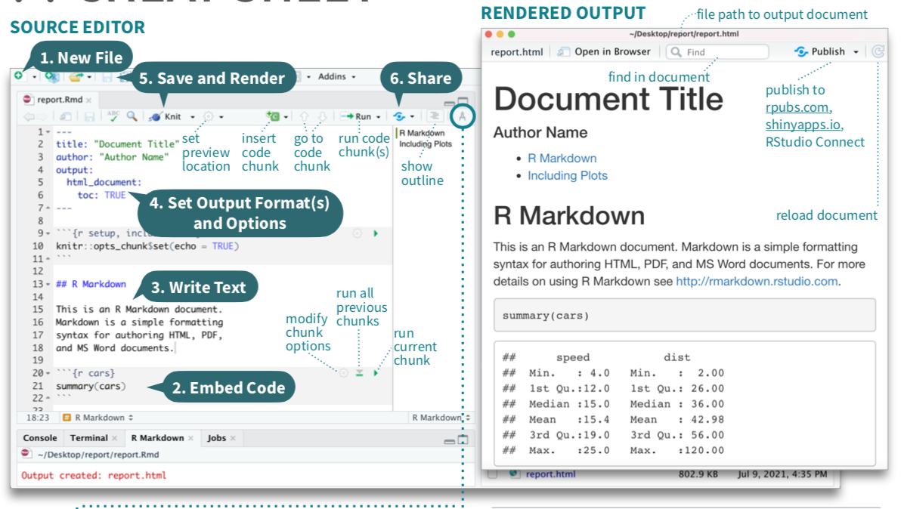
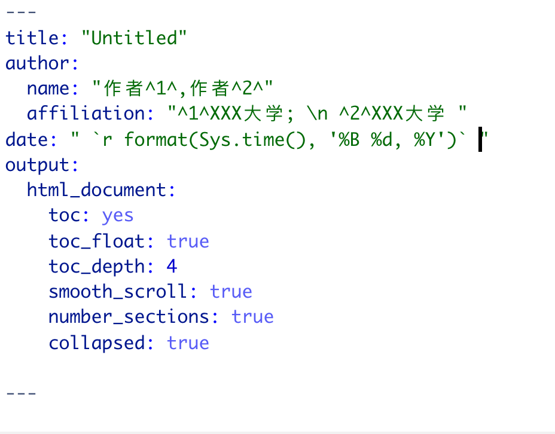
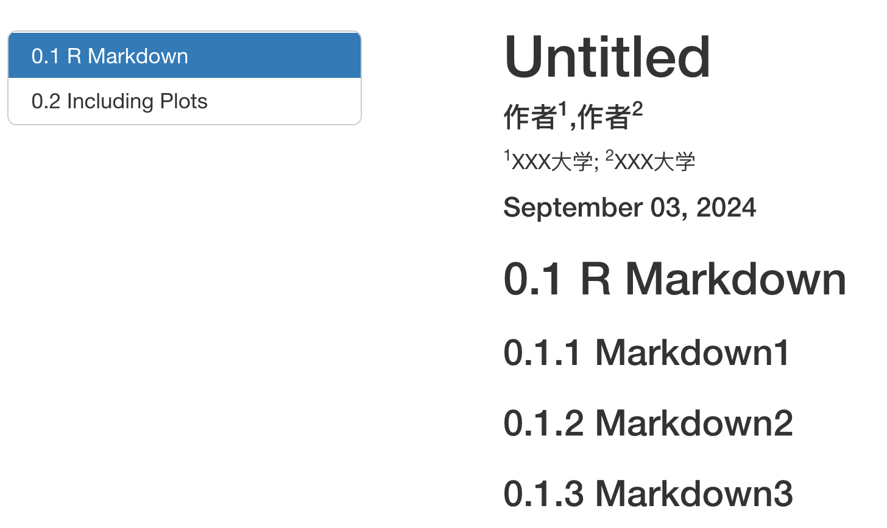
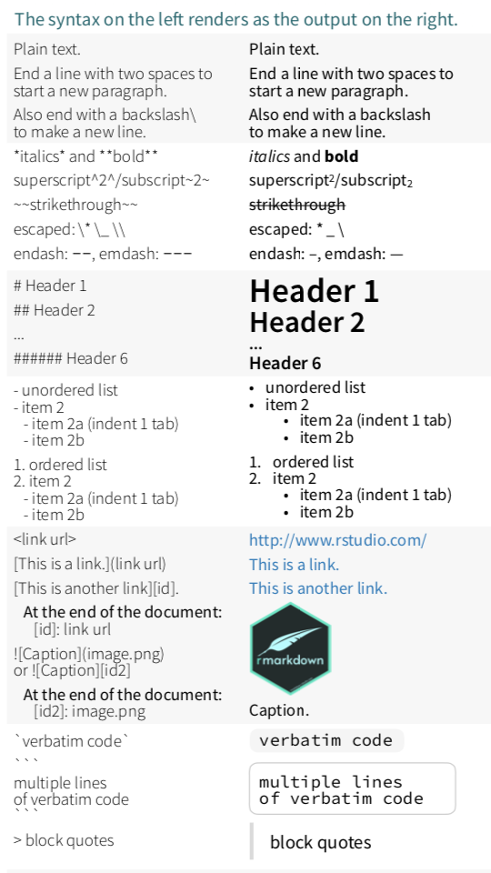

# R-markdown



&emsp;&emsp;使用 R Markdown，可以轻松创建一个文档，将代码、代码结果以及任何与分析相关的文本或外部图像结合在一起。本教程大部分都是使用 R Markdown 创建的。

&emsp;&emsp;要创建一个新的 R Markdown 文件，在 R Studio 中选择“文件>新建文件>R Markdown…”。接着，会弹出一个名为“新建 R Markdown”的窗口。


&emsp;&emsp;在这里，可以指定要创建的文件类型。标准类型是文档（HTML、PDF 或 Word），但您也可以选择其他选项，例如创建幻灯片（演示文稿）。由于 HTML 文件不像 PDF 和 Word 那样有传统的“页面”分隔，因此一般推荐使用 HTML 格式。此时还可以在各自的字段中为您的文档选择标题和作者名。最后，选择“确定”以创建新 R Markdown 文件。新文件会像创建新脚本时一样出现在R Studio 会话中。


&emsp;&emsp;R Markdown 文档时，看起来类似于一个脚本编辑器。有三个主要部分：**前置部分**、**代码块**和**注释图文**。

## YAML前置部分

&emsp;&emsp;前置部分，为 R Markdown 指定设置和标题信息。例如，设置输出文档时使用的文件类型。

**1、题目**

YAML中定义

> title:"语言数据科学教程"

**2、作者、单位、时间**
，
> author: “XXX作者”。

若有多个作者，可用[]将多个作者包裹，作者间用逗号分隔。

> author: [XXX^1^,XXX^2^]，结果每个作者占一行。

> author:
> - name: "作者^1^,作者^2^"
>  affiliation: " ^1^XXX大学; \n ^2^XXX大学 "

> date: " `r format(Sys.time(), '%B %d, %Y')` "

**3、目录**
YAML中定义，常见参数如下：
- toc: yes 是所有输出格式的通用选项，用以自动生成目录。
- toc_depth: 4 通用选项，控制目录显示深度，即输出文档要显示的目录层级。
- toc_float(默认FALSE): true 适用于输出HTML格式文档。属性为true时，目录变为侧边栏，并固定在屏幕左侧。
- collapsed：false时折叠二级标题以下的标题。
- smooth_scroll(默认true)：是否在鼠标点击目录时添加平滑滚动。
- number_sections(默认FALSE)：若为true，自动添加目录序号。




## 代码块


代码块用于放置要运行的 R 代码。通常，会在 Markdown 中包含多个代码块，代表分析的不同部分。当你创建 Markdown 文件并将其转化为文档时，这些代码块会按顺序运行，且它们的输出会按照对应代码块在文档中的位置依次显示。

&emsp;&emsp;一个代码块以 `{r name}` 开始，如以下示例所示：

&emsp;&emsp;你可以看到，代码块以灰色阴影显示，并在右上角显示了几个图标。代码块有几个组成部分。

&emsp;&emsp;首先，代码块命名，可以方便识别代码块的作用，并有助于文档的组织。注意，每个代码块必须有不同的名称，否则在编译 R Markdown 文件时会出现错误。

&emsp;&emsp;在 `{r ...}` 中指定代码块的多个选项，这些选项以逗号分隔。常见选项包括：

- `echo=TRUE` 或 `FALSE`：如果选择 TRUE，代码块中的实际代码会与其生成的结果一起显示在文档中。
```{r testing, echo=TRUE}
library(tidyverse)

```
如果选择 FALSE，代码不会显示，只有输出会显示。

```{r test, echo=FALSE}
library(tidyverse)

```

- `warning=TRUE` 或 `FALSE`：如果选择 TRUE（默认值），代码中的所有警告信息都会包含在文档中。如果选择 FALSE，这些警告信息将不会被包含。

```{r}

```

- `include=TRUE` 或 `FALSE`：如果选择 TRUE（默认值），代码的输出会包含在文档中。如果选择 FALSE，代码仍然会运行，但输出不会包含在文档中。这在某些情况下很有用，例如当你在后续代码块中使用此代码块的某些计算结果，但对该代码块的实际输出不感兴趣时。
```{r}

```
- `eval=` 默认TRUE，当FALSE，只显示代码，不运行代码。
- message = FALSE：不输出提示信息，比如包的载入信息。
- collapse = TRUE：代码块结果放在一个文本块。这个对于编写教程节省空间比较有用。
- cache = TRUE：缓存运行结果，能加速后续再编译。这个对于编写教材中包含运算量较大的模块比较有用。

&emsp;&emsp;右上角的图标中，最右侧的选项用于只运行当前代码块，这对于查看代码块的输出以及/或在创建 R Markdown 文档时验证代码块中的代码是否正确运行非常必要。注意，当你运行一个代码块时，它的输出会显示在该代码块的正下方。要获取代码块生成的所有内容（输出、警告、错误等）。


## Markdown区域

&emsp;&emsp;代码部分以外的空白区域是你放置文档中非 R 代码部分的地方。这个区域的工作方式与 Word 文档类似，你可以在其中放置文本、图像、表格等。这种将 R 代码、其结果与类似 Word 文档的功能结合在一起的方式，使你能够在一个文件中创建一个全面的分析报告。

你还可以格式化此区域内显示的文本。


```{r}

```

