--- 
title: "语言数据科学教程"
author: "陈居强"
date: "`r Sys.Date()`"
output:
  word_document: default
  html_document:
    df_print: paged
description: This is a minimal example of using the bookdown package to write a book.
  The output format for this example is bookdown::gitbook.
documentclass: book
github-repo: rstudio/bookdown-demo
link-citations: yes
bibliography:
- book.bib
- packages.bib
site: bookdown::bookdown_site
biblio-style: apalike
---

    
# 第一章 数据科学简介

<font size=5>欢迎关注我的[个人主页](https://juqiangj.github.io/research/)：</font>


<font size=5>微信公众号：数据科学与语言研究</font>


## 学习目标 {-}
- 📌 **了解语言数据的内涵**  
  探索语言数据的定义、特点及其在不同领域中的应用。

- 📌 **了解数据科学的由来与发展**  
  理解数据科学的起源、演变以及与统计学、计算机科学的关系。

- 📌 **了解数据科学项目的流程**  
  掌握从问题定义到模型部署的完整数据科学生命周期。

- 📌 **了解数据科学的内在结构**  
  熟悉数据科学所包含的统计知识、编程技能和专业知识。

## 语言数据

## 数据科学发展简史

## 数据科学项目工作流程

## 数据科学的内在构成


```{r include=FALSE}

# bookdown::render_book("index.Rmd", "bookdown::gitbook")
# /Users/chenjuqiang/'Nutstore Files'/310_Tutorial/LanguageDS-e
```


## R语言学习资源分类汇总 {-}

### 数据科学与数据处理

#### 📘 图书与电子书 {-}

- 📘 [*数据科学中的 R 语言*](https://bookdown.org/wangminjie/R4DS/) — 作者：王敏捷。基于 R for Data Science，适合中文用户入门。⭐⭐⭐⭐☆

- 📘 [*Introduction to Data Science: Data Analysis and Prediction Algorithms with R*](https://rafalab.github.io/dsbook/) — 作者：Rafael A. Irizarry。哈佛大学课程电子书，侧重统计与建模。⭐⭐⭐⭐☆

- 📘 [*Introduction to Data Science*](https://ubc-dsci.github.io/introduction-to-datascience/) — 作者：Tiffany-Anne Timbers、Trevor Campbell、Melissa Lee。UBC 教材，结构清晰，适合课堂教学。⭐⭐⭐⭐☆

- 📘 [*R for Data Science*](https://r4ds.had.co.nz/) [旧版](https://r4ds.hadley.nz/)— 作者：Garrett Grolemund 和 Hadley Wickham。R 语言数据处理的经典入门书，全面讲解 tidyverse 流程。⭐⭐⭐⭐⭐

- 📘 [*The R Manuals*](https://cran.r-project.org/manuals.html) ⭐⭐⭐⭐⭐

- 📘 [*R Books*](https://www.r-project.org/doc/bib/R-books.html) ⭐⭐⭐⭐⭐

- 📘 [*Data Wrangle 教程*](https://juqiangj.github.io/DH_Data_wrangling/) — 作者：陈居强。适合初学者系统学习数据清洗与整洁操作，案例丰富。⭐⭐⭐⭐

- 📘 [*Data Science Live Book*](https://livebook.datascienceheroes.com/index.html) — 理论与实战结合，涵盖特征工程、变量重要性分析等主题，适合进阶者。⭐⭐⭐⭐

- 📘 [*The Pirate’s Guide to R*](https://bookdown.org/ndphillips/YaRrr/where-did-this-book-come-from.html) — 用幽默和图解的方式讲解 R，适合初学者和教学使用。⭐⭐⭐⭐☆

#### 📄 学术文献 {-}

- 📄 Behrens, J. T. (1997). *Principles and Procedures of Exploratory Data Analysis*. *Psychological Methods*, 2(2), 131–160. — 探索性数据分析经典文献。⭐⭐⭐

#### 🌐 博客与网络资源 {-}

- 🌐 [*FlowingData 博客*](https://flowingdata.com/about/) — Nathan Yau 博士运营的可视化博客，案例丰富、风格有趣，适合扩展阅读。⭐⭐⭐⭐☆

- 🌐 [*The History of Data Science and Pioneers You Should Know*](https://onlinestemprograms.wpi.edu/blog/history-data-science-and-pioneers-you-should-know) — 数据科学的历史与重要人物简介，可用于教学引入或学术演讲材料。⭐⭐⭐


### 数据可视化

#### 📘 图书资源 {-}

- 📘 [*ggplot2: Elegant Graphics for Data Analysis*](https://ggplot2-book.org/index.html) — 作者：Hadley Wickham。ggplot2 官方指南，数据可视化领域的权威读物。⭐⭐⭐⭐⭐

- 📘 [*R Graphics Cookbook*](http://www.cookbook-r.com/Graphs/)[*2nd edition*](https://r-graphics.org/) — 作者：Winston Chang。图形制作实用手册，覆盖 ggplot2 和 base R 图形系统。⭐⭐⭐⭐

#### 🌐 在线教程 / 网页资源 {-}

- 🌐 [*Cookbook for R - Graphs*](http://www.cookbook-r.com/Graphs/) — 提供大量图形绘制范例，查询便捷，适合快速解决可视化问题。⭐⭐⭐⭐

- 🌐 [*Geocomputation with R*](https://geocompr.robinlovelace.net/) — 介绍如何使用 R 进行地理空间数据处理与可视化，涵盖 sf、raster、tmap 等包。⭐⭐⭐⭐⭐

- 🌐 [*DiagrammeR 官方文档*](https://rich-iannone.github.io/DiagrammeR/) — 绘制流程图、图结构与网络图工具包，支持 graphviz 与 mermaid 语法。⭐⭐⭐⭐

- 🌐 [*flextable R package*](https://ardata-fr.github.io/flextable-book/index.html) ⭐⭐⭐⭐⭐


### 文本分析

#### 📘 图书资源 {-}

- 📘 [*Text Mining with R Tidytext教程*](https://www.tidytextmining.com/index.html) — 作者：Julia Silge 和 David Robinson。基于 tidytext 包，系统讲解如何使用 tidyverse 工具进行文本挖掘。⭐⭐⭐⭐⭐

#### 🌐 在线教程 / 网页资源 {-}

- 🌐 [*Quanteda软件包官网*](https://quanteda.io/) — 作者：Kenneth Benoit and Kohei Watanabe。系统介绍Quanteda、文本分析基础与工具，适合语言类课程使用。⭐⭐⭐⭐

- 🌐 [*Corpus Linguistics 课程讲义*](https://alvinntnu.github.io/NTNU_ENC2036_LECTURES/) — 作者：Alvin Cheng-Hsien Chen。系统介绍语料库语言学、文本分析基础与工具，适合语言类课程使用。⭐⭐⭐⭐

- 🌐 [*Text mining in R for the social sciences and digital humanities*](https://tm4ss.github.io/docs/index.html) — 作者：Andreas Niekler, Gregor Wiedemann。系统介绍语料库语言学、文本分析基础与工具，适合语言类课程使用。⭐⭐⭐⭐


- 🌐 [*Computational Stylistics Group*](https://computationalstylistics.github.io/) — 跨机构研究团队（the Institute of Polish Language (Polish Academy of Sciences), but also at the Jagiellonian University and the University of Antwerp），聚焦计算风格学、文本风格分析、作者识别、情感分析等，强调语言学、文学批评与计算方法的交叉融合。⭐⭐⭐⭐

### 语音分析

#### 🌐 在线教程 / 使用手册 {-}

- 🌐 [*wrassp 入门教程*](https://cran.r-project.org/web/packages/wrassp/vignettes/wrassp_intro.html) — 介绍如何使用 wrassp 包进行音频信号分析，含实例与语法讲解。是 R 对 Michel Scheffers 的 `libassp`（高级语音信号处理器）库的封装。支持处理常见音频格式并执行语音科学常用的分析功能，包括：共振峰、基频、均方根能量、自动相关、频谱分析、零交叉率、滤波等。该包为 R 提供了 libassp 功能的主要子集，力求以用户友好的方式服务于语音信号分析。⭐⭐⭐⭐⭐


- 🌐 [*soundgen 教程：声学分析*](https://cran.r-project.org/web/packages/soundgen/vignettes/acoustic_analysis.html) — 基于 `seewave` 的功能，扩展了音频合成、处理和分析的高级函数。适用于声学特征提取与声音合成任务，特别适合语音/动物声音分析教学与研究。⭐⭐⭐⭐


- 🌐 [*EMU-SDMS 官方手册*](https://ips-lmu.github.io/The-EMU-SDMS-Manual/index.html) — EMU 语音数据库管理系统（EMU-SDMS）为一个集成式语音数据库解决方案，支持语音数据的生成、注释、查询、分析与管理。系统介绍 EMU 的结构、标注、音频管理与可视化工具，适合深入研究语音数据库的用户。⭐⭐⭐⭐⭐

- 🌐 [*国际音标在线输入键盘*](https://www.internationalphoneticalphabet.org/html-ipa-keyboard-v1/keyboard/) — 可交互地输入国际音标符号，适合语音学学习、作业编辑与标注使用。⭐⭐⭐⭐

- 🌐 [*Praat 脚本资源（UCLA）*](https://phonetics.linguistics.ucla.edu/facilities/acoustic/praat.html) — 提供常用的 Praat 脚本集合，用于自动化语音信号分析任务。⭐⭐⭐⭐⭐

- 🌐 [*语音学基础练习：The Articulatory System*](https://opentextbc.ca/psyclanguage/chapter/the-articulatory-system/) — 开源教材中的一章，介绍发音器官及基本发音方式，适合初学者练习。⭐⭐⭐⭐

- 🌐 [*R 语言绘制元音图教程*](https://lingmethodshub.github.io/content/R/vowel-plots-tutorial/) — 教你如何使用 R 可视化元音的 F1-F2 图，适用于语音学与音系学研究。⭐⭐⭐⭐

- 🌐 [*用 R 绘制 Praat 风格图形*](https://rpuggaardrode.github.io/praatpicture_manual/waveform.html) — 教程介绍如何使用 `praatpicture` 包生成波形图与频谱图，风格接近 Praat。⭐⭐⭐⭐

- 🌐 [*EMU-R 系统概览章节*](https://ips-lmu.github.io/The-EMU-SDMS-Manual/chap-overview.html) — 介绍 EMU-SDMS 系统的整体结构、主要模块和工作流程，是进行语音数据库管理的关键参考。⭐⭐⭐⭐⭐

- 🌐 [*SWPhonetics：基于共振峰计算元音发音位置*](https://swphonetics.com/methods/vowel-articulation-from-formants/) — 提供详细算法与可视化方法，支持在线计算与下载数据。⭐⭐⭐⭐

- 🌐 [*社科院语音数据库 AESOP*](https://www.aclclp.org.tw/use_mat.php#aesop) — 包含多语言语音语料，适用于跨语言声学分析、语音合成与识别研究。⭐⭐⭐⭐⭐


### 统计建模

#### 📘 图书资源 {-}

- 📘 [*Learning Statistics with R: A Tutorial for Psychology Students and Other Beginners*](https://learningstatisticswithr.com/book/) — 面向心理学初学者的统计入门教材，内容涵盖描述性统计、推论统计及线性建模，风格友好。⭐⭐⭐⭐⭐

- 📘 [*Hands-On Machine Learning with R*](https://bradleyboehmke.github.io/HOML/svm.html) — 以实际应用为导向，系统介绍机器学习在 R 中的实现，包括支持向量机、随机森林等。⭐⭐⭐⭐

- 📘 [*Statistical Thinking for the 21st Century*](https://statsthinking21.github.io/statsthinking21-core-site/index.html) — 现代统计思维教材，强调模型建构与理解而非公式推导，适合数据科学初学者。⭐⭐⭐⭐

- 📘 [*Statistical Inference via Data Science*](https://moderndive.com/index.html)[Second edition](https://moderndive.com/v2/index.html) — 作者Chester Ismay、Albert Y. Kim。⭐⭐⭐⭐


#### 🌐 在线教程 / 网页资源 {-}

- 🌐 [*R Companion to the Handbook of Biological Statistics*](https://rcompanion.org/handbook/index.html) — 提供 R 实现的统计方法指南，适用于生命科学、行为科学等领域，内容实用详尽，当我需要了解如何进行各种t检验、ANOVA或回归分析时，我常用的参考。⭐⭐⭐⭐⭐

- 🌐 [*A Primer on Factor Analysis in Research using Reproducible R Software*](https://rstudio-pubs-static.s3.amazonaws.com/1064415_4457273740634e8b81901636e1371c29.html#Module_V:_Factor_Loading) — 基于 R 的主成分分析与因子分析入门手册，强调可重复研究实践。⭐⭐⭐⭐

#### 📄 学术文章 {-}

- 📄 Schad, D. J., Vasishth, S., Hohenstein, S., & Kliegl, R. (2020).  
*How to capitalize on a priori contrasts in linear (mixed) models: A tutorial.*  
_Journal of Memory and Language, 110_, 104038. [https://doi.org/10.1016/j.jml.2019.104038](https://doi.org/10.1016/j.jml.2019.104038)  
→ 线性混合模型中对比编码的实用教程，尤其适用于语言学研究设计。⭐⭐⭐⭐⭐

- 📄 Quené, H., & van den Bergh, H. (2008).  
*Examples of mixed-effects modeling with crossed random effects and with binomial data.*  
_Journal of Memory and Language, 59_(4), 413–425. [https://doi.org/10.1016/j.jml.2008.02.002](https://doi.org/10.1016/j.jml.2008.02.002)  
→ 展示如何处理交叉随机效应与二项数据，是语音与语言学数据建模的经典范例。⭐⭐⭐⭐

- 📄 Jaeger, T. F. (2008).  
*Categorical data analysis: Away from ANOVAs (transformation or not) and towards logit mixed models.*  
_Journal of Memory and Language, 59_(4), 434–446. [https://doi.org/10.1016/j.jml.2007.11.007](https://doi.org/10.1016/j.jml.2007.11.007)  
→ 推崇使用逻辑回归混合模型分析分类数据，为语言学研究方法变革的重要文章。⭐⭐⭐⭐⭐

- 📄 Oleson, J. J., Brown, G. D., & McCreery, R. (2019).  
*Essential Statistical Concepts for Research in Speech, Language, and Hearing Sciences.*  
_Journal of Speech, Language, and Hearing Research, 62_(3), 489–497. [https://doi.org/10.1044/2018_JSLHR-S-ASTM-18-0239](https://doi.org/10.1044/2018_JSLHR-S-ASTM-18-0239)  
→ 为言语、语言与听觉研究提供核心统计概念梳理，适合初学者和研究者阅读。⭐⭐⭐⭐


### 机器学习


#### 📘 图书资源 {-}

- 陈文贤. (2020). *大话数据科学*. 北京: 清华大学出版社。  
  用通俗幽默的语言介绍数据科学的基本思想、流程和方法，适合中文读者理解建模思维与统计推理的基本框架。⭐⭐⭐⭐⭐


#### 🌐 在线教程/网页 {-}

- [A Primer on Factor Analysis in Research using Reproducible R Software 因子分析](https://rstudio-pubs-static.s3.amazonaws.com/1064415_4457273740634e8b81901636e1371c29.html#Abstract)  
  因子分析基础教程，基于 R 语言的可复现分析流程，适合社会科学与心理语言学研究者。⭐⭐⭐⭐⭐


- [Tidymodels with R](https://www.tmwr.org/)  
  - 系统介绍了基于 `tidymodels` 的现代建模流程，包括数据预处理、建模、调参与评估等步骤。⭐⭐⭐⭐⭐


- [Tidymodels Packages Overview](https://www.tidymodels.org/packages/)  
  - 提供 `tidymodels` 生态系统中各 R 包的功能简介与使用文档链接，是了解整体框架的入口页面。
  
- The [caret package](https://topepo.github.io/caret/index.html) (short for Classification And REgression Training) is a set of functions that attempt to streamline the process for creating predictive models. ⭐⭐⭐⭐⭐


### 网络分析 

#### 📘 图书资源 {-}

- 📘 [*Network Analysis in R*](https://robwiederstein.github.io/network_analysis/) — 作者：Robert Wiederstein。全面介绍R语言中的网络分析方法，涵盖基础理论和实践应用。⭐⭐⭐⭐

#### 🌐 在线教程/网页资源 {-}
- 🌐 [*An Introduction to Network Analysis for Psycholinguists*](https://vpf-netsci.netlify.app/part2-demo.html#Meso-level_(community_structure)) — 作者：Cynthia Siew。针对心理语言学领域的网络分析入门教程，特别关注社区结构等中观层面分析。⭐⭐⭐

- 🌐 [*Static and dynamic network visualization with R*](http://kateto.net/network-visualization) — 作者：Katya Ognyanova。详细讲解R中静态和动态网络可视化的方法与技巧，包含丰富代码示例。⭐⭐⭐⭐⭐
- 🌐 [*Introduction to Network Analysis with R*](https://www.jessesadler.com/post/network-analysis-with-r/) — 作者：Jesse Sadler。R语言网络分析入门指南，适合初学者快速上手。⭐⭐⭐⭐
- 🌐 [*ggnet2: network visualization with ggplot2*](https://briatte.github.io/ggnet/) — 作者：François Briatte。介绍如何使用ggplot2风格的ggnet2包进行网络可视化。⭐⭐⭐

#### 📄 学术文章 {-}

- 📄 [*Network Analysis in R Journal*](https://journal.r-project.org/archive/2017/RJ-2017-023/index.html) — R Journal发表的网络分析专题论文，涵盖前沿方法与应用案例。⭐⭐⭐⭐


### 网络抓取

#### 🌐 在线教程/网页资源 {-}

- 🌐 [*rvest: easy web scraping with R*](https://blog.rstudio.com/2014/11/24/rvest-easy-web-scraping-with-r/) — RStudio官方博客文章，介绍rvest包的基本用法和网页抓取原理。⭐⭐⭐⭐
  
- 🌐 [*Web Scraping in R using rvest*](https://www.datacamp.com/community/tutorials/r-web-scraping-rvest) — DataCamp社区教程，提供rvest包网页抓取的实战案例和分步指导。⭐⭐⭐⭐⭐

- 🌐 [*Beginner's Guide to Web Scraping in R using rvest*](https://www.analyticsvidhya.com/blog/2017/03/beginners-guide-on-web-scraping-in-r-using-rvest-with-hands-on-knowledge/) — Analytics Vidhya的入门指南，包含实际案例和操作知识。⭐⭐⭐


### 社交媒体分析

#### 📘 图书资源 {-}

- 📘 [*Learning Social Media Analytics with R*](https://learning.oreilly.com/library/view/learning-social-media/9781787127524/) — O'Reilly出版的实用指南，涵盖使用R进行社交媒体数据收集、分析和可视化全流程。⭐⭐⭐⭐

#### 🌐 在线教程/网页资源 {-}

- 🌐 [*Network Analysis and Visualization*](http://pablobarbera.com/big-data-upf/html/02a-networks-intro-visualization.html) — 作者：Pablo Barberá。UPF大学大数据课程讲义，重点介绍社交媒体网络分析和可视化技术。⭐⭐⭐⭐⭐


### 学科研究

#### 🌐 在线工具与平台 {-}

- 🌐 [*bibliometrix*](https://www.bibliometrix.org/home/) — 专业的文献计量分析工具，提供完整的科学计量学和知识图谱分析解决方案。支持R语言接口。⭐⭐⭐⭐⭐

#### 📚 心理学研究资源 {-}

- 📚 [*Using R for psychological research*](https://personality-project.org/r/r.guide.html) — 心理学研究中R语言应用的权威指南，涵盖实验设计到数据分析全流程。⭐⭐⭐⭐

- 📚 [*The psych and psychTools packages*](https://personality-project.org/r/psych/) — 心理学研究必备R包，提供心理测量、人格分析和问卷开发等专业功能。⭐⭐⭐⭐⭐

### 文档输出 

#### 📘 图书资源 {-}

- 📘 [*R Markdown: The Definitive Guide*](https://bookdown.org/yihui/rmarkdown/) — 作者：Yihui Xie。R Markdown 权威指南，涵盖从基础到高级的所有功能。⭐⭐⭐⭐⭐

- 📘 [*bookdown: Authoring Books and Technical Documents*](https://bookdown.org/yihui/bookdown/) — 作者：Yihui Xie。使用 R Markdown 编写书籍和技术文档的完整指南。⭐⭐⭐⭐⭐

#### 🌐 网站和博客资源 {-}

- 🌐 [*blogdown: Creating Websites with R Markdown*](https://bookdown.org/yihui/blogdown/) — 使用 R Markdown 创建静态网站的详细教程。⭐⭐⭐⭐

#### 📊 幻灯片制作 {-}

- 📊 [*xaringan: Creating remark.js Slides*](https://github.com/yihui/xaringan) — 通过 R Markdown 创建 remark.js 幻灯片的包。⭐⭐⭐⭐

- 📊 [*reveal.js Presentations*](https://bookdown.org/yihui/rmarkdown/revealjs.html) — 使用 R Markdown 制作 reveal.js 幻灯片的指南。⭐⭐⭐

- 📊 [*reveal.js 官方仓库*](https://github.com/hakimel/reveal.js#markdown) — reveal.js 的官方文档，支持 Markdown 语法。⭐⭐⭐⭐

#### 🛠️ 交互式工具 {-}

- 🛠️ [*learnr 交互式教程*](https://rstudio.github.io/learnr/#overview) — 创建交互式教程的 R 包。⭐⭐⭐⭐

- 🛠️ [*pkgdown 文档*](https://pkgdown.r-lib.org/articles/pkgdown.html) — 为 R 包创建专业文档网站的工具。⭐⭐⭐⭐⭐

#### 🎨 特殊样式 {-}

- 🎨 [*Tufte 样式*](https://rstudio.github.io/tufte/) — 实现 Edward Tufte 风格的 R Markdown 文档。⭐⭐⭐

- 🎨 [*DataTables 交互式表格*](https://rstudio.github.io/DT/) — 在 R Markdown 中创建交互式表格。⭐⭐⭐⭐

<!--chapter:end:index.Rmd-->


# 第二章 R语言简介

## 学习目标 {-}

- 📌 **了解R语言特点**  

- 📌 **安装R、R-Studio、R软件包**  

- 📌 **新建R语言编程文档**  

- 📌 **掌握R语言基本数据结构及简单操作**  


## R语言发展简史

详见教程。

## R、R-Studio、R软件包的安装简介

### R语言的安装
&emsp;&emsp;首先，我们可以在线来下载R语言软件（https://cloud.r-project.org/）。根据你的电脑操作系统，选择相应的版本。

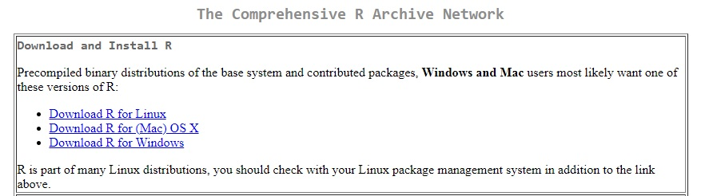

### R-Studio安装
&emsp;&emsp;R语言可以在计算机上通过终端命令直接运行，也有自己的图形界面。但是RStudio 是最适用于初学者的R 编程的集成开发环境(integrated development environment，IDE)。使用者可以在线下载并安装（ http://www.rstudio.com/download ）。其中免费版已经可以满足数据科学的需求了。


R语言可以在计算机上通过终端命令直接运行，也有自己的图形界面。但是RStudio 是最适用于初学者的R 编程的集成开发环境(integrated development environment，IDE)。使用者可以从 http://www.rstudio.com/download 下载并安装。其中免费版已经可以满足数据科学的需求了。

&emsp;&emsp;它提供了许多功能，如代码编辑器、调试器、数据可视化和包管理器等，使得R语言的学习和使用变得更加方便和高效。R-Studio被广泛用于数据科学、统计分析、机器学习和数据可视化等领域。

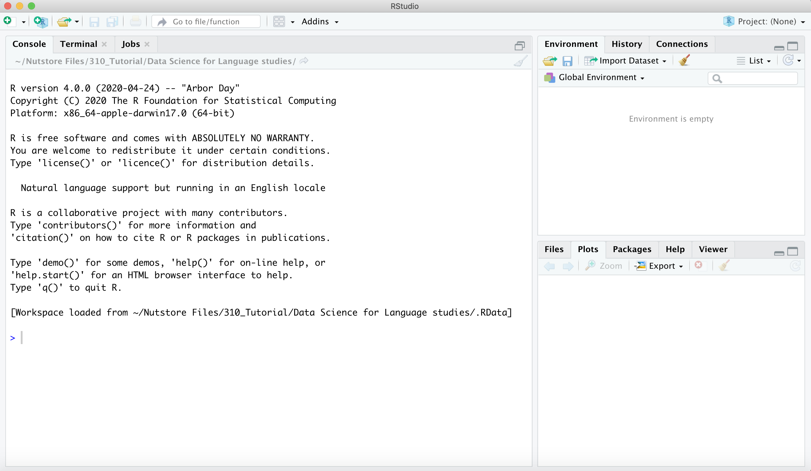

&emsp;&emsp;首先，初始界面有3个区域。在图中左侧区域是输入和运行代码区域，右侧上部的区域目前选中的是environment也就是环境变量的显示窗口。当前并没有输入任何代码，所以环境变量的窗口是空白。在右侧下部，对窗口有5个不同的按键：文件（File），制图（Plots），程序包（Packages），帮助（Help），视图（Viewer）。目前选中的是作图窗口。

### R package软件包安装

&emsp;&emsp;R package是一种用于R语言的扩展工具，它可以包含数据、代码、文档等，用于实现特定的数据分析、可视化或模型建立任务。在R社区中，R语言允许用户自由地创建、发布和分享自己的package。这种开放性不仅促进了R语言的发展，也为用户提供了更多的选择和灵活性。这些软件包不仅可以提高数据分析的效率，还可以促进不同用户之间的知识交流和共享。

&emsp;&emsp;软件包安装可以使用代码，也可以使用R-Studio的界面。使用命令安装软件包: install.packages("tidyverse")。在使用软件包的功能时，我们需要先装载软件包，比如library(tidyverse)。

使用R-studio界面中，Package功能也能安装软件包。

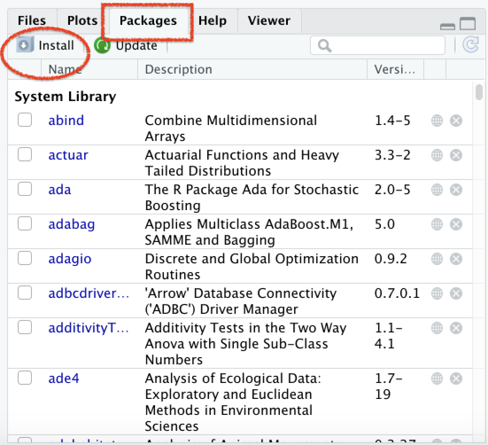


> 不同软件包使用快捷指南：https://github.com/JuqiangJ/cheatsheets

## R语言编程文档
&emsp;&emsp;大部分时候，我们需要对数据进行一系列的处理，因此相应的命名需要记录在一个文档中方便重复使用与修改。在R语言中，我们常用的编程文档有两种: R脚本(script)和R-markdown。

### R脚本文档


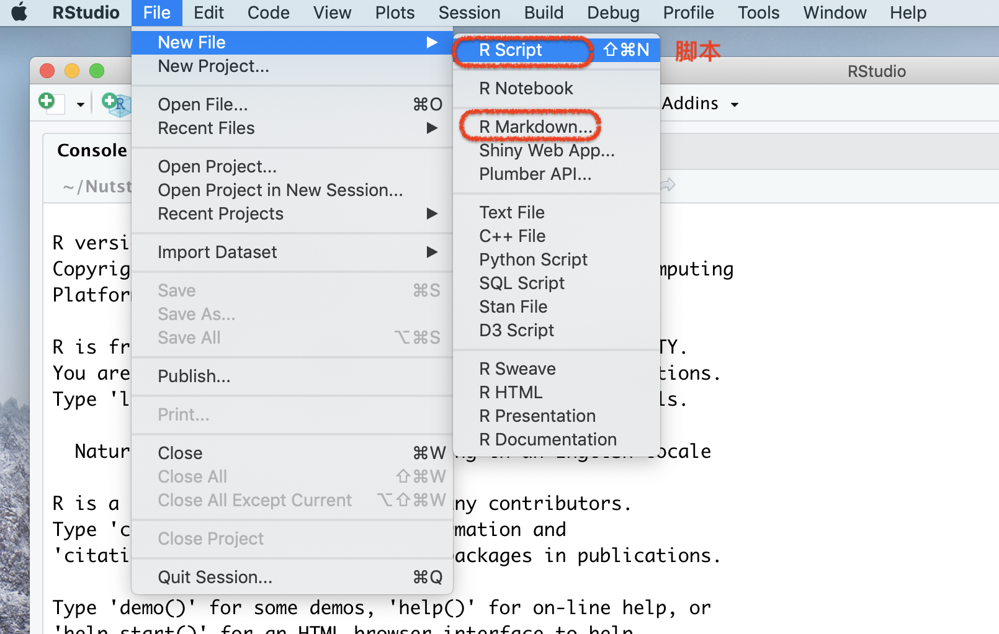

&emsp;&emsp;当我们新建了一个脚本文件，就会出现一个窗口。原先的代码运行窗口，变换到了左边的下部，而在左边上部出现了一个新的窗口。这就是脚本书写窗口。在这里书写的脚本，我们可以通过选中来运行。

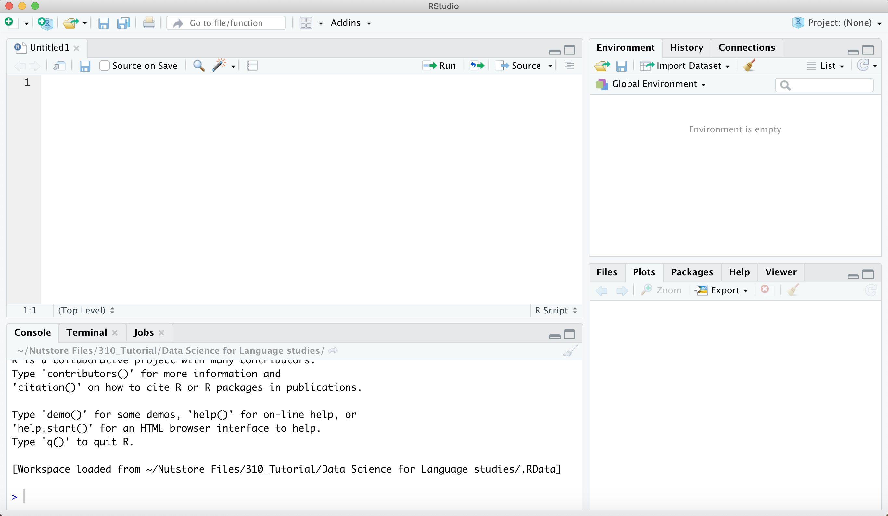


### R-Markdown文档
&emsp;&emsp;R-markdown是一种可复制性更好的数据分析记录报告文件格式，符合可读性统计编程（literate statistical programming）的理念。它可以将数据分析的代码，统计建模的细节和解释说明的文字以及可视化的图片统一集成在一个文件当中。这个文件可以输出网页格式、PDF或者文档。


&emsp;&emsp;在R-studio中，选择文件—新建文件，选择R-markdown之后，会弹出对话框。在对话框中，你需要选择文件输出的类型。比如，这里我们选择网页格式。同时你可以填写相应的文件标题和文件作者名称。完成以后点击OK就可以了。

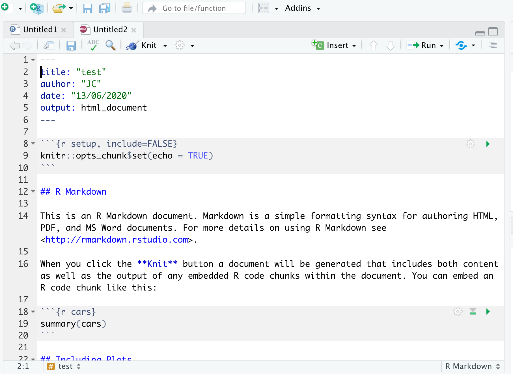

&emsp;&emsp;之后，在R-studio里面会出现一个新的文件即R-markdown文件。这个文件最开头，从第二行到第五行，是一些相关属性设置。比如，文件名称、作者、时间和输出格式。


&emsp;&emsp;在图中第八行到第十行之间，有一个代码块区域。在这里书写代码，完成之后，可以选中，进行运行。也可以点击右面绿色小三角，运行整个代码块。

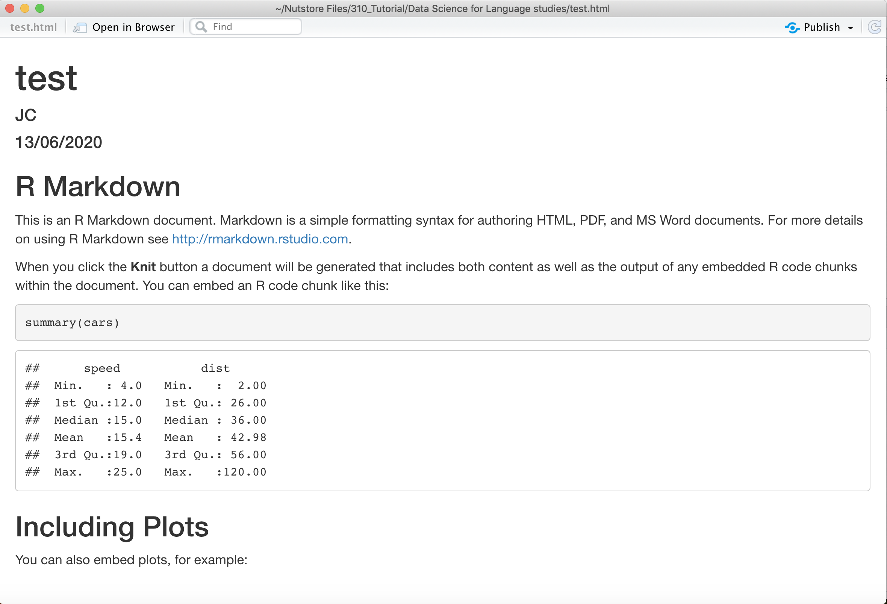

&emsp;&emsp;在每个代码块开头的{r setup, include = FALSE}中，可以控制是否运行代码，是否输出结果，是否显示代码，是否显示代码运行中的提示（Messages）和警告（Warnings）。比如上述代码中，“setup”是这个代码块的名称，include = FALSE说明该代码会运行但是代码本身不会显示，相应的运行结果、图片、提示和警告也不会显示。
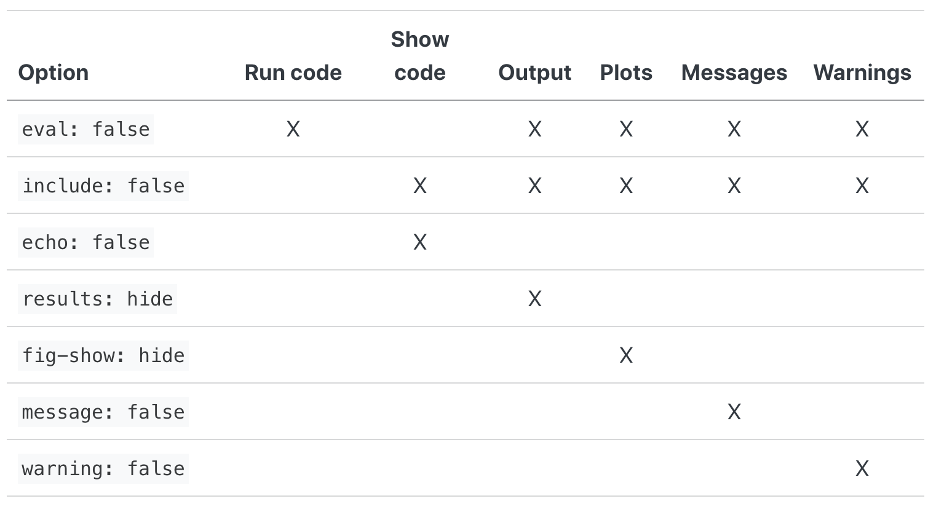

### 建立R-project

&emsp;&emsp;在数据处理中，我们通常会将输入和输出的数据放在一个文件夹里，每次导入数据的时候，我们需要输入绝对或者相对的路径。但是当你的合作者在另外一台电脑上打开你的文件夹时，这个绝对或者相对的路径就会发生错乱。因此，为了保持编程环境的相对稳定，我们可以为自己的数据处理项目建立一个project文件夹。当我们有一个project文件夹以后，R-studio里面就只需要输入相对路径。特别值得注意的是，无论是在云端同步，还是通过移动硬盘U盘等复制，这个文件夹是一个独立的编程环境。
&emsp;&emsp;首先，我们点击文件新建项目。然后，我们可以选择新建项目或者使用已有的文件夹。如果选择新建项目，那么需要给项目文件夹一个名称，并设置文件夹的位置。
&emsp;&emsp;新建项目以后，在所指定的路径，就会发现一个新的文件夹。在该文件夹内部，会有一个R-project文件。以后每次开始项目时，双击这个文件就会自动打开一个项目编程环境，里面所有路径都可以是相对路径。

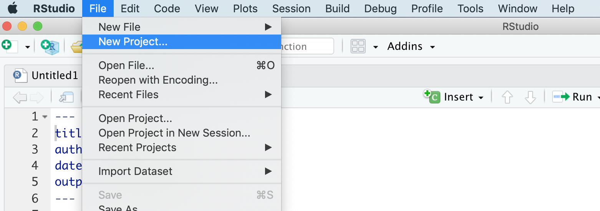


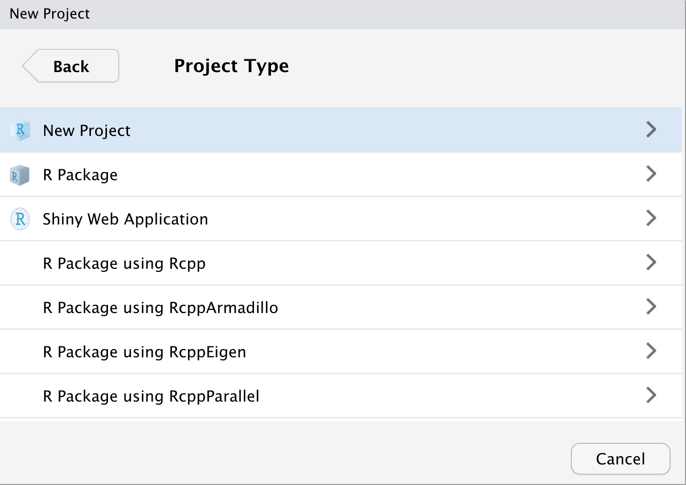

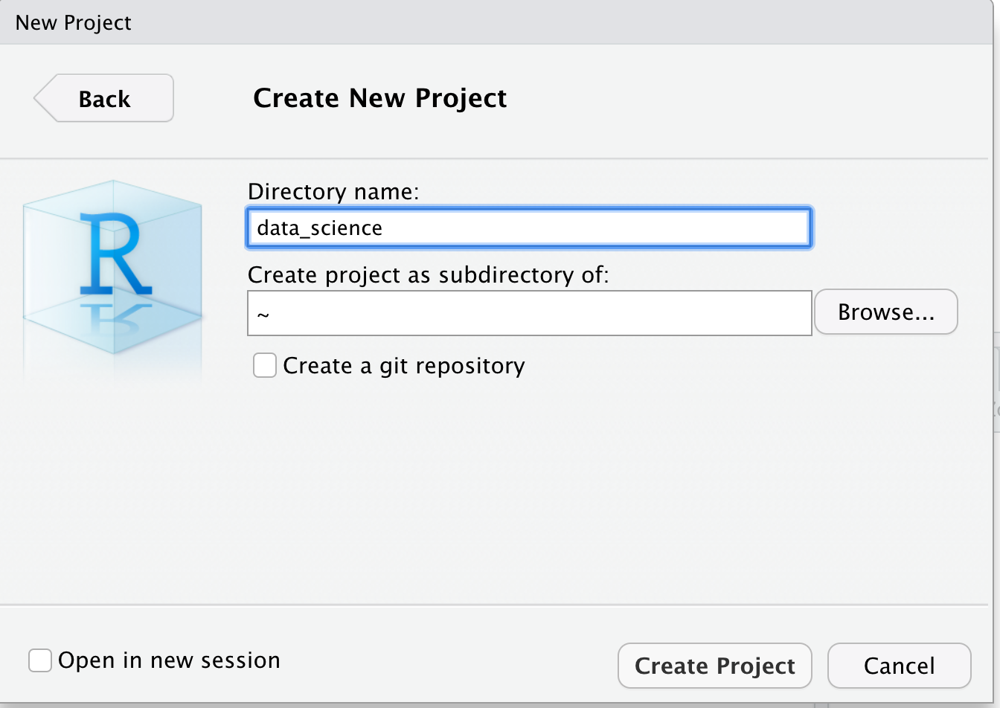

在项目文件夹内，需要对不同数据和文件进行管理。我们可以参考[Cookiecutter Data Science](https://drivendata.github.io/cookiecutter-data-science/) 的建议，在项目文件下设置子文件夹。 

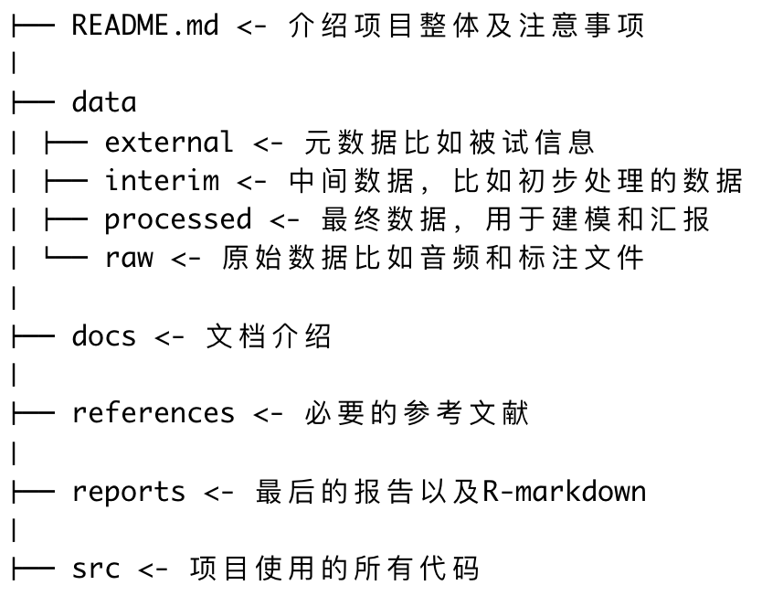

├── README.md <- 介绍项目整体及注意事项
|
├── data
│ ├── external <- 元数据比如被试信息
│ ├── interim <- 中间数据，比如初步处理的数据
│ ├── processed <- 最终数据，用于建模和汇报
│ └── raw <- 原始数据比如音频和标注文件
│
├── docs <- 文档介绍
│
├── references <- 必要的参考文献
│
├── reports <- 最后的报告以及R-markdown
│
├── src <- 项目使用的所有代码


## R语言的数据结构
&emsp;&emsp;在R中，基本的数据结构有向量（vector），数组（array），列表（list），数据框（data frame）和因子（factor）。

详见教程介绍

## 课堂任务

### 任务2.1 创建不同类型的向量 {-}

```{r eval=F, echo=T, collapse = TRUE}
#创建一个包含整数的向量
vector <- c(1, 2, 3, 4, 5)

# 创建不同类型的向量
# 数值型
a = 8:17

b <- c(9, 10, 100, 38)

# 布尔型
c = c (TRUE, FALSE, TRUE, FALSE)

c = c (T, F, T, F)

# 字符型
d = c ("TRUE", "FALSE", "FALSE")

# 改变向量的类型

as.vector(b, mode = "character")

```


&emsp;&emsp;值得注意的是，如果不同类型的数据被放入同一个向量，数据类型会发生改变。数值型数据会强制改变为字符型数据或布尔型数据。

```{r eval=F, echo=T}
e = c(9,10, "ab", "cd")

f = c(10, 11, T, F)
```

&emsp;&emsp;除了单个输入之外，我们可以借助R语言的一些函数，批量生成向量中的元素。

```{r eval=F, echo=T}
A = 9:20 + 1 # A 是一个从9到20的向量，并且每个元素都加上了1。

B = seq(1, 10)# B 是一个从1到10的向量，其中的数字是连续的。

C = seq(1, 20, by = 2)#C 是一个从1到20的向量，步长为2，也就是只包含奇数。

D = rep(5, 4)# D 是一个包含了4个5的向量。

E = rep(c(1, 2, 3), 4)# E 是一个重复了4次的向量，其中包含了1、2、3这三个元素。

G = rep(c(1, 2, 3), each = 4)# G 是一个重复了4次的向量，其中每个元素都重复了4次，即先重复1四次，然后重复2四次，最后重复3四次。

```


&emsp;&emsp;R语言中的一些基本函数，可以对包含不同类型数据的向量进行操作。

```{r eval=F, echo=T}
#length(): 返回向量的长度。
vector <- c(1, 2, 3, 4, 5)

length(vector)

# is.na(): 检查向量中是否存在缺失值（NA）。
vector<- c(1, NA, 3, NA, 5)
is.na(vector)

# which(): 返回满足条件的元素在向量中的索引。
vector<- c(1, 2, 6, 7, 8)
which(vector > 3)

# sample(): 随机从向量中抽取元素。可以用于实验随机抽样。
vector <- c(1:100)
sample(vector, size = 3)

```

### 任务2.2 数值型向量的简单计算 {-}

```{r eval=F, echo=T}
# sum(): 计算向量中所有元素的和。
vector <- c(1:50)
sum(vector)

# mean(): 计算向量的平均值。

mean(vector)

# median(): 计算向量的中位数。

median(vector)

# min(): 返回向量中的最小值。

min(vector)

# max(): 返回向量中的最大值。

max(vector)

# sort(): 将向量中的元素按升序排序。

sort(vector)

# rev(): 反转向量中元素的顺序。

rev(vector)

# unique(): 返回向量中唯一的元素。
vector = c(1,2,33,4,4,4,5,6,345)
unique(vector)

# range(): 返回向量的取值范围（最小值和最大值）。
range(vector )

quantile(vector)

round(sd(vector), 2)

```

针对字符串型向量的函数

```{r eval=F, echo=T}
# paste(): 将向量中的元素连接为一个字符串。
vector <- c("我", "爱", "XXX!")
paste(vector, collapse = " ")

# tolower(): 转换向量中的字符为小写。
vector <- c("HELLO", "WORLD", "!")
tolower(vector)

# toupper(): 转换向量中的字符为大写。
vector <- c("hello", "world", "!")
toupper(vector)

# grep(): 在向量中搜索满足条件的模式，并返回其索引。
vector <- c("苹果", "香蕉", "胡萝卜", "橙子")
grep("果", vector)

```

### 任务2.3 列表的简单操作 {-}

```{r eval=F, echo=T}

# 创建一个包含整数、字符和向量的列表：
my_list <- list(1, "a", c(2, 3, 4))

my_list
```

```{r eval=F, echo=T}
# unlist() 函数：将list转换为向量。
my_list <- list("apple", "banana", "orange")

unlist(my_list) 

# lapply()：对list中的每个元素应用一个函数。
my_list <- list(1:3, 4:6, 7:9)

lapply(my_list, mean)

# sapply()：对list中的每个元素应用一个函数，并将结果简化为向量。
my_list <- list(1:3, 4:6, 7:9)
sapply(my_list, mean)

```

&emsp;&emsp;在建立回归模型后，可以将结果存储在一个列表中。

```{r eval=F, echo=T}
# 这行代码使用R中的lm()函数（线性模型）来拟合一个线性回归模型。模型的目标（因变量）是mpg（每加仑英里数），预测变量（自变量）是hp（马力）。数据源是R自带的mtcars数据集。
model <- lm(mpg ~ hp, data = mtcars)
# 这行代码创建一个列表，其中包含了线性模型的系数（coefficients）、残差（residuals）和拟合值（fitted.values）。
model_summary <- list(coefficients = model$coefficients, 
                      residuals = model$residuals, 
                      fitted.values = model$fitted.values)
#这行代码返回并打印model_summary列表的内容。
model_summary
```


### 任务2.4 矩阵的简单操作 {-}


```{r eval=F, echo=T}

# 创建一个3行2列的矩阵：

data <- 1:6
matrix1 <- matrix(data, nrow = 3, ncol = 2)
print(matrix1)

```

&emsp;&emsp;在这个示例中，我们首先创建了一个从1到6的向量 data，然后我们创建了一个3行2列的矩阵 matrix1，并将这个向量的数据按列存入矩阵。输出的结果会是一个3行2列的矩阵，元素值按列从1到6。


### 任务2.5 数据框的简单操作 {-}

&emsp;&emsp;数据框是一种表格形式的数据结构。数据框可以包含不同类型的列，但是每列长度必须相同。数据框可以使用data.frame()函数创建，并可以使用列名称或索引来访问和修改数据框中的数据。

```{r eval=F, echo=T}
# 创建一个包含姓名和年龄的数据框
df <- data.frame(
  name = c("John", "Mary", "Peter"),
  age = c(25, 32, 45),
  gender = c("Male", "Female", "Male")
)
```

```{r eval=F, echo=T}
# summary()：用于查看数据框的统计信息。
summary(df) #（输出df的基本统计信息，包括均值、中位数、最大值、最小值等。）

```


```{r eval=F, echo=T}
# 查看数据框的结构
str(df)
```


```{r eval=F, echo=T}
# nrow()：用于计算数据框的行数。
nrow(df) #（输出df的行数。）

# ncol()：用于计算数据框的列数。
ncol(df) #（输出df的列数。）

# head()：用于查看数据框的前几行数据。
head(df, n = 2) #（输出df的前10行数据。）

# tail()：用于查看数据框的后几行数据。
tail(df, n = 2) #（输出df的后5行数据。）

# unique()：用于去重并输出数据框中唯一的值。
unique(df$gender) #（输出df中gender列的唯一值。）

```


### 任务2.6 数组的简单操作 {-}
&emsp;&emsp;数组是一个可以存储具有相同数据类型元素的多维数据结构。可以使用array()函数创建数组。

```{r eval=F, echo=T}
# 创建一个一维数组：
data <- 1:10
array1 <- array(data, dim = c(10))
print(array1)
# 在这个示例中，我们首先创建了一个从1到10的向量 data，然后我们创建了一个一维数组 array1，并将这个向量的数据存入数组。输出的结果会是1到10的一维数组。

# 创建一个二维数组：
data <- 1:12
array2 <- array(data, dim = c(3, 4))
print(array2)
# 在这个示例中，我们创建了一个二维数组 array2，它有3行4列。输出的结果会是一个3行4列的二维数组，元素值从1到12。

# 创建一个三维数组：
data <- 1:24
array3 <- array(data, dim = c(2, 3, 4))
print(array3)
# 在这个示例中，我们创建了一个三维数组 array3，它有2个2行3列的面。输出的结果会是一个2行3列，共有2个面的三维数组，元素值从1到24。
```

### 任务2.7 文件系统批量操作练习  {-}

第一步：直接创建文件夹和文件结构

```{r eval=F, echo=T}
# 1. 设置工作路径（请在桌面或指定位置手动创建 'File_Exercise' 文件夹）
setwd("/Users/chenjuqiang/Nutstore Files/310_Tutorial/LanguageDS-e/") # 根据你的系统修改路径

getwd() # 确认工作目录

# 2. 直接创建多个文件夹 (不使用条件判断)
dir.create("data/File_Exercise/Project_A")
dir.create("data/File_Exercise/Project_B")
dir.create("data/File_Exercise/Archive")

# 3. 在每个文件夹中直接创建示例文件
# 在 Project_A 中创建文件
write.csv(data.frame(x = 1:3, y = letters[1:3]), "data/File_Exercise/Project_A/data1.csv", row.names = FALSE)
write.csv(data.frame(test = 1:5), "data/File_Exercise/Project_A/results1.csv", row.names = FALSE)
write.table(data.frame(id = 1:2), "data/File_Exercise/Project_A/notes1.txt", row.names = FALSE)

# 在 Project_B 中创建文件
write.csv(data.frame(x = 10:12, y = letters[10:12]), "data/File_Exercise/Project_B/data2.csv", row.names = FALSE)
write.csv(data.frame(test = 6:10), "data/File_Exercise/Project_B/results2.csv", row.names = FALSE)
write.table(data.frame(id = 3:4), "data/File_Exercise/Project_B/notes2.txt", row.names = FALSE)

# 4. 查看生成的结构
list.files(recursive = TRUE) # 递归列出所有文件
```


第二步：批量获取文件路径

```{r eval=F, echo=T}
# 1. 获取所有.csv文件的完整路径（递归搜索）
csv_files <- list.files(pattern = "\\.csv$", recursive = TRUE, full.names = TRUE)
print("所有CSV文件:")
print(csv_files)

# 2. 获取Project_A文件夹下的所有文件路径
project_a_files <- list.files("data/File_Exercise/Project_A", full.names = TRUE)
print("Project_A下的文件:")
print(project_a_files)

# 3. 获取所有.txt文件的路径
txt_files <- list.files(pattern = "\\.txt$", recursive = TRUE, full.names = TRUE)
print("所有文本文件:")
print(txt_files)

```

第三步：批量复制文件

```{r eval=F, echo=T}
# 1. 创建目标文件夹
dir.create("data/File_Exercise/Backup")

# 2. 批量复制所有CSV文件到Backup文件夹
file.copy(csv_files, "data/File_Exercise/Backup")
cat("复制后Backup文件夹内容:\n")
list.files("Backup")

# 3. 复制Project_B的所有文件到Archive文件夹
file.copy(project_b_files <- list.files("data/File_Exercise/Project_B", full.names = TRUE), "data/File_Exercise/Archive")
cat("复制后Archive文件夹内容:\n")
list.files("Archive")
```

第四步：批量移动/重命名文件
```{r eval=F, echo=T}
# 1. 移动所有.txt文件到Archive文件夹
new_txt_paths <- file.path("data/File_Exercise/Archive", basename(txt_files)) # 构建新路径
file.rename(txt_files, new_txt_paths)
cat("移动文本文件后Archive文件夹内容:\n")
list.files("Archive", recursive = TRUE)

# 2. 批量重命名Backup文件夹中的文件（添加_backup后缀）
backup_files <- list.files("data/File_Exercise/Backup", full.names = TRUE)
new_backup_names <- sub("\\.csv", "_backup.csv", backup_files) # 替换扩展名
file.rename(backup_files, new_backup_names)
cat("重命名后Backup文件夹内容:\n")
list.files("data/File_Exercise/Backup")
```


第五步：批量删除文件

```{r eval=F, echo=T}
# 1. 删除Backup文件夹中的所有文件
file.remove(list.files("data/File_Exercise/Backup", full.names = TRUE))
cat("删除后Backup文件夹内容:\n")
list.files("Backup")


```


<!--chapter:end:01-CH2-R语言简介.Rmd-->


---
title: "数据整理"
author: Juqiang
date: Sept 27, 2024
output: word_document
---


# 第三章 数据加工

数据加工（data wrangling）是指对原始数据集进行一系列处理，以消除数据中的错误，选择合适的变量，合并不同数据集，调整数据格式，为后续的探索性数据分析（下一章）做好准备。本章主要介绍数据清理、变量筛选、数据合成、数据塑形等数据处理操作。在学习数据处理之前，我们需要对数据与变量的类型有所了解。

## 学习目标  {-}

- 📌 **了解数据与变量的类型** 

- 📌 **掌握数据清理概念与方法** 

- 📌 **掌握变量筛选的方法** 

- 📌 **掌握长宽数据相互转换的方法** 

- 📌 **掌握不同数据集合并的方法** 


## 数据与变量类型

详见教程

### 数据类型

### 变量类型

## 数据清洁与筛选

### 数据清洁

### 变量筛选


## 数据塑形与整合

### 数据塑形

### 数据整合


## 课堂任务

### 任务3.1 数据类型判断 {-}

详见教程

### 任务3.2 变量类型判断 {-}

详见教程

### 任务3.3 数据清洁 {-}

```{r eval=F, echo=T}

library(tidyverse)
# 创建含有错误值的数据
set.seed(123)  # 设置随机种子以确保可重复性

df_errors <- data.frame(Student_ID = 1:100,
                 Listening_Score = sample(-5:100, 100, replace = TRUE),
                 Speaking_Score = sample(0:103, 100, replace = TRUE),
                 Reading_Score = sample(c(0:100, NA), 100, replace = TRUE),
                 Writing_Score = sample(0:100, 100, replace = TRUE),
                 Age = sample(c(18:40, NA), 100, replace = TRUE),
                Gender = sample(c("Male", "Female"), 100, replace = TRUE))%>%
    mutate(Writing_Score  = case_when(
    Student_ID %in% c(5, 20, 50) ~ Writing_Score  + 50, # 添加异常值
    TRUE ~ Writing_Score ),
    Writing_Score  = case_when(
    Student_ID %in% c(3, 23, 54,67) ~ Writing_Score  - 50, # 添加异常值
    TRUE ~ Writing_Score ))

# 使用 drop_na() 函数删除含有缺失值的行
df_clean <- df_errors %>% drop_na()

# 使用均值插值法填补缺失值
df_interpolated <- df_errors %>%
  mutate(Reading_Score_new = ifelse(is.na(Reading_Score), 
                                 mean(Reading_Score, na.rm = TRUE), 
                                       Reading_Score))

# 使用中位数插值法填补缺失值
df_interpolated_median <- df_errors %>%
  mutate(Reading_Score_new = ifelse(is.na(Reading_Score), 
                         median(Reading_Score, na.rm = TRUE), Reading_Score))

# 使用 filter() 函数排除异常值
df_clean <- df_clean %>%
  filter(Listening_Score >= 0 & Speaking_Score <= 100 & Reading_Score <= 100)

# 过滤掉超过2个标准差的异常值
df_clean_sd <- df_errors %>%
  filter(Writing_Score >= mean(Writing_Score, na.rm = TRUE) - 2 * sd(Writing_Score, na.rm = TRUE) &
    Writing_Score <= mean(Writing_Score, na.rm = TRUE) + 2 * sd(Writing_Score, na.rm = TRUE))

# 使用四分位距法来识别并排除异常值
df_clean_iqr <- df_errors %>%
  filter(Writing_Score >= quantile(Writing_Score, 0.25, na.rm = TRUE) - 1.5 * IQR(Writing_Score, na.rm = TRUE) &
    Writing_Score <= quantile(Writing_Score, 0.75, na.rm = TRUE) + 1.5 * IQR(Writing_Score, na.rm = TRUE))

```


```{r eval=F, echo=T}

# 创建包含各种文本问题的数据框
text_problems <- data.frame(ID = 1:4,
  Problem_Type = c("拼写错误", "冗余词汇", "标点符号", "词性标签"),
  Original_Text = c("Ths is an exmple of text with splling errors.",
               "This is is an example example of redundant redundant words.",
                    "Clean the text; remove: punctuations!",
                  "This_DT is_VBZ an_DT example_NN."), stringsAsFactors = FALSE)
# 逐行处理文本问题
cleaned_text <- text_problems %>%
  mutate(Cleaned_Text = case_when(
    Problem_Type == "拼写错误" ~ str_replace_all(Original_Text, 
                                c("Ths" = "This", "exmple" = "example", 
                                               "splling" = "spelling")),
    Problem_Type == "冗余词汇" ~ str_replace_all(Original_Text, "\\b(\\w+)\\s+\\1\\b", "\\1"),
    Problem_Type == "标点符号" ~ str_replace_all(Original_Text, "[[:punct:]]", ""),
    Problem_Type == "词性标签" ~ str_replace_all(Original_Text, "_[A-Z]+", "")
  ))


```

### 任务3.4 变量筛选 {-}

&emsp;&emsp;当变量过多时，我们可以选择部分变量组成新的数据框。下面请选择所有女生的听力数据。选择所有男生的阅读数据。Filter函数主要筛选行数据，而select函数主要筛选变量即列数据。

```{r eval=F, echo=T}
df.girl = df_errors %>% 
  filter(Gender == "Female")%>%
  select(Listening_Score)
df.boy = df_errors %>% 
  filter(Gender == "Male")%>%
  select(Reading_Score)
```

### 任务3.5 数据塑形 {-}

```{r eval=F, echo=T}
# 生成一个二语学术写作数据集
set.seed(123)  # 设置随机种子，以确保结果可复现
academic_writing_data <- tibble(
  student_id = 1:10,  # 学生ID
  native_language = sample(c("Chinese", "Spanish", "French", "Russian", "German", "Italian"), 10, replace = TRUE),  # 母语
  second_language = sample(c("English", "Chinese", "Spanish", "French", "German", "Italian"), 10, replace = TRUE),  # 二语
  essay1_length = sample(200:2000, 10, replace = TRUE),  # 论文1长度
  essay2_length = sample(200:2000, 10, replace = TRUE),  # 论文2长度
  essay3_length = sample(200:2000, 10, replace = TRUE),  # 论文3长度
  )

# 把essay1_length、essay2_length和essay3_length三列汇总到一列中
long_data <- gather(academic_writing_data, 
essay, length, 
essay1_length:essay3_length)

# 转回宽格式
wide_data <- spread(long_data, essay, length)


```

### 任务3.6 数据整合 {-}

```{r eval=F, echo=T}

# 创建学生基本信息数据集
student_info <- data.frame(
  Student_ID = c("123456789012", "123456789013", "123456789014"),
  Name = c("Alice", "Bob", "Charlie"),
  Age = c(20, 21, 22))

# 创建学生成绩数据集
student_scores <- data.frame(
  ID = c("89012", "89013", "89014", "89015"),  # ID仅包含身份证后六位
  Math_Score = c(85, 90, 78, 88),
  English_Score = c(82, 76, 91, 80))

# 标准化ID列
student_scores <- student_scores %>%
  mutate(ID = paste0("1234567", ID))  # 假设前十位是固定的
# 合并数据集
merged_data <- student_scores %>%
  full_join(student_info , by = c("ID"="Student_ID"))  # 使用full_join合并

merged_data.cleaned <- merged_data %>%
  filter(!is.na(Name))


```

<!--chapter:end:02-CH3-数据加工.Rmd-->

# 第四章 探索性数据分析


## 学习目标  {-}

- 📌 **了解探索性数据分析的概念**  

- 📌 **掌握数据转化的常见方法**  

- 📌 **了解数据可视化类型与特点**  


## 数据转换

### Z-score标准化

### 归一化

### 对数化

### 词频标准化

### 描述性统计

#### 中心趋势度

#### 数据分布


## 数据可视化

### 数据可视化工具

### R语言绘图程序包

### ggplot2图形语法

### 数据可视化基本图类

#### 柱状图

#### 箱线图和小提琴图

#### 直方图

#### 密度图

#### 瓦片图


## 课堂任务

### 任务4.1 数据标准化与归一化 {-}

&emsp;&emsp;计算每个词汇的情感得分与抽象度的乘积作为新特征Emotion_Abstractness_Product。计算每个词汇的词频与意象度的差作为新特征Frequency_Imagery_Difference。对词频特征进行Z-score标准化，并创建新特征Frequency_Zscore。对词汇抽象度进行Min-Max归一化，并创建新特征Abstractness_Normalized。对词频特征进行对数化，并创建新特征Frequency_Log。

```{r eval=F, echo=T}
library(tidyverse)


# 创建含有真实汉语词汇的数据集
set.seed(123)  # 设置随机种子以确保可重复性
df_vocabulary <- data.frame(Word = c("苹果", "梨子", "香蕉", "草莓", 
                                     "桃子", "西瓜", "橙子", "柚子", "葡萄", "芒果",
                                 "书", "笔", "课本", "教室", "黑板", 
                                 "学生", "老师", "考试", "作业", "校园",
                                 "美食", "旅游", "音乐", "电影", 
                                 "运动", "阅读", "绘画", "写作", "摄影", "游戏",
                                 "猫", "狗", "兔子", "鱼", "鸟",
                                 "大象", "狮子", "熊猫", "猴子", "蛇",
                                 "早晨", "中午", "下午", "晚上", 
                                 "春天", "夏天", "秋天", "冬天", "天气", "季节",
                                 "篮球", "足球", "乒乓球", "网球",
                                 "羽毛球", "游泳", "滑雪", "跑步", "健身", "瑜伽"),
                        Frequency = sample(1:1000, 60, replace = TRUE),
                        Abstractness = sample(1:5, 60, replace = TRUE),
                        Imagery = sample(1:5, 60, replace = TRUE),
                        Age_of_Acquisition = sample(3:12, 60, replace = TRUE),
                        Difficulty = sample(1:5, 60, replace = TRUE),
                        Emotion_Score = sample(1:5, 60, replace = TRUE))


# 使用mutate函数创建新特征
df_vocabulary %>% 
  mutate(Emotion_Abstractness_Product = Emotion_Score * Abstractness,
         Frequency_Imagery_Difference = Frequency - Imagery,
         Frequency_Zscore = scale(Frequency),
         Abstractness_Normalized = (Abstractness - min(Abstractness)) / (max(Abstractness) - min(Abstractness)),
         Frequency_Log = log(Frequency))


```


### 任务4.2 描述性统计 {-}

计算男女生各门成绩的均分和标准差

```{r eval=F, echo=T}

df.score = data.frame(Student_ID = 1:100,
                    Listening_Score = sample(-5:100, 100, replace = TRUE),
                    Speaking_Score = sample(0:999, 100, replace = TRUE),
                    Reading_Score = sample(0:105, 100, replace = TRUE),
                    Writing_Score = sample(0:100, 100, replace = TRUE),
                    Gender = sample(c("Male", "Female"), 100, replace = TRUE))

# 计算每种母语的学习者的平均学习时长
df.mean.sd <- df.score %>%
  filter(Listening_Score > 0 | Reading_Score < 100)%>%
  group_by(Gender) %>%
  summarise(Listening.mean = mean(Listening_Score),
            Listening.sd = sd(Listening_Score))

```


### 任务4.3  {-}


```{r eval=F, echo=T}
#用于数据
library(janeaustenr)
#用于分词
library(tidytext)
library(dplyr)
library(stringr)

austen.emma.word <- austen_books() %>%
  group_by(book) %>%
  mutate(linenumber = row_number(),
         chapter = cumsum(str_detect(text, 
                                     regex("^chapter [\\divxlc]",
                                           ignore_case = TRUE)))) %>%
  unnest_tokens(word, text)%>%
  count(word, sort = TRUE) %>% 
  #筛选Emma这个小说
  filter(book == "Emma")%>%
  mutate(total = sum(n),
         relativefrq = (n/total)*100)%>%
  #显示前5的高频词
  head(5)

library(ggplot2)

austen.word = austen_books() %>%
  group_by(book) %>%
  unnest_tokens(word, text)%>%
  count(word, sort = TRUE) %>% 
  group_by(book)%>%
  mutate(total = sum(n),
         relativefrq = (n/total)*100)%>%
  filter(word %in% austen.emma.word$word)

austen.word %>%
  mutate(word = reorder(word, relativefrq)) %>%
  ggplot(aes(relativefrq, word, fill = book)) +  # fill按book变量着色
  geom_col(position = position_dodge(width = 0.7),  # 关键：平行排列，width控制间距
           width = 0.6) +  # 控制条形的宽度
  scale_fill_brewer(palette = "Set1") +  # 使用区分度好的配色
  labs(y = NULL, x = "Frequency", fill = "Book") +
  theme_minimal() +
  theme(legend.position = "top")  # 图例放在顶部

```


### 任务4.4 双变量可视化 {-}


```{r eval=F, echo=T}


naming.df = read.csv('/Users/chenjuqiang/Nutstore Files/310_Tutorial/LanguageDS-MS/data/ch4/pictureNaming.new.csv')%>%
  mutate(LEN = as.factor(LEN),
         Source = as.factor(Source))

table(naming.df$LEN,naming.df$Source)

naming.df%>% 
  count(Source, LEN)%>%
  ggplot(aes(Source, LEN))+
  geom_tile(aes(fill=n))


ggplot(lexdec)+
  geom_count(aes(Class, Correct))

# 条形图
naming.df%>% 
  group_by(LEN)%>%
  summarise(mean = mean(RT_harm))%>%
  ggplot(aes(LEN, mean))+
  geom_bar(stat="identity")

naming.df%>% 
  group_by(LEN)%>%
  summarise(mean = mean(RT_harm),
            sd = sd(RT_harm))%>%
  ggplot(aes(LEN, mean, fill = LEN))+
  geom_bar(stat="identity")+
  geom_errorbar(aes(ymin = mean - sd,
                    ymax = mean + sd),
                width = .2, size = 0.7, position = position_dodge(.9))


# 箱型图
naming.df%>% 
 ggplot(., aes(x=LEN, y=RT_harm))+
  geom_boxplot()

# 小提琴图
naming.df%>% 
 ggplot(., aes(x=LEN, y=RT_harm))+
    geom_violin()

# 密度图
ggplot(naming.df, aes(x = RT_harm, y =  ..density..))+
  geom_freqpoly(aes(linetype = LEN), binwidth = 100)


# 双连续变量

ggplot(naming.df)+
  geom_point(aes(RT_harm, FAM))


```

<!--chapter:end:03-CH4-探索性数据分析V2.Rmd-->


# 第五章 语言实验数据分析


## 学习目标  {-}

- 📌 **了解理论、假设与实验的关系**  

- 📌 **掌握实验设计的基本概念**  

- 📌 **熟悉数据收集的基本方法**  

- 📌 **掌握实验数据分析的流程与方法**  


## 理论与假设

## 实验设计

## 数据收集

## 数据分析

## 课堂任务

### 任务5.1：数据导入  {-}

```{r eval=F, echo=T}

library(tidyverse)
setwd("~/your folder")
assim = list.files(paste0(getwd(), "/data/ch5"), 
                   full.names=T, pattern = ".txt")

cm13.df = assim%>% map_dfr(read.delim)

str(cm13.df)

```


### 任务5.2：数据整理 {-}


```{r eval=F, echo=T}

assim.clean = cm13.df%>%
  # 除去练习数据
  filter(., Procedure.Block. != "pracproc") %>%
  # 选择需要的列并将变量名修改
  select(., subject = "Subject",
                  stimuli = "tone.Trial.",
                  response = "SoundOut1.RESP",
                  response_rt = "SoundOut1.RT",
                  rating = "Slide1.RESP",
                  rating_rt = "Slide1.RT")%>%
  # 除去被试未作答的试次
  filter(., response !="")%>%
  # 反应时为刺激播放后1000毫秒后的被试反应，原始数据从刺激播放开始记录，因此进行调整。
  mutate(., response_rt = response_rt-1000)%>%
  # 将被试的按键反应改写成相应的母语声调类别，修改刺激名称
  mutate(response =dplyr:: recode(response, 
                       f = "M55", g = "M35", 
                       h = "M214", j = "M51"),
         stimuli = dplyr:: recode(stimuli, 
                          "33" = "T33", "21" = "T21", 
                          "45" = "T45", "315" = "T315", 
                          "241" = "T241"))

```

&emsp;&emsp;如果有多个数据框需要进行相同的操作，我们可以复制上述代码。但是，这样会使得数据处理的脚本冗长。因此，我们可以将需要重复使用的代码块制作成自定义函数。

&emsp;&emsp;函数的基本结构：function_name 是你定义的函数名称。 function(arg1, arg2, …) 定义了函数的参数。 函数体包含了函数的逻辑和操作。 return(result) 是返回值，表示函数的输出。如果省略return，R会自动返回最后计算的值。


```{r eval=F, echo=T}
function_name <- function(arg1, arg2, ...) {
  # 函数体
  # 这里是你想让函数执行的代码
  return(result)
}

# cleaning perception data
data.clean = function(rawdata){
  filter(rawdata, Procedure.Block. != "pracproc") %>%
  select(., subject = "Subject",
                  stimuli = "tone.Trial.",
                  response = "SoundOut1.RESP",
                  response_rt = "SoundOut1.RT",
                  rating = "Slide1.RESP",
                  rating_rt = "Slide1.RT")%>%
  filter(., response !="")%>%
  mutate(., response_rt = response_rt-1000)%>%
  mutate(response =dplyr:: recode(response, 
                       f = "M55", g = "M35", 
                       h = "M214", j = "M51"),
         stimuli = dplyr:: recode(stimuli, 
                          "33" = "T33", "21" = "T21", 
                          "45" = "T45", "315" = "T315", 
                          "241" = "T241"))->clean_data
  return(clean_data)
}

assim.clean2 = data.clean(cm13.df) 

```


### 任务5.3：数据转化  {-}

&emsp;&emsp;下面我们希望能够先计算每个人在听到泰语五个声调时的选择模式和反应时。然后基于此计算出汉语普通话组的选择模式和反应时。

```{r eval=F, echo=T}

assim.individual = assim.clean %>%
  #为每个反应计数
  mutate(n = 1)%>%
  # 计算每个人每个泰语声调及对应汉语声调反应的次数、评分和反应时均值
  group_by(subject, stimuli, response)%>%
  summarise(cat = sum(n), 
            response_rt = mean(response_rt, na.rm = TRUE),
            rating = mean(rating, na.rm = TRUE))%>%
  # 计算每个人每个泰语声调及对应汉语声调反应的比例
  group_by(subject, stimuli)%>%
  mutate(percent = cat/sum(cat))%>%
  ungroup()


assim.group = assim.individual%>%
  # mutate(stimuli = as_factor(stimuli),
  #        response = as_factor(response),
  #        stimuli = fct_relevel(stimuli, "T45","T33","T21","T315","T241"),
  #        response = fct_relevel(response,
  #                           "M55","M35","M214","M51"))%>%
  group_by(stimuli,response)%>%
  # 计算每组反应平均值和评分均值
  summarise(cat.mean = round(sum(percent)/13, 3)*100,
            rate.mean = round(mean(rating,na.rm = TRUE),1))%>%
  gather(temp, score, ends_with(".mean")) %>%
  # 将刺激和对应的反应均值和评分均值组合
  unite(temp1, stimuli, temp, sep = "_")%>%
  # 将表格进行转换，得到最终需要的感知同化模式图
  spread(temp1, score)%>%
  #change the order of columns
  select("response" , "T45_cat.mean", "T45_rate.mean",
         "T33_cat.mean" , "T33_rate.mean",
         "T21_cat.mean","T21_rate.mean",
         "T315_cat.mean", "T315_rate.mean",
         "T241_cat.mean", "T241_rate.mean")

```

### 任务5.4：可视化  {-}

&emsp;&emsp;上述表格包含两个分类变量（泰语刺激的声调类型以及汉语反应的声调类型）和两个连续变量（选择的百分比以及评分）。两个分类变量是自变量，两个连续变量是因变量，我们可以根据因变量不同分别作图。首先，我们可以为感知同化模式画一个堆叠柱状图。普通柱状图的横纵表表示一个分类变量，为了让柱状图可以表示两个分类变量，我们需要在每个柱子中加入不同的颜色来区分。

```{r eval=F, echo=T}


assim.individual %>%
  group_by(stimuli,response)%>%
  summarise(percent = round(sum(percent)/13, 3)*100)%>%
  filter(percent>1)%>%
  ggplot(aes(fill=response, y=percent, x=stimuli)) +
  geom_bar( stat="identity")+
  scale_fill_manual(
        values=c("M55" = "black", "M35"="gray50",
                 "M214"="gray75", "M51"="white"),
        name="Mandarin",
        breaks=c("M55", "M35", "M214","M51"),
        labels=c("M55", "M35", "M214","M51"))+
  geom_bar(colour="black", stat="identity")+
  xlab("Thai tones (stimuli)")+
  ylab("Percentage of choice (%)") +
  scale_y_continuous(expand = c(0, 0), limits = c(0, 101))+
  labs(title = "Perceputal assimialtion of Thai tones by Mandarin listeners")+
  theme_classic()+
  theme(legend.title = element_text(size=12, face="bold"))+
  theme(legend.text = element_text(size = 12, face = "bold"))+
  theme(axis.text.x = element_text(face="bold", size=10))


```


&emsp;&emsp;两个分类变量的另一种可视化方法是热力图。我们可以用泰语的刺激作为横轴，普通话声调类别作为纵轴，用色块的深浅表示评分的高低。

```{r eval=F, echo=T}
  
  assim.individual %>%
  group_by(stimuli,response)%>%
  summarise(percent = round(sum(percent)/13, 3)*100,
              # 计算评分的均值
            rate.mean = round(mean(rating,na.rm = TRUE),1))%>%
  mutate(text.color = (stimuli== response))%>%
  # 构建xy轴
  ggplot(aes(stimuli,response))+
  # 构建热力图
  geom_tile(aes(fill = rate.mean))+
  # 将评分作为标记填入，并设置相应的颜色、大小
  geom_text(aes(label = round(rate.mean, 1)), 
            color = "red",
            size = 4) +
  scale_colour_manual(values=c("black", "white"))+
  scale_x_discrete(name = "Thai stimuli (%)")+
  scale_y_discrete(name = "Mandarin responses (%)")+
  scale_fill_gradient(name="%",low = "white", high = "black") +
  theme(axis.text.x = element_text(face="bold", size=8),
        axis.title.x = element_text(face="bold", size=10),
        axis.title.y = element_text(face="bold", size=10),
        #axis.title.y = element_blank(),
        axis.text.y = element_text(face="bold", size=8),
        #axis.text.y = element_blank(),
        axis.ticks.y = element_blank(),
        axis.ticks.x = element_blank())
```


<!--chapter:end:04-CH5-实验数据分析.Rmd-->

# 第六章 文本数据分析


## 学习目标 {-}

- 📌 **掌握词汇分析基本方法** 

- 📌 **掌握短语提取基本方法** 

- 📌 **掌握句法分析基本方法** 

- 📌 **掌握语篇分析基本方法** 


```{r message=FALSE}
library(tidyverse)
setwd("~/Nutstore Files/310_Tutorial/LanguageDS-e")
library(quanteda)
#install.packages("readtext")
require(readtext)
library(DT)
library(DiagrammeR)

library(FactoMineR)
library(factoextra)
library(flextable)
library(GGally)
library(ggdendro)
library(igraph)
library(network)
library(Matrix)
library(quanteda.textstats)
library(quanteda.textplots)
library(tm)
library(sna)
library(udpipe)
```

## 语言分析的单位

## 语言分析的维度

## 自然语言处理

### 分词

### 词形还原与词干提取

### 词性标注

### 命名实体识别

### 句法分析

### 语义角色标注

### 语义类别标注

## 语料库量化分析方法

### 词汇分析

#### 高频词分析

#### 关键词分析

#### 共现语境分析

### 短语分析

### 句法分析


### 语篇分析

#### 词汇丰富度分析

#### 文本信息熵

#### 文本可读性

#### 情感分析

#### 计算文体分析


## 课堂任务

### 任务6.1 高频词分析  {-}


```{r eval=F, echo=T}


# quanteda
detectives.raw <- readtext("data/ch6/detectives/*txt")

corps.detectives = corpus(detectives.raw)

summary(corpus(corps.detectives), 5)

docvars(corps.detectives, "book") <- names(corps.detectives)


```


```{r eval=F, echo=T}

# make a dfm

dfm_detectives <- corps.detectives %>%
   tokens(remove_punct = TRUE) %>%
   tokens_remove(stopwords("en")) %>%
   dfm()%>%
   dfm_group(groups = book)

print(dfm_detectives)

topfeatures(dfm_detectives, 20)


```


```{r eval=F, echo=T}

library("quanteda.textstats")
library("quanteda.textplots")

dfm_detectives.freq <- textstat_frequency(dfm_detectives, 
                                          n = 10, 
                                          groups = book)

ggplot(dfm_detectives.freq, 
       aes(x = frequency, y = reorder(feature, frequency))) +
    geom_point() + 
    labs(x = "Frequency", y = "Feature")+
    facet_wrap(~ group, scales = "free") 

```

&emsp;&emsp;我们还可以通过 `tidytext` 包的 `tidy()` 函数，将语料库转换为整洁数据框格式，以便使用 `tidyverse` 工具进一步处理和可视化。

```{r eval=F, echo=T}


library(tidytext)
tidy.corps.detectives = tidytext::tidy(corps.detectives)%>%
   unnest_tokens(word, text) %>%
   anti_join(stop_words, by = "word")%>%
   group_by(book)%>%
   count(word, sort = TRUE) %>%
   mutate(proportion = n / sum(n)) 

tidy.corps.detectives%>% 
  group_by(book)%>%
  arrange(desc(proportion))%>%
  mutate(rank = 1:n())%>%
  filter(rank < 11) %>%
  ggplot(aes(proportion, reorder(word, proportion))) +
  geom_col(fill="#006b7b") +
  facet_wrap(~book, ncol = 3, scales = "free") +
  labs(y = NULL)

```


```{r eval=F, echo=T}
options(scipen = 999)
## 计算两者的词汇频率相关性
df.freq = tidy.corps.detectives%>%
 select(-n) %>% 
  pivot_wider(names_from = book, values_from = proportion) %>%
  pivot_longer(`Dee.txt`:`Agatha.txt`,
               names_to = "author", values_to = "proportion")%>%
  filter(!is.na(Sherlock.txt) & !is.na(proportion))

library(scales)
# expect a warning about rows with missing values being removed
ggplot(df.freq, aes(x = proportion, y = `Sherlock.txt`, 
                      color = abs(`Sherlock.txt` - proportion))) +
  geom_abline(color = "gray40", lty = 2) +
  geom_jitter(alpha = 0.1, size = 2.5, width = 0.3, height = 0.3) +
  geom_text(aes(label = word), check_overlap = TRUE, vjust = 1.5) +
  scale_x_log10(labels = percent_format()) +
  scale_y_log10(labels = percent_format()) +
  scale_color_gradient(limits = c(0, 0.001), 
                       low = "darkslategray4", high = "gray75") +
  theme(legend.position="none") +
  facet_wrap(~author, ncol = 2) +
  labs(y = "Sherlock.txt", x = NULL)

cor.test(data = df.freq[df.freq$author == "Dee.txt",],
         ~ proportion + `Sherlock.txt`)

cor.test(data = df.freq[df.freq$author == "Agatha.txt",],
         ~ proportion + `Sherlock.txt`)

```


### 任务6.2 关键词分析 {-}


#### 使用quanteda自带的函数

```{r eval=F, echo=T}
# 挖掘狄仁杰语料相对于其他侦探小说的关键词
tstat_keyness <- textstat_keyness(dfm_detectives , 
                                  target = "Dee.txt")

tstat_keyness <- textstat_keyness(dfm_detectives , 
                                  #可以有不同选择"chi2", "exact", "lr", "pmi"
                                  measure = "lr", 
                                  target = "Sherlock.txt")

tstat_keyness%>%
  datatable(.,
  filter = "top",
  class = 'cell-border stripe hover compact'
)

# Plot estimated word keyness
textplot_keyness(tstat_keyness,
                 n = 10) 

```

#### tidytext
```{r eval=F, echo=T}

# 对比狄仁杰和福尔摩斯
texts_df = detectives.raw%>%
  unnest_tokens(word, text)%>%
  mutate(doc_id = dplyr::recode(doc_id , "Dee.txt" = "text1",
                                  "Sherlock.txt" = "text2"))%>%
  group_by(doc_id,word)%>%
  summarise(freq = n())%>%
  spread(doc_id, freq, fill = 0)%>%
  dplyr::rename(token = "word")%>%
  select(-Agatha.txt)%>%
  mutate( # remove non-word characters
    token = stringr::str_remove_all(token, "[^[:alpha:] ]"),
         token = stringr::str_remove_all(token, "[[:punct:][:space:]]+"),
 token = na_if(token, "")  )%>%
  filter(!is.na(token))
  
# codes borrowed from https://ladal.edu.au/tutorials/key/key.html

stats_tb2 = texts_df %>%
  dplyr::mutate(text1 = as.numeric(text1),
                text2 = as.numeric(text2)) %>%
  dplyr::mutate(C1 = sum(text1),
                C2 = sum(text2),
                N = C1 + C2) %>%
  dplyr::rowwise() %>%
  dplyr::mutate(R1 = text1+text2,
                R2 = N - R1,
                O11 = text1,
                O12 = R1-O11,
                O21 = C1-O11,
                O22 = C2-O12) %>%
  dplyr::mutate(E11 = (R1 * C1) / N,
                E12 = (R1 * C2) / N,
                E21 = (R2 * C1) / N,
                E22 = (R2 * C2) / N) %>%
  dplyr::select(-text1, -text2)

head(stats_tb2)%>%
  datatable(.,
  filter = "top",
  class = 'cell-border stripe hover compact'
) 


assoc_tb3 = stats_tb2 %>%
  # determine number of rows
  dplyr::mutate(Rws = nrow(.)) %>%   
  # work row-wise
  dplyr::rowwise() %>%
    # calculate fishers' exact test
  dplyr::mutate(p = as.vector(unlist(fisher.test(matrix(c(O11, O12, O21, O22), 
                                                        ncol = 2, byrow = T))[1]))) %>%
# extract descriptives
    dplyr::mutate(ptw_target = O11/C1*1000,
                  ptw_ref = O12/C2*1000) %>%
    
    # extract x2 statistics
    dplyr::mutate(X2 = (O11-E11)^2/E11 + (O12-E12)^2/E12 + (O21-E21)^2/E21 + (O22-E22)^2/E22) %>%
    
    # extract keyness measures
    dplyr::mutate(phi = sqrt((X2 / N)),
                  MI = log2(O11 / E11),
                  t.score = (O11 - E11) / sqrt(O11),
                  PMI = log2( (O11 / N) / ((O11+O12) / N) * 
                                ((O11+O21) / N) ),
                  DeltaP = (O11 / R1) - (O21 / R2),
                  LogOddsRatio = log(((O11 + 0.5) * (O22 + 0.5))  / ( (O12 + 0.5) * (O21 + 0.5) )),
                  G2 = 2 * ((O11+ 0.001) * log((O11+ 0.001) / E11) + (O12+ 0.001) * log((O12+ 0.001) / E12) + O21 * log(O21 / E21) + O22 * log(O22 / E22)),
                  
                  # traditional keyness measures
                  RateRatio = ((O11+ 0.001)/(C1*1000)) / ((O12+ 0.001)/(C2*1000)),
                  RateDifference = (O11/(C1*1000)) - (O12/(C2*1000)),
                  DifferenceCoefficient = RateDifference / sum((O11/(C1*1000)), (O12/(C2*1000))),
                  OddsRatio = ((O11 + 0.5) * (O22 + 0.5))  / ( (O12 + 0.5) * (O21 + 0.5) ),
                  LLR = 2 * (O11 * (log((O11 / E11)))),
                  RDF = abs((O11 / C1) - (O12 / C2)),
                  PDiff = abs(ptw_target - ptw_ref) / ((ptw_target + ptw_ref) / 2) * 100,
                  SignedDKL = sum(ifelse(O11 > 0, O11 * log(O11 / ((O11 + O12) / 2)), 0) - ifelse(O12 > 0, O12 * log(O12 / ((O11 + O12) / 2)), 0))) %>%
    
    # determine Bonferroni corrected significance
    dplyr::mutate(Sig_corrected = dplyr::case_when(p / Rws > .05 ~ "n.s.",
                                                   p / Rws > .01 ~ "p < .05*",
                                                   p / Rws > .001 ~ "p < .01**",
                                                   p / Rws <= .001 ~ "p < .001***",
                                                   T ~ "N.A.")) %>% 
    # round p-value
    dplyr::mutate(p = round(p, 5),
                  type = ifelse(E11 > O11, "antitype", "type"),
                  phi = ifelse(E11 > O11, -phi, phi),
                  G2 = ifelse(E11 > O11, -G2, G2)) %>%
    # filter out non significant results
    dplyr::filter(Sig_corrected != "n.s.") %>%
    # arrange by G2
    dplyr::arrange(-G2) %>%
    # remove superfluous columns
    dplyr::select(-any_of(c("TermCoocFreq", "AllFreq", "NRows", 
                            "R1", "R2", "C1", "C2", "E12", "E21",
                            "E22", "upp", "low", "op", "t.score", "z.score", "Rws"))) %>%
    dplyr::relocate(any_of(c("token", "type", "Sig_corrected", "O11", "O12",
                             "ptw_target", "ptw_ref", "G2",  "RDF", "RateRatio", 
                             "RateDifference", "DifferenceCoefficient", "LLR", "SignedDKL",
                             "PDiff", "LogOddsRatio", "MI", "PMI", "phi", "X2",  
                             "OddsRatio", "DeltaP", "p", "E11", "O21", "O22"))) 
head(assoc_tb3)%>%
  datatable(.,
  filter = "top",
  class = 'cell-border stripe hover compact'
) 

# sort the assoc_tb3 data frame in descending order based on the 'G2' column
assoc_tb3 %>%
    filter(!is.infinite(G2))%>%
    dplyr::arrange(-G2) %>%
    # select the top 20 rows after sorting
    head(20) %>%
    # create a ggplot with 'token' on the x-axis (reordered by 'G2') and 'G2' on the y-axis
    ggplot(aes(x = reorder(token, G2, mean), y = G2)) +
    # add a scatter plot with points representing the 'G2' values
    geom_point() +
    # flip the coordinates to have horizontal points
    coord_flip() +
    # set the theme to a basic white and black theme
    theme_bw() +
    # set the x-axis label to "Token" and y-axis label to "Keyness (G2)"
    labs(x = "Token", y = "Keyness (G2)")

# get top 10 keywords for text 1
top <- assoc_tb3 %>%
    filter(!is.infinite(G2))%>%
    dplyr::ungroup() %>%
    dplyr::slice_head(n = 12)
# get top 10 keywords for text 2
bot <- assoc_tb3 %>%
    dplyr::ungroup() %>%
    dplyr::slice_tail(n = 12)
# combine into table
rbind(top, bot) %>%
    # create a ggplot
    ggplot(aes(x = reorder(token, G2, mean), y = G2, label = G2, fill = type)) +
    # add a bar plot using the 'phi' values
    geom_bar(stat = "identity") +
    # add text labels above the bars with rounded 'phi' values
    geom_text(aes(
        y = ifelse(G2 > 0, G2 - 50, G2 + 50),
        label = round(G2, 1)
    ), color = "white", size = 3) +
    # flip the coordinates to have horizontal bars
    coord_flip() +
    # set the theme to a basic white and black theme
    theme_bw() +
    # remove legend
    theme(legend.position = "none") +
    # define colors
    scale_fill_manual(values = c("orange", "darkgray")) +
    # set the x-axis label to "Token" and y-axis label to "Keyness (G2)"
    labs(title = "Top 10 keywords for text1 and text 2", x = "Keyword", y = "Keyness (G2)")


```

### 任务6.3 共现语境分析 {-}


#### 单词语境分析

```{r eval=F, echo=T}
toks_corpus_detectives <- corps.detectives%>%
   tokens(remove_punct = TRUE)%>%
   tokens_remove(stopwords("en")) 

kwic(toks_corpus_detectives , pattern = "murder") %>%
  head()%>%
  as.data.frame()
```

#### 双语平行语料库检索

```{r eval=F, echo=T}
# 导入
law_ce <- read_csv("data/ch6/law.csv",  col_names = TRUE)

# 检索中文
law_ce%>%
  filter(str_detect(cn, "当事人"))%>%
  datatable(.,
  filter = "top",
  class = 'cell-border stripe hover compact'
) # put it at the top of the table


law_ce%>%
  mutate(count = str_count(cn, "当事人"))%>%
  filter(count > 0)

##上下排版的文本如何构建平行语料库

trans_corpus <- read_csv("data/ch6/英汉对照文本.csv",  col_names = FALSE)
row.no = nrow(trans_corpus)

trans.new = trans_corpus%>%
  mutate(key = rep(c("E","C"), (row.no/2)),
         id = rep(1:(row.no/2),each=2))%>%
  spread(key, X1)
trans.new %>%
  datatable(.,
  filter = "top",
  class = 'cell-border stripe hover compact'
) # put it at the top of the table


#search
trans.new%>%
  filter(str_detect(E, "good"))%>%
  datatable(.,
  filter = "top",
  class = 'cell-border stripe hover compact'
) # put it at the top of the table


```


#### 词汇文本分布 {-}

```{r eval=F, echo=T}
kwic(toks_corpus_detectives , pattern = "murder") %>%
    textplot_xray()

textplot_xray(
    kwic(toks_corpus_detectives, pattern = "murder"),
    kwic(toks_corpus_detectives, pattern = "judge"),
    kwic(toks_corpus_detectives, pattern = "police"),
    scale = "absolute")


```

#### 短语上下文共现 {-}

```{r eval=F, echo=T}
# 对于词组
kwic(toks_corpus_detectives, pattern = phrase("commit crime")) %>%
    head()%>%
   as.data.frame()
```


### 任务6.4 搭配提取 {-}

#### 自带算法
```{r eval=F, echo=T}
toks_corpus_detectives%>%
  #提取包含大写字母的专有名词
    tokens_select(pattern = "^[A-Z]", 
                  valuetype = "regex", 
                  case_insensitive = FALSE, 
                  padding = TRUE) %>%
    textstat_collocations(min_count = 5, 
                          size = 3, 
                          tolower = FALSE)


collocation.3wd <- textstat_collocations(corps.detectives, 
                                         size = 3, 
                                         tolower = FALSE)
```


#### 基于句子提取搭配 {-}

```{r eval=F, echo=T}
# set options
options(stringsAsFactors = F)
options(scipen = 999)
options(max.print=1000)

# codes were borrowed from https://ladal.edu.au/tutorials/coll/coll.html

sentences =corps.detectives%>%
  # split text into sentences
  tokenizers::tokenize_sentences() %>%
  # unlist sentences
  unlist() %>%
  # remove non-word characters
  stringr::str_replace_all("\\W", " ") %>%
  stringr::str_replace_all("[^[:alnum:] ]", " ") %>%
  # remove superfluous white spaces
  stringr::str_squish() %>%
  # convert to lower case and save in 'sentences' object
  tolower() 

head(sentences)

# tokenize the 'sentences' data using quanteda package
coll_basic = sentences %>%
  quanteda::tokens() %>%
  # create a document-feature matrix (dfm) using quanteda
  quanteda::dfm() %>%
  # create a feature co-occurrence matrix (fcm) without considering trigrams
  quanteda::fcm(tri = FALSE)%>%
  # tidy the data using tidytext package
  tidytext::tidy() %>%
  # rearrange columns for better readability
  dplyr::relocate(term, document, count) %>%
  # rename columns for better interpretation
  dplyr::rename(w1 = 1,
                w2 = 2,
                O11 = 3) 

head(coll_basic)%>%
  datatable(.,
  filter = "top",
  class = 'cell-border stripe hover compact'
) 

  # calculate the total number of observations (N)
colldf = coll_basic %>%  
  dplyr::mutate(N = sum(O11)) %>%
  # calculate R1, O12, and R2
  dplyr::group_by(w1) %>%
  dplyr::mutate(R1 = sum(O11),
                O12 = R1 - O11,
                R2 = N - R1) %>%
  dplyr::ungroup(w1) %>%
  # calculate C1, O21, C2, and O22
  dplyr::group_by(w2) %>%
  dplyr::mutate(C1 = sum(O11),
                O21 = C1 - O11,
                C2 = N - C1,
                O22 = R2 - O21) 
head(colldf )%>%
  datatable(.,
  filter = "top",
  class = 'cell-border stripe hover compact'
) 

# reduce and complement data
colldf_redux = colldf %>%
   # determine Term
  dplyr::filter(w1 == "crime",
                # set minimum number of occurrences of w2
                (O11+O21) > 10,
                # set minimum number of co-occurrences of w1 and w2
                O11 > 5)  %>%
  dplyr::rowwise() %>%
  dplyr::mutate(E11 = R1 * C1 / N, 
                E12 = R1 * C2 / N,
                E21 = R2 * C1 / N, 
                E22 = R2 * C2 / N)  
head(colldf_redux )%>%
  datatable(.,
  filter = "top",
  class = 'cell-border stripe hover compact'
) 

assoc_tb = colldf_redux %>%
  # determine number of rows
  dplyr::mutate(Rws = nrow(.)) %>%
    # work row-wise
    dplyr::rowwise() %>%
    # calculate fishers' exact test
    dplyr::mutate(p = as.vector(unlist(fisher.test(matrix(c(O11, O12, O21, O22), 
                                                        ncol = 2, byrow = T))[1]))) %>%
  # extract AM
    # 1. bias towards top left
    dplyr::mutate(btl_O12 = ifelse(C1 > R1, 0, R1-C1),
                  btl_O11 = ifelse(C1 > R1, R1, R1-btl_O12),
                  btl_O21 = ifelse(C1 > R1, C1-R1, C1-btl_O11),
                  btl_O22 = ifelse(C1 > R1, C2, C2-btl_O12),
                  
    # 2. bias towards top right
                  btr_O11 = 0, 
                  btr_O21 = R1,
                  btr_O12 = C1,
                  btr_O22 = C2-R1) %>%
    
    # 3. calculate AM
    dplyr::mutate(upp = btl_O11/R1,
                  low = btr_O11/R1,
                  op = O11/R1) %>%
    dplyr::mutate(AM = op / upp) %>%
    
    # remove superfluous columns
    dplyr::select(-any_of(c("btr_O21", "btr_O12", "btr_O22", "btl_O12", 
                            "btl_O11", "btl_O21", "btl_O22", "btr_O11"))) %>%
    # extract x2 statistics
    dplyr::mutate(X2 = (O11-E11)^2/E11 + (O12-E12)^2/E12 + (O21-E21)^2/E21 + (O22-E22)^2/E22) %>%
    # extract association measures
    dplyr::mutate(phi = sqrt((X2 / N)),
                Dice = (2 * O11) / (R1 + C1),
                LogDice = log((2 * O11) / (R1 + C1)),
                MI = log2(O11 / E11),
                MS = min((O11/C1), (O11/R1)),
                t.score = (O11 - E11) / sqrt(O11),
                z.score = (O11 - E11) / sqrt(E11),
                PMI = log2( (O11 / N) / ((O11+O12) / N) * 
                              ((O11+O21) / N) ),
                DeltaP12 = (O11 / (O11 + O12)) - (O21 / (O21 + O22)),
                DeltaP21 =  (O11 / (O11 + O21)) - (O21 / (O12 + O22)),
                DP = (O11 / R1) - (O21 / R2),
                LogOddsRatio = log(((O11 + 0.5) * (O22 + 0.5))  / ( (O12 + 0.5) * (O21 + 0.5) )),
                # calculate LL aka G2
                G2 = 2 * (O11 * log(O11 / E11) + O12 * log(O12 / E12) + O21 * log(O21 / E21) + O22 * log(O22 / E22))) %>%

  # determine Bonferroni corrected significance
  dplyr::mutate(Sig_corrected = dplyr::case_when(p / Rws > .05 ~ "n.s.",
                                                 p / Rws > .01 ~ "p < .05*",
                                                 p / Rws > .001 ~ "p < .01**",
                                                 p / Rws <= .001 ~ "p < .001***",
                                                 T ~ "N.A.")) %>%
  
  # round p-value
    dplyr::mutate(p = round(p, 5)) %>%
    # filter out non significant results
    dplyr::filter(Sig_corrected != "n.s.",
                # filter out instances where the w1 and w2 repel each other
                E11 < O11) %>%
    # arrange by DeltaP12 (association measure)
    dplyr::arrange(-DeltaP12) %>%
    # remove superfluous columns
    dplyr::select(-any_of(c("TermCoocFreq", "AllFreq", "NRows", "O12", "O21", 
                            "O22", "R1", "R2", "C1", "C2", "E11", "E12", "E21",
                            "E22", "upp", "low", "op", "Rws"))) 

head(assoc_tb)%>%
  datatable(.,
  filter = "top",
  class = 'cell-border stripe hover compact'
) 

```

#### 基于提取搭配 {-}

```{r eval=F, echo=T}

kwic_words <- quanteda::tokens_select(tokens(corps.detectives,
                                             remove_numbers = TRUE, 
                                             remove_punct = TRUE), 
                                      pattern = "kill", 
                                      window = 5, 
                                      selection = "keep") %>%
  unlist() %>%
  # tabulate results
  table() %>%
  # convert into data frame
  as.data.frame() %>%
  # rename columns
  dplyr::rename(token = 1,
                n = 2) %>%
  # add a column with type
  dplyr::mutate(type = "kwic")

corpus_words <- corps.detectives %>%
  # tokenize the corpus files
  quanteda::tokens( remove_numbers = TRUE, 
                    remove_punct = TRUE) %>%
  # unlist the tokens to create a data frame
  unlist() %>%
  as.data.frame() %>%
  # rename the column to 'token'
  dplyr::rename(token = 1) %>%
  # group by 'token' and count the occurrences
  dplyr::group_by(token) %>%
  dplyr::summarise(n = n()) %>%
  # add column stating where the frequency list is 'from'
  dplyr::mutate(type = "corpus")

freq_df <- dplyr::left_join(corpus_words, kwic_words, by = c("token")) %>%
  # rename columns and select relevant columns
  dplyr::rename(corpus = n.x,
                kwic = n.y) %>%
  dplyr::select(-type.x, -type.y) %>%
  # replace NA values with 0 in 'corpus' and 'kwic' columns
  tidyr::replace_na(list(corpus = 0, kwic = 0))


stats_tb = freq_df %>%
  dplyr::filter(corpus > 0) %>%
  dplyr::mutate(corpus = as.numeric(corpus),
                kwic = as.numeric(kwic)) %>%
  dplyr::mutate(corpus= corpus-kwic,
                C1 = sum(kwic),
                C2 = sum(corpus),
                N = C1 + C2) %>%
  dplyr::rowwise() %>%
  dplyr::mutate(R1 = corpus+kwic,
                R2 = N - R1,
                O11 = kwic,
                O12 = R1-O11,
                O21 = C1-O11,
                O22 = C2-O12) %>%
  dplyr::mutate(E11 = (R1 * C1) / N,
                E12 = (R1 * C2) / N,
                E21 = (R2 * C1) / N,
                E22 = (R2 * C2) / N) %>%
  dplyr::select(-corpus, -kwic) 

assoc_tb2 = stats_tb %>%
  # determine number of rows
  dplyr::mutate(Rws = nrow(.)) %>%
    # work row-wise
    dplyr::rowwise() %>%
    # calculate fishers' exact test
    dplyr::mutate(p = as.vector(unlist(fisher.test(matrix(c(O11, O12, O21, O22), 
                                                        ncol = 2, byrow = T))[1]))) %>%

      # extract AM
    # 1. bias towards top left
    dplyr::mutate(btl_O12 = ifelse(C1 > R1, 0, R1-C1),
                  btl_O11 = ifelse(C1 > R1, R1, R1-btl_O12),
                  btl_O21 = ifelse(C1 > R1, C1-R1, C1-btl_O11),
                  btl_O22 = ifelse(C1 > R1, C2, C2-btl_O12),
                  
    # 2. bias towards top right
                  btr_O11 = 0, 
                  btr_O21 = R1,
                  btr_O12 = C1,
                  btr_O22 = C2-R1) %>%
    
    # 3. calculate AM
    dplyr::mutate(upp = btl_O11/R1,
                  low = btr_O11/R1,
                  op = O11/R1) %>%
    dplyr::mutate(AM = op / upp) %>%
    
    # remove superfluous columns
    dplyr::select(-any_of(c("btr_O21", "btr_O12", "btr_O22", "btl_O12", 
                            "btl_O11", "btl_O21", "btl_O22", "btr_O11"))) %>% 
  
    # extract x2 statistics
    dplyr::mutate(X2 = (O11-E11)^2/E11 + (O12-E12)^2/E12 + (O21-E21)^2/E21 + (O22-E22)^2/E22) %>%
    # extract expected frequency
    dplyr::mutate(Exp = E11) %>%

    # extract association measures
    dplyr::mutate(phi = sqrt((X2 / N)),
                MS = min((O11/C1), (O11/R1)),
                Dice = (2 * O11) / (R1 + C1),
                LogDice = log((2 * O11) / (R1 + C1)),
                MI = log2(O11 / E11),
                t.score = (O11 - E11) / sqrt(O11),
                z.score = (O11 - E11) / sqrt(E11),
                PMI = log2( (O11 / N) / ((O11+O12) / N) * 
                              ((O11+O21) / N) ),
                DeltaP12 = (O11 / (O11 + O12)) - (O21 / (O21 + O22)),
                DeltaP21 =  (O11 / (O11 + O21)) - (O21 / (O12 + O22)),
                DP = (O11 / R1) - (O21 / R2),
                LogOddsRatio = log(((O11 + 0.5) * (O22 + 0.5))  / ( (O12 + 0.5) * (O21 + 0.5) )),
                # calculate LL aka G2
                G2 = 2 * (O11 * log(O11 / E11) + O12 * log(O12 / E12) + O21 * log(O21 / E21) + O22 * log(O22 / E22))) %>%
  
  # determine Bonferroni corrected significance
  dplyr::mutate(Sig_corrected = dplyr::case_when(p / Rws > .05 ~ "n.s.",
                                                 p / Rws > .01 ~ "p < .05*",
                                                 p / Rws > .001 ~ "p < .01**",
                                                 p / Rws <= .001 ~ "p < .001***",
                                                 T ~ "N.A.")) %>%  
  
  # round p-value
    dplyr::mutate(p = round(p, 5)) %>%
    # filter out non significant results
    dplyr::filter(Sig_corrected != "n.s.",
                # filter out instances where the w1 and w2 repel each other
                E11 < O11) %>%
    # arrange by phi (association measure)
    dplyr::arrange(-DeltaP12) %>%
    # remove superfluous columns
    dplyr::select(-any_of(c("TermCoocFreq", "AllFreq", "NRows", "O12", "O21", 
                            "O22", "R1", "R2", "C1", "C2", "E11", "E12", "E21",
                            "E22", "upp", "low", "op", "Rws"))) 

```

```{r eval=F, echo=T}
# sort the assoc_tb2 data frame in descending order based on the 'phi' column
assoc_tb %>%
  dplyr::arrange(-phi) %>%
  # select the top 20 rows after sorting
  head(20) %>%
  # create a ggplot with 'token' on the x-axis (reordered by 'phi') and 'phi' on the y-axis
  ggplot(aes(x = reorder(token, phi, mean), y = phi)) +
  # add a scatter plot with points representing the 'phi' values
  geom_point() +
  # flip the coordinates to have horizontal points
  coord_flip() +
  # set the theme to a basic white and black theme
  theme_bw() +
  # set the x-axis label to "Token" and y-axis label to "Association strength (phi)"
  labs(x = "Token", y = "Association strength (phi)")
```


```{r eval=F, echo=T}
# sort the assoc_tb2 data frame in descending order based on the 'phi' column
assoc_tb2 %>%
  dplyr::arrange(-phi) %>%
  # select the top 20 rows after sorting
  head(20) %>%
  # create a ggplot with 'token' on the x-axis (reordered by 'phi') and 'phi' on the y-axis
  ggplot(aes(x = reorder(token, phi, mean), y = phi, label = phi)) +
  # add a bar plot using the 'phi' values
  geom_bar(stat = "identity") +
  # add text labels above the bars with rounded 'phi' values
  geom_text(aes(y = phi - 0.005, label = round(phi, 3)), color = "white", size = 3) + 
  # flip the coordinates to have horizontal bars
  coord_flip() +
  # set the theme to a basic white and black theme
  theme_bw() +
  # set the x-axis label to "Token" and y-axis label to "Association strength (phi)"
  labs(x = "Token", y = "Association strength (phi)")
```


```{r eval=F, echo=T}
# sort the assoc_tb2 data frame in descending order based on the 'phi' column
top20colls <- assoc_tb2 %>%
  dplyr::arrange(-phi) %>%
  # select the top 20 rows after sorting
  head(20) %>%
  # extract the 'token' column 
  dplyr::pull(token)
# inspect the top 20 tokens with the highest 'phi' values
top20colls

# tokenize the 'sentences' data using quanteda package
keyword_fcm <- sentences %>%
  quanteda::tokens() %>%
  # create a document-feature matrix (dfm) from the tokens
  quanteda::dfm() %>%
  # select features based on 'top20colls' and the term "selection" pattern
  quanteda::dfm_select(pattern = c(top20colls, "kill")) %>%
  # Create a symmetric feature co-occurrence matrix (fcm) 
  quanteda::fcm(tri = FALSE)

# inspect the first 6 rows and 6 columns of the resulting fcm
keyword_fcm[1:6, 1:6]

# create a hierarchical clustering object using the distance matrix of the fcm as data
hclust(dist(keyword_fcm),     
       # use ward.D as linkage method
       method="ward.D2") %>% 
  # generate visualization (dendrogram)
  ggdendrogram() +              
  # add title
  ggtitle("20 most strongly collocating terms of 'kill'")  

```


```{r eval=F, echo=T}
# create a network plot using the fcm
quanteda.textplots::textplot_network(keyword_fcm,
                                     # set the transparency of edges to 0.8 for visibility
                                     edge_alpha = 0.8,
                                     # set the color of edges to gray
                                     edge_color = "gray",
                                     # set the size of edges to 2 for better visibility
                                     edge_size = 2,
                                     # adjust the size of vertex labels 
                                     # based on the logarithm of row sums of the fcm
                                     vertex_labelsize = log(rowSums(keyword_fcm)))
```


### 任务6.5 依存句法分析 {-}

#### 依存句法标注 {-}

```{r eval=F, echo=T}
#Load the model
# First load the model which you have downloaded or which you have stored somewhere on disk.
# 
# udmodel <- udpipe_download_model(language = "chinese")

## Either give a file in the current working directory
udmodel_eng <- udpipe_load_model(file = "data/ch6/english-ewt-ud-2.5-191206.udpipe")
# udmodel_chn <- udpipe_load_model(file = "chinese-gsd-ud-2.5-191206.udpipe")

# dee.raw <- scan(file="judge_dee/01.txt", 
#                 what="character", 
#                 sep="\n")

dee.raw = detectives.raw %>%
  filter(doc_id == "Dee.txt")
  
dee.depd <- udpipe_annotate(udmodel_eng, x = dee.raw$text)


dee.df <- as.data.frame(dee.depd)

table(dee.df$upos)
```

#### 词性统计 {-}

```{r eval=F, echo=T}
library(lattice)
stats <- txt_freq(dee.df$upos)
stats$key <- factor(stats$key, levels = rev(stats$key))
barchart(key ~ freq, data = stats, col = "cadetblue", 
         main = "UPOS (Universal Parts of Speech)\n frequency of occurrence", 
         xlab = "Freq")
```

#### 依存句法结构 {-}

```{r eval=F, echo=T}
library(textplot)
# generate dependency plot
dplot <- textplot_dependencyparser(filter(dee.df, doc_id == "doc1",
                                                    paragraph_id == 2, 
                                                    sentence_id == 2), size = 3) 
# show plot
dplot
```


```{r eval=F, echo=T}
stats <- subset(dee.df, upos %in% c("NOUN")) 
stats <- udpipe::txt_freq(stats$token)
stats$key <- factor(stats$key, levels = rev(stats$key))
barchart(key ~ freq, data = head(stats, 20), col = "cadetblue", 
         main = "Most occurring nouns", xlab = "Freq")
```

#### 基于词性的搭配提取 {-}

```{r eval=F, echo=T}
## Using RAKE
stats <- keywords_rake(x = dee.df, term = "lemma", group = "doc_id", 
                       relevant = dee.df$upos %in% c("NOUN", "ADJ"))
stats$key <- factor(stats$keyword, levels = rev(stats$keyword))
barchart(key ~ rake, data = head(subset(stats, freq > 3), 20), col = "cadetblue", 
         main = "Keywords identified by RAKE", 
         xlab = "Rake")
```


```{r eval=F, echo=T}
## Using Pointwise Mutual Information Collocations
dee.df$word <- tolower(dee.df$token)
stats <- keywords_collocation(x = dee.df, term = "word", group = "doc_id")
stats$key <- factor(stats$keyword, levels = rev(stats$keyword))
barchart(key ~ pmi, data = head(subset(stats, freq > 3), 20), col = "cadetblue", 
         main = "Keywords identified by PMI Collocation", 
         xlab = "PMI (Pointwise Mutual Information)")
```


```{r eval=F, echo=T}
## Using a sequence of POS tags (noun phrases / verb phrases)
dee.df$phrase_tag <- as_phrasemachine(dee.df$upos, type = "upos")
stats <- keywords_phrases(x = dee.df$phrase_tag, term = tolower(dee.df$token), 
                          pattern = "(A|N)*N(P+D*(A|N)*N)*", 
                          is_regex = TRUE, detailed = FALSE)
stats <- subset(stats, ngram > 1 & freq > 3)
stats$key <- factor(stats$keyword, levels = rev(stats$keyword))
barchart(key ~ freq, data = head(stats, 20), col = "cadetblue", 
         main = "Keywords - simple noun phrases", xlab = "Frequency")


```


```{r eval=F, echo=T}
library(igraph)
library(ggraph)
library(ggplot2)

## Co-occurrences allow to see how words are used either in the same sentence or next to each other. 
# This R package make creating co-occurrence graphs using the relevant Parts of Speech tags as easy as possible.

# Nouns / adjectives used in same sentence

cooc <- cooccurrence(x = subset(dee.df, upos %in% c("NOUN", "ADJ")), 
                     term = "lemma", 
                     group = c("doc_id", "paragraph_id", "sentence_id"))


wordnetwork <- head(cooc, 30)
wordnetwork <- graph_from_data_frame(wordnetwork)

ggraph(wordnetwork, layout = "fr") +
  geom_edge_link(aes(width = cooc, edge_alpha = cooc), edge_colour = "blue") +
  geom_node_text(aes(label = name), col = "darkgreen", size = 4) +
  theme_graph(base_family = "Arial Narrow") +
  theme(legend.position = "none") +
  labs(title = "Cooccurrences within sentence", subtitle = "Nouns & Adjective")
```


```{r eval=F, echo=T}
cooc <- cooccurrence(dee.df$lemma, 
                     relevant = dee.df$upos %in% c("NOUN", "ADJ"), 
                     skipgram = 1)
head(cooc)

wordnetwork <- head(cooc, 15)
wordnetwork <- graph_from_data_frame(wordnetwork)
ggraph(wordnetwork, layout = "fr") +
  geom_edge_link(aes(width = cooc, edge_alpha = cooc)) +
  geom_node_text(aes(label = name), col = "darkgreen", size = 4) +
  theme_graph(base_family = "Arial Narrow") +
  labs(title = "Words following one another", subtitle = "Nouns & Adjective")
```


```{r eval=F, echo=T}
dee.df$id <- unique_identifier(dee.df, fields = c("sentence_id", "doc_id"))
dtm <- subset(dee.df, upos %in% c("NOUN", "ADJ"))
dtm <- document_term_frequencies(dtm, document = "id", term = "lemma")
dtm <- document_term_matrix(dtm)
dtm <- dtm_remove_lowfreq(dtm, minfreq = 5)
termcorrelations <- dtm_cor(dtm)
y <- as_cooccurrence(termcorrelations)
y <- subset(y, term1 < term2 & abs(cooc) > 0.2)
y <- y[order(abs(y$cooc), decreasing = TRUE), ]
head(y)

```


```{r eval=F, echo=T}
## Define the identifier at which we will build a topic model
dee.df$topic_level_id <- unique_identifier(dee.df, fields = c("doc_id", "paragraph_id", "sentence_id"))
## Get a data.frame with 1 row per id/lemma
dtf <- subset(dee.df, upos %in% c("NOUN"))
dtf <- document_term_frequencies(dtf, document = "topic_level_id", term = "lemma")
head(dtf)

## Create a document/term/matrix for building a topic model
dtm <- document_term_matrix(x = dtf)
## Remove words which do not occur that much
dtm_clean <- dtm_remove_lowfreq(dtm, minfreq = 5)
head(dtm_colsums(dtm_clean))
```


```{r eval=F, echo=T}
############################################################

# Use dependency parsing output to get the nominal subject and the adjective of it
stats <- merge(dee.df, dee.df, 
               by.x = c("doc_id", "paragraph_id", "sentence_id", "head_token_id"),
               by.y = c("doc_id", "paragraph_id", "sentence_id", "token_id"),
               all.x = TRUE, all.y = FALSE, 
               suffixes = c("", "_parent"), sort = FALSE)

stats <- subset(stats, dep_rel %in% "nsubj" & upos %in% c("NOUN") & upos_parent %in% c("ADJ"))

stats$term <- paste(stats$lemma_parent, stats$lemma, sep = " ")
stats <- txt_freq(stats$term)

library(wordcloud)
wordcloud(words = stats$key, freq = stats$freq, min.freq = 5, max.words = 100,
          random.order = FALSE, colors = c("#1B9E77", "#D95F02", "#7570B3", "#E7298A", "#66A61E", "#E6AB02"))


```


### 任务6.6 语篇特征分析 {-}

#### 词汇丰富度 {-}


```{r eval=F, echo=T}

lexical.diversity <- textstat_lexdiv(dfm_detectives, measure = "all")

lexical.diversity.df = lexical.diversity%>%
  as.data.frame()%>%
  # mutate(id = 1:n())%>%
  # filter(id >1 )%>%
  select("document","TTR","C","R","K","D","Vm")%>%
  gather("measures", "values", -c("document"))%>%
  mutate(measures = as.factor(measures),
         measures = fct_relevel(measures, "TTR","C","R","K","D","Vm"))

lexical.diversity.df

## 移动窗口词汇丰富度
lexical.mattr <- textstat_lexdiv(tokens(corps.detectives), 
                                 measure = "MATTR", MATTR_window = 500)

lexical.mattr
```

#### 文本可读性 {-}

```{r eval=F, echo=T}
readability <- textstat_readability(corps.detectives, measure = "all")
readability.df = readability %>%
  select("document","ARI","Flesch","FOG",
         "Coleman.Liau.short","Dale.Chall","Spache")%>%
  gather("measures", "values", -c("document"))%>%
  mutate(measures = as.factor(measures),
         measures = fct_relevel(measures, "ARI","Flesch","FOG",
                                "Coleman.Liau.short","Dale.Chall","Spache"))

```

#### 文本信息熵 {-}


```{r eval=F, echo=T}

textstat_entropy(dfm_detectives)

```


#### 文本情感分析 {-}


```{r eval=F, echo=T}

library(dplyr)
library(stringr)
library(tidytext)

tidy_books <- detectives.raw %>%
  unnest_sentences(sentence, text)%>%
  group_by(doc_id) %>%
  mutate(linenumber = row_number()) %>%
  ungroup() %>%
  unnest_tokens(word, sentence)


tidy.sent = tidy_books %>%
  inner_join(get_sentiments("bing")) %>%
  count(doc_id, index = linenumber %/% 80, sentiment) %>%
  pivot_wider(names_from = sentiment, values_from = n, values_fill = 0) %>% 
  mutate(sentiment = positive - negative)

library(ggplot2)

ggplot(tidy.sent , aes(index, sentiment, fill = doc_id)) +
  geom_col(show.legend = FALSE) +
  facet_wrap(~doc_id, ncol = 2, scales = "free_x")

# 进一步看看哪些积极或者消极的词
bing_word_counts <- tidy_books %>%
  inner_join(get_sentiments("bing")) %>%
   group_by(doc_id) %>%
  count(word, sentiment, sort = TRUE) %>%
  ungroup()

bing_word_counts %>%
  group_by(sentiment) %>%
  slice_max(n, n = 10) %>% 
  ungroup() %>%
  mutate(word = reorder(word, n)) %>%
  ggplot(aes(n, word, fill = sentiment)) +
  geom_col(show.legend = FALSE) +
  facet_wrap(doc_id~sentiment, scales = "free_y") +
  labs(x = "Contribution to sentiment",
       y = NULL)


```


拓展阅读


<!--chapter:end:05-CH6-文本数据分析.Rmd-->

# 第六章 文本数据分析


## 学习目标 {-}

- 📌 **掌握词汇分析基本方法** 

- 📌 **掌握短语提取基本方法** 

- 📌 **掌握句法分析基本方法** 

- 📌 **掌握语篇分析基本方法** 


```{r message=FALSE}
library(tidyverse)
setwd("~/Nutstore Files/310_Tutorial/LanguageDS-e")
library(quanteda)
#install.packages("readtext")
require(readtext)
library(DT)
library(DiagrammeR)

library(FactoMineR)
library(factoextra)
library(flextable)
library(GGally)
library(ggdendro)
library(igraph)
library(network)
library(Matrix)
library(quanteda.textstats)
library(quanteda.textplots)
library(tm)
library(sna)
library(udpipe)
```

## 语言分析的单位

## 语言分析的维度

## 自然语言处理

### 分词

### 词形还原与词干提取

### 词性标注

### 命名实体识别

### 句法分析

### 语义角色标注

### 语义类别标注

## 语料库量化分析方法

### 词汇分析

#### 高频词分析

#### 关键词分析

#### 共现语境分析

### 短语分析

### 句法分析


### 语篇分析

#### 词汇丰富度分析

#### 文本信息熵

#### 文本可读性

#### 情感分析

#### 计算文体分析


## 课堂任务

### 任务6.1 高频词分析  {-}


```{r eval=F, echo=T}


# quanteda
detectives.raw <- readtext("data/ch6/detectives/*txt")

corps.detectives = corpus(detectives.raw)

summary(corpus(corps.detectives), 5)

docvars(corps.detectives, "book") <- names(corps.detectives)


```


```{r eval=F, echo=T}

# make a dfm

dfm_detectives <- corps.detectives %>%
   tokens(remove_punct = TRUE) %>%
   tokens_remove(stopwords("en")) %>%
   dfm()%>%
   dfm_group(groups = book)

print(dfm_detectives)

topfeatures(dfm_detectives, 20)


```


```{r eval=F, echo=T}

library("quanteda.textstats")
library("quanteda.textplots")

dfm_detectives.freq <- textstat_frequency(dfm_detectives, 
                                          n = 10, 
                                          groups = book)

ggplot(dfm_detectives.freq, 
       aes(x = frequency, y = reorder(feature, frequency))) +
    geom_point() + 
    labs(x = "Frequency", y = "Feature")+
    facet_wrap(~ group, scales = "free") 

```

&emsp;&emsp;我们还可以通过 `tidytext` 包的 `tidy()` 函数，将语料库转换为整洁数据框格式，以便使用 `tidyverse` 工具进一步处理和可视化。

```{r eval=F, echo=T}


library(tidytext)
tidy.corps.detectives = tidytext::tidy(corps.detectives)%>%
   unnest_tokens(word, text) %>%
   anti_join(stop_words, by = "word")%>%
   group_by(book)%>%
   count(word, sort = TRUE) %>%
   mutate(proportion = n / sum(n)) 

tidy.corps.detectives%>% 
  group_by(book)%>%
  arrange(desc(proportion))%>%
  mutate(rank = 1:n())%>%
  filter(rank < 11) %>%
  ggplot(aes(proportion, reorder(word, proportion))) +
  geom_col(fill="#006b7b") +
  facet_wrap(~book, ncol = 3, scales = "free") +
  labs(y = NULL)

```


```{r eval=F, echo=T}
options(scipen = 999)
## 计算两者的词汇频率相关性
df.freq = tidy.corps.detectives%>%
 select(-n) %>% 
  pivot_wider(names_from = book, values_from = proportion) %>%
  pivot_longer(`Dee.txt`:`Agatha.txt`,
               names_to = "author", values_to = "proportion")%>%
  filter(!is.na(Sherlock.txt) & !is.na(proportion))

library(scales)
# expect a warning about rows with missing values being removed
ggplot(df.freq, aes(x = proportion, y = `Sherlock.txt`, 
                      color = abs(`Sherlock.txt` - proportion))) +
  geom_abline(color = "gray40", lty = 2) +
  geom_jitter(alpha = 0.1, size = 2.5, width = 0.3, height = 0.3) +
  geom_text(aes(label = word), check_overlap = TRUE, vjust = 1.5) +
  scale_x_log10(labels = percent_format()) +
  scale_y_log10(labels = percent_format()) +
  scale_color_gradient(limits = c(0, 0.001), 
                       low = "darkslategray4", high = "gray75") +
  theme(legend.position="none") +
  facet_wrap(~author, ncol = 2) +
  labs(y = "Sherlock.txt", x = NULL)

cor.test(data = df.freq[df.freq$author == "Dee.txt",],
         ~ proportion + `Sherlock.txt`)

cor.test(data = df.freq[df.freq$author == "Agatha.txt",],
         ~ proportion + `Sherlock.txt`)

```


### 任务6.2 关键词分析 {-}


#### 使用quanteda自带的函数

```{r eval=F, echo=T}
# 挖掘狄仁杰语料相对于其他侦探小说的关键词
tstat_keyness <- textstat_keyness(dfm_detectives , 
                                  target = "Dee.txt")

tstat_keyness <- textstat_keyness(dfm_detectives , 
                                  #可以有不同选择"chi2", "exact", "lr", "pmi"
                                  measure = "lr", 
                                  target = "Sherlock.txt")

tstat_keyness%>%
  datatable(.,
  filter = "top",
  class = 'cell-border stripe hover compact'
)

# Plot estimated word keyness
textplot_keyness(tstat_keyness,
                 n = 10) 

```

#### tidytext
```{r eval=F, echo=T}

# 对比狄仁杰和福尔摩斯
texts_df = detectives.raw%>%
  unnest_tokens(word, text)%>%
  mutate(doc_id = dplyr::recode(doc_id , "Dee.txt" = "text1",
                                  "Sherlock.txt" = "text2"))%>%
  group_by(doc_id,word)%>%
  summarise(freq = n())%>%
  spread(doc_id, freq, fill = 0)%>%
  dplyr::rename(token = "word")%>%
  select(-Agatha.txt)%>%
  mutate( # remove non-word characters
    token = stringr::str_remove_all(token, "[^[:alpha:] ]"),
         token = stringr::str_remove_all(token, "[[:punct:][:space:]]+"),
 token = na_if(token, "")  )%>%
  filter(!is.na(token))
  
# codes borrowed from https://ladal.edu.au/tutorials/key/key.html

stats_tb2 = texts_df %>%
  dplyr::mutate(text1 = as.numeric(text1),
                text2 = as.numeric(text2)) %>%
  dplyr::mutate(C1 = sum(text1),
                C2 = sum(text2),
                N = C1 + C2) %>%
  dplyr::rowwise() %>%
  dplyr::mutate(R1 = text1+text2,
                R2 = N - R1,
                O11 = text1,
                O12 = R1-O11,
                O21 = C1-O11,
                O22 = C2-O12) %>%
  dplyr::mutate(E11 = (R1 * C1) / N,
                E12 = (R1 * C2) / N,
                E21 = (R2 * C1) / N,
                E22 = (R2 * C2) / N) %>%
  dplyr::select(-text1, -text2)

head(stats_tb2)%>%
  datatable(.,
  filter = "top",
  class = 'cell-border stripe hover compact'
) 


assoc_tb3 = stats_tb2 %>%
  # determine number of rows
  dplyr::mutate(Rws = nrow(.)) %>%   
  # work row-wise
  dplyr::rowwise() %>%
    # calculate fishers' exact test
  dplyr::mutate(p = as.vector(unlist(fisher.test(matrix(c(O11, O12, O21, O22), 
                                                        ncol = 2, byrow = T))[1]))) %>%
# extract descriptives
    dplyr::mutate(ptw_target = O11/C1*1000,
                  ptw_ref = O12/C2*1000) %>%
    
    # extract x2 statistics
    dplyr::mutate(X2 = (O11-E11)^2/E11 + (O12-E12)^2/E12 + (O21-E21)^2/E21 + (O22-E22)^2/E22) %>%
    
    # extract keyness measures
    dplyr::mutate(phi = sqrt((X2 / N)),
                  MI = log2(O11 / E11),
                  t.score = (O11 - E11) / sqrt(O11),
                  PMI = log2( (O11 / N) / ((O11+O12) / N) * 
                                ((O11+O21) / N) ),
                  DeltaP = (O11 / R1) - (O21 / R2),
                  LogOddsRatio = log(((O11 + 0.5) * (O22 + 0.5))  / ( (O12 + 0.5) * (O21 + 0.5) )),
                  G2 = 2 * ((O11+ 0.001) * log((O11+ 0.001) / E11) + (O12+ 0.001) * log((O12+ 0.001) / E12) + O21 * log(O21 / E21) + O22 * log(O22 / E22)),
                  
                  # traditional keyness measures
                  RateRatio = ((O11+ 0.001)/(C1*1000)) / ((O12+ 0.001)/(C2*1000)),
                  RateDifference = (O11/(C1*1000)) - (O12/(C2*1000)),
                  DifferenceCoefficient = RateDifference / sum((O11/(C1*1000)), (O12/(C2*1000))),
                  OddsRatio = ((O11 + 0.5) * (O22 + 0.5))  / ( (O12 + 0.5) * (O21 + 0.5) ),
                  LLR = 2 * (O11 * (log((O11 / E11)))),
                  RDF = abs((O11 / C1) - (O12 / C2)),
                  PDiff = abs(ptw_target - ptw_ref) / ((ptw_target + ptw_ref) / 2) * 100,
                  SignedDKL = sum(ifelse(O11 > 0, O11 * log(O11 / ((O11 + O12) / 2)), 0) - ifelse(O12 > 0, O12 * log(O12 / ((O11 + O12) / 2)), 0))) %>%
    
    # determine Bonferroni corrected significance
    dplyr::mutate(Sig_corrected = dplyr::case_when(p / Rws > .05 ~ "n.s.",
                                                   p / Rws > .01 ~ "p < .05*",
                                                   p / Rws > .001 ~ "p < .01**",
                                                   p / Rws <= .001 ~ "p < .001***",
                                                   T ~ "N.A.")) %>% 
    # round p-value
    dplyr::mutate(p = round(p, 5),
                  type = ifelse(E11 > O11, "antitype", "type"),
                  phi = ifelse(E11 > O11, -phi, phi),
                  G2 = ifelse(E11 > O11, -G2, G2)) %>%
    # filter out non significant results
    dplyr::filter(Sig_corrected != "n.s.") %>%
    # arrange by G2
    dplyr::arrange(-G2) %>%
    # remove superfluous columns
    dplyr::select(-any_of(c("TermCoocFreq", "AllFreq", "NRows", 
                            "R1", "R2", "C1", "C2", "E12", "E21",
                            "E22", "upp", "low", "op", "t.score", "z.score", "Rws"))) %>%
    dplyr::relocate(any_of(c("token", "type", "Sig_corrected", "O11", "O12",
                             "ptw_target", "ptw_ref", "G2",  "RDF", "RateRatio", 
                             "RateDifference", "DifferenceCoefficient", "LLR", "SignedDKL",
                             "PDiff", "LogOddsRatio", "MI", "PMI", "phi", "X2",  
                             "OddsRatio", "DeltaP", "p", "E11", "O21", "O22"))) 
head(assoc_tb3)%>%
  datatable(.,
  filter = "top",
  class = 'cell-border stripe hover compact'
) 

# sort the assoc_tb3 data frame in descending order based on the 'G2' column
assoc_tb3 %>%
    filter(!is.infinite(G2))%>%
    dplyr::arrange(-G2) %>%
    # select the top 20 rows after sorting
    head(20) %>%
    # create a ggplot with 'token' on the x-axis (reordered by 'G2') and 'G2' on the y-axis
    ggplot(aes(x = reorder(token, G2, mean), y = G2)) +
    # add a scatter plot with points representing the 'G2' values
    geom_point() +
    # flip the coordinates to have horizontal points
    coord_flip() +
    # set the theme to a basic white and black theme
    theme_bw() +
    # set the x-axis label to "Token" and y-axis label to "Keyness (G2)"
    labs(x = "Token", y = "Keyness (G2)")

# get top 10 keywords for text 1
top <- assoc_tb3 %>%
    filter(!is.infinite(G2))%>%
    dplyr::ungroup() %>%
    dplyr::slice_head(n = 12)
# get top 10 keywords for text 2
bot <- assoc_tb3 %>%
    dplyr::ungroup() %>%
    dplyr::slice_tail(n = 12)
# combine into table
rbind(top, bot) %>%
    # create a ggplot
    ggplot(aes(x = reorder(token, G2, mean), y = G2, label = G2, fill = type)) +
    # add a bar plot using the 'phi' values
    geom_bar(stat = "identity") +
    # add text labels above the bars with rounded 'phi' values
    geom_text(aes(
        y = ifelse(G2 > 0, G2 - 50, G2 + 50),
        label = round(G2, 1)
    ), color = "white", size = 3) +
    # flip the coordinates to have horizontal bars
    coord_flip() +
    # set the theme to a basic white and black theme
    theme_bw() +
    # remove legend
    theme(legend.position = "none") +
    # define colors
    scale_fill_manual(values = c("orange", "darkgray")) +
    # set the x-axis label to "Token" and y-axis label to "Keyness (G2)"
    labs(title = "Top 10 keywords for text1 and text 2", x = "Keyword", y = "Keyness (G2)")


```

### 任务6.3 共现语境分析 {-}


#### 单词语境分析

```{r eval=F, echo=T}
toks_corpus_detectives <- corps.detectives%>%
   tokens(remove_punct = TRUE)%>%
   tokens_remove(stopwords("en")) 

kwic(toks_corpus_detectives , pattern = "murder") %>%
  head()%>%
  as.data.frame()
```

#### 双语平行语料库检索

```{r eval=F, echo=T}
# 导入
law_ce <- read_csv("data/ch6/law.csv",  col_names = TRUE)

# 检索中文
law_ce%>%
  filter(str_detect(cn, "当事人"))%>%
  datatable(.,
  filter = "top",
  class = 'cell-border stripe hover compact'
) # put it at the top of the table


law_ce%>%
  mutate(count = str_count(cn, "当事人"))%>%
  filter(count > 0)

##上下排版的文本如何构建平行语料库

trans_corpus <- read_csv("data/ch6/英汉对照文本.csv",  col_names = FALSE)
row.no = nrow(trans_corpus)

trans.new = trans_corpus%>%
  mutate(key = rep(c("E","C"), (row.no/2)),
         id = rep(1:(row.no/2),each=2))%>%
  spread(key, X1)
trans.new %>%
  datatable(.,
  filter = "top",
  class = 'cell-border stripe hover compact'
) # put it at the top of the table


#search
trans.new%>%
  filter(str_detect(E, "good"))%>%
  datatable(.,
  filter = "top",
  class = 'cell-border stripe hover compact'
) # put it at the top of the table


```


#### 词汇文本分布 {-}

```{r eval=F, echo=T}
kwic(toks_corpus_detectives , pattern = "murder") %>%
    textplot_xray()

textplot_xray(
    kwic(toks_corpus_detectives, pattern = "murder"),
    kwic(toks_corpus_detectives, pattern = "judge"),
    kwic(toks_corpus_detectives, pattern = "police"),
    scale = "absolute")


```

#### 短语上下文共现 {-}

```{r eval=F, echo=T}
# 对于词组
kwic(toks_corpus_detectives, pattern = phrase("commit crime")) %>%
    head()%>%
   as.data.frame()
```


### 任务6.4 搭配提取 {-}

#### 自带算法
```{r eval=F, echo=T}
toks_corpus_detectives%>%
  #提取包含大写字母的专有名词
    tokens_select(pattern = "^[A-Z]", 
                  valuetype = "regex", 
                  case_insensitive = FALSE, 
                  padding = TRUE) %>%
    textstat_collocations(min_count = 5, 
                          size = 3, 
                          tolower = FALSE)


collocation.3wd <- textstat_collocations(corps.detectives, 
                                         size = 3, 
                                         tolower = FALSE)
```


#### 基于句子提取搭配 {-}

```{r eval=F, echo=T}
# set options
options(stringsAsFactors = F)
options(scipen = 999)
options(max.print=1000)

# codes were borrowed from https://ladal.edu.au/tutorials/coll/coll.html

sentences =corps.detectives%>%
  # split text into sentences
  tokenizers::tokenize_sentences() %>%
  # unlist sentences
  unlist() %>%
  # remove non-word characters
  stringr::str_replace_all("\\W", " ") %>%
  stringr::str_replace_all("[^[:alnum:] ]", " ") %>%
  # remove superfluous white spaces
  stringr::str_squish() %>%
  # convert to lower case and save in 'sentences' object
  tolower() 

head(sentences)

# tokenize the 'sentences' data using quanteda package
coll_basic = sentences %>%
  quanteda::tokens() %>%
  # create a document-feature matrix (dfm) using quanteda
  quanteda::dfm() %>%
  # create a feature co-occurrence matrix (fcm) without considering trigrams
  quanteda::fcm(tri = FALSE)%>%
  # tidy the data using tidytext package
  tidytext::tidy() %>%
  # rearrange columns for better readability
  dplyr::relocate(term, document, count) %>%
  # rename columns for better interpretation
  dplyr::rename(w1 = 1,
                w2 = 2,
                O11 = 3) 

head(coll_basic)%>%
  datatable(.,
  filter = "top",
  class = 'cell-border stripe hover compact'
) 

  # calculate the total number of observations (N)
colldf = coll_basic %>%  
  dplyr::mutate(N = sum(O11)) %>%
  # calculate R1, O12, and R2
  dplyr::group_by(w1) %>%
  dplyr::mutate(R1 = sum(O11),
                O12 = R1 - O11,
                R2 = N - R1) %>%
  dplyr::ungroup(w1) %>%
  # calculate C1, O21, C2, and O22
  dplyr::group_by(w2) %>%
  dplyr::mutate(C1 = sum(O11),
                O21 = C1 - O11,
                C2 = N - C1,
                O22 = R2 - O21) 
head(colldf )%>%
  datatable(.,
  filter = "top",
  class = 'cell-border stripe hover compact'
) 

# reduce and complement data
colldf_redux = colldf %>%
   # determine Term
  dplyr::filter(w1 == "crime",
                # set minimum number of occurrences of w2
                (O11+O21) > 10,
                # set minimum number of co-occurrences of w1 and w2
                O11 > 5)  %>%
  dplyr::rowwise() %>%
  dplyr::mutate(E11 = R1 * C1 / N, 
                E12 = R1 * C2 / N,
                E21 = R2 * C1 / N, 
                E22 = R2 * C2 / N)  
head(colldf_redux )%>%
  datatable(.,
  filter = "top",
  class = 'cell-border stripe hover compact'
) 

assoc_tb = colldf_redux %>%
  # determine number of rows
  dplyr::mutate(Rws = nrow(.)) %>%
    # work row-wise
    dplyr::rowwise() %>%
    # calculate fishers' exact test
    dplyr::mutate(p = as.vector(unlist(fisher.test(matrix(c(O11, O12, O21, O22), 
                                                        ncol = 2, byrow = T))[1]))) %>%
  # extract AM
    # 1. bias towards top left
    dplyr::mutate(btl_O12 = ifelse(C1 > R1, 0, R1-C1),
                  btl_O11 = ifelse(C1 > R1, R1, R1-btl_O12),
                  btl_O21 = ifelse(C1 > R1, C1-R1, C1-btl_O11),
                  btl_O22 = ifelse(C1 > R1, C2, C2-btl_O12),
                  
    # 2. bias towards top right
                  btr_O11 = 0, 
                  btr_O21 = R1,
                  btr_O12 = C1,
                  btr_O22 = C2-R1) %>%
    
    # 3. calculate AM
    dplyr::mutate(upp = btl_O11/R1,
                  low = btr_O11/R1,
                  op = O11/R1) %>%
    dplyr::mutate(AM = op / upp) %>%
    
    # remove superfluous columns
    dplyr::select(-any_of(c("btr_O21", "btr_O12", "btr_O22", "btl_O12", 
                            "btl_O11", "btl_O21", "btl_O22", "btr_O11"))) %>%
    # extract x2 statistics
    dplyr::mutate(X2 = (O11-E11)^2/E11 + (O12-E12)^2/E12 + (O21-E21)^2/E21 + (O22-E22)^2/E22) %>%
    # extract association measures
    dplyr::mutate(phi = sqrt((X2 / N)),
                Dice = (2 * O11) / (R1 + C1),
                LogDice = log((2 * O11) / (R1 + C1)),
                MI = log2(O11 / E11),
                MS = min((O11/C1), (O11/R1)),
                t.score = (O11 - E11) / sqrt(O11),
                z.score = (O11 - E11) / sqrt(E11),
                PMI = log2( (O11 / N) / ((O11+O12) / N) * 
                              ((O11+O21) / N) ),
                DeltaP12 = (O11 / (O11 + O12)) - (O21 / (O21 + O22)),
                DeltaP21 =  (O11 / (O11 + O21)) - (O21 / (O12 + O22)),
                DP = (O11 / R1) - (O21 / R2),
                LogOddsRatio = log(((O11 + 0.5) * (O22 + 0.5))  / ( (O12 + 0.5) * (O21 + 0.5) )),
                # calculate LL aka G2
                G2 = 2 * (O11 * log(O11 / E11) + O12 * log(O12 / E12) + O21 * log(O21 / E21) + O22 * log(O22 / E22))) %>%

  # determine Bonferroni corrected significance
  dplyr::mutate(Sig_corrected = dplyr::case_when(p / Rws > .05 ~ "n.s.",
                                                 p / Rws > .01 ~ "p < .05*",
                                                 p / Rws > .001 ~ "p < .01**",
                                                 p / Rws <= .001 ~ "p < .001***",
                                                 T ~ "N.A.")) %>%
  
  # round p-value
    dplyr::mutate(p = round(p, 5)) %>%
    # filter out non significant results
    dplyr::filter(Sig_corrected != "n.s.",
                # filter out instances where the w1 and w2 repel each other
                E11 < O11) %>%
    # arrange by DeltaP12 (association measure)
    dplyr::arrange(-DeltaP12) %>%
    # remove superfluous columns
    dplyr::select(-any_of(c("TermCoocFreq", "AllFreq", "NRows", "O12", "O21", 
                            "O22", "R1", "R2", "C1", "C2", "E11", "E12", "E21",
                            "E22", "upp", "low", "op", "Rws"))) 

head(assoc_tb)%>%
  datatable(.,
  filter = "top",
  class = 'cell-border stripe hover compact'
) 

```


```{r eval=F, echo=T}

# data visualisation
# sort the assoc_tb data frame in descending order based on the 'phi' column
assoc_tb %>%
  dplyr::arrange(-phi) %>%
  # select the top 20 rows after sorting
  head(20) %>%
  # create a ggplot with 'token' on the x-axis (reordered by 'phi') and 'phi' on the y-axis
  ggplot(aes(x = reorder(w2, phi, mean), y = phi)) +
  # add a scatter plot with points representing the 'phi' values
  geom_point() +
  # flip the coordinates to have horizontal points
  coord_flip() +
  # set the theme to a basic white and black theme
  theme_bw() +
  # set the x-axis label to "Token" and y-axis label to "Association strength (phi)"
  labs(x = "Collocation for crime", y = "Association strength (phi)")
```


```{r eval=F, echo=T}
# sort the assoc_tb data frame in descending order based on the 'phi' column
assoc_tb %>%
  dplyr::arrange(-phi) %>%
  # select the top 20 rows after sorting
  head(20) %>%
  # create a ggplot with 'w2' on the x-axis (reordered by 'phi') and 'phi' on the y-axis
  ggplot(aes(x = reorder(w2, phi, mean), y = phi, label = phi)) +
  # add a bar plot using the 'phi' values
  geom_bar(stat = "identity") +
  # add text labels above the bars with rounded 'phi' values
  #geom_text(aes(y = phi - 0.005, label = round(phi, 3)), color = "white", size = 3) + 
  #geom_text(aes(y = phi, label = round(phi, 3)), color = "white", size = 3) + 
  # flip the coordinates to have horizontal bars
  coord_flip() +
  # set the theme to a basic white and black theme
  theme_bw() +
  # set the x-axis label to "Token" and y-axis label to "Association strength (phi)"
  labs(x = "Collocation for crime", y = "Association strength (phi)")
```


```{r eval=F, echo=T}
# sort the assoc_tb2 data frame in descending order based on the 'phi' column
top20colls <- assoc_tb %>%
  dplyr::arrange(-phi) %>%
  # select the top 20 rows after sorting
  head(20) %>%
  # extract the 'token' column 
  dplyr::pull(w2)
# inspect the top 20 tokens with the highest 'phi' values
top20colls

# tokenize the 'sentences' data using quanteda package
keyword_fcm <- sentences %>%
  quanteda::tokens() %>%
  # create a document-feature matrix (dfm) from the tokens
  quanteda::dfm() %>%
  # select features based on 'top20colls' and the term "selection" pattern
  quanteda::dfm_select(pattern = c(top20colls, "kill")) %>%
  # Create a symmetric feature co-occurrence matrix (fcm) 
  quanteda::fcm(tri = FALSE)

# inspect the first 6 rows and 6 columns of the resulting fcm
keyword_fcm[1:6, 1:6]

# create a hierarchical clustering object using the distance matrix of the fcm as data
hclust(dist(keyword_fcm),     
       # use ward.D as linkage method
       method="ward.D2") %>% 
  # generate visualization (dendrogram)
  ggdendrogram() +              
  # add title
  ggtitle("20 most strongly collocating terms of 'kill'")  

```


```{r eval=F, echo=T}
# create a network plot using the fcm
quanteda.textplots::textplot_network(keyword_fcm,
                                     # set the transparency of edges to 0.8 for visibility
                                     edge_alpha = 0.8,
                                     # set the color of edges to gray
                                     edge_color = "gray",
                                     # set the size of edges to 2 for better visibility
                                     edge_size = 2,
                                     # adjust the size of vertex labels 
                                     # based on the logarithm of row sums of the fcm
                                     vertex_labelsize = log(rowSums(keyword_fcm)))
```


### 任务6.5 依存句法分析 {-}

#### 依存句法标注 {-}

```{r eval=F, echo=T}
#Load the model
# First load the model which you have downloaded or which you have stored somewhere on disk.

# udmodel <- udpipe_download_model(language = "chinese")

## Either give a file in the current working directory
udmodel_eng <- udpipe_load_model(file = "data/ch6/english-ewt-ud-2.5-191206.udpipe")
# udmodel_chn <- udpipe_load_model(file = "chinese-gsd-ud-2.5-191206.udpipe")

# dee.raw <- scan(file="judge_dee/01.txt", 
#                 what="character", 
#                 sep="\n")

dee.raw = detectives.raw %>%
  filter(doc_id == "Dee.txt")
  
dee.depd <- udpipe_annotate(udmodel_eng, x = dee.raw$text)


dee.df <- as.data.frame(dee.depd)

table(dee.df$upos)
```


|| Treebank                   | Mode         |  Words |  Sents |  UPOS |  XPOS |  UFeats | AllTags |  Lemma |  UAS  |  LAS  |  MLAS |  BLEX |
   | Chinese-GSD                | Raw text     |  90.3% |  99.1% | 84.1% | 84.0% |  89.0%  |  82.8%  |  90.3% | 61.6% | 57.8% | 50.8% | 54.7% |
   | Chinese-GSD                | Gold tok     |    -   |    -   | 92.2% | 92.0% |  98.7%  |  90.8%  | 100.0% | 74.4% | 69.5% | 62.2% | 67.8% |
   | Chinese-GSD                | Gold tok+mor |    -   |    -   |   -   |   -   |    -    |    -    |    -   | 82.6% | 80.5% | 77.5% | 79.6% |
   | Chinese-GSDSimp            | Raw text     |  90.3% |  99.1% | 84.2% | 84.1% |  89.0%  |  82.8%  |  90.3% | 62.6% | 58.7% | 51.3% | 55.2% |
   | Chinese-GSDSimp            | Gold tok     |    -   |    -   | 92.0% | 91.8% |  98.6%  |  90.5%  | 100.0% | 74.1% | 69.0% | 61.8% | 67.1% |
   | Chinese-GSDSimp            | Gold tok+mor |    -   |    -   |   -   |   -   |    -    |    -    |    -   | 82.7% | 80.4% | 77.5% | 79.6% |
   | Classical Chinese-Kyoto    | Raw text     |  99.5% |  41.7% | 89.9% | 89.2% |  92.3%  |  86.7%  |  99.5% | 68.9% | 62.9% | 59.1% | 61.3% |
   | Classical Chinese-Kyoto    | Gold tok     |    -   |    -   | 92.0% | 91.3% |  93.6%  |  89.2%  | 100.0% | 81.0% | 74.7% | 71.0% | 73.5% |
   | Classical Chinese-Kyoto    | Gold tok+mor |    -   |    -   |   -   |   -   |    -    |    -    |    -   | 90.0% | 85.9% | 84.6% | 85.0% |
   | English-EWT                | Raw text     |  98.9% |  77.4% | 93.3% | 92.8% |  94.2%  |  91.3%  |  95.5% | 80.2% | 77.0% | 67.7% | 69.5% |
   | English-EWT                | Gold tok     |    -   |    -   | 94.4% | 93.9% |  95.4%  |  92.5%  |  96.4% | 84.4% | 81.1% | 71.6% | 73.6% |
   | English-EWT                | Gold tok+mor |    -   |    -   |   -   |   -   |    -    |    -    |    -   | 88.1% | 86.2% | 82.4% | 83.1% |
   | English-GUM                | Raw text     |  99.7% |  82.3% | 93.8% | 93.3% |  94.3%  |  92.2%  |  94.9% | 80.2% | 76.2% | 64.8% | 65.1% |
   | English-GUM                | Gold tok     |    -   |    -   | 94.1% | 93.7% |  94.6%  |  92.5%  |  95.2% | 82.0% | 77.9% | 66.2% | 66.6% |
   | English-GUM                | Gold tok+mor |    -   |    -   |   -   |   -   |    -    |    -    |    -   | 86.5% | 84.4% | 78.0% | 79.0% |
   | English-LinES              | Raw text     |  99.9% |  87.5% | 94.9% | 92.7% |  94.9%  |  90.3%  |  97.1% | 80.4% | 75.9% | 67.0% | 69.5% |
   | English-LinES              | Gold tok     |    -   |    -   | 95.0% | 92.8% |  95.0%  |  90.4%  |  97.1% | 81.2% | 76.6% | 67.7% | 70.2% |
   | English-LinES              | Gold tok+mor |    -   |    -   |   -   |   -   |    -    |    -    |    -   | 85.5% | 82.3% | 78.1% | 79.8% |
   | English-ParTUT             | Raw text     |  99.7% | 100.0% | 93.6% | 93.2% |  93.4%  |  91.7%  |  96.7% | 83.9% | 80.4% | 69.0% | 71.4% |
   | English-ParTUT             | Gold tok     |    -   |    -   | 93.8% | 93.5% |  93.6%  |  91.9%  |  97.0% | 84.2% | 80.6% | 69.1% | 71.5% |
   | English-ParTUT             | Gold tok+mor |    -   |    -   |   -   |   -   |    -    |    -    |    -   | 86.8% | 85.4% | 79.0% | 80.1% |
   


#### 词性统计 {-}

```{r eval=F, echo=T}
library(lattice)
stats <- txt_freq(dee.df$upos)
stats$key <- factor(stats$key, levels = rev(stats$key))
barchart(key ~ freq, data = stats, col = "cadetblue", 
         main = "UPOS (Universal Parts of Speech)\n frequency of occurrence", 
         xlab = "Freq")
```

#### 依存句法结构 {-}

```{r eval=F, echo=T}
library(textplot)
# generate dependency plot
dplot <- textplot_dependencyparser(filter(dee.df, doc_id == "doc1",
                                                    paragraph_id ==5, 
                                                    sentence_id == 9), size = 3) 
# show plot
dplot
```


```{r eval=F, echo=T}
stats <- subset(dee.df, upos %in% c("NOUN")) 
stats <- udpipe::txt_freq(stats$token)
stats$key <- factor(stats$key, levels = rev(stats$key))
barchart(key ~ freq, data = head(stats, 20), col = "cadetblue", 
         main = "Most occurring nouns", xlab = "Freq")
```

#### 基于词性的搭配提取 {-}

```{r eval=F, echo=T}
## Using RAKE
stats <- keywords_rake(x = dee.df, term = "lemma", group = "doc_id", 
                       relevant = dee.df$upos %in% c("NOUN", "ADJ"))
stats$key <- factor(stats$keyword, levels = rev(stats$keyword))
barchart(key ~ rake, data = head(subset(stats, freq > 3), 20), col = "cadetblue", 
         main = "Key NOUN + ADJ phrases identified by RAKE", 
         xlab = "Rake (Rapid Automatic Keyword Extraction method)")
```


```{r eval=F, echo=T}
## Using Pointwise Mutual Information Collocations
dee.df$word <- tolower(dee.df$token)
stats <- keywords_collocation(x = dee.df, term = "word", group = "doc_id")
stats$key <- factor(stats$keyword, levels = rev(stats$keyword))
barchart(key ~ pmi, data = head(subset(stats, freq > 3), 20), col = "cadetblue", 
         main = "Keywords identified by PMI Collocation", 
         xlab = "PMI (Pointwise Mutual Information method)")
```


```{r eval=F, echo=T}
## Using a sequence of POS tags (noun phrases / verb phrases)
dee.df$phrase_tag <- as_phrasemachine(dee.df$upos, type = "upos")
stats <- keywords_phrases(x = dee.df$phrase_tag, term = tolower(dee.df$token), 
                          pattern = "(A|N)*N(P+D*(A|N)*N)*", 
                          is_regex = TRUE, detailed = FALSE)
stats <- subset(stats, ngram > 1 & freq > 3)
stats$key <- factor(stats$keyword, levels = rev(stats$keyword))
barchart(key ~ freq, data = head(stats, 20), col = "cadetblue", 
         main = "Keywords - simple noun phrases", xlab = "Frequency")


```


```{r eval=F, echo=T}
library(igraph)
library(ggraph)
library(ggplot2)

## Co-occurrences allow to see how words are used either in the same sentence or next to each other. 
# This R package make creating co-occurrence graphs using the relevant Parts of Speech tags as easy as possible.

# Nouns / adjectives used in same sentence

cooc <- cooccurrence(x = subset(dee.df, upos %in% c("NOUN", "ADJ")), 
                     term = "lemma", 
                     group = c("doc_id", "paragraph_id", "sentence_id"))


wordnetwork <- head(cooc, 30)
wordnetwork <- graph_from_data_frame(wordnetwork)

ggraph(wordnetwork, layout = "fr") +
  geom_edge_link(aes(width = cooc, edge_alpha = cooc), edge_colour = "blue") +
  geom_node_text(aes(label = name), col = "darkgreen", size = 4) +
  theme_graph(base_family = "Arial Narrow") +
  theme(legend.position = "none") +
  labs(title = "Cooccurrences within sentence", subtitle = "Nouns & Adjective")
```


```{r eval=F, echo=T}
cooc <- cooccurrence(dee.df$lemma, 
                     relevant = dee.df$upos %in% c("NOUN", "ADJ"), 
                     skipgram = 1)
head(cooc)

wordnetwork <- head(cooc, 15)
wordnetwork <- graph_from_data_frame(wordnetwork)
ggraph(wordnetwork, layout = "fr") +
  geom_edge_link(aes(width = cooc, edge_alpha = cooc)) +
  geom_node_text(aes(label = name), col = "darkgreen", size = 4) +
  theme_graph(base_family = "Arial Narrow") +
  labs(title = "Words following one another", subtitle = "Nouns & Adjective")
```


## topic modelling

```{r eval=F, echo=T}
## Define the identifier at which we will build a topic model
dee.df$topic_level_id <- unique_identifier(dee.df, fields = c("doc_id", "paragraph_id", "sentence_id"))
## Get a data.frame with 1 row per id/lemma
dtf <- subset(dee.df, upos %in% c("NOUN"))
dtf <- document_term_frequencies(dtf, document = "topic_level_id", term = "lemma")
head(dtf)

## Create a document/term/matrix for building a topic model
dtm <- document_term_matrix(x = dtf)
## Remove words which do not occur that much
dtm_clean <- dtm_remove_lowfreq(dtm, minfreq = 5)
head(dtm_colsums(dtm_clean))


library(topicmodels)
m <- LDA(dtm_clean, k = 4, method = "Gibbs", 
         control = list(nstart = 5, burnin = 2000, best = TRUE, seed = 1:5))

scores <- predict(m, newdata = dtm, type = "topics", 
                  labels = c("labela", "labelb", "labelc", "xyz"))

predict(m, type = "terms", min_posterior = 0.05, min_terms = 3)
```


### 任务6.6 语篇特征分析 {-}

#### 词汇丰富度 {-}


```{r eval=F, echo=T}

lexical.diversity <- textstat_lexdiv(dfm_detectives, measure = "all")

lexical.diversity.df = lexical.diversity%>%
  as.data.frame()%>%
  # mutate(id = 1:n())%>%
  # filter(id >1 )%>%
  select("document","TTR","C","R","K","D","Vm")%>%
  gather("measures", "values", -c("document"))%>%
  mutate(measures = as.factor(measures),
         measures = fct_relevel(measures, "TTR","C","R","K","D","Vm"))

lexical.diversity.df

## 移动窗口词汇丰富度
lexical.mattr <- textstat_lexdiv(tokens(corps.detectives), 
                                 measure = "MATTR", MATTR_window = 500)

lexical.mattr
```

#### 文本可读性 {-}

```{r eval=F, echo=T}
readability <- textstat_readability(corps.detectives, measure = "all")
readability.df = readability %>%
  select("document","ARI","Flesch","FOG",
         "Coleman.Liau.short","Dale.Chall","Spache")%>%
  gather("measures", "values", -c("document"))%>%
  mutate(measures = as.factor(measures),
         measures = fct_relevel(measures, "ARI","Flesch","FOG",
                                "Coleman.Liau.short","Dale.Chall","Spache"))

readability.df
```

#### 文本信息熵 {-}


```{r eval=F, echo=T}

textstat_entropy(dfm_detectives)

```


#### 文本情感分析 {-}


```{r eval=F, echo=T}

library(dplyr)
library(stringr)
library(tidytext)

tidy_books <- detectives.raw %>%
  unnest_sentences(sentence, text)%>%
  group_by(doc_id) %>%
  mutate(linenumber = row_number()) %>%
  ungroup() %>%
  unnest_tokens(word, sentence)


tidy.sent = tidy_books %>%
  inner_join(get_sentiments("bing")) %>%
  # 每八十行进行一次平均
  count(doc_id, index = linenumber %/% 80, sentiment) %>%
  pivot_wider(names_from = sentiment, values_from = n, values_fill = 0) %>% 
  mutate(sentiment = positive - negative)

library(ggplot2)

ggplot(tidy.sent , aes(index, sentiment, fill = doc_id)) +
  geom_col(show.legend = FALSE) +
  facet_wrap(~doc_id, ncol = 2, scales = "free_x")

# 进一步看看哪些积极或者消极的词
bing_word_counts <- tidy_books %>%
  inner_join(get_sentiments("bing")) %>%
   group_by(doc_id) %>%
  count(word, sentiment, sort = TRUE) %>%
  ungroup()

  bing_word_counts %>%
  group_by(doc_id, sentiment) %>%
  slice_max(n, n = 10) %>% 
  ungroup() %>%
  mutate(word = reorder(word, n))%>%
  ggplot(aes(n, word, fill = sentiment)) +
  geom_col(show.legend = FALSE) +
  facet_wrap(sentiment ~ doc_id, scales = "free_y") +
  labs(x = "Contribution to sentiment",
       y = NULL)


```


Schweinberger, Martin. 2025. Sentiment Analysis in R. Brisbane: The University of Queensland. url: https://ladal.edu.au/tutorials/sentiment/sentiment.html (Version 2025.04.02).

```{r eval=F, echo=T}

nrc <- readRDS("data/ch6/nrc.rda")

novels_anno <- tidy_books %>%
    dplyr::group_by(doc_id) %>%
    dplyr::mutate(words = n()) %>%
    dplyr::left_join(nrc) %>%
    dplyr::mutate(
        novel = factor(doc_id),
        sentiment = factor(sentiment)
    )


novels <- novels_anno %>%
    dplyr::group_by(novel) %>%
    dplyr::group_by(novel, sentiment) %>%
    dplyr::summarise(
        sentiment = unique(sentiment),
        sentiment_freq = n(),
        words = unique(words)
    ) %>%
    dplyr::filter(is.na(sentiment) == F) %>%
    dplyr::mutate(percentage = round(sentiment_freq / words * 100, 1))

novels %>%
    dplyr::filter(
        sentiment != "positive",
        sentiment != "negative"
    ) %>%
    ggplot(aes(sentiment, percentage, fill = novel)) +
    geom_bar(
        stat = "identity",
        position = position_dodge()
    ) +
    scale_fill_manual(name = "", values = c("orange", "gray70", "red")) +
    theme_bw() +
    theme(legend.position = "top")

novels %>%
    dplyr::filter(
        sentiment != "positive",
        sentiment != "negative"
    ) %>%
    dplyr::mutate(sentiment = factor(sentiment,
        levels = c(
            "anger", "fear", "disgust", "sadness",
            "surprise", "anticipation", "trust", "joy"
        )
    )) %>%
    ggplot(aes(novel, percentage, fill = sentiment)) +
    geom_bar(stat = "identity", position = position_dodge()) +
    scale_fill_brewer(palette = "RdBu") +
    theme_bw() +
    theme(legend.position = "right") +
    coord_flip()

# Identifying important emotives
novels_impw <- novels_anno %>%
    dplyr::filter(
        !is.na(sentiment),
        sentiment != "anticipation",
        sentiment != "surprise",
        sentiment != "disgust",
        sentiment != "negative",
        sentiment != "sadness",
        sentiment != "positive"
    ) %>%
    dplyr::mutate(sentiment = factor(sentiment, levels = c("anger", "fear", "trust", "joy"))) %>%
    dplyr::group_by(novel) %>%
    dplyr::count(word, sentiment, sort = TRUE) %>%
    dplyr::group_by(novel, sentiment) %>%
    dplyr::top_n(3) %>%
    dplyr::mutate(score = n / sum(n))


novels_impw %>%
    dplyr::group_by(novel) %>%
    slice_max(score, n = 20) %>%
    dplyr::arrange(desc(score)) %>%
    dplyr::ungroup() %>%
    ggplot(aes(x = reorder(word, score), y = score, fill = word)) +
    facet_wrap(novel ~ sentiment, ncol = 4, scales = "free_y") +
    geom_col(show.legend = FALSE) +
    coord_flip() +
    labs(x = "Words")
```


```{r eval=F, echo=T}
# Calculating and dispalying polarity
novels %>%
    dplyr::filter(sentiment == "positive" | sentiment == "negative") %>%
    dplyr::select(-percentage, -words) %>%
    dplyr::mutate(
        sentiment_sum = sum(sentiment_freq),
        positive = sentiment_sum - sentiment_freq
    ) %>%
    dplyr::filter(sentiment != "positive") %>%
    dplyr::rename(negative = sentiment_freq) %>%
    dplyr::select(novel, positive, negative) %>%
    dplyr::group_by(novel) %>%
    dplyr::summarise(polarity = positive / negative) %>%
    ggplot(aes(reorder(novel, polarity, mean), polarity, fill = novel)) +
    geom_bar(stat = "identity") +
    geom_text(aes(y = polarity - 0.1, label = round(polarity, 2)),
        color = "white", size = 4
    ) +
    theme_bw() +
    labs(
        y = "Polarity\n(ration of positive to negative emitives)",
        x = ""
    ) +
    coord_cartesian(y = c(0, 2)) +
    scale_y_continuous(
        breaks = seq(0, 2, 1),
        labels = c("more negative", "neutral", "more positive")
    ) +
    theme(legend.position = "none")


# Calculating and dispalying changes in polarity
library(Hmisc)
novels_bin <- novels_anno %>%
    dplyr::group_by(novel) %>%
    dplyr::filter(is.na(sentiment) | sentiment == "negative" | sentiment == "positive") %>%
    dplyr::mutate(
        sentiment = as.character(sentiment),
        sentiment = case_when(
            is.na(sentiment) ~ "0",
            TRUE ~ sentiment
        ),
        sentiment = case_when(
            sentiment == "0" ~ 0,
            sentiment == "positive" ~ 1,
            TRUE ~ -1
        ),
        id = 1:n(),
        index = as.numeric(cut2(id, m = 80))
    ) %>%
    dplyr::group_by(novel, index) %>%
    dplyr::summarize(
        index = unique(index),
        polarity = mean(sentiment)
    )

ggplot(novels_bin, aes(index, polarity)) +
    facet_wrap(vars(novel), scales = "free_x") +
    geom_smooth(se = F, col = "black") +
    theme_bw() +
    labs(
        y = "polarity ratio (mean by bin)",
        x = "index (bin)"
    )


```


拓展阅读


<!--chapter:end:05-CH6-文本数据分析v2.Rmd-->

# 第七章 语音数据分析


## 学习目标 {-}

- 📌 **掌握语音产生原理** 

- 📌 **掌握常见语音声学特征** 

- 📌 **掌握语音库建构基本原理及方法** 

- 📌 **熟悉语音数据处理方法** 


## 语音数据产生的生理基础

## 语音数据的声学特征


### 声音的物理特性

### 元音的声学特征

### 辅音的声学特征

#### 清辅音

#### 摩擦音

#### 鼻音

#### 近音

## 语音库数据管理

### 语音库分类

### 语音库制作过程

### EMU语音库管理系统

## 课堂任务

### 任务7.1：语音数据标注  {-}

### 任务7.2：声学参数的读取  {-}

### 任务7.3：语音库构建与分析  {-}

#### 构建语音库  {-}

```{r eval=F, echo=T}


# load the package
library(emuR)
library(tidyverse)
setwd("~/Nutstore Files/310_Tutorial/LanguageDS-e")
# 设置语音库的位置
 corpusPath = "data/ch7/speech_corp"
# 
# # 设置已经标注的语音文件 .wav 和标注文件.TextGrid files的位置
# path2folder = "/Users/chenjuqiang/Desktop/AmE_Consonants/"
# 
# # 基于语音文件和对应标注文件构建 emuDB 语音库
# # 注意：这一步只需要一次，语音库建设完成后不需要重复构建
# convert_TextGridCollection(dir = path2folder, 
#                            dbName = "AmE_Consonants", 
#                            targetDir = corpusPath)
# 
# # 将语音库文件位置设置为一个变量
 AMECpath = paste(corpusPath, "/AmE_Consonants_emuDB",sep = "")

# 将语音库载入R语言环境
# 注意这一步每次都需要先运行
AmeC.corp = load_emuDB(AMECpath, verbose = FALSE)

# 了解一下语音库
summary(AmeC.corp)
```

#### 检索语音信息 {-}

&emsp;&emsp;EMU-SDMS系统可以无缝和R语言的其他数据处理，可视化，建模的程序包对接，不需要产生不必要的中间数据，减少版本或人工操作错误的可能性。

```{r eval=F, echo=T}


# 通过检索函数检索语音库的内容
query(emuDBhandle = AmeC.corp, query = "segment =~ .*")%>%
  head()
```

####  时长提取 {-}

```{r eval=F, echo=T}
# 检索语音库中的鼻音和爆破音
nasals = query(AmeC.corp, query = "segment==n")%>%
  mutate(type = "nasals")
plosives = query(AmeC.corp, "segment==b|p|t|d|k|g")%>%
  mutate(type = "plosives")


#计算各自的时长
duration.df = rbind(nasals,plosives)%>%
  mutate(duration = end-start)%>%
  select(labels, type, duration, bundle)

duration.df 


```

#### 共振峰提取 {-}

```{r eval=F, echo=T}

# 元音ai在Praat中的标注是“a\\ic”,
vwl = query(AmeC.corp, query = "segment== a\\ic")

# 提取共振峰信息
# 所得表格中最后为共振峰信息，T1、T2、T3、T4
vwl.fm = get_trackdata(AmeC.corp, vwl,
                   onTheFlyFunctionName = "forest",
                   resultType = "emuRtrackdata")

# load package
library(ggplot2)

# 第一共振峰
ggplot(vwl.fm ) +
  aes(x = times_rel, y = T1, col = labels, group = sl_rowIdx) +
  geom_line() +
  labs(x = "Duration (ms)", y = "F1 (Hz)")

# 将共振峰信息进行时长归一化
td_vowels_norm = normalize_length(vwl.fm)

ggplot(td_vowels_norm) +
  aes(x = times_norm, y = T1, col = labels, group = labels) +
  geom_smooth() +
  labs(x = "Duration (normalized)", y = "F1 (Hz)") 


# 下面我们提取共振峰中最稳定的部分，中间点
td_vowels_midpoint = td_vowels_norm %>% 
  filter(times_norm == 0.5)

# 计算元音在一、二共振峰的中心点
td_centroids = td_vowels_midpoint %>%
  group_by(labels) %>%
  summarise(T1 = mean(T1), T2 = mean(T2))

# 画元音的位置图
ggplot(td_vowels_midpoint, aes(x = T2, y = T1, colour = labels, label = labels)) + 
  geom_text(data = td_centroids) +
  stat_ellipse() +
  scale_y_reverse() + scale_x_reverse() + 
  labs(x = "F2 (Hz)", y = "F1 (Hz)") +
  theme(legend.position="none")

  
  
```

#### 基频分析 {-}

&emsp;&emsp;基频是语音中音高的声学基础。所有响音（如元音和鼻音）都有基频。我们说话的语调也是由基频的变化体现的。此外，一些语言如汉语使用基频区分不同词的意思，又称声调。

```{r eval=F, echo=T}

vwl.f0 = get_trackdata(AmeC.corp, vwl,
                   onTheFlyFunctionName = "ksvF0",
                   resultType = "emuRtrackdata")

# 此时T1表示的是基频FO
ggplot(vwl.f0 ) +
  aes(x = times_rel, y = T1, col = labels, group = sl_rowIdx) +
  geom_line() +
  labs(x = "Duration (ms)", y = "F0 (Hz)")

# 将基频信息进行时长归一化
f0_norm = normalize_length(vwl.f0)

ggplot(f0_norm) +
  aes(x = times_norm, y = T1, col = labels, group = labels) +
  geom_smooth() +
  labs(x = "Duration (normalized)", y = "F0 (Hz)") 

```

<!--chapter:end:06-CH7-语音数据分析.Rmd-->

# 第八章 统计建模入门


## 学习目标 {-}

- 📌 **了解推断性统计的基本逻辑** 

- 📌 **了解常见概率分布** 

- 📌 **熟悉不同参数和非参数检验使用条件** 

- 📌 **掌握统计检验算法实现及解读** 


## 统计检验流派

## 概率分布

## 参数和非参数统计检验

## 经典统计测试的结果解读与汇报

### 因变量为数值变量

#### t检验

#### 方差分析

#### 相关分析

#### 线性回归

#### 一般线性模型与广义线性模型


### 因变量为分类变量

#### 卡方检验

#### 逻辑回归

## 课堂任务

### 任务8.1 统计模型选择 {-}


### 任务8.2 卡方检验 {-}

```{r eval=F, echo=T}
# 1. 直接创建数据框（更直观的方式）
text_analysis_df <- data.frame(
  性别 = c(rep("男性用户", 1000), rep("女性用户", 1000)),
  情感强化方式 = c(
    rep("强化表达", 210), rep("中性表达", 650), rep("弱化表达", 140), # 男性
    rep("强化表达", 320), rep("中性表达", 520), rep("弱化表达", 160)  # 女性
  )
)

# 2. 创建列联表
contingency_table <- table(text_analysis_df$性别, text_analysis_df$情感强化方式)

print(contingency_table)

# 添加边际和（可选）

addmargins(contingency_table)


# 3. 计算百分比（更深入的理解）
cat("行百分比（%）：\n")
prop.table(contingency_table, margin = 1) * 100


cat("列百分比（%）：\n")
prop.table(contingency_table, margin = 2) * 100


# 4. 进行卡方检验
chi_sq_test <- chisq.test(contingency_table, correct = FALSE)

print(chi_sq_test)


# 计算百分比用于绘图
plot_data <- text_analysis_df %>%
  group_by(性别, 情感强化方式) %>%
  summarise(计数 = n(), .groups = 'drop') %>%
  group_by(性别) %>%
  mutate(百分比 = 计数 / sum(计数) * 100)

# 绘制堆叠百分比条形图
ggplot(plot_data, aes(x = 性别, y = 百分比, fill = 情感强化方式)) +
  geom_bar(stat = "identity", position = "stack") +
  geom_text(aes(label = sprintf("%.1f%%", 百分比)), 
            position = position_stack(vjust = 0.5),
            size = 4) +
  scale_fill_manual(values = c("#FF6B6B", "#4ECDC4", "#556270")) +
  labs(title = "性别与情感强化方式的关系",
       subtitle = paste0("卡方检验: χ²(", chi_sq_test$parameter, ") = ", 
                        round(chi_sq_test$statistic, 2), 
                        ", p = ", format.pval(chi_sq_test$p.value, digits = 3)),
       x = "性别", 
       y = "百分比",
       fill = "情感强化方式") +
  theme_minimal() +
  theme(plot.title = element_text(hjust = 0.5),
        plot.subtitle = element_text(hjust = 0.5))

library(rstatix)
contingency_table%>%
  chisq_test()
```

### 任务8.3 t检验、方差分析 {-}
```{r eval=F, echo=T}

# 单样本t检验 (One-Sample t-test)
# 研究场景：
# 检验一所语言学校学生的平均托福成绩是否显著高于全球平均分（假设为90分）。
# 设置随机种子以保证结果可重现
set.seed(123)
# 生成数据：假设该校40名学生的托福成绩，平均分92，标准差8
toefl_scores <- rnorm(n = 40, mean = 92, sd = 8)
# 将数据转换为数据框
toefl_data <- data.frame(score = toefl_scores)

# 检测数据是否符合正态分布，P<0.05 不符合正态分布
shapiro.test(toefl_data$score)
plot(density(toefl_data$score))

# 进行单样本t检验，检验均值是否不等于90（默认双侧）
t_test_result <- t.test(toefl_data$score, mu = 90, alternative = "greater") # 使用alternative = "greater"检验是否大于90

# 输出结果
print(t_test_result)

# 绘制箱线图进行可视化
boxplot(toefl_data$score, main = "Distribution of TOEFL Scores", 
        ylab = "Score", col = "lightblue")
abline(h = 90, col = "red", lty = 2) # 添加全球平均分参考线

# 使用rstatix

# 创建数据
scores_long <- data.frame(
  student_id = rep(paste0("S", 1001:1050), each = 4),
  gender = rep(sample(c("男", "女"), 50, replace = TRUE), each = 4),
  skill = rep(c("听力", "口语", "阅读", "写作"), times = 50),
  score = round(c(
    rnorm(50, 75, 10),  # 听力
    rnorm(50, 72, 12),  # 口语
    rnorm(50, 78, 8),   # 阅读
    rnorm(50, 70, 11)   # 写作
  ))
)
scores_long %>%
    group_by(skill) %>%
  t_test(score ~ 1, mu = 60)

```

```{r eval=F, echo=T}


# 独立样本t检验 (Independent-Samples t-test)
# 研究场景：比较两种不同的外语教学方法（“沉浸式” vs. “传统式”）对学生词汇测试成绩的影响。
# 设置随机种子
set.seed(456)
# 生成两组独立的数据
# 组1: 沉浸式教学，假设平均成绩更高为85分
group_immersive <- rnorm(n = 30, mean = 85, sd = 7)
# 组2: 传统式教学，假设平均成绩稍低为78分
group_traditional <- rnorm(n = 35, mean = 78, sd = 8) # 允许两组人数不同

# 创建数据框：一列是成绩，一列是分组标签
method_data <- data.frame(
  score = c(group_immersive, group_traditional),
  method = factor(rep(c("Immersive", "Traditional"), 
                      times = c(30, 35))) # 创建分组因子
)

# 进行独立样本t检验（默认假设方差不相等，使用Welch's t-test）
 t.test(score ~ method, data = method_data, 
                     alternative = "greater") # 检验“沉浸式”成绩是否大于“传统式”


# 绘制分组箱线图进行可视化
boxplot(score ~ method, data = method_data, 
        main = "Vocabulary Score by Teaching Method",
        xlab = "Teaching Method", 
        ylab = "Vocabulary Test Score",
        col = c("#FF6B6B", "#4ECDC4")) # 为两组设置不同的颜色
# rstatix 
stat.test = method_data %>% 
  t_test(score ~ method, paired = FALSE) 
stat.test
# Create a box plot
p <- ggboxplot(
  method_data, x = "method", y = "score", 
  color = "method", 
  palette = "jco",
  ylim = c(0,105)
  )
# Add the p-value manually
p + stat_pvalue_manual(stat.test, label = "p", y.position = 100)


# 如果非正态分布，汇报Mann–Whitney U test 更好
wilcox.test(score ~ method, data = method_data )


```

```{r eval=F, echo=T}
# 配对样本t检验 (Paired-Samples t-test)
# 研究场景：检验一项为期8周的发音训练课程是否显著改善了10名学生的发音清晰度得分（收集每个学生训练前和训练后的数据）。
# 设置随机种子
set.seed(789)
# 生成数据：为每个学生生成一个“基础”分数，然后前后分数相关
n_pairs <- 10 # 10个学生
base_score <- rnorm(n = n_pairs, mean = 70, sd = 10) # 训练前的基础水平
# 训练后分数：在基础分数上增加一个改善量（平均改善5分），并与前测相关
post_score <- base_score + rnorm(n = n_pairs, mean = 5, sd = 3) # 后测分数
# 创建数据框
pronunciation_data <- data.frame(
  subject = factor(rep(1:n_pairs, times = 2)), # 受试者编号，用于配对
  time = factor(rep(c("Pre-test", "Post-test"), each = n_pairs), # 时间点
                levels = c("Pre-test", "Post-test")), # 设定因子顺序
  score = c(base_score, post_score)
)
# 查看数据（长格式）
head(pronunciation_data, 12)
# 进行配对样本t检验
# 方法一：使用公式语法，指定配对参数
t.test(score ~ time, data = pronunciation_data, 
                        paired = TRUE, # 关键参数：指定这是配对检验
                        alternative = "less") # 检验“前测”是否小于“后测”

# 方法二：直接提供两个向量
t.test(base_score, post_score, paired = TRUE)


# 绘制差异图（连接线图）
library(ggplot2)
ggplot(pronunciation_data, aes(x = time, y = score, group = subject)) +
  geom_line(color = "grey", linewidth = 1) +
  geom_point(size = 3) +
  labs(title = "Pronunciation Scores Before and After Training",
       subtitle = "Paired Samples t-test",
       x = "Time Point",
       y = "Clarity Score") +
  theme_minimal()

# rstatix

stat.test <- pronunciation_data %>% 
  t_test(score ~ time, paired = TRUE) 
stat.test

# Box plot
p <- ggpaired(
  pronunciation_data, 
  x = "time", y = "score", color = "time", palette = "jco", 
  line.color = "gray", line.size = 0.4, ylim = c(0, 105)
  )

p + stat_pvalue_manual(stat.test, label = "p", y.position = 100)


```


```{r eval=F, echo=T}

# 模拟数据并进行混合方差分析

# 设置随机种子
set.seed(123)

# 参数设置
n <- 60  # 总被试数
n_per_group <- 30  # 每组被试数

# 生成被试信息
subject_id <- paste0("S", 1001:(1000 + n))
wm_capacity <- rep(c("高工作记忆", "低工作记忆"), each = n_per_group)

# 模拟基础反应时间（毫秒）
# 假设低工作记忆组基础反应时间更长
base_rt_low <- rnorm(n_per_group, 800, 100)  # 低组
base_rt_high <- rnorm(n_per_group, 700, 90)   # 高组

# 生成两种句子类型的反应时间
# 假设宾语从句更难，反应时间更长，且低工作记忆组受难度影响更大
df.wm <- data.frame(
  subject_id = rep(subject_id, each = 2),
  wm_capacity = rep(wm_capacity, each = 2),
  sentence_type = rep(c("宾语关系从句", "主语关系从句"), times = n),
  reaction_time = c(
    # 低工作记忆组
    base_rt_low + rnorm(n_per_group, 150, 40),  # 宾语从句
    base_rt_low + rnorm(n_per_group, 50, 30),   # 主语从句
    
    # 高工作记忆组  
    base_rt_high + rnorm(n_per_group, 80, 35),  # 宾语从句
    base_rt_high + rnorm(n_per_group, 30, 25)   # 主语从句
  )
)

wm.aov = aov ( reaction_time  ~ wm_capacity * sentence_type, data = df.wm)

summary(wm.aov)

TukeyHSD(wm.aov)
# rstatix
df.wm %>% anova_test(reaction_time  ~ wm_capacity*sentence_type)
anv.test = df.wm %>% anova_test(reaction_time  ~ wm_capacity*sentence_type)

```

### 任务8.3 相关分析 {-}

```{r eval=F, echo=T}

Liu2007 <- read_csv("data/Liu2007.csv")%>%
  select(WF, CF, PF, AoA, CON, FAM, IMG)
# r base
cor.test(~WF+ AoA,
         data = Liu2007,
         method = "pearson")
# method = "kendall", "spearman"

# Correlation test between two variables
Liu2007 %>% cor_test(AoA, CON, method = "pearson")


# Correlation of one variable against all
Liu2007 %>%cor_test(AoA, method = "pearson")


# Pairwise correlation test between all variables
Liu2007 %>% cor_test(method = "pearson")

# Compute correlation matrix
#::::::::::::::::::::::::::::::::::::::::::::::::::::::::::
cor.mat <- Liu2007 %>% cor_mat()
cor.mat

# Show the significance levels
cor.mat %>% cor_get_pval()

# Replacing correlation coefficients by symbols
cor.mat %>%
  cor_as_symbols() %>%
  pull_lower_triangle()

# Mark significant correlations
cor.mat %>%
  cor_mark_significant()

# Draw correlogram using R base plot
cor.mat %>%
  cor_reorder() %>%
  pull_lower_triangle() %>% 
  cor_plot()


```


```{r eval=F, echo=T}

lm.model = lm(AoA ~ WF+ CF+ PF,
               data = Liu2007)

summary(lm.model)

```
lm模型对象的summary函数包括对模型参数（截距和斜率）的估计，以及模型的R平方值和模型的p值。

如何解读模型？
&emsp;&emsp;模型产生了截距的系数和斜率的系数；

&emsp;&emsp;每个系数还伴随着其他三个数字：其标准误差、t值和p值。p值告诉我们系数是否显著不同于零。

&emsp;&emsp;如果预测变量的系数为零，则预测变量与因变量之间没有任何关系，因此作为预测变量是毫无价值的。为了确定系数是否显著不同于零，从而具有潜在的预测能力，进行双侧t检验，使用t值和相关的自由度。

&emsp;&emsp;t值本身是系数除以其标准误差得到的值。这个标准误差是系数估计的确定程度的衡量。标准误差越小，估计周围的置信区间就越小，接受区域中包含零的可能性就越小，因此系数可能为零的概率也越小。

&emsp;&emsp;残差标准误差是模型不成功的度量；它衡量了我们无法通过预测变量处理的因变量的变异性。模型越好，其残差标准误差就越小。

&emsp;&emsp;多重R平方是平方相关系数r²，它在0到1的范围内量化了模型解释的方差的比例。

### 任务8.4 多元回归 {-}

```{r eval=F, echo=T}
# 汉语词汇判断数据
TrialsSCLP <- read_csv("data/TrialsSCLP.csv")
# 汉语词汇特征数据
chineselexicaldatabase2_1 <- read_csv("data/chineselexicaldatabase2.1.csv")
# 选择单字词
cld.df = chineselexicaldatabase2_1%>%
  filter(Length == 1)

# 计算判断准确率，并提取单字词的词汇特征
char.dec.reg = TrialsSCLP %>%
  group_by(item,lexicality)%>%
  summarise(total = sum(accuracy),
            percent = total/n(),
            z.rt.mean = mean(zscore,na.rm = TRUE))%>%
  filter(!is.na(z.rt.mean))%>%
  left_join(cld.df, by = c("item"= "Word"))%>%
  filter(!is.na(C1))

# 构建模型
char.dec.mdl = lm(z.rt.mean~  Frequency + PhonologicalFrequency + Strokes, data = char.dec.reg)


# 查看模型摘要
summary(model)


# 增加词汇心理语言学特征
char.dec.reg.psy = char.dec.reg%>%
  left_join(Liu2007,by = c("item"= "Word"))%>%
  filter(!is.na(Tag))

char.dec.psyc.mdl = lm(z.rt.mean~  AoA + CON + FAM + IMG + 
                         Frequency + PhonologicalFrequency + 
                         Strokes, data = char.dec.reg.psy)
# 查看模型摘要
summary(char.dec.psyc.mdl)

```

### 任务8.5 逻辑回归 {-}

```{r eval=F, echo=T}

# 拟合逻辑回归模型
char.dec.df = TrialsSCLP%>%
  filter(subject == "AZ" & lexicality == "character")%>%
  mutate(accuracy = as.factor(accuracy))%>%
  left_join(cld.df, by = c("item"= "Word"))%>%
  filter(!is.na(C1))

model <- glm(accuracy ~ Frequency + PhonologicalFrequency + Strokes, 
             family="binomial", 
             data=char.dec.df)

# 不使用科学计数法
options(scipen=999)

#view model summary
summary(model)

caret::varImp(model)

```

| 公式             | 描述                                                                                             |
| :--------------- | :----------------------------------------------------------------------------------------------- |
| `(1\|s)`         | 对因子 `s` 的每个唯一水平设置随机截距                                                                  |
| `(1\|s) + (1\|i)`  | 对因子 `s` 和因子 `i` 的每个唯一水平分别设置随机截距                                                         |
| `(1\|s/i)`       | 对因子 `s` 和嵌套在 `s` 内的因子 `i` 设置随机截距。展开形式为 `(1\|s) + (1\|s:i)`，即 `s` 的每个水平及 `s` 与 `i` 的水平组合均分配随机截距。嵌套随机效应用于多层级模型，例如 `s` 表示学校，`i` 表示学校内的班级。 |
| `(a\|s)`         | 对因子 `s` 的每个水平，设置变量 `a` 的随机截距和随机斜率，并估计截距与斜率的相关性（等价于 `(a*b\|s)`）                             |
| `(a*b\|s)`       | 对因子 `s` 的每个水平，设置变量 `a`、`b` 及其交互项 `a:b` 的随机截距和斜率，并估计所有随机效应间的相关性                               |
| `(0+a\|s)`       | 对因子 `s` 的每个水平，仅设置变量 `a` 的随机斜率（不包含随机截距）                                                         |
| `(a\|\|s)`       | 对因子 `s` 的每个水平，设置变量 `a` 的随机截距和随机斜率，但强制随机效应间无相关性（即相关性设为0）。展开形式为：`(0+a\|s) + (1\|s)`              |

<!--chapter:end:07-CH8-统计建模V2.Rmd-->

---
title: "第九章 机器学习建模基础"
author: Juqiang
date: Sept 27, 2024
output: word_document
---

# 第九章 机器学习建模入门

```{r message=FALSE}

library(tidyverse)
library(languageR)
setwd("~/Nutstore Files/310_Tutorial/LanguageDS-MS")
library(cluster)
#library(factoextra)
library(caTools)
library(e1071)
library(flextable)
library(lattice)
dir.fig = "~/Nutstore Files/310_Tutorial/LanguageDS-MS/fig/ch9/"
library(plotly)
library(ggfortify)

# remove scientific notation
options(scipen=999)


```

## 学习目标 {-}

- 📌 **了解机器学习建模中数据准备过程** 

- 📌 **掌握监督和非监督学习建模** 

- 📌 **掌握模型优化基本方法** 

- 📌 **掌握模型评估基本方法** 


## 数据准备

### 数据划分

### 重采样

### 数据平衡

### 特征工程

#### 因变量特征工程

#### 缺失值

#### 特征筛选

#### 自变量特征工程

## 算法类型

### 监督学习

### 非监督学习

#### 降维

#### 聚类

## 模型优化

## 模型评估

## 建模工具

## 课堂任务

### 任务1 非监督学习-降维技术 {-}

#### 主成分分析 {-}

```{r eval=F, echo=T}

# 数据导入
metrics_SCA <- read_csv("data/ch9/metrics_SCA_novel.CSV")%>%
  mutate(author = str_extract(books, "[A-z]{1,8}_"),
         author = str_remove(author,"_"))%>%
   mutate(across(where(is.numeric), ~ round(.x, digits = 2)))

# prcomp建模
sc.pr = prcomp(metrics_SCA[, -c(1:10, 25)], scale = T, center = T)
sc.pr$x[, 1:3]
# sc.pr0 = prcomp(metrics_SCA[, -c(1:10, 25)])
# sc.pr0$x[, 1:3]

# components
props = round((sc.pr$sdev^2/sum(sc.pr$sdev^2)), 3)


```

```{r eval=F, echo=T}

# factor score
novel.fscore = as.data.frame(sc.pr$x[, 1:3])%>%
  mutate(bookname = metrics_SCA$books)%>%
  relocate(bookname)%>%
  mutate(across(where(is.numeric), ~ round(.x, digits = 4)))

write_csv(novel.fscore,
          file = paste(dir.fig,
                       paste("novel.fscore",
                             Sys.Date(),
                             "csv",
                             sep = "."),
                       sep = "") )
# factor loadings
novel.floadings = as.data.frame(sc.pr$rotation[, 1:3])%>%
  mutate(features = rownames(sc.pr$rotation))%>%
  relocate(features)%>%
  mutate(across(where(is.numeric), ~ round(.x, digits = 4)))

write_csv(novel.floadings,
          file = paste(dir.fig,
                       paste("novel.floadings",
                             Sys.Date(),
                             "csv",
                             sep = "."),
                       sep = "") )
```

```{r eval=F, echo=T}

png(paste(dir.fig, paste("ch9_components",Sys.Date(),"png",sep = "."),sep = ""), 
      units="in", width=5, height=6, res=600)
barplot(props, col = as.numeric(props > 0.05), 
        xlab = "principal components", 
        ylab = "proportion of variance explained") 
abline(h = 0.05)
dev.off()

png(paste(dir.fig, paste("ch9_pca",Sys.Date(),"png",sep = "."),sep = ""), 
      units="in", width=5, height=6, res=600)
super.sym = trellis.par.get("superpose.symbol")
splom(data.frame(sc.pr$x[,1:3]), 
        groups = metrics_SCA$author, 
        panel = panel.superpose, 
        key = list( title = "English novelists", 
                      text = list(unique(metrics_SCA$author)), 
                      points = list(pch = super.sym$pch[1:5], 
                                      col = super.sym$col[1:5])))
dev.off()


# stats包
png(paste(dir.fig, paste("ch9_pca_biplot_Stats",Sys.Date(),"png",sep = "."),sep = ""), 
      units="in", width=5, height=6, res=600)

biplot(sc.pr, scale = 0)

dev.off()

# ggplot2
library(ggfortify)
png(paste(dir.fig, paste("ch9_pca_biplot_ggplot2",Sys.Date(),"png",sep = "."),sep = ""), 
      units="in", width=5, height=6, res=600)

autoplot(sc.pr, data = metrics_SCA, colour = 'author',
              loadings = TRUE, loadings.colour = 'gray',
              loadings.label = TRUE, loadings.label.size = 3)
dev.off()

# factoextra包
library(factoextra)
png(paste(dir.fig, paste("ch9_pca_biplot_factoextra",Sys.Date(),"png",sep = "."),sep = ""), 
      units="in", width=5, height=6, res=600)

fviz_pca_biplot(sc.pr,
                label="var",
                habillage = metrics_SCA$author)

dev.off()


```


```{r eval=F, echo=T}

# princomp包
sc.prin = princomp(metrics_SCA[, -c(1:10, 25)], cor = TRUE)
names(sc.prin)

### illstrate how to get eigen values 

#Compute the correlation matrix for the dataset
cor_matrix <- cor(metrics_SCA[, -c(1:10, 25)])

# Perform an eigenvalue decomposition of the correlation matrix
eigen_decomp <- eigen(cor_matrix)

# Extract the eigenvalues
eigen_decomp$values

# Extract the eigenvalues and communality
# eigenvalues 
sc.prin$sdev^2

# communality 
apply(sc.prin$loadings^2, 2, sum)

library(psych)
# Perform Varimax rotation on the factor solution
rotated <- psych::faRotate(sc.prin$loadings,"varimax")

#rotated.loadings = as.data.frame(rotated$loadings)
rotated$loadings

```


```{r eval=F, echo=T}

# factor score
novel.princomp.fscore = as.data.frame(sc.prin$scores[, 1:3])%>%
  mutate(bookname = metrics_SCA$books)%>%
  relocate(bookname)%>%
  mutate(across(where(is.numeric), ~ round(.x, digits = 4)))

write_csv(novel.princomp.fscore,
          file = paste(dir.fig,
                       paste("novel.princomp.fscore",
                             Sys.Date(),
                             "csv",
                             sep = "."),
                       sep = "") )
  
# factor loadings
novel.princomp.floadings = as.data.frame(sc.prin$loadings[, 1:3])%>%
  mutate(features = rownames(sc.prin$loadings))%>%
  relocate(features)%>%
  mutate(across(where(is.numeric), ~ round(.x, digits = 4)))

write_csv(novel.princomp.floadings,
          file = paste(dir.fig,
                       paste("novel.princomp.floadings",
                             Sys.Date(),
                             "csv",
                             sep = "."),
                       sep = "") )

```

#### 因子分析 {-}

```{r eval=F, echo=T}
# 尝试不同因子个数
factanal(metrics_SCA[, -c(1:10,25)], 
                  factors = 3,
                  scores = "regression")

factanal(metrics_SCA[, -c(1:10,25)], 
                  factors = 4,
                  scores = "regression")

factanal(metrics_SCA[, -c(1:10,25)], 
                  factors = 5,
                  scores = "regression")


# 尝试不同因子旋转方式
# 默认是正交 varimax
# 斜交
factanal(metrics_SCA[, -c(1:10,25)], 
                  factors = 3,
           rotation = "promax",
                  scores = "regression")

# 提取因子分数
# sc.fac.5=factanal(metrics_SCA[, -c(1:10,25)], 
#                   factors = 5,
#                   scores = "regression")
# 
# sc.fac.5$scores
# 
# loadings(sc.fac.5) 
# loadings(sc.fac.4) 
# loadings(sc.fac.3) 
# 
# 
# loadings = loadings(sc.fac) 
# plot(loadings, type = "n", xlim = c(-0.4, 1)) 
# text(loadings, rownames(loadings), cex = 0.8)


# factor rotation
# sc.fac.rot = factanal(metrics_SCA[, -c(1:10,25)], 
#                    factors = 5, rotation = "promax") 
# 
# loadings.rot = loadings(sc.fac.rot) 
# plot(loadings.rot, type = "n", xlim = c(-0.4, 1)) 
# text(loadings.rot, rownames(loadings)) 
# abline(h = -0.1, col = "darkgrey")


```

```{r eval=F, echo=T, include= F}
# 
# # factor score
# novel.fa.score = as.data.frame(sc.fac$scores)%>%
#   mutate(bookname = metrics_SCA$books)%>%
#   relocate(bookname)%>%
#   mutate(across(where(is.numeric), ~ round(.x, digits = 4)))
# 
# 
# write_csv(novel.fa.score,
#           file = paste(dir.fig,
#                        paste("novel.fa.score",
#                              Sys.Date(),
#                              "csv",
#                              sep = "."),
#                        sep = "") )
# 
# # factor loadings
# novel.fa.loadings = as.data.frame(sc.fac$loadings[, 1:5])%>%
#   mutate(features = rownames(sc.fac$loadings))%>%
#   relocate(features)%>%
#   mutate(across(where(is.numeric), ~ round(.x, digits = 4)))

```

### 对应分析 {-}

```{r eval=F, echo=T}
library(stylo)

# 导入文本数据
style.corpus <- load.corpus(files = "all", 
                            corpus.dir = "data/ch9/fictions",
                            encoding = "UTF-8")


# 对文本进行分词
tokenized.corpus <- txt.to.words.ext(style.corpus, 
                                     preserve.case = TRUE)

# 根据研究目的我们可以设置一个词表去除一些干扰词。比如我们想排除文本中高频专有名词的干扰。
# proper.noun = c("DEE","Judge","Dee","")
# delete.stop.words(tokenized.corpus, stop.words = proper.noun)

# 一些作者研究认为代词对于计算文体风格有干扰，比如如果是一个大女主的小说，那么女性代词就会很多。但是这些不能代表作者风格，只能代表作品风格。
clean.corpus = delete.stop.words(tokenized.corpus,
                                  stop.words = stylo.pronouns(corpus.lang = "English"))

corpus.char.1 <- txt.to.features(clean.corpus, 
                                       ngram.size = 1, 
                                       features = "w")

# 将数据划分成4000个词一份
sliced.corpus.char.1 <- make.samples(corpus.char.1, 
                              sampling = "normal.sampling", 
                              sample.size = 4000)
# 提取词频特征
features1 <- make.frequency.list(sliced.corpus.char.1)

# 制作词频特征表
freqs1 <- make.table.of.frequencies(sliced.corpus.char.1, 
                                   features = features1)


# Culling
# 通过删选，用户可以指定特征在语料库中的出现比例，以决定其是否被纳入分析。在语料库中未达到指定比例的词语将被忽略。
culled.freqs1 <- perform.culling(freqs1, culling.level = 80)

wd.df = as.data.frame(culled.freqs1)
```


```{r eval=F, echo=T}
# correspondence analysis
detect.ca = corres.fnc(wd.df)

# summary(detect.ca, head = TRUE)


meta.novel = data.frame(books = rownames(wd.df))%>%
      mutate(author = str_extract(books, "[A-z]{1,8}_"),
         author = str_remove(author,"_"))

#biplot
plot(detect.ca, 
     rlabels = meta.novel$author, 
     rcol = as.numeric(as.factor(meta.novel$author)), 
     rcex = 0.4, 
     extreme = 0.2, ccol = "blue")


# library(Factoshiny)
# result <- Factoshiny(wd.df)

```

#### 多维尺度分析 {-}


```{r eval=F, echo=T}
wd.df.d = dist(wd.df,                 # create distance matrix
               method = "euclidean")  

wd.mds = cmdscale(wd.df.d, k = 3)


df.mds = data.frame(wd.mds, 
                 books = rownames(wd.df))%>%
         mutate(author = str_extract(books, "[A-z]{1,8}_"),
         author = str_remove(author,"_"))
a = dist(iris[, 1:4])
# 可以通过作家对三个维度做对比

```

### 任务2 非监督学习-聚类算法 {-}

#### 层次聚类 {-}

```{r eval=F, echo=T}


#### 检测数据是否可以聚类
clusttendency <- get_clust_tendency(wd.df,    
                   # define number of points from sample space
                                    n = 9,      
                   gradient = list(
                     # define color for low values
                     low = "steelblue",
                     # define color for high values
                     high = "white")) 

clusttendency[1]
```


```{r eval=F, echo=T}
#### 数据预处理
wd.dfs <- scale(wd.df)
# 计算距离
clustd <- dist(wd.dfs, method = "euclidean") 
# 创建聚类
cd <- hclust(clustd, method="ward.D2") 
# 距离图           
plot(cd, hang = -1)    

### 确定最佳的聚类数量
optclus <- sapply(2:8, function(x) summary(silhouette(cutree(cd, k = x), clustd))$avg.width)
optclus # inspect results
# 最佳的聚类数量是具有最高轮廓系数（silhouette width）的聚类方案。我们将树状图剪切为最佳的聚类数量，并绘制结果。
optnclust <- which(optclus == max(optclus)) # determine optimal number of clusters
groups <- cutree(cd, k=optnclust) # cut tree into optimal number of clusters


plot(cd, hang = -1, cex = .75)             # plot result as dendrogram
rect.hclust(cd, k = optnclust, border="red") # draw red borders around clusters

```


```{r eval=F, echo=T}

png(paste(dir.fig, paste("_ch9_cluster",Sys.Date(),"png",sep = "."),sep = ""), 
      units="in", width=5, height=6, res=600)
plot(cd, hang = -1, cex = .75)             # plot result as dendrogram
rect.hclust(cd, k = optnclust, border="red") # draw red borders around clusters
dev.off()
```


```{r eval=F, echo=T}
  # use euclidean (!) distance

## 计算距离的各种方法
# # create distance matrix (euclidean method: not good when dealing with many dimensions)
# clustd <- dist(clusts, method = "euclidean")
# # create distance matrix (maximum method: here the difference between points dominates)
# clustd_maximum <- round(dist(clusts, method = "maximum"), 2)
# # create distance matrix (manhattan method: most popular choice)
# clustd_manhatten <- round(dist(clusts, method = "manhattan"), 2) 
# # create distance matrix (canberra method: for count data only - focuses on small differences and neglects larger differences)
# clustd_canberra <- round(dist(clusts, method = "canberra"), 2)
# # create distance matrix (binary method: for binary data only!)
# clustd_binary <- round(dist(clusts, method = "binary"), 2) 
# # create distance matrix (minkowski method: is not a true distance measure)
# clustd_minkowski <- round(dist(clusts, method = "minkowski"), 2) 
# # distance method for words: daisy (other possible distances are "manhattan" and "gower")
# clustd_daisy <- round(daisy(clusts, metric = "euclidean"), 2)
```

```{r eval=F, echo=T}
    

# 创建cluster的方法
# # single linkage: cluster with nearest data point
# cd_single <- hclust(clustd, method="single") 
# # create cluster object (ward.D linkage)
# cd_wardd <- hclust(clustd, method="ward.D")
# # create cluster object (ward.D2 linkage): 
# # cluster in a way to achieve minimum variance
# cd_wardd2 <- hclust(clustd, method="ward.D2")
# # average linkage: cluster with closest mean
# cd_average <- hclust(clustd, method="average") 
# # mcquitty linkage
# cd_mcquitty <- hclust(clustd, method="mcquitty") 
# # median linkage: cluster with closest median
# cd_median <- hclust(clustd, method="median")
# # centroid linkage: cluster with closest prototypical point of target cluster
# cd_centroid <- hclust(clustd, method="centroid") 
# # complete linkage: cluster with nearest/furthest data point of target cluster
# cd_complete <- hclust(clustd, method="complete")  

```


```{r eval=F, echo=T}
# library(pvclust)
# #### 检验分类是否合理， 现在我们将通过使用自助法（bootstrapping）验证聚类解决方案，测试聚类是否合理。
# res.pv <- pvclust(t(wd.dfs),                     # apply pvclust method to clus data
#                   method.dist="euclidean",  # use eucledian distance
#                   method.hclust="ward.D2",  # use ward.d2 linkage
#                   nboot = 100)              # use 100 bootstrap runs
# 
# plot(res.pv, cex = .75)
# pvrect(res.pv)

```

#### 类别型数据聚类分析 {-}

```{r eval=F, echo=T}

tone.phon <- read.csv("data/ch9/tone-phonology.CSV")

row.names(tone.phon)=tone.phon$language
#tone.phon = select(tone.phon, -language)
# convert into factors
tone.phon <- apply(tone.phon, 1, function(x){
  x <- as.factor(x) })
# clean data
tone.phon.mtr  <- t(as.matrix(tone.phon))
# create distance matrix
tone.phon.mtr.d<- dist(tone.phon.mtr[,-1] , method = "binary")   # create a distance object with binary (!) distance
# create cluster object (ward.D2 linkage)   : cluster in a way to achieve minimum variance
tone.phon.mtr.cd <- hclust(tone.phon.mtr.d, method="ward.D2")
# plot result as dendrogram
plot(tone.phon.mtr.cd , hang = -1)              # display dendogram
```

```{r eval=F, echo=T}

png(paste(dir.fig, paste("_ch9_cluster.category",Sys.Date(),"png",sep = "."),sep = ""), 
      units="in", width=5, height=6, res=600)
plot(tone.phon.mtr.cd , hang = -1)              # display dendogram
dev.off()

```

#### 分割优化 {-}

```{r eval=F, echo=T}
# k-means clustering [assume 3 clusters]
km = kmeans(sc.pr$x[,1:3], centers=5, nstart=12)

# Coordinates of individuals
ind.coord <- as.data.frame(get_pca_ind(sc.pr)$coord)
# Add clusters obtained using the K-means algorithm
ind.coord$cluster <- factor(km$cluster)
# Add Species groups from the original data sett
ind.coord$author <- metrics_SCA$author
ind.coord$text <- metrics_SCA$books

# Percentage of variance explained by dimensions
eigenvalue <- round(get_eigenvalue(sc.pr), 1)
variance.percent <- eigenvalue$variance.percent
head(eigenvalue)

library(ggpubr)

ggscatter(ind.coord, x = "Dim.1", y = "Dim.2",
  color = "cluster", 
  palette = "npg", 
  ellipse = TRUE, 
  ellipse.type = "convex",
  label = "text",
  shape = "author", size = 1.5,  legend = "right", 
  ggtheme = theme_bw(),
  xlab = paste0("PC 1 (", variance.percent[1], "% )" ),
  ylab = paste0("PC 2 (", variance.percent[2], "% )" )) 

```


```{r eval=F, echo=T}

png(paste(dir.fig, paste("_ch9_kmeans",Sys.Date(),"png",sep = "."),sep = ""), 
      units="in", width=6, height=6, res=600)

ggscatter(ind.coord, x = "Dim.1", y = "Dim.2",
  color = "cluster", 
  palette = "npg", 
  ellipse = TRUE, 
  ellipse.type = "convex",
  label = "text",
  shape = "Registers", size = 1.5,  legend = "right", 
  ggtheme = theme_bw(),
  xlab = paste0("PC 1 (", variance.percent[1], "% )" ),
  ylab = paste0("PC 2 (", variance.percent[2], "% )" )) 

dev.off()

```


计算文体学

```{r eval=F, echo=T}
# 主成分分析
stylo(frequencies = culled.freqs1, 
      analysis.type = "PCR",
      custom.graph.title = "Judge Dee and Sherlock", 
      pca.visual.flavour = "technical", 
      write.png.file = TRUE, gui = FALSE)


# 显示两本书在第一第二主成分空间的分布
stylo(frequencies = culled.freqs1, 
      analysis.type = "PCR", 
      mfw.min = 100, mfw.max = 500,
      custom.graph.title = "Judge Dee and Sherlock", 
      write.png.file = FALSE, gui = FALSE)


# 显示不同高频词的权重loadings
stylo(frequencies = culled.freqs1, 
      analysis.type = "PCR", 
      custom.graph.title = "Judge Dee and Sherlock",
      pca.visual.flavour = "loadings", 
      write.png.file = FALSE, 
      gui = FALSE)

# cluster analysis
stylo(frequencies = culled.freqs1, 
      analysis.type = "CA", 
      write.png.file = FALSE,  
      custom.graph.title = "Judge Dee and Sherlock", 
      gui = FALSE)


```


### 任务3 监督学习模型训练 {-}

#### 数据准备 {-}

```{r eval=F, echo=T}
# Helper packages 
library(rsample) # for data splitting  

# Modeling packages 
library(caret) # for classification and regression training 
library(kernlab) # for fitting SVMs  

# Model interpretability packages 
library(pdp) # for partial dependence plots, etc. 
library(vip) # for variable importance plots


pictureNaming <- read_csv("data/ch9/pictureNaming.new.csv")%>%
  filter(AoA_r != "#NULL!")%>%
  drop_na()%>%
  mutate(AoA_r = as.numeric(AoA_r),
         AoA_o = as.numeric(AoA_o))%>%
  select("LEN","VAR","IMG","FAM","VC","FREQ", 
         "NAgree","H_value","CA","AoA_r","AoA_o", "RT_harm")


pictureNaming_split <- initial_split(pictureNaming, prop = 0.7) 
pictureNaming_train <- training(pictureNaming_split) 
pictureNaming_test <- testing(pictureNaming_split)

# 美国英语本族语者数据
datasetAE <- read_csv("data/ch9/datasetAE.CSV")
datasetAE$focus_type = as.factor(datasetAE$focus_type)
# Create training (70%) and test (30%) sets 

# orginal response distribution  
table(datasetAE$focus_type) %>% prop.table() 

# stratified sampling with the rsample package
datasetAE_split <- initial_split(datasetAE, prop = 0.7, strata = "focus_type") 
datasetAE_train <- training(datasetAE_split) 
datasetAE_test <- testing(datasetAE_split)

table(datasetAE_train$focus_type) %>% prop.table() 
table(datasetAE_test$focus_type) %>% prop.table()

```

#### 决策树 {-}

```{r eval=F, echo=T}
# Modeling packages 
library(rpart) # direct engine for decision tree application 
library(caret) # meta engine for decision tree application  
# Model interpretability packages 
library(rpart.plot) # for plotting decision trees 
library(vip) # for feature importance 
library(pdp) # for feature effects


pictureNaming_m1 <- rpart(formula = RT_harm ~ ., 
                          data = pictureNaming_train, method = "anova" )


rpart.plot(pictureNaming_m1)

plotcp(pictureNaming_m1)

# rpart cross validation results 
pictureNaming_m1$cptable

pictureNaming_m2 <- rpart( formula = RT_harm ~ ., 
                   data = pictureNaming_train, method = "anova", 
                   control = list(cp = 0, xval = 10) )

rpart.plot(pictureNaming_m2)

plotcp(pictureNaming_m2)

vip(pictureNaming_m1, num_features = 7, bar = FALSE)

# caret cross validation results 

pictureNaming_m3 <- train(RT_harm ~ ., 
                   data = pictureNaming_train, 
                   method = "rpart", 
                   trControl = trainControl(method = "cv", number = 10), 
                   tuneLength = 20 )  

ggplot(pictureNaming_m3)

vip(pictureNaming_m3, num_features = 7, bar = FALSE)


```


```{r eval=F, echo=T}
## model 1
datasetAE.tree1 <- rpart(formula = focus_type ~ ., 
                         data = datasetAE_train)

rpart.plot(datasetAE.tree1)

plotcp(datasetAE.tree1)

# model2
datasetAE.tree2 <- rpart( formula = focus_type ~ ., 
                         data = datasetAE_train,
                         control = list(cp = 0, xval = 4) )
rpart.plot(datasetAE.tree2)
plotcp(datasetAE.tree2)

# model 3
# caret cross validation results 
datasetAE.tree3 <- train( focus_type ~ ., 
                          data = datasetAE_train,
                          method = "rpart", 
                   trControl = trainControl(method = "cv", number = 10), 
                   tuneLength = 20 )  

ggplot(datasetAE.tree3)

# feature importance
vip(datasetAE.tree3, num_features = 21, bar = FALSE)

# Construct partial dependence plots  
# p1 <- partial(datasetAE.tree3, pred.var = "Fallexc") %>% autoplot() 
# p2 <- partial(datasetAE.tree3, pred.var = "Falldur") %>% autoplot() 
# p3 <- partial(datasetAE.tree3, pred.var = c("Fallexc", "Falldur")) %>% 
# 
# plotPartial(levelplot = FALSE, zlab ="yhat", 
#               drape = TRUE, colorkey = TRUE, 
#               screen = list(z = -20, x = -60))  
# # Display plots side by side  
# gridExtra::grid.arrange(p1, p2, p3, ncol = 3)


```


```{r eval=F, echo=T}

png(paste(dir.fig, paste("_ch9_datasetAE.tree1",Sys.Date(),"png",sep = "."),sep = ""), 
      units="in", width=6, height=6, res=600)

rpart.plot(datasetAE.tree1)

dev.off()

png(paste(dir.fig, paste("_ch9_plotcp_datasetAE.tree1",Sys.Date(),"png",sep = "."),sep = ""), 
      units="in", width=6, height=6, res=600)

plotcp(datasetAE.tree1)

dev.off()

png(paste(dir.fig, paste("_ch9_datasetAE.tree2",Sys.Date(),"png",sep = "."),sep = ""), 
      units="in", width=6, height=6, res=600)

rpart.plot(datasetAE.tree1)

dev.off()

png(paste(dir.fig, paste("_ch9_plotcp_datasetAE.tree3",Sys.Date(),"png",sep = "."),sep = ""), 
      units="in", width=6, height=6, res=600)

plotcp(datasetAE.tree1)

dev.off()

png(paste(dir.fig, paste("_ch9_datasetAE.tree3",Sys.Date(),"png",sep = "."),sep = ""), 
      units="in", width=6, height=6, res=600)

ggplot(datasetAE.tree3)
dev.off()
# feature importance
png(paste(dir.fig, paste("_ch9_datasetAE.tree3.importance",Sys.Date(),"png",sep = "."),sep = ""), 
      units="in", width=6, height=6, res=600)

vip(datasetAE.tree3, num_features = 21, bar = FALSE)
dev.off()
```


#### bagging  {-}

```{r eval=F, echo=T}
library(ipred) # for fitting bagged decision trees

# make bootstrapping reproducible 
set.seed(123)  
# train bagged model 
datasetAE_bag1 <- bagging( formula = focus_type ~ ., data = datasetAE_train, 
                           nbagg = 100, coob = TRUE, 
                           control = rpart.control(minsplit = 2, cp = 0) )


```

#### random forest  {-}

```{r eval=F, echo=T}
# Modeling packages 

# Helper packages 
library(dplyr) # for data wrangling 
library(ggplot2) # for awesome graphics  
# Modeling packages 
library(ranger) # a c++ implementation of random forest 
library(h2o) # a java-based implementation of random forest

## package 1
library(randomForest)

set.seed(123)

RF_AE = randomForest(focus_type ~ .,
                    ntree = 500, 
                    data = datasetAE_train, 
                    importance = TRUE)
importance(RF_AE)   

varImpPlot(RF_AE, n.var= 5, main ="AE")

# 在构建随机森林的过程中，每棵决策树都是通过对原始训练数据进行有放回抽样（Bootstrap Sampling）得到的子样本训练出来的。剩下样本则没有被该树用于训练，这些样本就是袋外样本。利用那些没有进行训练的数据来进行预测。

as.data.frame(RF_AE$confusion)%>%
mutate(across(where(is.numeric), ~ round(.x, digits = 2)))%>%
  flextable()%>%
  set_caption(caption = "Table x .")
```


```{r eval=F, echo=T}
## ranger package
library(ranger) # a c++ implementation of random forest 
# number of features  
n_features <- length(setdiff(names(datasetAE_train), "focus_type"))  

# train a default random forest model 
datasetAE_rf1 <- ranger( focus_type ~ ., data = datasetAE_train, 
                    mtry = floor(n_features / 3), 
                    respect.unordered.factors = "order",
                    seed = 123 )  
# get OOB RMSE  
default_rmse <- sqrt(datasetAE_rf1$prediction.error)
# create hyperparameter grid 
hyper_grid <- expand.grid( mtry = floor(n_features * c(.05, .15, .25, .333, .4)), 
                           min.node.size = c(1, 3, 5, 10), 
                           replace = c(TRUE, FALSE), 
                           sample.fraction = c(.5, .63, .8), rmse = NA )  

# execute full cartesian grid search 
for(i in seq_len(nrow(hyper_grid))) {  
  # fit model for ith hyperparameter combination 
fit <- ranger(  formula = focus_type ~ ., 
                  data = datasetAE_train, 
                  num.trees = n_features * 10, 
                  mtry = hyper_grid$mtry[i], 
                  min.node.size = hyper_grid$min.node.size[i], 
                  replace = hyper_grid$replace[i], 
                  sample.fraction = hyper_grid$sample.fraction[i], 
                  verbose = FALSE, seed = 123, respect.unordered.factors = "order", )  
  # export OOB error  
hyper_grid$rmse[i] <- sqrt(fit$prediction.error) 
  }
 
# assess top 10 models 
hyper_grid %>%  
  arrange(rmse) %>%  
  mutate(perc_gain = (default_rmse - rmse) / default_rmse * 100) %>% 
  head(10)%>% mutate(across(where(is.numeric), ~ round(.x, digits = 2)))%>%
  flextable()%>%
  set_caption(caption = "Table x .")

# re-run model with impurity-based variable importance
rf_impurity <- ranger(
  formula = focus_type ~ ., 
  data = datasetAE_train, 
  num.trees = 2000,
  mtry = 20,
  min.node.size = 1,
  sample.fraction = .80,
  replace = FALSE,
  importance = "impurity",
  respect.unordered.factors = "order",
  verbose = FALSE,
  seed  = 123
)

# re-run model with permutation-based variable importance
rf_permutation <- ranger(
  formula = focus_type ~ ., 
  data = datasetAE_train, 
  num.trees = 2000,
  mtry = 20,
  min.node.size = 1,
  sample.fraction = .80,
  replace = FALSE,
  importance = "permutation",
  respect.unordered.factors = "order",
  verbose = FALSE,
  seed  = 123
)

p1 <- vip::vip(rf_impurity, num_features = 25, bar = FALSE)
p2 <- vip::vip(rf_permutation, num_features = 25, bar = FALSE)

gridExtra::grid.arrange(p1, p2, nrow = 1)
```


```{r eval=F, echo=T}
png(paste(dir.fig, paste("_ch9_forest.importance",Sys.Date(),"png",sep = "."),sep = ""), 
      units="in", width=8, height=6, res=600)

p1 <- vip::vip(rf_impurity, num_features = 25, bar = FALSE)
p2 <- vip::vip(rf_permutation, num_features = 25, bar = FALSE)

gridExtra::grid.arrange(p1, p2, nrow = 1)

dev.off()
```


```{r eval=F, echo=T}
# pacakge 3
library(h2o) # a java-based implementation of random forest
h2o.no_progress()
h2o.init(max_mem_size = "5g")

# convert training data to h2o object
train_h2o <- as.h2o(datasetAE_train)

# set the response column to Sale_Price
response <- "focus_type"

# set the predictor names
predictors <- setdiff(colnames(datasetAE_train), response)

h2o_rf1 <- h2o.randomForest(
    x = predictors, 
    y = response,
    training_frame = train_h2o, 
    ntrees = n_features * 10,
    seed = 123
)

h2o_rf1

# hyperparameter grid
# hyper_grid <- list(
#   mtries = floor(n_features * c(.05, .15, .25, .333, .4)),
#   min_rows = c(1, 3, 5, 10),
#   max_depth = c(10, 20, 30),
#   sample_rate = c(.55, .632, .70, .80)
# )

# random grid search strategy
# search_criteria <- list(
#   strategy = "RandomDiscrete",
#   stopping_metric = "mse",
#   stopping_tolerance = 0.001,   # stop if improvement is < 0.1%
#   stopping_rounds = 10,         # over the last 10 models
#   max_runtime_secs = 60*5      # or stop search after 5 min.
# )


# # perform grid search 
# random_grid <- h2o.grid(
#   algorithm = "randomForest",
#   grid_id = "rf_random_grid",
#   x = predictors, 
#   y = response, 
#   training_frame = train_h2o,
#   hyper_params = hyper_grid,
#   ntrees = n_features * 10,
#   seed = 123,
#   stopping_metric = "RMSE",   
#   stopping_rounds = 10,           # stop if last 10 trees added 
#   stopping_tolerance = 0.005,     # don't improve RMSE by 0.5%
#   search_criteria = search_criteria
# )


# collect the results and sort by our model performance metric 
# of choice
# random_grid_perf <- h2o.getGrid(
#   grid_id = "rf_random_grid", 
#   sort_by = "mse", 
#   decreasing = FALSE
# )
# 
# random_grid_perf

```


#### Gradient Boosting  {-}


```{r eval=F, echo=T}
# Modeling packages
library(gbm)      # for original implementation of regular and stochastic GBMs
library(h2o)      # for a java-based implementation of GBM variants
library(xgboost)  # for fitting extreme gradient boosting

h2o.init(max_mem_size = "10g")

train_h2o <- as.h2o(datasetAE_train)
response <- "focus_type"
predictors <- setdiff(colnames(datasetAE_train), response)

# run a basic GBM model
set.seed(123)  # for reproducibility

datasetAE_gbm1 <- gbm(
  formula = focus_type ~ .,
  data = datasetAE_train,
  distribution = "gaussian",  # SSE loss function
  n.trees = 5000,
  shrinkage = 0.1,
  interaction.depth = 3,
  n.minobsinnode = 10,
  cv.folds = 10
)

# find index for number trees with minimum CV error
best <- which.min(datasetAE_gbm1 $cv.error)

# get MSE and compute RMSE
sqrt(datasetAE_gbm1$cv.error[best])

# plot error curve
gbm.perf(datasetAE_gbm1, method = "cv")


# create grid search
hyper_grid <- expand.grid(
  learning_rate = c(0.3, 0.1, 0.05, 0.01, 0.005),
  RMSE = NA,
  trees = NA,
  time = NA
)

# execute grid search
for(i in seq_len(nrow(hyper_grid))) {

  # fit gbm
  set.seed(123)  # for reproducibility
  train_time <- system.time({
    m <- gbm(
      formula = focus_type ~ .,
      data = datasetAE_train,
      distribution = "gaussian",
      n.trees = 5000, 
      shrinkage = hyper_grid$learning_rate[i], 
      interaction.depth = 3, 
      n.minobsinnode = 10,
      cv.folds = 10 
   )
  })
  
  # add SSE, trees, and training time to results
  hyper_grid$RMSE[i]  <- sqrt(min(m$cv.error))
  hyper_grid$trees[i] <- which.min(m$cv.error)
  hyper_grid$Time[i]  <- train_time[["elapsed"]]

}

# results
arrange(hyper_grid, RMSE)

# second try
# search grid
hyper_grid <- expand.grid(
  n.trees = 6000,
  shrinkage = 0.01,
  interaction.depth = c(3, 5, 7),
  n.minobsinnode = c(5, 10, 15)
)

# create model fit function
model_fit <- function(n.trees, shrinkage, interaction.depth, n.minobsinnode) {
  set.seed(123)
  m <- gbm(
    formula = focus_type ~ .,
    data = datasetAE_train,
    distribution = "gaussian",
    n.trees = n.trees,
    shrinkage = shrinkage,
    interaction.depth = interaction.depth,
    n.minobsinnode = n.minobsinnode,
    cv.folds = 10
  )
  # compute RMSE
  sqrt(min(m$cv.error))
}

# perform search grid with functional programming
hyper_grid$rmse <- purrr::pmap_dbl(
  hyper_grid,
  ~ model_fit(
    n.trees = ..1,
    shrinkage = ..2,
    interaction.depth = ..3,
    n.minobsinnode = ..4
    )
)

# results
arrange(hyper_grid, rmse)

# implement a stochastic GBM

# refined hyperparameter grid
hyper_grid <- list(
  sample_rate = c(0.5, 0.75, 1),              # row subsampling
  col_sample_rate = c(0.5, 0.75, 1),          # col subsampling for each split
  col_sample_rate_per_tree = c(0.5, 0.75, 1)  # col subsampling for each tree
)

# random grid search strategy
search_criteria <- list(
  strategy = "RandomDiscrete",
  stopping_metric = "mse",
  stopping_tolerance = 0.001,   
  stopping_rounds = 10,         
  max_runtime_secs = 60*60      
)

# perform grid search 
grid <- h2o.grid(
  algorithm = "gbm",
  grid_id = "gbm_grid",
  x = predictors, 
  y = response,
  training_frame = train_h2o,
  hyper_params = hyper_grid,
  ntrees = 6000,
  learn_rate = 0.01,
  max_depth = 7,
  min_rows = 5,
  nfolds = 10,
  stopping_rounds = 10,
  stopping_tolerance = 0,
  search_criteria = search_criteria,
  seed = 123
)

# collect the results and sort by our model performance metric of choice
grid_perf <- h2o.getGrid(
  grid_id = "gbm_grid", 
  sort_by = "mse", 
  decreasing = FALSE
)

grid_perf


# Grab the model_id for the top model, chosen by cross validation error
best_model_id <- grid_perf@model_ids[[1]]
best_model <- h2o.getModel(best_model_id)

# Now let’s get performance metrics on the best model
h2o.performance(model = best_model, xval = TRUE)

#### XGBoost
library(recipes)
xgb_prep <- recipe(focus_type ~ ., data = datasetAE_train) %>%
  step_integer(all_nominal()) %>%
  prep(training = datasetAE_train, retain = TRUE) %>%
  juice()

X <- as.matrix(xgb_prep[setdiff(names(xgb_prep), "focus_type")])
Y <- xgb_prep$focus_type

set.seed(123)
datasetAE_xgb <- xgb.cv(
  data = X,
  label = Y,
  nrounds = 6000,
  objective = "reg:linear",
  early_stopping_rounds = 50, 
  nfold = 10,
  params = list(
    eta = 0.1,
    max_depth = 3,
    min_child_weight = 3,
    subsample = 0.8,
    colsample_bytree = 1.0),
  verbose = 0
)  

# minimum test CV RMSE
min(datasetAE_xgb$evaluation_log$test_rmse_mean)

# hyperparameter grid
hyper_grid <- expand.grid(
  eta = 0.01,
  max_depth = 3, 
  min_child_weight = 3,
  subsample = 0.5, 
  colsample_bytree = 0.5,
  gamma = c(0, 1, 10, 100, 1000),
  lambda = c(0, 1e-2, 0.1, 1, 100, 1000, 10000),
  alpha = c(0, 1e-2, 0.1, 1, 100, 1000, 10000),
  rmse = 0,          # a place to dump RMSE results
  trees = 0          # a place to dump required number of trees
)

# optimal parameter list
params <- list(
  eta = 0.01,
  max_depth = 3,
  min_child_weight = 3,
  subsample = 0.5,
  colsample_bytree = 0.5
)

# train final model
xgb.fit.final <- xgboost(
  params = params,
  data = X,
  label = Y,
  nrounds = 3944,
  objective = "reg:linear",
  verbose = 0
)

```


#### SVM  {-}

```{r eval=F, echo=T}


svm_AE = svm(formula = focus_type ~ .,
                 data = datasetAE,
                 #regression or classification
                 type = 'C-classification', 
                 kernel = 'radial',
                 cost = "2",
                 cross = 10)

#summary(svm_AE)

svm_AE$tot.accuracy

svm_AE$accuracies

```


```{r eval=F, echo=T}

# Tune an SVM with radial basis kernel 
set.seed(1854) # for reproducibility 
datasetAE_svm <- train( focus_type ~ ., 
                    data = datasetAE_train, 
                    method = "svmRadial", 
                    preProcess = c("center", "scale"), 
                    trControl = trainControl(method = "cv", number = 10), 
                    tuneLength = 10 )

# Plot results  
ggplot(datasetAE_svm ) + 
  theme_light()

as.data.frame(datasetAE_svm$results)%>%
mutate(across(where(is.numeric), ~ round(.x, digits = 2)))%>%
  flextable()%>%
  set_caption(caption = "Table x .")

# Control params for SVM 
ctrl <- trainControl( method = "cv", number = 10, 
                      classProbs = TRUE, 
                      summaryFunction = multiClassSummary # also needed for AUC/ROC 
                      )  
# Tune an SVM 
set.seed(5628) # for reproducibility 
datasetAE_svm_auc <- train( focus_type ~ .,
                        data = datasetAE_train, 
                        method = "svmRadial", 
                        preProcess = c("center", "scale"),  
                        metric = "ROC", # area under ROC curve (AUC)
                        trControl = ctrl, tuneLength = 10 )

confusionMatrix(datasetAE_svm_auc)

# Variable importance plot 
set.seed(2827) # for reproducibility  
# prob_bro <- function(object, newdata) { predict(object, 
#                                                 newdata = newdata, 
#                                                 type = "prob")[, "bro"] }
# vip(datasetAE_svm_auc, 
#     method = "permute", 
#     nsim = 5, 
#     train = datasetAE_train, 
#     target = "focus_type", 
#     metric = "roc_auc", 
#     reference_class = "bro", 
#     pred_wrapper = prob_bro)

vip(
  datasetAE_svm_auc, 
  method = "permute", 
  nsim = 5, 
  train = datasetAE_train, 
  target = "focus_type", 
  metric = yardstick::accuracy_vec, 
  pred_wrapper = function(object, newdata) predict(object, newdata = newdata),
  smaller_is_better = FALSE
)

# vip::list_metrics()
# 
# levels(datasetAE_train$focus_type)


```

```{r eval=F, echo=T}

png(paste(dir.fig, paste("_ch9_datasetAE_svm",Sys.Date(),"png",sep = "."),sep = ""), 
      units="in", width=6, height=6, res=600)

ggplot(datasetAE_svm ) + 
  theme_light()

dev.off()

png(paste(dir.fig, paste("_ch9_datasetAE_svm_auc_importance",Sys.Date(),"png",sep = "."),sep = ""), 
      units="in", width=6, height=6, res=600)

vip(
  datasetAE_svm_auc, 
  method = "permute", 
  nsim = 5, 
  train = datasetAE_train, 
  target = "focus_type", 
  metric = yardstick::accuracy_vec, 
  pred_wrapper = function(object, newdata) predict(object, newdata = newdata),
  smaller_is_better = FALSE
)

dev.off()


```


```{r eval=F, echo=T}


# 为了模拟美国英语（AE）听众如何感知由中国英语（CE1和CE2）学习者发出的焦点目标词语，使用所有AE数据特征训练了一个支持向量机（SVM）模型，并分别使用两个中国英语学习者组的数据进行测试。
#Cross langauge preception

# 中国英语学习者大一
datasetCE1 = read_csv("data/ch9/datasetCE1.CSV")
# 中国英语学习者大三
datasetCE2 = read_csv("data/ch9/datasetCE2.CSV")
datasetCE1$focus_type = as.factor(datasetCE1$focus_type)
datasetCE2$focus_type = as.factor(datasetCE2$focus_type)


#svm
y_predCE1 = predict(svm_AE, newdata = datasetCE1[-1])
y_predCE2 = predict(svm_AE, newdata = datasetCE2[-1])

library(caret)

conf_ce1 = confusionMatrix(as.factor(datasetCE1$focus_type), y_predCE1)
conf_ce2 = confusionMatrix(as.factor(datasetCE2$focus_type), y_predCE2)

as.data.frame(conf_ce1$table)%>%
  group_by(Reference)%>%
  mutate(accuracy = Freq/sum(Freq),
         LANG = "CE1")%>%
  mutate(across(where(is.numeric), ~ round(.x, digits = 2)))%>%
  flextable()%>%
  set_caption(caption = "Table x CE1.")

as.data.frame(conf_ce2$table)%>%
  group_by(Reference)%>%
  mutate(accuracy = Freq/sum(Freq),
         LANG = "CE2")%>%
  mutate(across(where(is.numeric), ~ round(.x, digits = 2)))%>%
  flextable()%>%
  set_caption(caption = "Table x CE2.")

# 总体准确率在CE1和CE2两组中均高于随机水平，且两组之间的差异较小。在每个组内，BF类词汇相对容易分类，而NF和CF类词汇则较难分类，反映在较低的准确率上。


```


<!--chapter:end:08-CH9-机器学习-V2.Rmd-->


# 语言实验项目案例


## 案例10.1 不同认知负荷条件下声调感知同化实验  {-}

```{r setup, include=FALSE}
library(tidyverse)
library(lme4)
library(lsmeans)
library(DT)
# for cleaning up stats
library(broom)
# calculate confidence intervals
library(rcompanion)
library(cowplot)
library(flextable)
# remove scientific notation
install.packages()
options(scipen=999)
#setwd("/Users/chenjuqiang/Nutstore Files/310_Tutorial/LanguageDS-MS/认知科学与数据挖掘")

library(dplyr)
library(tidyr)


# processed.dir = "data/processed/"
# tbl.fig = "data/tbl_fig/"

```

### 研究背景  {-}

### 研究问题及假设 {-}

### 研究方法  {-}

#### 数据收集  {-}

#### 数据加工  {-}

```{r eval=F, echo=T}
# 数据导入
md32 <- read.delim("data/session2/md_assim_32_final.txt")

```

&emsp;&emsp;此时我们得到一个4800行，137列的数据框，里面包含了13名汉语普通话母语者感知不同泰语声调，并将其同化为普通话四个声调的数据。

&emsp;&emsp;在正式实验之前，我们让被试进行了几个试次的练习。因此，首先我们需要去掉被试在练习时的数据。原始数据中每列的名称受到E-prime编程和运行的影响，有很多列是没有用的。为了方便后续数据处理，我们选择需要的列（即刺激和对于的选择和反应时数据），并去除被试没有作答的试次。

```{r eval=F, echo=T}
## 数据整理
assim.clean = md32%>%
   filter(Procedure.Block. != "pracproc") %>%
    mutate(isi = str_extract(ExperimentName, "2000|500"),
           isi = dplyr::recode(isi, "500" = "Low", "2000"="High"))%>%
    select(subject = "Subject",
                  stimuli = "tone.Trial.",
                  response = "insex1.RESP",
                  response_rt = "insex1.RT",
                  rating = "exprate.RESP",
                  rating_rt = "exprate.RT",
                  block = "Procedure.Block.", isi)%>%
    filter(., response !="")%>%
    mutate(., response_rt = response_rt,
           rating_rt = rating_rt -1000)%>%
    mutate(cgload = dplyr::recode(block, block1 = "ss", block2 = "ss",
                                  block3 = "sd", block4 = "sd",
                                  block5 = "ds", block6 = "ds",
                                  block7 = "dd"),
           stimuli = dplyr::recode(stimuli, "45" = "T45", "33" = "T33", "21" = "T21",
                         "315" = "T315","241" = "T241"))
  
```

**函数的基本结构：**

- function_name 是你定义的函数名称。

- function(arg1, arg2, ...) 定义了函数的参数。

- 函数体包含了函数的逻辑和操作。

- return(result) 是返回值，表示函数的输出。如果省略return，R会自动返回最后计算的值。

```{r eval=F, echo=T}

function_name <- function(arg1, arg2, ...) {
  # 函数体
  # 这里是你想让函数执行的代码
  return(result)
}

# cleaning assimilation data
data.clean = function(rawdata){ 
  filter(rawdata, Procedure.Block. != "pracproc") %>%
    mutate(isi = str_extract(ExperimentName, "2000|500"),
           isi = dplyr::recode(isi, "500" = "Low", "2000"="High"))%>%
    select(subject = "Subject",
                  stimuli = "tone.Trial.",
                  response = "insex1.RESP",
                  response_rt = "insex1.RT",
                  rating = "exprate.RESP",
                  rating_rt = "exprate.RT",
                  block = "Procedure.Block.", isi)%>%
    filter(., response !="")%>%
    mutate(., response_rt = response_rt,
           rating_rt = rating_rt -1000)%>%
    mutate(cgload = dplyr::recode(block, block1 = "ss", block2 = "ss",
                                  block3 = "sd", block4 = "sd",
                                  block5 = "ds", block6 = "ds",
                                  block7 = "dd"),
           stimuli = dplyr::recode(stimuli, "45" = "T45", "33" = "T33", "21" = "T21",
                         "315" = "T315","241" = "T241"))->clean_data
  return(clean_data)
}

# Data cleanning 
md.cat.cln = data.clean(md32)

# write.csv(md.cat.cln, # for multinomial analysis
#           file = paste(processed.dir, 
#                        paste("md.cat.cln",
#                              Sys.Date(),
#                              "csv",
#                              sep = "."),
#                        sep = "") ,row.names = FALSE)

# 计算缺失值比例
missing.cat.md = 1-length(md.cat.cln$stimuli)/4480

```


&emsp;&emsp;下面我们希望能够先计算每个人在听到泰语五个声调时的选择模式和反应时。然后基于此计算出汉语普通话组的选择模式和反应时。

```{r eval=F, echo=T}

md.cat.fnl<- md.cat.cln%>%
  mutate(counter = 1)%>%
  mutate(response = dplyr::recode(response, 
                                  f = "M55", g = "M35", h = "M214", j = "M51"),
         stimuli = as.factor(stimuli))%>%
  # add cgload if necessary
  group_by(subject, stimuli, response, isi)%>% 
  summarise(counter = sum(counter), 
            response_rt = mean(response_rt, na.rm = TRUE),
            rating = mean(rating, na.rm = TRUE), 
            rating_rt =  mean(rating_rt,na.rm = TRUE))%>%
  # add cgload if necessary
  group_by(subject, stimuli)%>% 
  mutate(percentage = counter/sum(counter),
         sum = sum(counter))

# write.csv(md.cat.fnl, 
#           file = paste(processed.dir, 
#                        paste("md.cat.fnl",
#                              Sys.Date(),
#                              "csv",
#                              sep = "."),
#                        sep = "") ,row.names = FALSE)

# md.cat.fnl = read.csv(paste(dir.processed, 
#                        paste("md.cat.fnl",
#                              "2020-08-04",
#                              "csv",
#                              sep = "."),
#                        sep = ""))%>%
#             mutate(isi = fct_relevel(isi, "Low","High"),
#                    response = as_factor(response),
#                    response = fct_relevel(response, "M55","M35","M214","M51"))


```


### 研究结果  {-}

#### 描述性图表  {-}

```{r eval=F, echo=T}
md.cat.tbl = md.cat.fnl%>%
 select(subject, isi, rating, stimuli, response, percentage)%>% 
    # add cgload if necessary
    group_by(isi, stimuli, response)%>%
    summarise(cat.mean = round(sum(percentage)/16, 3)*100,
              rate.mean = round(mean(rating),1))%>%
    gather(temp, score, ends_with(".mean")) %>%
    unite(temp1, stimuli, temp, sep = "_")%>% 
    spread(temp1, score)%>%
    select("isi","response", "T45_cat.mean","T45_rate.mean",
           "T33_cat.mean", "T33_rate.mean", "T21_cat.mean","T21_rate.mean",
           "T315_cat.mean", "T315_rate.mean","T241_cat.mean", "T241_rate.mean")

# generating cat & rate table
cat.table = function(catdata){
  catdata %>%
    select(subject, isi, rating, stimuli, response, percentage)%>% 
    # add cgload if necessary
    group_by(isi, stimuli, response)%>%
    summarise(cat.mean = round(sum(percentage)/16, 3)*100,
              rate.mean = round(mean(rating),1))%>%
    gather(temp, score, ends_with(".mean")) %>%
    unite(temp1, stimuli, temp, sep = "_") %>% 
    spread(temp1, score)%>%
    select("isi","response", "T45_cat.mean","T45_rate.mean",
           "T33_cat.mean", "T33_rate.mean", "T21_cat.mean","T21_rate.mean",
           "T315_cat.mean", "T315_rate.mean","T241_cat.mean", "T241_rate.mean")->catdata2
  return(catdata2)
}

# percentage of choice table
md.cat.tbl = cat.table(md.cat.fnl)


library(flextable)
flextable(md.cat.tbl)
```

#### 可视化  {-}

&emsp;&emsp;两个分类变量的另一种可视化方法是热力图。我们可以用泰语的刺激作为横轴，普通话声调类别作为纵轴，用色块的深浅表示评分的高低。

```{r eval=F, echo=T}
  
md.cat.fnl %>%
  group_by(isi, stimuli,response)%>%
  summarise(percent = round(sum(percentage)/16, 3)*100,
              # 计算评分的均值
            rate.mean = round(mean(rating,na.rm = TRUE),1))%>%
  mutate(text.color = (stimuli== response))%>%
  # 构建xy轴
  ggplot(aes(stimuli,response))+
  # 构建热力图
  geom_tile(aes(fill = percent ))+
  # 将评分作为标记填入，并设置相应的颜色、大小
  # geom_text(aes(label = round(rate.mean, 1)), 
  #           color = "red",
  #           size = 4) +
    geom_text(aes(label = round(percent, 1)), 
            color = "red",
            size = 4) +
  scale_colour_manual(values=c("black", "white"))+
  scale_x_discrete(name = "Thai stimuli (%)")+
  scale_y_discrete(name = "Mandarin responses (%)")+
  scale_fill_gradient(name="%",low = "white", high = "black") +
  theme(axis.text.x = element_text(face="bold", size=8),
        axis.title.x = element_text(face="bold", size=10),
        axis.title.y = element_text(face="bold", size=10),
        #axis.title.y = element_blank(),
        axis.text.y = element_text(face="bold", size=8),
        #axis.text.y = element_blank(),
        axis.ticks.y = element_blank(),
        axis.ticks.x = element_blank())+
   facet_grid(. ~ isi)

  
```

#### 数据建模  {-}


```{r eval=F, echo=T}
# 筛选母语选项超过随机水平

# 低记忆负荷 500ms
thresh.md.low = md.cat.fnl%>%
  filter(isi == "Low")%>%
  select(subject, stimuli, response, percentage)%>%
  # 计算个体选择比率
  group_by(subject, stimuli, response)%>%
  summarise(percentage = round (mean(percentage), 3))%>%
  group_by(stimuli, response)%>%
  # 计算同组人平均值
  summarise(cat.mean = round (sum(percentage)/16, 3))%>%
  mutate(key = paste(response, stimuli, sep = "_"))%>%
  filter(cat.mean > 0.25)

# 高记忆负荷 2000ms
thresh.md.high = md.cat.fnl%>%
  filter(isi == "High")%>%
  select(subject, stimuli, response, percentage)%>% 
  #add cgload if necessary
  group_by(subject, stimuli, response)%>%
  summarise(percentage = round (mean(percentage), 3))%>%
  group_by(stimuli, response)%>%
  summarise(cat.mean = round (sum(percentage)/16, 3))%>%
  mutate(key = paste(response, stimuli, sep = "_"))%>%
  filter(cat.mean > 0.25)

# convert responses above chance to vectors
thresh.md.low = as.vector(thresh.md.low$key)
thresh.md.high = as.vector(thresh.md.high$key)

# 用T检验验证选项是否显著大于0.25
# 低记忆负荷 500ms
md.t.test.low = md.cat.fnl%>%
  filter(isi == "Low")%>%
  mutate(key = paste(response, stimuli, sep = "_"))%>%
  filter(key %in% thresh.md.low )%>%
  group_by(stimuli, response)%>% 
  #add cgload if necessary
  summarise(res = list(tidy(t.test(percentage, 
                                   mu =0.25,
                                   alternative="greater"))))%>%
  unnest()%>%
  mutate(memory = "Low")

# 高记忆负荷 2000ms
md.t.test.high = md.cat.fnl%>%
  filter(isi == "High")%>%
  mutate(key = paste(response, stimuli, sep = "_"))%>%
  filter(key %in% thresh.md.high )%>%
  group_by(stimuli, response)%>%
  summarise(res = list(tidy(t.test(percentage, 
                                   mu =0.25,
                                   alternative="greater"))))%>%
  unnest()%>%
  mutate(memory = "High")

md.t.test.all = rbind(md.t.test.low, md.t.test.high)


```

```{r eval=F, echo=T}
library(car)
# 检验每个泰语声调对应母语选项是否存在显著差异

# 此处需要每个被试、每个泰语声调的每个母语选项，即使一些为0。

md.rsp.stim.matrix.low = data.frame(
  expand.grid(isi = "Low",
              response2 = c("M55", "M35","M214","M51"), 
              stimuli2 = c("T315","T241","T21","T33","T45"), 
              c = unique(md.cat.fnl[md.cat.fnl$isi== "Low", ]$subject)))%>%
  mutate(id = paste(response2, stimuli2,c, sep = "_"))

md.rsp.stim.matrix.high = data.frame(
  expand.grid(isi = "High",
              response2 = c("M55", "M35","M214","M51"), 
              stimuli2 = c("T315","T241","T21","T33","T45"), 
              c = unique(md.cat.fnl[md.cat.fnl$isi== "High", ]$subject)))%>%
  mutate(id = paste(response2, stimuli2,c, sep = "_"))

# combining the dataframe with percentage data
md.cat.test.low = md.cat.fnl%>%
  filter(isi == "Low")%>%
  mutate(id = paste(response, stimuli, subject, sep = "_"))%>%
  left_join(md.rsp.stim.matrix.low,.)%>%
  mutate(percentage = ifelse(is.na(percentage), 0, percentage))

md.cat.test.high = md.cat.fnl%>%
  filter(isi == "High")%>%
  mutate(id = paste(response, stimuli,subject, sep = "_"))%>%
  left_join(md.rsp.stim.matrix.high,.)%>%
  mutate(percentage = ifelse(is.na(percentage), 0, percentage))

md.cat.test.all = rbind(md.cat.test.low, md.cat.test.high)

# 混合效应模型

# 构建模型
cat.model <- function(df) {
  # c = subject
  lmer(percentage ~ response2 +(1|c), data = df )
  }

# 获取P值
cat.anova =  function(model) {
  Anova(model, test = "F")
}
# 多重比较
cat.pair = function(model){
  lsmeans(model, pairwise ~ response2)
}

# 批量建模
md.cat.mdl = md.cat.test.all%>%
  group_by(isi, stimuli2)%>%
  nest() %>%
  mutate(model = map(data, cat.model ))

# 批量提取P值 
md.cat.mdl.Ftest = md.cat.mdl%>%
  mutate(anova = map(model, cat.anova))%>%
  unnest(anova)%>%
  select(isi, stimuli2, 5:8)%>%
  mutate( F= round(F, 2))

colnames(md.cat.mdl.Ftest) = c("ISI", "Thai_stimulus","F","df","df","p") 

md.cat.mdl.Ftest$p = round(md.cat.mdl.Ftest$p, 5)

# write.csv(md.cat.mdl.Ftest, 
#           file = paste(dir.tbl, 
#                        paste("md.cat.mdl.Ftest",
#                              Sys.Date(),
#                              "csv",
#                              sep = "."),
#                        sep = "") ,row.names = FALSE)

## mutiple comparison

extract.contrast = function(df){
  contrast = df$contrasts
  contrast = data.frame(contrast)
}

md.cat.mdl.mltpl = md.cat.mdl%>%
                    mutate(pair = map(model, cat.pair))%>%
                    mutate(contrast = map(pair, extract.contrast))%>%
                    unnest(contrast)%>%
                    select(stimuli2,contrast, estimate, 
                           SE, t.ratio, df, p.value)%>%
                    mutate(estimate = round(estimate, 3),
                                SE = round(SE, 3),
                            t.ratio = round(t.ratio, 2),
                            p.value = round(p.value, 3))


# write.csv(md.cat.mdl.mltpl, 
#           file = paste(dir.tbl, 
#                        paste("md.cat.mdl.mltpl",
#                              Sys.Date(),
#                              "csv",
#                              sep = "."),
#                        sep = "") ,row.names = FALSE)

```


```{r eval=F, echo=T}
### multinomial analysis ###
require(foreign)
require(nnet)
library(mlogit)

# create dataframe for multinomial analysis

md.cat.cln = md.cat.cln %>%
            mutate(response = dplyr::recode(response, 
                          f = "M55", g = "M35", h = "M214", j = "M51"),
                   isi = fct_relevel(isi, "Low","High"),
                   stimuli = as.factor(stimuli),
                   response = as_factor(response),
                   response = fct_relevel(response, "M55","M35","M214","M51"),
                   speaker = str_extract(cgload, "^[a-z]{1}"),
                   vowel = str_extract(cgload, "[a-z]{1}$"))


md.cat.cln$ref <- relevel(md.cat.cln$response, ref = "M55")

md.mdl.mltnm.1 = multinom(ref ~  isi*speaker *vowel * stimuli, 
                  data = md.cat.cln )

md.mdl.mltnm.2 = multinom(ref ~  speaker * vowel * stimuli, 
                  data = md.cat.cln )
# effect of isi
anova(md.mdl.mltnm.1 , md.mdl.mltnm.2)

# effect of speaker
md.mdl.mltnm.3 = multinom(ref ~  isi * vowel * stimuli, data = md.cat.cln)
anova(md.mdl.mltnm.1 , md.mdl.mltnm.3)

# effect of vowel
md.mdl.mltnm.4 = multinom(ref ~  isi*speaker*stimuli, data = md.cat.cln )
anova(md.mdl.mltnm.1 , md.mdl.mltnm.4)

# effect of Thai tones
md.mdl.mltnm.5 = multinom(ref ~  isi*speaker *vowel, data = md.cat.cln )
anova(md.mdl.mltnm.1 , md.mdl.mltnm.5)

```

### 研究结论  {-}

&emsp;&emsp;在感知同化任务中，在高记忆负荷条件下，听者以更偏音系的模式处理刺激，从而产生更多基于母语音系的同化；而在低记忆负荷下，听者的判断则更多基于刺激的语音特性。另一方面，说话人变异性与元音环境变异性并未影响感知同化，说明听者可借助母语音位范畴对这类音系无关的变化进行调节与适应。


##  案例 10.2 不同认知负荷条件下声调区分实验  {-}

### 研究背景  {-}

### 研究问题及假设  {-}

### 研究方法  {-}

#### 数据收集  {-}

#### 数据加工  {-}

```{r eval=F, echo=T}
## 导入数据
md.s1.dis.cln = read_csv("~/Nutstore Files/310_Tutorial/LanguageDS-MS/认知科学与数据挖掘/data/tbl_fig/md.s1.dis.cln.2025-05-06.csv")

md.s2.dis.cln = read_csv("~/Nutstore Files/310_Tutorial/LanguageDS-MS/认知科学与数据挖掘/data/tbl_fig/md.s2.dis.cln.2025-05-06.csv")

```

```{r eval=F, echo=T}


## calculating d prime
dprime = function(inputdata){
  inputdata%>%
    select(ISI, Subject, cgload,Tone_contrast, n_hit,n_fa,n_miss,n_cr,insexp.RT )%>%
    group_by(Subject, ISI, cgload,Tone_contrast)%>%
    mutate(Tone_contrast = dplyr::recode(Tone_contrast, 
                                  "33-45" = "T33-T45","21-241" ="T241-T21",
                                  "315-45" = "T315-T45", "21-33" = "T33-T21",
                                  "33-241" = "T33-T241" ))%>%
    summarise(n_hit = sum(n_hit),
              n_fa = sum (n_fa),
              n_miss = sum (n_miss),
              n_cr = sum (n_cr) ,
              dis_rt = mean(insexp.RT))%>%
    mutate (n_hit = n_hit + 0.5, n_miss = n_miss + 0.5,
            n_fa = n_fa + 0.5, n_cr = n_cr + 0.5)%>%
    mutate(hit_rate =  round(n_hit/(n_hit+n_miss), 2),
           fa_rate = round(n_fa/(n_fa+n_cr),2),
           z_hit = qnorm(hit_rate, 0, 1),
           z_fa = qnorm(fa_rate, 0, 1))%>%
    mutate(dprime = z_hit - z_fa)->outputdata
  return(outputdata)
}

md.s1.dis.fnl = dprime(md.s1.dis.cln)

md.s2.dis.fnl = dprime(md.s2.dis.cln)

#combine two sessions
md.dis.all = rbind(md.s1.dis.fnl, md.s2.dis.fnl)%>%
             mutate(speaker = str_extract(cgload, "^[a-z]{2}"),
                    speaker = dplyr::recode(speaker, "ss" = "Constant", "ds"="Variable"),
                    vowel = str_extract(cgload, "[a-z]{2}$"),
                    vowel = dplyr::recode(vowel, "sv"="Constant", "dv" = "Variable"),
                    language = "Mandarin")
# detection theory
ax_df <- read_csv("data/session2/ax_df2.csv")
ax_df.new = ax_df%>%
            gather(., fa_rate, dprime2, -hit_rate)%>%
            mutate(fa_rate = as.numeric(fa_rate))

# new dprime with difference rules
md.dis.all= left_join(md.dis.all, ax_df.new, by = c("hit_rate","fa_rate"))

missing.md.dis = (20480 - (length(md.s1.dis.cln$block_con)+length(md.s2.dis.cln$sounda)))/20480

# write.csv(md.dis.all, 
#           file = paste(processed.dir, 
#                        paste("md.dis.all",
#                              Sys.Date(),
#                              "csv",
#                              sep = "."),
#                        sep = "") ,row.names = FALSE)

```

### 研究结果  {-}

#### 数据建模  {-}

统计建模

```{r eval=F, echo=T}

md.dis.all = md.dis.all%>%
             mutate(speaker = paste(speaker, "S", sep = "_"),
                    vowel = paste(vowel, "V", sep = "_"))

## md d'
# dprime2 = new measures

md.dis.mdl0 = lmer(dprime2 ~ ISI * speaker * vowel* Tone_contrast + 
                    (1|Subject), 
                    data = md.dis.all)

md.dis.mdl1 = lmer(dprime2 ~ ISI * speaker * vowel* Tone_contrast + 
                    (1+ISI+speaker+vowel|Subject), 
                    data = md.dis.all)

AIC(md.dis.mdl0, md.dis.mdl1)
anova(md.dis.mdl0, md.dis.mdl1)

md.dis.mdl = lmer(dprime2 ~ ISI * speaker * vowel* Tone_contrast +
                      (1 + speaker|Subject)+(1 + vowel|Subject), 
                    data = md.dis.all)

anova(md.dis.mdl, md.dis.mdl0)
AIC(md.dis.mdl,md.dis.mdl0)

# 最终选择 md.dis.mdl 
md.mdl.smry = data.frame(coef(summary(md.dis.mdl)))
md.mdl.smry$variable = rownames(md.mdl.smry)

# write.csv(md.mdl.smry, 
#           file = paste(dir.tbl, 
#                        paste("md.mdl.smry",
#                              Sys.Date(),
#                              "csv",
#                              sep = "."),
#                        sep = "") ,row.names = FALSE)


#calculation the main effects and interactions
#Anova(md.dis.mdl, test = "F")

md.dis.mdl.tbl = data.frame(Anova(md.dis.mdl, test = "F"))

md.dis.mdl.tbl$variable = rownames(md.dis.mdl.tbl)
flextable(md.dis.mdl.tbl)
# write.csv(md.dis.mdl.tbl, 
#           file = paste(dir.tbl, 
#                        paste("md.dis.mdl.tbl",
#                              Sys.Date(),
#                              "csv",
#                              sep = "."),
#                        sep = "") ,row.names = FALSE)


#pair-wise comparison
lsmeans(md.dis.mdl, pairwise ~ Tone_contrast)
lsmeans(md.dis.mdl, pairwise ~ speaker:vowel)

md.dis.mdl.tone = data.frame(language = "Mandarin",
                              lsmeans(md.dis.mdl, 
                              pairwise ~ Tone_contrast)$contrasts)

md.dis.mdl.vwl.tlk = data.frame(language = "Mandarin",
                                lsmeans(md.dis.mdl, 
                                pairwise ~ speaker:vowel)$contrasts)


# write.csv(md.dis.mdl.tone, 
#           file = paste(dir.tbl, 
#                        paste("md.dis.mdl.tone",
#                              Sys.Date(),
#                              "csv",
#                              sep = "."),
#                        sep = "") ,row.names = FALSE)
# 
# 
# write.csv(md.dis.mdl.vwl.tlk, 
#           file = paste(dir.tbl, 
#                        paste("md.dis.mdl.vwl.tlk",
#                              Sys.Date(),
#                              "csv",
#                              sep = "."),
#                        sep = "") ,row.names = FALSE)


```


### 研究结论  {-}

&emsp;&emsp;与感知同化任务不同，在感知区分任务中，高刺激变异性会促使听者采纳音系感知模式，而记忆负荷则无显著作用。尽管如感知同化模型（PAM）所预测的那样，母语影响仍为主导因素，但本研究发现，记忆负荷与刺激变异性分别以不同方式影响感知同化与感知区分任务中感知模式的倾向（音系 vs. 语音），这一发现与ASP的理论原则一致。


<!--chapter:end:09-CH10-语言实验项目-V4.Rmd-->

# 文本分析项目案例

## 案例11.1 狄仁杰小说翻译文体风格 {-}


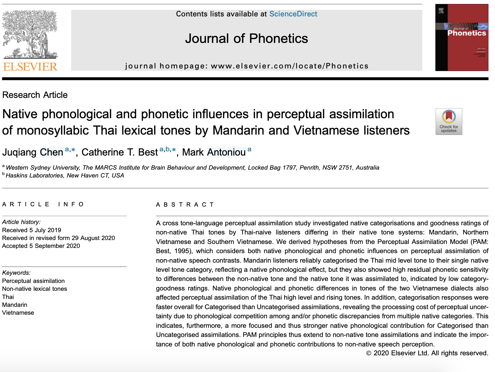


```{r eval=F, echo=T}
library(tidyverse)

library(lme4)
library(lsmeans)
library(DT)
# for cleaning up stats
library(broom)
# calculate confidence intervals
library(rcompanion)
library(cowplot)
library(flextable)
library(tidyverse)
library(quanteda)

require(readtext)
library(quanteda.textstats)

library(tidytext)

library(rstatix)
library(flextable)
#install.packages("RColorBrewer")
library("RColorBrewer")
# remove scientific notation
options(scipen=999)
setwd("/Users/chenjuqiang/Nutstore Files/310_Tutorial/LanguageDS-MS/认知科学与数据挖掘")

processed.dir = "data/processed/"
tbl.fig = "data/tbl_fig/"

```

### 研究背景 {-}

### 研究问题 {-}

### 研究方法 {-}

#### 数据收集 {-}
&emsp;&emsp; 研究选取了“狄公案”系列中已出版的17本著作，将其文本数字化。分析仅针对书籍的正文部分，序言、后记及其他非主体内容均被剔除。为确保故事结构的完整性，每本书作为一个独立单元处理。

&emsp;&emsp; 17本书首先被导入R语言环境（R Core Team, 2018），并利用quanteda程序包（Benoit等, 2018）中的corpus函数转换为语料库。接着，语料库文件被进一步转化为文档-特征矩阵。在此过程中，文本首先经过分词处理并转换为小写形式，数字、标点及符号均被移除。

#### 数据加工 {-}

```{r eval=F, echo=T}
dee.raw =readtext("data/session3/*.txt", docvarsfrom = "filenames")

dee.corpus = corpus(dee.raw)

dee.corpus.summary = data.frame(summary(dee.corpus))

dee.dfm <- dfm(dee.corpus, 
               remove_numbers = TRUE, 
               remove_punct = TRUE, 
               remove_symbols = TRUE
               #remove = stopwords("english")
               )

```


```{r eval=F, echo=T}
dee.corpus.summary%>%
    flextable()%>%
    set_caption(caption = "Table 1. Number of types, tokens, and sentences of each book in the Judge Dee series.")
```


##### Lexical diversity {-}


```{r eval=F, echo=T}
lexical.diversity <- textstat_lexdiv(dee.dfm, measure = "all")

lexical.mattr <- textstat_lexdiv(tokens(dee.corpus), 
                                 measure = "MATTR", 
                                 MATTR_window = 500)

```

##### Syntactic complexity {-}

```{r eval=F, echo=T}
metrics_SCA <- read_csv("data/session3/metrics_SCA.csv")

metrics_SCA.ci = metrics_SCA%>%
  filter(text !="01.txt")%>%
  gather("measures", "values", -c("text"))%>%
  groupwiseMean(values ~ measures,
                data = .,
                conf = 0.95,
                digits = 3)
```


##### Readability  {-}

```{r eval=F, echo=T}
readability <- textstat_readability(dee.corpus, measure = "all")

readability.df = readability%>%
   as.data.frame()%>%
   select(document, ARI, Flesch, FOG, Coleman.Liau.short, Dale.Chall, Spache)

readability.ci = readability%>%
   as.data.frame()%>%
   select(document, ARI, Flesch, FOG, Coleman.Liau.short, Dale.Chall, Spache)%>%
  filter(document !="01_Celebrated-Cases.txt")%>%
  gather("measures", "values", -c("document"))%>%
  groupwiseMean(values ~ measures,
                data = .,
                conf = 0.95,
                digits = 3)
```

### 研究结果 {-}

#### 描述性图表 {-}

##### Lexical diversity {-}
```{r eval=F, echo=T}
lexical.diversity.df = lexical.diversity%>%
  as.data.frame()%>%
  dplyr::select(document, TTR,C,R)%>%
  left_join(lexical.mattr)%>%
  bind_cols(entropy)%>%
  rename("entropy" = "...6" )%>%
 mutate(across(where(is.numeric), round, 2))

lexical.diversity.df%>%
  flextable()%>%
  set_caption(caption = "Table A1. Lexical diversity measures for each text book.")

# write_csv(lexical.diversity.df,
#           file = paste(dir.tbl,
#                        paste("lexical.diversity.df",
#                              Sys.Date(),
#                              "csv",
#                              sep = "."),
#                        sep = "") )

lexical.diversity.ci = lexical.diversity.df%>%
  filter(document !="01_Celebrated-Cases.txt")%>%
  gather("measures", "values", -c("document"))%>%
  groupwiseMean(values ~ measures,
                data = .,
                conf = 0.95,
                digits = 3)
```

##### Syntactic complexity {-}

```{r eval=F, echo=T}
metrics_SCA%>%
  mutate(across(where(is.numeric), round, 2))%>%
  flextable()%>%
  set_caption(caption = "Table A2. Readability measures for each text book.")
```

##### Readability {-}

```{r eval=F, echo=T}
readability%>%
  as.data.frame()%>%
  dplyr::select(document,ARI,Flesch, FOG, "Coleman.Liau.short", "Dale.Chall", Spache)%>%
  mutate(across(where(is.numeric), round, 2))%>%
  flextable()%>%
  set_caption(caption = "Table A3. Readability measures for each text book.")


# write_csv(readability.df,
#           file = paste(dir.tbl,
#                        paste("readability.df",
#                              Sys.Date(),
#                              "csv",
#                              sep = "."),
#                        sep = "") )
```


#### 数据建模 {-}

##### lexical diversity {-}

```{r eval=F, echo=T}
# t-tests
t.test(lexical.diversity$TTR[2:17], 
       mu = lexical.diversity$TTR[1], 
       alternative = "greater")

t.test(lexical.diversity$C[2:17], 
       mu = lexical.diversity$C[1], 
       alternative = "greater")

t.test(lexical.diversity$R[2:17], 
       mu = lexical.diversity$R[1], 
       alternative = "greater")

t.test(lexical.mattr$MATTR[2:17], 
       mu = lexical.mattr$MATTR[1], 
       alternative = "greater")


entropy = textstat_entropy(dee.dfm)$entropy

t.test(entropy[2:17], mu = entropy[1])


```

##### Syntactic complexity {-}

```{r eval=F, echo=T}
# mean length of clause (MLC): number of words divided by number of clauses;
t.test(metrics_SCA$MLC[2:17], mu = metrics_SCA$MLC[1],  alternative = "less")

t.test(metrics_SCA$MLS[2:17], mu = metrics_SCA$MLS[1], alternative = "less")

t.test(metrics_SCA$MLT[2:17], mu = metrics_SCA$MLT[1], alternative = "less")

t.test(metrics_SCA$"C/S"[2:17], mu = metrics_SCA$"C/S"[1], alternative = "less")

t.test(metrics_SCA$"C/T"[2:17], mu = metrics_SCA$"C/T"[1], alternative = "less")

t.test(metrics_SCA$"CT/T"[2:17], mu = metrics_SCA$"CT/T"[1], alternative = "less")

t.test(metrics_SCA$"DC/C"[2:17], mu = metrics_SCA$"DC/C"[1], alternative = "less")

t.test(metrics_SCA$"DC/T"[2:17], mu = metrics_SCA$"DC/T"[1], alternative = "less")

t.test(metrics_SCA$"CP/C"[2:17], mu = metrics_SCA$"CP/C"[1], alternative = "less")

t.test(metrics_SCA$"CP/T"[2:17], mu = metrics_SCA$"CP/T"[1], alternative = "less")

t.test(metrics_SCA$"T/S"[2:17], mu = metrics_SCA$"T/S"[1], alternative = "less")

t.test(metrics_SCA$"CN/C"[2:17], mu = metrics_SCA$"CN/C"[1], alternative = "less")

t.test(metrics_SCA$"CN/T"[2:17], mu = metrics_SCA$"CN/T"[1], alternative = "less")

t.test(metrics_SCA$"VP/T"[2:17], mu = metrics_SCA$"VP/T"[1], alternative = "less")


```

##### Readability {-}

```{r eval=F, echo=T}

t.test(readability$ARI[2:17], mu = readability$ARI[1], alternative = "less")

t.test(readability$Flesch[2:17], mu = readability$Flesch[1], alternative = "greater")

t.test(readability$FOG[2:17], mu = readability$FOG[1], alternative = "less")

t.test(readability$Coleman.Liau.short[2:17], mu = readability$Coleman.Liau.short[1], alternative = "less")

t.test(readability$Dale.Chall[2:17], mu = readability$Dale.Chall[1], alternative = "greater")

t.test(readability$Spache[2:17], mu = readability$Spache[1], alternative = "less")

# t.test(readability$meanSentenceLength[2:17], mu = readability$meanSentenceLength[1])

# t.test(readability$meanWordSyllables[2:17], mu = readability$meanWordSyllables[1])

```

### 研究结论 {-}

&emsp;&emsp; 狄公案系列侦探小说的英译文本在词汇多样性及复杂度上均低于原创文本，但在句法复杂度上反而更高。根据约束语言理论，翻译过程中涉及的双语系统激活与持续语码转换等复杂认知机制，会额外增加译者的认知负荷并降低其工作记忆容量，从而导致译者更倾向于采用简化策略。此外，源语文本也在一定程度上限制了译者对词汇资源的调用空间。相比之下，作者高罗佩在进行原创写作时能够充分调用其全部语言储备，因而创作出词汇丰富度更高的文本。

&emsp;&emsp; 作为译者，高罗佩（Robert van Gulik）对自身的中介者角色有着清醒认知，始终秉持着将中国古代公案小说引介至西方世界的使命感。为实现这一目标，他在译文中刻意采用了符合西方读者阅读习惯的句法结构，甚或存在过度使用之嫌。译本文句复杂度较高的现象，亦可与显化效应（explicitation effect）相关联——鉴于故事发生的中国在地理与文化层面均与西方读者存在巨大隔阂，译者不得不通过精细重构句式，将原文隐含的信息予以显性呈现。

&emsp;&emsp; 译文文本的阅读难度可能反而高于原创文本。这表明，相较于原创作品，译文要么含有更长的句子，要么使用了更复杂的词汇。鉴于译文的词汇多样性较低，我们可以推断句法复杂性是导致其可读性相对较低的主因。正如前文所述，译文中出现的复杂句式结构，很可能是译者竭力传达源文本信息的必然结果——由此导致的可读性损耗，实非译者本意。


## 案例11.2 汉语失语症话语产出 {-}

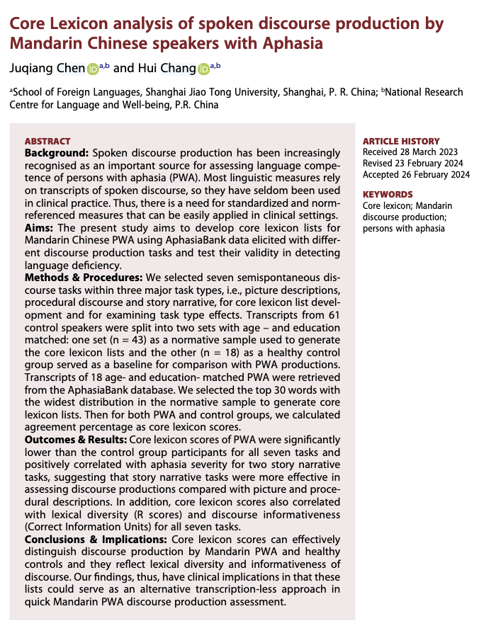

### 研究背景 {-}

### 研究问题及假设 {-}

### 研究方法 {-}

#### 数据收集 {-}

#### 数据处理 {-}

```{r message = FALSE, warning = FALSE}

library(tidyverse)
library(tidytext)
library(quanteda)
library(stringr)
library(jiebaR)
library(readtext)
library(rstatix)
# for cleaning up stats
library(broom)
# calculate confidence intervals
library(rcompanion)
library(cowplot)
library(flextable)
# remove scientific notation
options(scipen=999)

# add r values in regression lines
library(ggpubr)
# show chinese characters in ggplot
library(showtext)
showtext_auto()

#filter function
`%!in%` <- Negate(`%in%`)

setwd("~/Nutstore Files/310_Tutorial/LanguageDS-e")

```

```{r eval=F, echo=T}
### Jieba 分词
text = "口语话语产出越来越被视为评估失语症患者（PWA）语言能力的重要来源。"
# 创建一个默认的分词器
seg1 <- worker()
# 使用seg1进行分词
segment(text, seg1)
# 
# seg3 <- worker(user = "demo_data/dict-ch-user-demo.txt", #设置自定义词典
#                # 设置停用词
#                stop_word = "demo_data/stopwords-ch-demo.txt")
# 
# segment(text, seg3)


```


```{r eval=F, echo=T}
### 汉语失语症语料分词
# 导入被试信息

subjects_all <- read_csv("data/ch11/subjects.all4corelexV2.csv", 
                         na = "NA")

## 导入语料
df.clean <- read_csv("data/ch11/df.all.clean.2022-10-05.csv")%>%
  mutate(subject = dplyr::recode(subject,"/JiangLin40a2.cha"="/JiangLin40a.cha",
                          "/JiangLin40a1.cha"="/JiangLin40a.cha",
                          "/JiangLin01a2.cha"="/JiangLin01a.cha",
                          "/JiangLin01a1.cha"="/JiangLin01a.cha",
                          "/JiangLin70a1.cha"="/JiangLin70a.cha",
                          "/JiangLin70a2.cha"="/JiangLin70a.cha",
                          "/JiangLin08a2.cha"= "/JiangLin08a.cha",
                          "/JiangLin08a1.cha"= "/JiangLin08a.cha"))%>%
  filter(!is.na(task))%>%
  mutate(subject = str_remove(subject,"\\/"),
         subject = str_remove(subject,".cha"))%>%
  left_join(subjects_all)%>%
  mutate(normative = as.character(normative))%>%
  filter(normative != "0")%>%
  filter(include == "Y")%>%
  select(-Onset_Date, -Video_Date, -Informed_Consent)

## 批量分词

my_seg <- worker(bylines = T, 
                 #user = "demo_data/dict-ch-user-demo.txt", 
                 symbol=T)

df.tokenised =  df.clean%>%
  mutate(clean = str_replace_all(clean_new, 
                                 c(" 一 个 " = " 一个 ", " 一 条 " = "一条"," 一 场 " = " 一场 ",
                                    " 一 把 " = " 一把 ", " 一 群 " = " 一群 ", " 一 次 " = " 一次 ",
                                    " 一 辆 " = " 一辆 ", " 一 只 " = " 一只 ", " 一 天 " = " 一天 ",
                                   " 一 下 " = " 一下 ", " 一 张 " = " 一张 ", " 一 道 " = " 一道 ",
                                   " 一 起 " = " 一起 "," 一 步 " = " 一步 "," 一 看 " = " 一看 ",
                                   " 一 匹 " = " 一匹 "," 一 觉 " = " 一觉 "," 一 件 " = " 一件 ",
                                   "一 位" = "一位","一 架" = "一架","一 项" = "一项",
                                   " 发 洪水 " = " 发洪水 "," 发 大水 " = " 发大水 ", 
                                   " 一 队 " = " 一队 ")))%>%
  # 分词
  unnest_tokens(word, ## new tokens unnested
                clean, ## original larger units
                token = function(x)   ## self-defined tokenization method
                segment(x, jiebar = my_seg)
                 )%>%
  #filter non-words
  filter(str_detect(word, "\\w"))%>%
  #filter english words
  filter(!str_detect(word, "[a-zA-Z]"))%>%
  filter(word !="_")%>%
  mutate(task = dplyr::recode(task, "@task2"="Pic-Window","@task3"="Pic-Umbrella",
                       "@task4"="Pic-CatRescue","@task5"="Pic-Flood",
                       "@task6"="S-TortioseHare",
                       "@task7"="S-CryWolf","@task8"="Proc-FriedRice"))%>%
  filter(task %!in% c("@task1", "@task10", "@task11", "@task9"))

## 计算被试年龄和教育程度
age.aq.edu.stroke = df.tokenised%>%
    select(subject, Age, Gender, group, normative, Education_Level, 
           PostOnsetMonth, Aphasia_Type, AQ)%>%
    distinct()%>%
    mutate(AQ = as.numeric(AQ))%>%
    group_by( normative)%>%
    summarise(n = n(),
            mean.age = round(mean(Age),1),
            max.age = round(max(Age),1),
            min.age = round(min(Age),1),
            sd.age = round(sd(Age),1),
            mean.edu = round(mean(Education_Level, na.rm = TRUE),1),
            sd.edu = round(sd(Education_Level,  na.rm = TRUE),1),
            max.edu= round(max(Education_Level, na.rm = TRUE),1),
            min.edu = round(min(Education_Level, na.rm = TRUE),1),
            mean.AQ = round(mean(AQ, na.rm = TRUE),1),
            sd.AQ = round(sd(AQ, na.rm = TRUE),1),
            max.AQ= round(max(AQ, na.rm = TRUE),1),
            min.AQ = round(min(AQ, na.rm = TRUE),1),
            mean.stroke = round(mean(PostOnsetMonth, na.rm = TRUE),1),
            sd.stroke = round(sd(PostOnsetMonth, na.rm = TRUE),1))

## 被试年龄和教育程度统计分析
age.aq.edu.stroke.t.test = df.tokenised%>%
    select(subject, Age, Gender, group, normative, Education_Level, Aphasia_Type)%>%
    distinct()%>%
    gather(measures, values, c("Age", "Education_Level"))%>%
    filter(normative %in%c("1","2","3"))%>%
    group_by(measures)%>%
    rstatix::t_test(values~ normative)

age.aq.edu.stroke%>%
  filter(normative != "4")%>%
    flextable()%>%
    set_caption(caption = "Table 1 Demographic information for all individuals. ")

age.aq.edu.stroke.t.test%>%
    flextable()%>%
    set_caption(caption = "Table 2. Statistical tests of age and years of education among three groups.")

```

```{r eval=F, echo=T}
### 计算词汇丰富度
chinese.TTR = df.tokenised%>%
    mutate(word2 = dplyr::recode(word,
                        #task 2
                        "电视机"="电视","窗"="窗户","电视机"="电视",
                        "男孩"="小孩","小朋友"="小孩","足球"="球",
                        #task3
                        "雨伞"="伞","孩子"="小孩","小孩子"="小孩",
                        "母亲"="妈妈","电视机"="电视","电视机"="电视",
                        #task4
                        "女孩"="小孩","女儿"="小孩","孩子"="小孩",
                        "父亲"="爸爸","车子"="消防车","电视机"="电视",
                        #task5
                        "大水"="洪水","女"="小孩","消防员"="战士","发大水"="发洪水",
                        "解放军"="战士","电视机"="电视","电视机"="电视",
                        #task 6 
                        "兔"="兔子","龟"="乌龟","白兔"="兔子",
                        #task 7
                        "孩子"="小孩","农民"="村民","电视机"="电视"
                        ))%>%
  select(subject, normative, group, task, word2)%>%
  mutate(token = 1,
         character = nchar(word2))%>%
  group_by(subject, normative, task)%>%
  summarise(token = sum(token),
            character = sum(character),
            type = n_distinct(word2),
            ttr = type/token,
            c = log(type)/log(token),
            r = type/sqrt(token))%>%
  filter(normative %in% c("1","2","3"))%>%
  group_by(normative, task)%>%
  get_summary_stats(token, type, character, ttr,c,r, type = "mean_sd")%>%
  select(-n)%>%
  gather(stats, value, -(normative:variable))%>%
  mutate(value = round(value, 1))%>%
  unite(temp, variable, stats)%>%
  spread(temp, value)%>%
  select( "task", "normative","character_mean", "character_sd", "type_mean", "type_sd",
          "token_mean", "token_sd", "ttr_mean", "ttr_sd", "c_mean", "c_sd", "r_mean", "r_sd")
   
chinese.TTR.test = df.tokenised%>%
    mutate(word2 = dplyr::recode(word,
                        #task 2
                        "电视机"="电视","窗"="窗户","电视机"="电视",
                        "男孩"="小孩","小朋友"="小孩","足球"="球",
                        #task3
                        "雨伞"="伞","孩子"="小孩","小孩子"="小孩",
                        "母亲"="妈妈","电视机"="电视","电视机"="电视",
                        #task4
                        "女孩"="小孩","女儿"="小孩","孩子"="小孩",
                        "父亲"="爸爸","车子"="消防车","电视机"="电视",
                        #task5
                        "大水"="洪水","女"="小孩","消防员"="战士","发大水"="发洪水",
                        "解放军"="战士","电视机"="电视","电视机"="电视",
                        #task 6 
                        "兔"="兔子","龟"="乌龟","白兔"="兔子",
                        #task 7
                        "孩子"="小孩","农民"="村民","电视机"="电视"
                        ))%>%
  select(subject, normative, group, task, word2)%>%
  mutate(token = 1,
         character = nchar(word2))%>%
  group_by(subject, normative, task)%>%
  summarise(token = sum(token),
            character = sum(character),
            type = n_distinct(word2),
            ttr = type/token,
            c = log(type)/log(token),
            r = type/sqrt(token))%>%
  #filter(normative%in%c("2"))%>%
  #group_by(normative, task)%>%
    gather(measures, values, c("token", "character","type","ttr","c","r"))%>%
    filter(normative %in% c("1","2","3"))%>%
    group_by(measures, task)%>%
    rstatix::wilcox_test(values~ normative)%>%
  mutate(p.adj = round(p.adj,4))%>%
  select(-p)

chinese.TTR%>%
  filter(normative != "4")%>%
  select(-c("ttr_mean","ttr_sd","c_mean","c_sd","r_mean","r_sd"))%>%
  arrange(task)%>%
    flextable()%>%
    set_caption(caption = "Table 3. Number of characters, word types, and tokens for each task and each group.  ")

chinese.TTR.test%>%
    filter(measures %!in% c("c","r","ttr"))%>%
    flextable()%>%
    set_caption(caption = "Table 4 Statistical comparisions of linguistic variables among normative, control and PWA goups.")
```

### 提取核心词汇 {-}

```{r  eval=F, echo=T}

core.lex.raw = df.tokenised%>%
  filter(normative == "1")%>%
  ## filter some functional words
  # anti_join(fWord)%>%
  #merge some  words
  mutate(word2 = dplyr::recode(word,
                        #task 2
                        "电视机"="电视","窗"="窗户","电视机"="电视",
                        "男孩"="小孩","小朋友"="小孩","足球"="球",
                        #task3
                        "雨伞"="伞","孩子"="小孩","小孩子"="小孩",
                        "母亲"="妈妈","电视机"="电视","电视机"="电视",
                        #task4
                        "女孩"="小孩","女儿"="小孩","孩子"="小孩",
                        "父亲"="爸爸","车子"="消防车","电视机"="电视",
                        #task5
                        "大水"="洪水","女"="小孩","消防员"="战士", "发大水"="发洪水",
                        "解放军"="战士","电视机"="电视","电视机"="电视",
                        #task 6 
                        "兔"="兔子","龟"="乌龟","白兔"="兔子",
                        #task 7
                        "孩子"="小孩","农民"="村民","电视机"="电视",
                        "饭"="米饭"
                        ))%>%
  group_by(subject,task)%>%
  count(word2, sort = TRUE)

core.lex.freq = core.lex.raw%>%
  group_by(task, word2)%>%
  summarise(freq = sum(n))


# number of controls
n.ctr = df.tokenised%>%
  filter(normative == "1")%>%
  distinct(subject)%>%
  nrow()

core.lex.ctrl = core.lex.raw%>%
  mutate(present = 1)%>%
  group_by(task, word2)%>%
  summarise(x1distribute = sum(present)/n.ctr)%>%
  mutate(x1distribute = round(x1distribute, 2)*100)%>%
  arrange(desc(x1distribute))  %>%
  mutate(top.no = 1:n())%>%
  #filter(distribute > 0.5)
  filter(top.no < 31)%>%
  mutate(x2chinese = case_when(
      word2 == "了" ~ "FC1", word2 == "的" ~ "FC2", word2 == "一" ~ "one",
      word2 == "树" ~ "tree", word2 == "上" ~ "up", word2 == "猫" ~ "cat",
      word2 == "在" ~ "in", word2 == "狗" ~ "dog", word2 == "小" ~ "small",
      word2 == "救" ~ "save", word2 == "有" ~ "have", word2 == "下来" ~ "come down",
      word2 == "这个" ~ "this",word2 == "是" ~ "link verb",word2 == "然后" ~ "then",
      word2 == "一个" ~ "classifier (one)",word2 == "一只" ~ "classifier (one)",
      word2 == "不" ~ "negative marker",
      word2 == "把" ~ "FC3", word2 == "来" ~ "come", word2 == "梯子" ~ "ladder",
      word2 == "爬" ~ "climb", word2 == "到" ~ "arrive", word2 == "小孩" ~ "kid",
      word2 == "就" ~ "FC4", word2 == "着" ~ "FC5", word2 == "这" ~ "this",
      word2 == "下" ~ "down", word2 == "想" ~ "think", word2 == "也" ~ "too",
      word2 == "叫" ~ "shout", word2 == "她" ~ "she", word2 == "树枝" ~ "branch",
      word2 == "被" ~ "FC6", word2 == "水" ~ "water", word2 == "吧" ~ "FC7",
      word2 == "就是" ~ "be exactly", word2 == "一" ~ "one", word2 == "发" ~ "flooding",
      word2 == "个" ~ "classifier", word2 == "里" ~ "inside", word2 == "伞" ~ "umbrella",
      word2 == "妈妈" ~ "mum", word2 == "他" ~ "he", word2 == "下雨" ~ "raining",
      word2 == "带" ~ "carry", word2 == "雨" ~ "rain", word2 == "上学" ~ "go to school",
      word2 == "走" ~ "go", word2 == "淋" ~ "get wet (by rain)", word2 == "去" ~ "go",
      word2 == "要" ~ "want", word2 == "时候" ~ "time", word2 == "跑" ~ "run",
      word2 == "没" ~ "none", word2 == "给" ~ "give", word2 == "说" ~ "say",
      word2 == "窗户" ~ "window", word2 == "看" ~ "look", word2 == "玻璃" ~ "glass",
      word2 == "踢" ~ "kick", word2 == "球" ~ "ball", word2 == "人" ~ "man",
      word2 == "电视" ~ "TV", word2 == "那个" ~ "that", word2 == "家" ~ "home",
      word2 == "我" ~ "I", word2 == "火腿肠" ~ "sausage", word2 == "油" ~ "oil",
      word2 == "蛋炒饭" ~ "egg fried rice", word2 == "放" ~ "put", word2 == "先" ~ "first",
      word2 == "锅" ~ "wok", word2 == "鸡蛋" ~ "egg", word2 == "再" ~ "then",
      word2 == "切" ~ "cut", word2 == "倒" ~ "pour", word2 == "米饭" ~ "rice",
      word2 == "可以" ~ "can", word2 == "米饭" ~ "that", word2 == "家" ~ "home",
      word2 == "好" ~ "good", word2 == "做" ~ "do", word2 == "进去" ~ "into",
      word2 == "盐" ~ "salt", word2 == "一下" ~ "one time", word2 == "那个" ~ "that",
      word2 == "狼" ~ "wolf", word2 == "羊" ~ "sheep", word2 == "都" ~ "all",
      word2 == "喊" ~ "shout", word2 == "吃" ~ "eat", word2 == "真的" ~ "real",
       word2 == "次" ~ "(this) time", word2 == "又" ~ "again", word2 == "山" ~ "hill",
       word2 == "兔子" ~ "rabbit", word2 == "乌龟" ~ "tortoise", word2 == "它" ~ "it",
       word2 == "赛跑" ~ "race", word2 == "过" ~ "FC9", word2 == "和" ~ "and",
       word2 == "得" ~ "FC8", word2 == "快" ~ "quick", word2 == "睡" ~ "sleep",
       word2 == "喊" ~ "shout", word2 == "吃" ~ "eat", word2 == "终点" ~ "end",
       word2 == "很" ~ "very", word2 == "森林" ~ "forest", word2 == "比赛" ~ "games",
       word2 == "听" ~ "hear", word2 == "已经" ~ "already",word2 == "开始" ~ "begin",
       word2 == "洪水" ~ "flood", word2 == "炒" ~ "stir fry", word2 == "村民" ~ "villager",
      word2 == "里面" ~ "inside",
      TRUE                      ~ "####"))

core.lex.ctrl.wide = core.lex.ctrl%>%
  ungroup()%>%
  gather(measures, value, c("word2", "x1distribute", "x2chinese"))%>%
  mutate(measures = paste(task, measures, sep = "-"))%>%
  select(-task)%>%
  spread(measures, value)

core.lex.ctrl.wide%>%
    flextable()%>%
    set_caption(caption = "Table 5 Core lexicon for different tasks")


```


### 研究结果 {-}

#### 描述性图表 {-}

```{r  eval=F, echo=T}

### 比较核心词汇分数
core.score.pwa.ctrl = df.tokenised%>%
  #filter(Age > 20 & Age < 65 )%>%
  filter(normative %in% c("2","3"))%>%
  select(subject,group,task,word, AQ, Aphasia_Type, include)%>%
  filter(include == "Y")%>%
  ## filter some functional words
  #anti_join(fWord)%>%
  #merge some  words
  mutate(word2 = dplyr::recode(word,
                        #task 2
                        "电视机"="电视","窗"="窗户","电视机"="电视",
                        "男孩"="小孩","小朋友"="小孩","足球"="球",
                        #task3
                        "雨伞"="伞","孩子"="小孩","小孩子"="小孩",
                        "母亲"="妈妈","电视机"="电视","电视机"="电视",
                        #task4
                        "女孩"="小孩","女儿"="小孩","孩子"="小孩",
                        "父亲"="爸爸","车子"="消防车","电视机"="电视",
                        #task5
                        "大水"="洪水","女"="小孩","消防员"="战士","发大水"="发洪水",
                        "解放军"="战士","电视机"="电视","电视机"="电视",
                        #task 6 
                        "兔"="兔子","龟"="乌龟","白兔"="兔子",
                        #task 7
                        "孩子"="小孩","农民"="村民","电视机"="电视"
  ))%>%
  select(-word)%>%
  distinct()%>%
  inner_join(core.lex.ctrl, by = c("task","word2"))%>%
  mutate(present = 1)%>%
  group_by(subject, group, task)%>%
  filter(task!="@task1" & task != "@task9")%>%
  summarise(score = sum(present))%>%
  mutate(id = paste(subject, group, sep = "_"))


cn.matrix = data.frame(
  expand.grid(task2 = unique(core.score.pwa.ctrl$task), 
              id2 = unique(core.score.pwa.ctrl$id)))%>%
  mutate(unique_id = paste(id2, task2, sep = "_"))

fig.core.score = core.score.pwa.ctrl %>% 
  mutate(unique_id = paste(id, task, sep = "_"))%>%
  right_join(cn.matrix)%>%
  mutate(subject= str_extract(id2, "^\\w*_"),
         subject = str_remove(subject,"_"),
         task = task2,
         group = str_extract(id2, "control|patient"))%>%
  # replace na with 0
  mutate(score = coalesce(score, 0))%>%
  groupwiseMean(score ~ group + task,
                data = .,
                conf = 0.95,
                digits = 3) %>%
  ggplot(.,aes(task, Mean, fill = group))+
  geom_bar(colour = "black",
           stat = "identity", position = position_dodge(.9))+
  geom_errorbar(aes(ymin = Trad.lower,
                    ymax = Trad.upper),
                width = .2, size = 0.7, 
                position = position_dodge(.9))+
  scale_fill_manual(values=c("grey75", "white"),
                    name="Participants",
                    labels=c("Control",
                             "PWA"))+
  labs(y = "Core Lexicon scores",
       x = "Task")+
  theme_bw()

fig.core.score
```


#### 统计建模 {-}

```{r  eval=F, echo=T}

## 统计分析

core.score.pwa.ctrl.df = core.score.pwa.ctrl %>%
  mutate(unique_id = paste(id, task, sep = "_"))%>%
  right_join(cn.matrix)%>%
  mutate(subject= str_extract(id2, "^\\w*_"),
         subject = str_remove(subject,"_"),
         task = task2,
         group = str_extract(id2, "control|patient"))%>%
  # replace na with 0
  mutate(score = coalesce(score, 0))


stat.test.normality = core.score.pwa.ctrl.df  %>%
  group_by(task)%>%
  rstatix::shapiro_test(score)%>% 
  rstatix::add_significance("p")

core.lex.wilcox = core.score.pwa.ctrl.df  %>%
  group_by(task)%>%
  rstatix::wilcox_test(score ~ group)%>% 
  rstatix::add_significance("p")

core.lex.wilcox.effectsize = core.score.pwa.ctrl.df  %>%
  group_by(task)%>%
  wilcox_effsize(score ~ group)

core.lex.wilcox.result = core.lex.wilcox%>%
  select(task, n1, n2, statistic, p, p.signif)%>%
  left_join(core.lex.wilcox.effectsize)%>%
  select(task, n1, n2, statistic, p, p.signif, effsize, magnitude)%>%
  mutate(effsize = round(effsize,2),
         statistic = round(statistic, 0))

core.lex.wilcox.result%>%
    flextable()%>%
    set_caption(caption = "Table 7 Statistical comparisons of core lexicon scores between healthy controls and PWA in each discourse production task. ")


```


```{r  eval=F, echo=T}
### 核心词汇分数和词汇丰富度相关性分析
### correlation with aphasia severity
score.aq.correlation  = core.score.pwa.ctrl.df %>% 
  left_join(subjects_all)%>%
  filter(group == "patient")%>%
  select(subject, group, task, AQ, score)%>%
  mutate(AQ = as.numeric(AQ),
         task = dplyr::recode(task, "@task2"="Pic-Window","@task3"="Pic-Umbrella",
                       "@task4"="Pic-CatRescue","@task5"="Pic-Flood",
                       "@task6"="S-TortioseHare",
                       "@task7"="S-CryWolf","@task8"="Proc-FriedRice"))%>%
  group_by(task)%>%
  cor_test(AQ, score, method = "spearman")


### linguistic variables
linguistic = df.tokenised%>%
    mutate(word2 = dplyr::recode(word,
                        #task 2
                        "电视机"="电视","窗"="窗户","电视机"="电视",
                        "男孩"="小孩","小朋友"="小孩","足球"="球",
                        #task3
                        "雨伞"="伞","孩子"="小孩","小孩子"="小孩",
                        "母亲"="妈妈","电视机"="电视","电视机"="电视",
                        #task4
                        "女孩"="小孩","女儿"="小孩","孩子"="小孩",
                        "父亲"="爸爸","车子"="消防车","电视机"="电视",
                        #task5
                        "大水"="洪水","女"="小孩","消防员"="战士","发大水"="发洪水",
                        "解放军"="战士","电视机"="电视","电视机"="电视",
                        #task 6 
                        "兔"="兔子","龟"="乌龟","白兔"="兔子",
                        #task 7
                        "孩子"="小孩","农民"="村民","电视机"="电视"
                        ))%>%
  select(subject, normative, group, task, word2)%>%
  mutate(token = 1,
         character = nchar(word2))%>%
  group_by(subject, normative, task)%>%
  summarise(token = sum(token),
            character = sum(character),
            type = n_distinct(word2),
            ttr = type/token,
            c = log(type)/log(token),
            r = type/sqrt(token))%>%
  filter(normative %in% c("2","3"))%>%
  mutate(group = dplyr::recode(normative,
                        "2"="control","3"="patient"))

score.linguistic.correlation.full = core.score.pwa.ctrl.df%>% 
  #filter(group == "patient")%>%
  left_join(linguistic)%>%
  mutate_all(~ifelse(is.na(.), 0, .))%>%
  left_join(subjects_all, by = c("subject", "group"))%>%
  mutate(AQ = as.numeric(AQ))%>%
  group_by(group, task)%>%
  cor_test(token, character, type, ttr, score, c,r,AQ, method = "spearman")

score.linguistic.cor.final = score.linguistic.correlation.full%>%
  mutate(var = paste(var1, var2, sep = "-"),
         statistic = round(statistic, 0),
         p = round(p,4))%>%
  filter(group == "patient")%>%
  filter(var %in% c("score-ttr","score-c","score-r","score-AQ",
                    "ttr-AQ","c-AQ","r-AQ"))


```


```{r  eval=F, echo=T}

score.aq.correlation %>%
    flextable()%>%
    set_caption(caption = "Table 8 Correlations of core lexicon scores with aphasia serverity. ")


chinese.TTR %>%
    select("task","normative","ttr_mean","ttr_sd","c_mean","c_sd","r_mean","r_sd")%>%
    arrange(task)%>%
    flextable()%>%
    set_caption(caption = "Table 9. Lexical diversity measures of each group per task. ")


chinese.TTR.test %>%
    filter(measures %in% c("c","r","ttr"))%>%
    flextable()%>%
    set_caption(caption = "Table 10 Statistical comparisions of lexical diversity measures among normative, control and PWA goups per task. ")

score.linguistic.cor.final %>%
    flextable()%>%
    set_caption(caption = "Table 11. Correlations of core lexicon scores with lexical diversity R.")


```

### 研究结论 {-}
&emsp;&emsp; 核心词汇评分能够有效区分汉语失语症患者与健康对照组的话语产出，并反映话语的词汇多样性和信息丰富度。因此，我们的研究发现具有临床意义：这些核心词汇列表可作为一种免转录的快速评估方法，用于汉语失语症患者的话语产出评估。

<!--chapter:end:10-CH11-文本分析项目-V3.Rmd-->


# 声学分析项目案例

## 案例12.1 越南语南北方言声调曲拱对比 {-}


### 研究背景 {-}

### 研究问题及假设  {-}

### 研究方法

### 数据收集

### 数据处理


```{r message=FALSE, warning=FALSE }

setwd("~/Nutstore Files/310_Tutorial/LanguageDS-e")
#install.packages("plotfunctions")
library(tidyverse)
## 构建模型
library(mgcv)
## 作图
library(itsadug)
```


```{r eval=F, echo=T}

## 数据导入及整理
contour_data_all = read.csv("data/ch12/nv.sv.data.2024-08-24.csv")

# modelling NV difference
nv.data = contour_data_all%>%
  ungroup()%>%
  filter(tone %in% c("NV415", "NV214") )%>%
  #filter(subject != 214)%>%
  rename(Time = Timepoint)%>%
  select(-language)%>%
  mutate(id = as.factor(id),
        tone = as.factor(tone),
         subject = as.factor(subject))

#sort data per individual trajectory (for autocorrelation)
nv.data = data.frame(nv.data)
nv.data$id = as.factor(nv.data$id)
nv.data = start_event(nv.data, event = c("subject", "id"))

```

#### 数据建模


```{r eval=F, echo=T}
### 越南语北部方言声调建模
# preliminary model without autocorrelation correction 
model.nv = bam(normF0 ~ tone + s(Time, by=tone)+
               s(Time, subject, by = tone, bs = "fs", m = 1),
             data= nv.data)
summary(model.nv)
nvacf = acf_resid(model.nv)
#获取参数
nvacf[2]

## with autocorrelation correction
model.nv.b = bam(normF0 ~ tone + s(Time, by=tone)+
                 s(Time, subject, by = tone, bs = "fs", m = 1),
               rho = nvacf[2],
               AR.start = nv.data$start.event, 
               discrete = T, 
               nthreads = 2,
               data= nv.data)

summary(model.nv.b)

# plot
plot_smooth(model.nv.b, ylab = "Normalised f0", 
            xlab = "Normalised time",
            view="Time", cond=list(tone=c("NV415")), 
            ylim=c(-0.5,1), rm.ranef=T, 
            main="Northen Vietnamese", 
            rug=FALSE, col="blue", 
            hide.label = "fitted values")

plot_smooth(model.nv.b, view="Time", 
            cond=list(tone=c("NV214")), 
            v0 = 6, rug=FALSE,rm.ranef=T, 
            col="green",add=T)

```


```{r  eval=F, echo=T }

# 验证越南语北部方言是否存在这个声调对立

# （一）模型比较法
# 模型1区分两个对立


model.nv = bam(normF0 ~ tone + s(Time, by=tone)+
                 s(Time, subject, by = tone, bs = "fs", m = 1),
               data= nv.data)
# 模型2不区分两个对立
model.nv0 = bam(normF0 ~ tone + s(Time)+
                 s(Time, subject, by = tone, bs = "fs", m = 1),
               data= nv.data)
#比较两个模型
compareML(model.nv, model.nv0)
#此方法缺点是计算量比较大。但是对于不是很复杂的模型没有影响。

```


```{r eval=F, echo=T}

# （二）差值比较法
# 通过修改模型的设定，将表示两个原始平滑函数之间差异的函数包含在模型中。接下来，发现这个差异平滑函数是显著的，这就表明有显著差异。为了拟合这个新模型，我们首先需要创建一个新的二元变量，该变量在一个水平上等于0，而在另一个水平上等于1。我们现在创建一个名为IS214的变量，该变量在单词‘NV214’上为1，而在单词‘NV415’上为0。


nv.data$IS214 = (nv.data$tone == "NV214")*1

model.nv.binary = bam(normF0 ~ s(Time) + s(Time, by=IS214)+
                        s(Time, subject, by = tone, bs = "fs", m = 1),
                      rho = nvacf[2],
                      AR.start = nv.data$start.event, 
                      discrete = T, 
                      nthreads = 2,
                      data= nv.data)

summary(model.nv.binary)
```


```{r eval=F, echo=T}
# （三）
nv.data$toneO = as.ordered(nv.data$tone)
contrasts(nv.data$toneO) = "contr.treatment"

model.nv.ord = bam(normF0 ~ toneO+ s(Time) + s(Time, by=toneO)+
                     s(Time, subject, by = tone, bs = "fs", m = 1),
                   rho = nvacf[2],
                   AR.start = nv.data$start.event, 
                   discrete = T, 
                   nthreads = 2,
                   data= nv.data)
summary(model.nv.ord )

```


```{r eval=F, echo=T}

### 越南语南部方言声调建模
sv.data = contour_data_all%>%
  ungroup()%>%
  filter(tone %in% c("SV415", "SV214") )%>%
  rename(Time = Timepoint)%>%
  select(-language)%>%
  mutate(id = as.factor(id),
         tone = as.factor(tone),
         subject = as.factor(subject))

#sort data per individual trajectory (for autocorrelation)
sv.data = start_event(sv.data, event = c("subject", "id"))

# preliminary model without autocorrelation correction 
model.sv = bam(normF0 ~ tone + s(Time, by=tone)+
                 s(Time, subject, by = tone, bs = "fs", m = 1),
               data= sv.data)
summary(model.sv)
svacf = acf_resid(model.sv)
svacf[2]

## with autocorrelation correction
model.sv.b = bam(normF0 ~ tone + s(Time, by=tone)+
                   s(Time, subject, by = tone, bs = "fs", m = 1),
                 rho = svacf[2],
                 AR.start = sv.data$start.event, 
                 discrete = T, 
                 nthreads = 2,
                 data= sv.data)

summary(model.sv.b)

# plot
plot_smooth(model.sv.b, ylab = "Normalised f0", 
            xlab = "Normalised time",
            view="Time", cond=list(tone=c("SV415")), 
            ylim=c(-0.5,1), rm.ranef=T, 
            main="Southen Vietnamese", 
            rug=FALSE, col="blue", 
            hide.label = "fitted values")

plot_smooth(model.sv.b, view="Time", 
            cond=list(tone=c("SV214")), 
            v0 = 6, rug=FALSE,rm.ranef=T, 
            col="green",add=T)

# testing if the tone contrast exists
#solution 1
model.sv.b = bam(normF0 ~ tone + s(Time, by=tone)+
                   s(Time, subject, by = tone, bs = "fs", m = 1),
                 rho = svacf[2],
                 AR.start = sv.data$start.event, 
                 discrete = T, 
                 nthreads = 2,
                 data= sv.data)
model.sv.b0 = bam(normF0 ~ tone + 
                   s(Time, subject, by = tone, bs = "fs", m = 1),
                 rho = svacf[2],
                 AR.start = sv.data$start.event, 
                 discrete = T, 
                 nthreads = 2,
                 data= sv.data)
compareML(model.sv, model.sv.b0)

# solution 2
sv.data$IS214 = (sv.data$tone == "SV214")*1

model.sv.binary = bam(normF0 ~ s(Time) + s(Time, by=IS214)+
                   s(Time, subject, by = tone, bs = "fs", m = 1),
                 rho = svacf[2],
                 AR.start = sv.data$start.event, 
                 discrete = T, 
                 nthreads = 2,
                 data= sv.data)

summary(model.sv.binary)

# soluation 3

sv.data$toneO = as.ordered(sv.data$tone)
contrasts(sv.data$toneO) = "contr.treatment"

model.sv.ord = bam(normF0 ~ toneO+ s(Time) + s(Time, by=toneO)+
                     s(Time, subject, by = tone, bs = "fs", m = 1),
                   rho = svacf[2],
                   AR.start = sv.data$start.event, 
                   discrete = T, 
                   nthreads = 2,
                   data= sv.data)
summary(model.sv.ord )


```


```{r eval=F, echo=T}
## 展示与呈现
# plot the comparison
library(cowplot)

# png(paste(dir.fig, paste("gam.mdl",Sys.Date(),"png",sep = "."),sep = ""), units="in", width=14, height=10, res=600)

par(mfrow=c(1,2))

# Northen Vietnamese
plot_smooth(model.nv.b, ylab = "Normalised f0", 
            xlab = "Normalised time",
            view="Time", cond=list(tone=c("NV415")), 
            ylim=c(-0.5,0.6), rm.ranef=T, 
            main="Northern Vietnamese", 
            rug=FALSE, col="black", 
            hide.label = "fitted values")

plot_smooth(model.nv.b, view="Time", 
            cond=list(tone=c("NV214")), 
            v0 = 6, rug=FALSE,rm.ranef=T, 
            col="gray",add=T)

# Southern vietnamese
plot_smooth(model.sv.b, ylab = "Normalised f0", 
            xlab = "Normalised time",
            view="Time", cond=list(tone=c("SV415")), 
            ylim=c(-0.5,0.6), rm.ranef=T, 
            main="Southern Vietnamese", 
            rug=FALSE, col="black", 
            hide.label = "fitted values")

plot_smooth(model.sv.b, view="Time", 
            cond=list(tone=c("SV214")), 
            v0 = 6, rug=FALSE,rm.ranef=T, 
            col="gray",add=T)
# dev.off()


# write.csv(nv.data,
#           file = paste("data/ch12/",
#                        paste("nv.sv.data",
#                              Sys.Date(),
#                              "csv",
#                              sep = "."),
#                        sep = "") ,row.names = FALSE)
```

### 结论 {-}


## 案例12.2 汉语母语者模仿泰语声调研究 {-}


### 研究背景 {-}

### 研究问题及假设 {-}

### 研究方法 {-}

#### 数据收集 {-}


#### 数据处理 {-}

```{r eval=F, echo=T}
# set storage directory
setwd("~/Nutstore Files/115_JournalPaper/3_Cog_imitation")
dir.processed = "/Users/chenjuqiang/Nutstore Files/115_JournalPaper/3_Cog_imitation/data/processed/"
dir.fig = "/Users/chenjuqiang/Nutstore Files/115_JournalPaper/3_Cog_imitation/data/figures/"
dir.tbl = "/Users/chenjuqiang/Nutstore Files/115_JournalPaper/3_Cog_imitation/data/tables/"
  
##### import eprime data
  ep_md <- read.delim("data/raw/md_ep.txt")
  
#data cleaning
  ep_md_clean <- ep_md%>%
    filter(Procedure.Block. != "prac")%>%
    mutate(isi = dplyr::recode(ExperimentName, 
                               imit_test = "short", 
                               imit_test2000ms = "long"),
           tone.Trial. = as.factor(tone.Trial.))%>%
    select(isi, subject = Subject, session = Session,
           block = Procedure.Block., informant = speaker.Trial.,
           syllable = syllable.Trial., token = token.Trial.,
           tone = tone.Trial., order = Block)%>%
    mutate(cgload = dplyr::recode(block, block1 = "sssv", block2 = "sssv", 
                                  block3 = "ssdv", block4 = "ssdv", 
                                  block5 = "dssv", block6 = "dssv",
                                  block7 = "dsdv", block8 = "dsdv"))%>%
    mutate(speaker = substr(cgload, 1, 2),
           vowel_vari = substr(cgload, 3, 4))%>%
    unite(col = "bundle", c(subject, session), sep ="_", remove = FALSE)%>%
    group_by(bundle)%>%
    mutate(id = 1:n(),
           language = "md")

################## 
##Imitation data##
##################
  
  
  # ProsodyPro outputs acoustic measures in the **means** files. 
  # We only used duration in these files that measured the duration of the syllable. 
  # For other F0 related measures, we calculated from the pitch contour (10%-90%).
  

  #duration
  
  #set working directory
  duration_md_file = list.files("data/interim/md_mean",full.names=T)

# duration data
  #mandarin data
  df_md_dur = data.frame()
  bin = data.frame()
  for (i in 1:length(duration_md_file)){
    bin =  read.delim(duration_md_file[i])
    bin = mutate(bin, bundle = str_extract(duration_md_file[i], "[0-9]{3}_[1-5]") )
    #bin = mutate(bin, id = row_number())
    df_md_dur = rbind(df_md_dur, bin)
  }
  
  dur_md = df_md_dur%>%
    group_by(bundle)%>%  
    mutate(id = 1: n())%>% # add id for each recording
    left_join(., ep_md_clean, by = c("id","bundle"))%>%
    filter(., rowLabel != "na")
#missing data
  missing_md = df_md_dur%>%
    group_by(bundle)%>%  
    mutate(id = 1: n())%>% # add id for each recording
    left_join(., ep_md_clean, by = c("id","bundle"))%>%
    filter(., rowLabel == "na")%>%
    mutate(count = 1)%>%
    group_by(subject, syllable, tone, speaker, vowel_vari)%>%
    summarise(n = sum(count))
  
  # write.csv(missing_md,
  #           file = paste(dir.processed,
  #                        paste("missing_md",
  #                              Sys.Date(),
  #                              "csv",
  #                              sep = "."),
  #                        sep = "") ,row.names = FALSE) 
  # 

#loading 10 point f0 data
filename_md = list.files("data/interim/md_norm_f0",full.names=T)
 
#mandarin
  df_md_f0 = data.frame()
  bin = data.frame()
  for (i in 1:length(filename_md)){
    bin =  read.delim(filename_md[i])
    bin = mutate(bin, bundle = str_extract(filename_md[i], "[0-9]{3}_[1-5]") )
    #bin = mutate(bin, id = row_number())
    df_md_f0 = rbind(df_md_f0, bin)
  }
  

  
#attaching e-prime data
  #mandarin data
  f0_md = df_md_f0%>%
    group_by(bundle)%>%  
    mutate(id = rep(c(1:80), each = 10))%>% #segement 80 tokens per session per speaker
    mutate(temp = as.factor(cut(NormalizedTime, 80)))%>%
    group_by(bundle, temp)%>%
    mutate(timepoint = 1:10)%>%
    filter(., rowLabel != "na")%>%
    left_join(., ep_md_clean, by = c("id","bundle"))

  # write.csv(f0_md, 
  #           file = paste(dir.processed, 
  #                        paste("f0.md.10pnt",
  #                              Sys.Date(),
  #                              "csv",
  #                              sep = "."),
  #                        sep = "") ,row.names = FALSE)  
  # 
    
  # Labonov normalisation
  # 8 points selection
  md_imit_8points = f0_md %>%
    group_by(subject)%>%
    mutate(F0norm = (F0 - mean(F0))/sqrt(sum(F0^2)/length(F0)),
           language = "md")%>%
    filter(timepoint>1 & timepoint < 10)%>%
    group_by(bundle, id)%>%
    mutate(timepoint = 1:n())%>% # recode timepoint
    select("language","subject","F0","isi","id","tone","speaker",
           "vowel_vari","syllable", "token",
           "timepoint","F0norm","bundle","cgload","informant")%>%
    ungroup()
  
  md_imit_discrete = md_imit_8points %>% 
    group_by(bundle, id, language, isi, 
             speaker, tone, vowel_vari,syllable, token, cgload,informant,subject)%>%
    summarise(excursion = max(F0norm)-min(F0norm),
              meanf0 = mean(F0norm),
              maxloc = which.max(F0norm)/8)%>%
    ungroup()
 
   write.csv(md_imit_8points,
            file = paste(dir.processed,
                         paste("md_imit_8points",
                               Sys.Date(),
                               "csv",
                               sep = "."),
                         sep = "") ,row.names = FALSE)
  
  # md_all = left_join(md, imit_excursion, by = c("bundle", "id"))
  
  
#####################
##stimuli data#######  
#####################

  #stimulus syllabe duration
  stim.duration <- read.delim("data/interim/stim_duration.txt", na.strings="--undefined--", stringsAsFactors=FALSE)
  
  colnames(stim.duration)= c("rowLabel", "stim_duration")
  
  stim.duration = stim.duration%>%
    mutate(tone = str_extract(rowLabel, "[0-9]{2,3}"),
           informant = str_extract(rowLabel, "F[1-4]"),
           token = str_extract(rowLabel, "[1-6]{1}$"),
           syllable = str_extract(rowLabel, "m[a,i]"),
           #normalize duration
           dur_stim_norm = (stim_duration - mean(stim_duration))/sqrt(sum(stim_duration^2)/length(stim_duration)))
  
  
  #write.csv(table.data, file = "table1.csv")
  
  #Thai 10 point
  
  raw.10points = read.delim("data/interim/stim_normf0.txt")
  
  #get excursion
  stim.8point = raw.10points%>%
    mutate(., tone = str_extract(Filename, "[0-9]{2,3}"),
           informant = str_extract(Filename, "F[1-4]"),
           token = str_extract(Filename, "[1-6]{1}$"),
           syllable = str_extract(Filename, "m[a-z]"))%>%
    gather(timepoint, f0, 2:11)%>%
    group_by(informant )%>%
    mutate(F0norm.stim = (f0- mean(f0))/sqrt(sum(f0^2)/length(f0)))%>%
    filter(timepoint%in%c("X2","X3","X4","X5","X6","X7","X8","X9"))%>%
    group_by(informant, tone, syllable,token)%>%
    mutate(timepoint = 1:n())%>%
    select("f0","tone","informant","syllable","token","timepoint","F0norm.stim")
  
write.csv(stim.8point,
            file = paste(dir.processed,
                         paste("stim.8point",
                               Sys.Date(),
                               "csv",
                               sep = "."),
                         sep = "") ,row.names = FALSE)  
  
  stim.discret = stim.8point%>%
    group_by(informant, tone, token, syllable)%>%
    summarise(mean.stim=mean(F0norm.stim),
              excursion.stim = max(F0norm.stim)-min(F0norm.stim),
              maxloc.stim = which.max(F0norm.stim)/8)
  
  stimuli.data.all = stim.discret%>% 
    left_join(., stim.duration, by = c("informant", "tone", "token", "syllable"))%>%
    select(informant, 
           tone, 
           token, syllable, 
           stim_duration,
           mean.stim,
           excursion.stim, 
           maxloc.stim,
           dur_stim_norm)%>%
    ungroup(informant) 
  

####################
# difference scores#
####################
  
# duration difference score
  
ds_md_dur = dur_md %>%
    mutate(., informant = as.character(informant),
           syllable = str_extract(syllable, "m[a-z]{1}"),
           syllable = as.character(syllable),
           token = as.character(token),
           tone = as.character(tone))%>%
    group_by(subject)%>%
    # normalize duration
    mutate(dur_norm = (duration- mean( duration))/sqrt(sum( duration^2)/length( duration)))%>%
    ungroup()%>%
    #join stimulus data
    left_join(., stimuli.data.all, 
              by = c("informant","syllable","token","tone"))%>%
    mutate(df_dur= dur_norm - dur_stim_norm)
  

# write.csv(ds_md_dur, file = "data/paper3/processed/ds_md_dur.csv", row.names = FALSE)


  write.csv(ds_md_dur, 
            file = paste(dir.processed, 
                         paste("ds.md.dur",
                               Sys.Date(),
                               "csv",
                               sep = "."),
                         sep = "") ,row.names = FALSE)  

  
  # discrete difference score
  ds_md_discrete = md_imit_discrete %>%
    mutate(., informant = as.character(informant),
           syllable = str_extract(syllable, "m[a-z]{1}"),
           syllable = as.character(syllable),
           token = as.character(token),
           tone = as.character(tone))%>%
    #join stimulus data
    left_join(., stimuli.data.all, 
              by = c("informant","syllable","token","tone"))%>%
    mutate(., df_meanf0 = meanf0 - mean.stim,
           df_excursion = excursion - excursion.stim,
           df_maxloc = maxloc - maxloc.stim)
  
  
  
  # # for plot difference score contour
  # ds_md_8point = md_imit_8points %>%
  #   mutate(., informant = as.character(informant),
  #          syllable = str_extract(syllable, "m[a-z]{1}"),
  #          syllable = as.character(syllable),
  #          token = as.character(token),
  #          tone = as.character(tone))%>%
  #   #join stimulus data
  #   left_join(., stim.8point, 
  #             by = c("informant","syllable","token","tone","timepoint"))%>%
  #   mutate(., df_meanf0 = F0norm - F0norm.stim)
  # 
  # 

  # save the data
  write.csv(ds_md_discrete, 
            file = paste(dir.processed, 
                         paste("ds.md.discrete",
                               Sys.Date(),
                               "csv",
                               sep = "."),
                         sep = "") ,row.names = FALSE)


  

  


```

### 研究结果 {-}


#### 数据建模 {-}

```{r eval=F, echo=T}
library(tidyverse)
#install packages
library(lme4)
# remove scientific notation
options(scipen=999)

  
#import data
# this is the f0-related measures
ds.md.discrete <- read.csv(paste(dir.processed, 
                       paste("ds.md.discrete",
                             "2020-08-29",
                             "csv",
                             sep = "."),
                       sep = ""))


# this is for duration data

ds.md.dur  <- read.csv(paste(dir.processed, 
                       paste("ds.md.dur",
                             "2020-08-29",
                             "csv",
                             sep = "."),
                       sep = ""))


#### Experiemnt 1 ####

library(car)
library(lsmeans)
require(nlme)
# convert tone into a categorical variable
ds.md.dur$tone = as.factor(ds.md.dur$tone)
ds.md.dur$subject = as.factor(ds.md.dur$subject)

ds.md.discrete$tone = as.factor(ds.md.discrete$tone)
ds.md.discrete$subject = as.factor(ds.md.discrete$subject)


#### md duration modelling #####
imit.md.dur = lmer(df_dur ~ isi*speaker*vowel_vari* tone +(1|subject), 
                      data = ds.md.dur)


summary(imit.md.dur)

imit.md.dur.smry = data.frame(coef(summary(imit.md.dur)))
imit.md.dur.smry$variable = rownames(imit.md.dur.smry)

write.csv(imit.md.dur.smry, 
          file = paste(dir.tbl, 
                       paste("imit.md.dur.smry",
                             Sys.Date(),
                             "csv",
                             sep = "."),
                       sep = "") ,row.names = FALSE)
appendix0a.new = Anova(imit.md.dur, test = "F")

emm_options(pbkrtest.limit = 5100) # set this larger than the data points
imit.md.dur.post1 = lsmeans(imit.md.dur, pairwise ~ tone)
imit.md.dur.post2 = lsmeans(imit.md.dur, pairwise ~ tone:speaker)
# imit.md.dur.post3 = lsmeans(imit.md.dur, pairwise ~ tone:isi)

# calculating effect size
# imit.md.dur.post1.eff = data.frame (eff_size(imit.md.dur.post1,
#                                              sigma = sigma(imit.md.dur), edf = Inf))
# imit.md.dur.post2.eff = data.frame (eff_size(imit.md.dur.post2,
#                                              sigma = sigma(imit.md.dur), edf = Inf))

imit.md.dur.post1.fnl = data.frame(imit.md.dur.post1$contrasts)%>%
                    bind_cols(imit.md.dur.post1.eff)%>%
                    mutate(type = "duration",
                           contrast = contrast...1,
                           contrast2 = contrast...7,
                           d = round(effect.size, 3),
                           estimate = round(estimate, 3),
                           SE = round(SE...3, 3),
                           df = round(df...4, 0),
                           t = round(t.ratio, 2),
                           p = round(p.value,3))%>%
                           select(type, contrast, contrast2, d, estimate, SE, df, t, p)

imit.md.dur.post2.fnl = data.frame(imit.md.dur.post2$contrasts)%>%
                    bind_cols(imit.md.dur.post2.eff)%>%
                    mutate(type = "duration",
                           contrast = contrast...1,
                           contrast2 = contrast...7,
                           d = round(effect.size, 3),
                           estimate = round(estimate, 3),
                           SE = round(SE...3, 3),
                           df = round(df...4, 0),
                           t = round(t.ratio, 2),
                           p = round(p.value,3))%>%
                           select(type, contrast, contrast2, d, estimate, SE, df,t, p)

write.csv(appendix0a, 
          file = "data/paper3/tables/appendix0a.csv", row.names = FALSE)

write.csv(imit.md.dur.post1$contrasts, 
          file = "data/paper3/tables/ap_dur.a.csv", row.names = FALSE)
write.csv(imit.md.dur.post2$contrasts, 
          file = "data/paper3/tables/ap_dur.b.csv", row.names = FALSE)

########## md f0 mean modelling ################

# ds_md_discrete$df_meanf0.abs = abs(ds_md_discrete$df_meanf0)

imit.md.f0mean = lmer(df_meanf0 ~ isi*speaker*vowel_vari* tone +(1|subject), 
                      data = ds.md.discrete)

# imit.md.f0mean = lmer(df_meanf0 ~ isi*speaker*vowel_vari* tone +
#                         (1 + speaker|subject)+(1 + vowel_vari|subject), 
#                       data = ds.md.discrete)
summary(imit.md.f0mean)
imit.md.f0mean.smry = data.frame(coef(summary(imit.md.f0mean)))
imit.md.f0mean.smry$variable = rownames(imit.md.f0mean.smry)

write.csv(imit.md.f0mean.smry, 
          file = paste(dir.tbl, 
                       paste("imit.md.f0mean.smry",
                             Sys.Date(),
                             "csv",
                             sep = "."),
                       sep = "") ,row.names = FALSE)

#Caculating P for fixed factors

appendix1a = Anova(imit.md.f0mean, test = "F")


emm_options(pbkrtest.limit = 5100) # set this larger than your data points

imit.md.f0mean.post1 = lsmeans(imit.md.f0mean, pairwise ~ tone)
imit.md.f0mean.post2 = lsmeans(imit.md.f0mean, pairwise ~ tone:speaker)
imit.md.f0mean.post3 = lsmeans(imit.md.f0mean, pairwise ~ tone:isi)

ds.md.241 = ds.md.discrete%>%
  filter(tone == 241)%>%
  select(speaker, df_meanf0)
ds.md.241 = ds.all.discrete%>%
   #filter(tone == 241)%>%
    groupwiseMean(df_meanf0 ~ language + tone + isi + speaker,
                          data = .,
                          conf = 0.95,
                          digits = 3)

library(rcompanion)
ds.all.discrete%>%
    groupwiseMean(df_meanf0 ~ language + speaker,
                          data = .,
                          conf = 0.95,
                          digits = 3)

## effect size
# imit.md.f0mean.post1.eff = data.frame (eff_size(imit.md.f0mean.post1, 
#                                              sigma = sigma(imit.md.f0mean), edf = Inf))
# imit.md.f0mean.post2.eff = data.frame (eff_size(imit.md.f0mean.post2, 
#                                              sigma = sigma(imit.md.f0mean), edf = Inf))
# imit.md.f0mean.post3.eff = data.frame (eff_size(imit.md.f0mean.post3, 
#                                              sigma = sigma(imit.md.f0mean), edf = Inf))
# 
# imit.md.f0mean.post1.fnl = data.frame(imit.md.f0mean.post1$contrasts)%>%
#                     bind_cols(imit.md.f0mean.post1.eff)%>%
#                     mutate(type = "f0mean",
#                            contrast = contrast...1,
#                            contrast2 = contrast...7,
#                            d = round(effect.size, 3),
#                            estimate = round(estimate, 3),
#                            SE = round(SE...3, 3),
#                            df = round(df...4, 0),
#                            t = round(t.ratio, 2),
#                            p = round(p.value,3))%>%
#                            select(type, contrast, contrast2, d, estimate, SE, df,t,  p)
# 
# imit.md.f0mean.post2.fnl = data.frame(imit.md.f0mean.post2$contrasts)%>%
#                     bind_cols(imit.md.f0mean.post2.eff)%>%
#                     mutate(type = "f0mean",
#                            contrast = contrast...1,
#                            contrast2 = contrast...7,
#                            d = round(effect.size, 3),
#                            estimate = round(estimate, 3),
#                            SE = round(SE...3, 3),
#                            df = round(df...4, 0),
#                            t = round(t.ratio, 2),
#                            p = round(p.value,3))%>%
#                            select(type, contrast, contrast2, d, estimate, SE, df, t, p)
# 
# imit.md.f0mean.post3.fnl = data.frame(imit.md.f0mean.post3$contrasts)%>%
#                     bind_cols(imit.md.f0mean.post3.eff)%>%
#                     mutate(type = "f0mean",
#                            contrast = contrast...1,
#                            contrast2 = contrast...7,
#                            d = round(effect.size, 3),
#                            estimate = round(estimate, 3),
#                            SE = round(SE...3, 3),
#                            df = round(df...4, 0),
#                            t = round(t.ratio, 2),
#                            p = round(p.value,3))%>%
#                            select(type, contrast, contrast2, d, estimate, SE, df,t, p)
# 
# write.csv(imit.md.f0mean.post1$contrasts, file = "data/paper3/tables/ap_meanf0.a.csv", row.names = FALSE)
# write.csv(imit.md.f0mean.post2$contrasts, file = "data/paper3/tables/ap_meanf0.b.csv", row.names = FALSE)
# write.csv(imit.md.f0mean.post3$contrasts, file = "data/paper3/tables/ap_meanf0.c.csv", row.names = FALSE)


# absolute value of deviation scores

# ds.md.discrete$df_meanf0.abs = abs(ds.md.discrete$df_meanf0)
# 
# imit.md.f0mean.abs = lmer(df_meanf0.abs ~ isi*speaker*vowel_vari* tone +(1|subject), 
#                       data = ds.md.discrete)
# 
# #Caculating P for fixed factors
# 
# appendix1a.abs = Anova(imit.md.f0mean.abs, test = "F")


##### md f0 excursion modeling #####


imit.md.excursion = lmer(df_excursion ~ isi*speaker*vowel_vari* tone +(1|subject),
                         data = ds.md.discrete)

summary(imit.md.excursion)

imit.md.excursion.smry = data.frame(coef(summary(imit.md.excursion)))
imit.md.excursion.smry$variable = rownames(imit.md.excursion.smry)

write.csv(imit.md.excursion.smry, 
          file = paste(dir.tbl, 
                       paste("imit.md.excursion.smry",
                             Sys.Date(),
                             "csv",
                             sep = "."),
                       sep = "") ,row.names = FALSE)

appendix1b = Anova(imit.md.excursion, test = "F")

imit.md.excursion.post1 = lsmeans(imit.md.excursion, pairwise ~ tone)
imit.md.excursion.post2 = lsmeans(imit.md.excursion, pairwise ~ tone:speaker)
imit.md.excursion.post3 = lsmeans(imit.md.excursion, pairwise ~ tone:isi)


## effect size
imit.md.excursion.post1.eff = data.frame (eff_size(imit.md.excursion.post1, 
                                             sigma = sigma(imit.md.excursion), edf = Inf))
imit.md.excursion.post2.eff = data.frame (eff_size(imit.md.excursion.post2, 
                                             sigma = sigma(imit.md.excursion), edf = Inf))
imit.md.excursion.post3.eff = data.frame (eff_size(imit.md.excursion.post3, 
                                             sigma = sigma(imit.md.excursion), edf = Inf))

imit.md.excursion.post1.fnl = data.frame(imit.md.excursion.post1$contrasts)%>%
                    bind_cols(imit.md.excursion.post1.eff)%>%
                    mutate(type = "excursion",
                           contrast = contrast...1,
                           contrast2 = contrast...7,
                           d = round(effect.size, 3),
                           estimate = round(estimate, 3),
                           SE = round(SE...3, 3),
                           df = round(df...4, 0),
                           t = round(t.ratio, 2),
                           p = round(p.value,3))%>%
                           select(type, contrast, contrast2, d, estimate, SE, df, t,p)

imit.md.excursion.post2.fnl = data.frame(imit.md.excursion.post2$contrasts)%>%
                    bind_cols(imit.md.excursion.post2.eff)%>%
                    mutate(type = "excursion",
                           contrast = contrast...1,
                           contrast2 = contrast...7,
                           d = round(effect.size, 3),
                           estimate = round(estimate, 3),
                           SE = round(SE...3, 3),
                           df = round(df...4, 0),
                           t = round(t.ratio, 2),
                           p = round(p.value,3))%>%
                           select(type, contrast, contrast2, d, estimate, SE, df, t, p)

imit.md.excursion.post3.fnl = data.frame(imit.md.excursion.post3$contrasts)%>%
                    bind_cols(imit.md.excursion.post3.eff)%>%
                    mutate(type = "excursion",
                           contrast = contrast...1,
                           contrast2 = contrast...7,
                           d = round(effect.size, 3),
                           estimate = round(estimate, 3),
                           SE = round(SE...3, 3),
                           df = round(df...4, 0),
                           t = round(t.ratio, 2),
                           p = round(p.value,3))%>%
                           select(type, contrast, contrast2, d, estimate, SE, df, t, p)

write.csv(imit.md.excursion.post1$contrasts, 
          file = "data/paper3/tables/ap_excursion.a.csv", row.names = FALSE)
write.csv(imit.md.excursion.post2$contrasts, 
          file = "data/paper3/tables/ap_excursion.b.csv", row.names = FALSE)
write.csv(imit.md.excursion.post3$contrasts, 
          file = "data/paper3/tables/ap_excursion.c.csv", row.names = FALSE)

ds.md.discrete$df_excursion.abs = abs(ds.md.discrete$df_excursion)

imit.md.excursion.abs = lmer(df_excursion.abs ~ isi*speaker*vowel_vari* tone +(1|subject), 
                      data = ds.md.discrete)

#Caculating P for fixed factors

#appendix1b.abs = Anova(imit.md.excursion.abs, test = "F")


##### md  f0 maxloc modeling ####


imit.md.maxloc = lmer(df_maxloc ~ isi*speaker*vowel_vari* tone +(1|subject), 
                         data = ds.md.discrete)
summary(imit.md.maxloc)

imit.md.maxloc.smry = data.frame(coef(summary(imit.md.maxloc)))
imit.md.maxloc.smry$variable = rownames(imit.md.maxloc.smry)

write.csv(imit.md.maxloc.smry, 
          file = paste(dir.tbl, 
                       paste("imit.md.maxloc.smry",
                             Sys.Date(),
                             "csv",
                             sep = "."),
                       sep = "") ,row.names = FALSE)

appendix1c = Anova(imit.md.maxloc, test = "F")

imit.md.maxloc.post1 = lsmeans(imit.md.maxloc, pairwise ~ tone)
imit.md.maxloc.post2 = lsmeans(imit.md.maxloc, pairwise ~ tone:speaker)
imit.md.maxloc.post3 = lsmeans(imit.md.maxloc, pairwise ~ tone:isi)

lsmeans(imit.md.maxloc, pairwise ~ speaker)

## effect size
# imit.md.maxloc.post1.eff = data.frame (eff_size(imit.md.maxloc.post1, 
#                                              sigma = sigma(imit.md.maxloc), edf = Inf))
# imit.md.maxloc.post2.eff = data.frame (eff_size(imit.md.maxloc.post2, 
#                                              sigma = sigma(imit.md.maxloc), edf = Inf))
# imit.md.maxloc.post3.eff = data.frame (eff_size(imit.md.maxloc.post3, 
#                                              sigma = sigma(imit.md.maxloc), edf = Inf))

imit.md.maxloc.post1.fnl = data.frame(imit.md.maxloc.post1$contrasts)%>%
                    bind_cols(imit.md.maxloc.post1.eff)%>%
                    mutate(type = "maxloc",
                           contrast = contrast...1,
                           contrast2 = contrast...7,
                           d = round(effect.size, 3),
                           estimate = round(estimate, 3),
                           SE = round(SE...3, 3),
                           df = round(df...4, 0),
                           t = round(t.ratio, 2),
                           p = round(p.value,3))%>%
                           select(type, contrast, contrast2, d, estimate, SE, df,t, p)

imit.md.maxloc.post2.fnl = data.frame(imit.md.maxloc.post2$contrasts)%>%
                    bind_cols(imit.md.maxloc.post2.eff)%>%
                    mutate(type = "maxloc",
                           contrast = contrast...1,
                           contrast2 = contrast...7,
                           d = round(effect.size, 3),
                           estimate = round(estimate, 3),
                           SE = round(SE...3, 3),
                           df = round(df...4, 0),
                           t = round(t.ratio, 2),
                           p = round(p.value,3))%>%
                           select(type, contrast, contrast2, d, estimate, SE, df,t, p)

imit.md.maxloc.post3.fnl = data.frame(imit.md.maxloc.post3$contrasts)%>%
                    bind_cols(imit.md.maxloc.post3.eff)%>%
                    mutate(type = "maxloc",
                           contrast = contrast...1,
                           contrast2 = contrast...7,
                           d = round(effect.size, 3),
                           estimate = round(estimate, 3),
                           SE = round(SE...3, 3),
                           df = round(df...4, 0),
                           t = round(t.ratio, 2),
                           p = round(p.value,3))%>%
                           select(type, contrast, contrast2, d, estimate, SE, df,t, p)


write.csv(imit.md.maxloc.post1$contrasts, file = "data/paper3/tables/ap_maxloc.a.csv", row.names = FALSE)
write.csv(imit.md.maxloc.post2$contrasts, file = "data/paper3/tables/ap_maxloc.b.csv", row.names = FALSE)
write.csv(imit.md.maxloc.post3$contrasts, file = "data/paper3/tables/ap_maxloc.c.csv", row.names = FALSE)

ds.md.discrete$df_maxloc.abs = abs(ds.md.discrete$df_maxloc)

imit.md.maxloc.abs = lmer(df_maxloc.abs ~ isi*speaker*vowel_vari* tone +(1|subject), 
                      data = ds.md.discrete)

#Caculating P for fixed factors

# appendix1c.abs = Anova(imit.md.maxloc.abs, test = "F")


# tone main effect

#imit.md.dur.post1 = data.frame(imit.md.dur.post1$contrasts)
#imit.md.f0mean.post1 = data.frame(imit.md.f0mean.post1$contrasts)
#imit.md.excursion.post1 = data.frame(imit.md.excursion.post1$contrasts)
#imit.md.maxloc.post1 = data.frame(imit.md.maxloc.post1$contrasts)

md_tone_main = rbind(imit.md.dur.post1.fnl,
                     imit.md.f0mean.post1.fnl,
                     imit.md.excursion.post1.fnl,
                     imit.md.maxloc.post1.fnl)

write.csv(md_tone_main, 
          file = paste(dir.tbl, 
                       paste("md_tone_main",
                             Sys.Date(),
                             "csv",
                             sep = "."),
                       sep = "") ,row.names = FALSE)

# tone by talker interaction
md.tone.talker = rbind(imit.md.dur.post2.fnl,
                     imit.md.f0mean.post2.fnl,
                     imit.md.excursion.post2.fnl,
                     imit.md.maxloc.post2.fnl)%>%
  mutate(t1 = str_extract(contrast, "[0-9]{2,3}"),
         t2 = str_extract(contrast, "- [0-9]{2,3}"),
         t2 = str_extract(t2, "[0-9]{2,3}"))%>%
  filter(t1 == t2)%>%
  select(-t1, -t2)

write.csv(md.tone.talker, 
          file = paste(dir.tbl, 
                       paste("md.tone.talker",
                             Sys.Date(),
                             "csv",
                             sep = "."),
                       sep = "") ,row.names = FALSE)

# tone by memory load interaction
md.tone.isi = rbind( imit.md.f0mean.post3.fnl,
                     imit.md.excursion.post3.fnl,
                     imit.md.maxloc.post3.fnl)%>%
  mutate(t1 = str_extract(contrast, "[0-9]{2,3}"),
         t2 = str_extract(contrast, "- [0-9]{2,3}"),
         t2 = str_extract(t2, "[0-9]{2,3}"))%>%
  filter(t1 == t2)%>%
  select(-t1, -t2)

write.csv(md.tone.isi, 
          file = paste(dir.tbl, 
                       paste("md.tone.isi",
                             Sys.Date(),
                             "csv",
                             sep = "."),
                       sep = "") ,row.names = FALSE)

##### batch analysis #######
appendix1a.old = Anova(imit.md.f0mean, test = "F")
appendix1b.old = Anova(imit.md.excursion, test = "F")
appendix1c.old = Anova(imit.md.maxloc, test = "F")

appendix1a.new = Anova(imit.md.f0mean, test = "F")
appendix1b.new = Anova(imit.md.excursion, test = "F")
appendix1c.new = Anova(imit.md.maxloc, test = "F")


md_model.p3 = cbind(appendix1a,appendix1b,appendix1c)

# write.csv(md_model, file = "data/paper3/tables/md_model.csv")

```
### 结论 {-}


## 课程项目孵化器
声学分析可以使用IPA开放数据
UCLA 语音学实验室档案
http://archive.phonetics.ucla.edu/
UCLA 语音学实验室档案。收录了世界各地的语言录音样本。这些数据集对于语音研究、音系学研究，都非常有帮助，涉及到了200个语言，并且配有相应的国际音标转写，以及田野调查的一些笔记。
Sanders, N. C., & Chin, S. B. (2009). Phonological Distance Measures. Journal of Quantitative Linguistics, 16(1), 96–114. 
Vakulenko, M. (2021). Calculation of Phonetic Distances between Speech Sounds. Journal of Quantitative Linguistics, 28(3), 223–236. 
Vakulenko, M. O. (2023). Unified Parametrization of Phonetic Features and Numerical Calculation of Phonetic Distances between Speech Sounds. Journal of Quantitative Linguistics, 30(1), 67–85. 
Bauer, L., Warren, P., Bardsley, D., Kennedy, M., & Major, G. (2007). New Zealand English. Journal of the International Phonetic Association, 37(01), 97. https://doi.org/10.1017/S0025100306002830
Chen, Y., & Gussenhoven, C. (2015). Shanghai Chinese. Journal of the International Phonetic Association, 45(3), 321–337. https://doi.org/10.1017/S0025100315000043
Cox, F., & Palethorpe, S. (2007). Australian English. Journal of the International Phonetic Association, 37(3), 341–350. https://doi.org/10.1017/S0025100307003192
Deterding, D. (1997). The Formants of Monophthong Vowels in Standard Southern British English Pronunciation. Journal of the International Phonetic Association, 27(1–2), 47–55. https://doi.org/10.1017/S0025100300005417
Deterding, D. (2006). The North Wind versus a Wolf: Short texts for the description and measurement of English pronunciation. Journal of the International Phonetic Association, 36(2), 187–196. https://doi.org/10.1017/S0025100306002544
Ferragne, E., & Pellegrino, F. (2010). Formant frequencies of vowels in 13 accents of the British Isles. Journal of the International Phonetic Association, 40(1), 1–34. https://doi.org/10.1017/S0025100309990247
Harrington, J., Palethorpe, S., & Watson, C. (2000). Monophthongal vowel changes in Received Pronunciation: An acoustic analysis of the Queen’s Christmas broadcasts. Journal of the International Phonetic Association, 30(1–2), 63–78. https://doi.org/10.1017/S0025100300006666
Hawkins, S., & Midgley, J. (2005). Formant frequencies of RP monophthongs in four age groups of speakers. Journal of the International Phonetic Association, 35(2), 183–199. https://doi.org/10.1017/S0025100305002124
Hillenbrand, J. M. (2003). American English: Southern Michigan. Journal of the International Phonetic Association, 33(1), 121–126. https://doi.org/10.1017/S0025100303001221
Lee, W.-S., & Zee, E. (2003). Standard Chinese (Beijing). Journal of the International Phonetic Association, 33(1), 109–112. https://doi.org/10.1017/S0025100303001208
Li, Q., Chen, Y., & Xiong, Z. (2019). Tianjin Mandarin. Journal of the International Phonetic Association, 49(1), 109–128. https://doi.org/10.1017/S0025100317000287
Roach, P. (2004). British English: Received Pronunciation. Journal of the International Phonetic Association, 34(2), 239–245. https://doi.org/10.1017/S0025100304001768
Shi, M., & Chen, Y. (undefined/ed). Lili Wu Chinese. Journal of the International Phonetic Association, 1–23. https://doi.org/10.1017/S0025100320000092
Villarreal, D., Clark, L., Hay, J., & Watson, K. (2020). From categories to gradience: Auto-coding sociophonetic variation with random forests. Laboratory Phonology: Journal of the Association for Laboratory Phonology, 11(1), Article 1. https://doi.org/10.5334/labphon.216
Watson, K. (2007). Liverpool English. Journal of the International Phonetic Association, 37(3), 351–360. https://doi.org/10.1017/S0025100307003180
Zee, E. (1991). Chinese (Hong Kong Cantonese). Journal of the International Phonetic Association, 21(1), 46–48.


<!--chapter:end:11-CH12-声学分析项目-V3.Rmd-->

# 机器学习项目案例

## 案例13.1 基于母语特征建模预测声调学习难点 {-}


```{r echo=FALSE, include=FALSE}

library(tidyverse)
# install.packages('e1071')

library(e1071)
setwd("~/Nutstore Files/310_Tutorial/LanguageDS-e")

library(cowplot)
```

### 研究背景 {-}

### 研究问题及假设 {-}

### 研究方法 {-}

#### 数据收集 {-}

#### 数据处理 {-}


### 研究结果  {-}

#### 数据建模 {-}

```{r eval=F, echo=T}

# import data
md_discrete = read.csv("data/ch13/md_discrete.csv")

# Selecting features
dataset_md = md_discrete[ , c(3, 4:9)]

# scale the data
dataset_md[,-1] = scale(dataset_md[-1])

dataset_md$tone = as.factor(dataset_md$tone)
# Fitting classifier
# model based on discrete features
svm_md = svm(formula = tone ~ .,
               data = dataset_md,
               type = 'C-classification',#regression or classification
               kernel = 'radial',
               cost = "2",
               cross = 10)

# total accuracy
# summary(svm_md)
svm_md$tot.accuracy


```


```{r eval=F, echo=T}
# producing confusion matrix
prediction_md <- predict(svm_md, dataset_md)

md_confusion = data.frame(pred = prediction_md, tone = md_discrete$tone)

md_confusion_table = md_confusion%>%
  group_by(tone,pred)%>%
  summarize(n = n())%>%
  group_by(tone)%>%
  mutate(sum = sum(n),
         percent = round((n/sum)*100,2))%>%
  select(tone,pred,percent)%>%
  spread(tone, percent)
md_confusion_table

# write.csv(md_confusion_table, 
#           file ="data/processed/md_confusion_table.csv", 
#           row.names = FALSE)

md_plot = md_confusion%>%
  group_by(pred, tone)%>%
  summarise(n = n())%>%
  group_by(tone)%>%
  mutate(percent = n/sum(n),
         sum = sum(n))%>%
  ggplot(aes(pred, tone))+
  geom_tile(aes(fill = percent*100 ))+
  geom_text(aes(label = round(percent*100, 1)), size = 4) +
  scale_x_discrete(name = "Predictions",
                   limits=c("M55","M35","M214","M51"),
                   labels=c("M55","M35","M214","M51"))+
  scale_y_discrete(name = "Mandarin tones",
                   limits=c("M55","M35","M214","M51"),
                   labels=c("M55","M35","M214","M51"))+
  scale_fill_gradient(name="Percentage (%)",
                      low = "white", high = "blue") +
  theme(axis.text.x = element_text(face="bold", 
                                   size=10),
        axis.text.y = element_text(face="bold", 
                                   size=10),
        panel.background = element_blank())

 md_plot
# Print this our for publication
# png("figure4.png", units="in", width=5, height=4, res=600)
# md_plot
# dev.off()

```

```{r eval=F, echo=T}

## 模拟普通话听者感知泰语声调
# import data
thai_discrete = read.csv("data/ch13/thai_discrete.csv")

# Selecting features
dataset_thai = thai_discrete[ , c(2, 6:11)]

# scale the data
dataset_thai[,-1] = scale(dataset_thai[-1])


prediction_md_thai <- predict(svm_md, dataset_thai)
 
table( prediction_md_thai, thai_discrete$tone)

# SVM assimilation table
md.svm.assim = data.frame(pred =  prediction_md_thai, 
            tone = thai_discrete$tone)%>%
   group_by(pred, tone)%>%
   summarise(n = n())%>%
   group_by(tone)%>%
   mutate(percent = round((n/sum(n)),3)*100,
          sum = sum(n))
 
md.svm.assim$pred = factor(md.svm.assim$pred, c("M55","M35","M214","M51"))
 
md.svm.assim$tone = factor(md.svm.assim$tone,c("45","33","21","315","241"))
 

# Stacked barplot 
  
md.svm.assim.stacked = ggplot(md.svm.assim, 
                 aes(fill=pred, y=percent, x=tone, label = percent)) + 
   geom_bar( stat="identity")+
   scale_fill_manual(
     values=c("M55" = "black", "M35"="gray25",
              "M214"="gray75", "M51"="white"), 
     name="Mandarin",
     breaks=c("M55", "M35", "M214","M51"),
     labels=c("M55", "M35", "M214","M51"))+
   geom_bar(colour="black", stat="identity")+
   xlab("Thai tones")+
   ylab("Mandarin responses(%)") +
   scale_y_continuous(expand = c(0, 0), limits = c(0, 101))+
   theme_classic()+
   theme(legend.title = element_text(size=12, face="bold"))+
   theme(legend.text = element_text(size = 12, face = "bold"))+
   theme(axis.text.x = element_text(face="bold", size=10))+
    scale_x_discrete(breaks = c("45", "33", "21","315","241"),
                   labels=c("T45", "T33", "T21","T315","T241"))+
  geom_text(size = 4, position = position_stack(vjust = 0.5),color="blue")

md.svm.assim.stacked 
 
# png("figure/md.svm.assim.stacked .png", 
#      units="in", width=5, height=4, res=600)
# md.svm.assim.stacked 
# dev.off()
 
# heat map 
md.svm.assim.heat = md.svm.assim%>%
   filter(percent>10)%>%
   ggplot(aes(tone, pred))+
   geom_tile(aes(fill = percent ))+
   geom_text(aes(label = percent)) +
   scale_x_discrete(name = "Thai stimuli",
                    limits=c("45","33","21","315","241"),
                    labels=c("T45","T33","T21","T315","T241"))+
   scale_y_discrete(name = "Predicted responses",
                    limits=c("M51","M214","M35","M55"),
                    labels=c("M51","M214","M35","M55"))+
   scale_fill_gradient(name="Percentage (%)",
                       low = "white", high = "gray") +
   theme(axis.text.x = element_text(face="bold", 
                                    size=10),
         axis.text.y = element_text(face="bold", 
                                    size=10),
         panel.background = element_blank())+
  theme(legend.position="none")

md.svm.assim.heat

```


```{r eval=F, echo=T}
final.cm = read.csv(file = "data/ch13/final.cm.csv")

final.cm$stimuli = as.factor(final.cm$stimuli)

md.human.assim.heat = final.cm%>%
  group_by(stimuli, response)%>%
  filter(subject !="106")%>%
  summarise(cat.mean = round ((sum(percentage)/12)*100, 1))%>%
  filter(cat.mean >10)%>%
  ggplot(aes(stimuli, response))+
  geom_tile(aes(fill = cat.mean ))+
  geom_text(aes(label = cat.mean)) +
  scale_x_discrete(name = "Thai stimuli",
                   limits=c("45","33","21","315","241"),
                   labels=c("T45","T33","T21","T315","T241"))+
  scale_y_discrete(name = "Mandarin listeners' responses",
                   limits=c("M51","M214","M35","M55"),
                   labels=c("M51","M214","M35","M55"))+
  scale_fill_gradient(name="Percentage (%)",
                      low = "white", high = "gray") +
  theme(axis.text.x = element_text(face="bold", 
                                   size=10),
        axis.text.y = element_text(face="bold", 
                                   size=10),
        panel.background = element_blank())
md.human.assim.heat


md_compare = plot_grid(md.svm.assim.heat, md.human.assim.heat,  
          nrow=1, labels=c('A', 'B'),
          rel_widths = c(1, 1.4)
          ) #Or labels="AUTO"

md_compare

 # png("md_compare.png", units="in", width=8, height=3, res=600)
 # md_compare
 # dev.off()

```


```{r eval=F, echo=T}
## 训练泰语母语者声调模型
# # import data
# thai_discrete = read.csv("data/ch13/thai_discrete.csv")
# 
# # Selecting features
# dataset_thai = thai_discrete[ , c(2, 6:11)]
# 
# # scale the data
# dataset_thai[,-1] = scale(dataset_thai[-1])


# Fitting classifier
# model based on discrete features
svm_thai = svm(formula = tone ~ .,
               data = dataset_thai,
               type = 'C-classification',#regression or classification
               kernel = 'radial',
               cost = "2",
               cross = 10)
# total accuracy
# summary(svm_thai)
svm_thai$tot.accuracy

```

检测泰语母语者声调模型的正确率。

```{r eval=F, echo=T}
# confusion matrix
prediction <- predict(svm_thai, dataset_thai)

thai_confusion = data.frame(pred = prediction, tone = thai_discrete$tone)

thai_confusion_table = thai_confusion%>%
  group_by(tone,pred)%>%
  summarize(n = n())%>%
  group_by(tone)%>%
  mutate(sum = sum(n),
         percent = round((n/sum)*100,2))%>%
  select(tone,pred,percent)%>%
  spread(tone, percent)
thai_confusion$tone = as.factor(thai_confusion$tone)

# write.csv(thai_confusion_table, 
#           file = "data/processed/thai_confusion_table ", 
#           row.names = FALSE)

thai_plot = thai_confusion%>%
  group_by(pred, tone)%>%
  summarise(n = n())%>%
  group_by(tone)%>%
  mutate(percent = n/sum(n),
         sum = sum(n))%>%
  ggplot(aes(pred, tone))+
  geom_tile(aes(fill = percent*100 ))+
  geom_text(aes(label = round(percent*100, 1)), size = 4)+
  scale_x_discrete(name = "Predictions",
                   limits=c("21","33","45","315","241"),
                   labels=c("T21", "T33", "T45","T315","T241"))+
  scale_y_discrete(name = "Thai tones",
                   limits=c("21","33","45","315","241"),
                   labels=c("T21", "T33", "T45","T315","T241"))+
  scale_fill_gradient(name="Percentage (%)",
                      low = "white", high = "red") +
  theme(axis.text.x = element_text(face="bold", 
                                   size=10),
        axis.text.y = element_text(face="bold", 
                                   size=10),
        panel.background = element_blank())

thai_plot
# Print this our for publication
# png("thai_tones.png", units="in", width=5, height=4, res=600)
# thai_plot
# dev.off()


```


```{r eval=F, echo=T}
## 模拟泰语母语听者感知普通话声调

prediction_thai_md <- predict(svm_thai, dataset_md)

table(prediction_thai_md, md_discrete$tone)

# set the order of thai tones
thai.svm.assim = data.frame(pred = prediction_thai_md, 
               tone = md_discrete$tone)%>%
  group_by(pred, tone)%>%
  summarise(n = n())%>%
  group_by(tone)%>%
  mutate(percent = round((n/sum(n)),3)*100,
         sum = sum(n))
thai.svm.assim$tone = factor(thai.svm.assim$tone, 
                             c("M55","M35","M214","M51"))

thai.svm.assim$pred = factor(thai.svm.assim$pred,
                             c("45","33","21","315","241"))

thai.svm.assim.stacked = ggplot(thai.svm.assim,
                 aes(fill=pred, y=percent, x=tone, label = percent)) + 
  geom_bar( stat="identity")+
  scale_fill_manual(
    values=c("45" = "black", "33"="gray25", "21"="gray50",
             "315"="gray75", "241"="white"), 
    name="Thai",
    breaks=c("45", "33", "21","315","241"),
    labels=c("T45", "T33", "T21","T315","T241"))+
  geom_bar(colour="black", stat="identity")+
  xlab("Mandarin tones")+
  ylab("Thai responses(%)") +
  scale_y_continuous(expand = c(0, 0), limits = c(0, 100))+
  theme_classic()+
  theme(legend.title = element_text(size=12, face="bold"))+
  theme(legend.text = element_text(size = 12, face = "bold"))+
  theme(axis.text.x = element_text(face="bold", size=10))+
  scale_x_discrete(breaks = c("M55", "M35", "M214","M51"),
                   labels=c("M55", "M35", "M214","M51"))+
  geom_text(size = 4, position = position_stack(vjust = 0.5),color="blue")


# Print this our for publication

# png("figure3.png", units="in", width=5, height=4, res=600)
# figure3
# dev.off()


# svm predictions
 thai.svm.assim.heat = thai.svm.assim%>%
    filter(percent>10)%>%
    ggplot(aes(tone, pred))+
    geom_tile(aes(fill = percent ))+
    geom_text(aes(label = percent))+
    scale_fill_gradient(name="Percentage (%)",
                        low = "white", high = "gray")+
    theme(axis.text.x = element_text(face="bold", 
                                     size=10),
          axis.text.y = element_text(face="bold", 
                                     size=10),
          panel.background = element_blank())+
    scale_x_discrete(name = "Mandarin stimuli",
                     breaks = c("M55", "M35", "M214","M51"),
                     labels=c("M55", "M35", "M214","M51"))+
    scale_y_discrete(name = "Predicted responses",
                     limits=c("241","315","21","33","45"),
                     labels=c("T241", "T315", "T21","T33","T45"))+
    theme(legend.position="none")
thai.svm.assim.heat  

# human listener predictions
thai_assm <- read_csv("data/ch13/thai_assm.csv")
thai_assm$pred = as.character(thai_assm$pred)  

thai_assm$tone = factor(thai_assm$tone, c("M55","M35","M214","M51"))

thai_assm$pred = factor(thai_assm$pred,c("45","33","21","315","241")) 
  
thai.human.assim.heat = thai_assm%>%
    filter(percent>10)%>%
    ggplot(aes(tone, pred))+
    geom_tile(aes(fill = percent ))+
    geom_text(aes(label = percent))+
    scale_fill_gradient(name="Percentage (%)",
                        low = "white", high = "gray")+
    theme(axis.text.x = element_text(face="bold", 
                                     size=10),
          axis.text.y = element_text(face="bold", 
                                     size=10),
          panel.background = element_blank())+
    scale_x_discrete(name = "Mandarin stimuli",
                   breaks = c("M55", "M35", "M214","M51"),
                   labels=c("M55", "M35", "M214","M51"))+
    scale_y_discrete(name = "Thai listners' responses",
                     limits=c("241","315","21","33","45"),
                     labels=c("T241", "T315", "T21","T33","T45"))
    

thai_compare = plot_grid(thai.svm.assim.heat , thai.human.assim.heat,  
                         nrow=1, labels=c('A', 'B'),
                         rel_widths = c(1, 1.3))

thai_compare
  
 png("thai_compare.png", units="in", width=8, height=3, res=600)
 thai_compare
 dev.off()
```


### 结论 {-}


## 案例13.2 基于母语特征建模评估外语声调产出 {-}

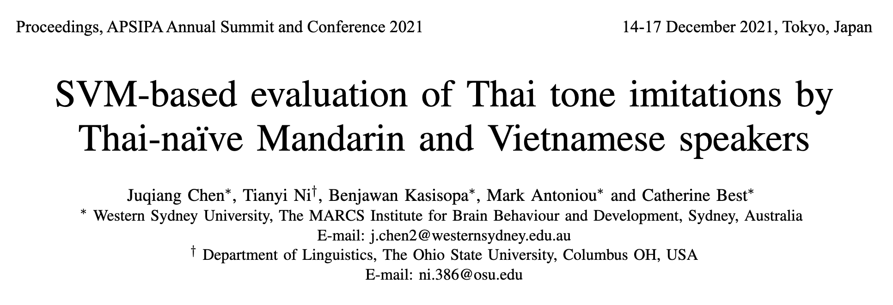

### 研究背景 {-}

### 研究问题及假设 {-}

### 研究方法 {-}

#### 数据收集 {-}

#### 数据处理 

```{r eval=F, echo=T}
library(tidyverse)

dir.interim = "data/interim/"
dir.processed = "data/processed/"

# Thai data

# prosody pro with discrete measures
# thai_all <- read.delim(paste(dir.interim,
#                              "Thai_all/thai_all.means",
#                              sep = ""), 
#                        stringsAsFactors=FALSE)

# contour_data_all = read.csv(paste(dir.processed, 
#                                   paste("contour_data_all",
#                                         "2020-08-02",
#                                         "csv",
#                                         sep = "."),
#                                   sep = ""))

# thai_mean = thai_all %>%
#   filter(., rowLabel != "silence")%>%
#   mutate(language = "Thai",
#          tone = str_extract(rowLabel, "[0-9]{2,3}"),
#          informant = str_extract(rowLabel, "(F|M)[1-8]"),
#          token = str_extract(rowLabel, "[1-6]{1}$"),
#          syllable = str_extract(rowLabel, "m[a,i]"))
# 
# # duration
# 
# duration_thai = thai_mean%>%
#   select(language, tone, informant, token, syllable, duration)

# f0 normtime data
# df.thai.f0 <- read.delim("data/processed/Thai_all/thai_all.normtimef0", 
#                        stringsAsFactors=FALSE)

df.thai.f0 = read.delim(paste(dir.interim,
                        "Thai_all/thai_all.normtimef0",
                        sep = ""), 
                        stringsAsFactors=FALSE)

# df.thai.f0.new <- read.delim("data/processed/Thai_new/thai_new.normtimef0", 
#                          stringsAsFactors=FALSE)

df.thai.f0.new = read.delim(paste(dir.interim,
                            "Thai_new/thai_new.normtimef0",
                            sep = ""), 
                            stringsAsFactors=FALSE)

f0.thai = df.thai.f0%>%
  filter(., rowLabel != "silence")%>%
  group_by(rowLabel)%>%
  mutate(language = "Thai",
         tone = str_extract(rowLabel, "[0-9]{2,3}"),
         informant = str_extract(rowLabel, "(F|M)[1-8]"),
         token = str_extract(rowLabel, "[1-6]{1}$"),
         syllable = str_extract(rowLabel, "m[a,i]"),
         timepoint = 1:n())

f0.thai.new = df.thai.f0.new%>%
  filter(., rowLabel != "silence_mono")%>%
  group_by(rowLabel)%>%
  mutate(language = "Thai",
         tone = str_extract(rowLabel, "[i,a,u,r][0-9]{1}[-,_]"),
         informant = paste(str_extract(rowLabel, "(F|M)[1-9]"),"b", sep = ""),
         token = str_extract(rowLabel, "-[1-6]{1}"),
         syllable = str_extract(rowLabel, "[m,n][a,i,u]"),
         timepoint = 1:n())%>%
  mutate(tone = str_extract(tone, "[0-9]{1}[-,_]"),
    tone = recode(tone, "0-" = "33", "1-"="21",
                       "2-" = "241", "3-"= "45","4-"="315", "0_" = "33", "1_"="21",
                       "2_" = "241", "3_"= "45","4_"="315"),
         token = str_extract(token, "[1-9]{1}"))%>%
  filter(!is.na(tone))%>%
  filter(tone != "5-")

# unique(f0.thai.new$tone)

f0.thai.all = rbind(f0.thai, f0.thai.new)

#unique(f0.thai.all$tone)

f0.thai.8points = f0.thai.all %>%
  # select 8 points first 
  filter(timepoint >1 & timepoint < 10) %>%
  group_by(informant)%>%
  #normalisation
  mutate(normF0 = (F0 - mean(F0))/sqrt(sum(F0^2)/length(F0)))%>%
  select(language, tone, informant, token, syllable, timepoint, normF0)


#onset/offset data

onset.thai = f0.thai.8points%>%
  filter(timepoint == 2)%>%
  rename(onset = normF0)%>%
  select(language, tone, informant, token, syllable, onset)

offset.thai = f0.thai.8points%>%
  filter(timepoint == 9)%>%
  rename(offset = normF0)%>%
  select(language, tone, informant, token, syllable, offset)

#re-calculating data from 10-90%
meanf0.thai = f0.thai.8points%>%
  group_by(language, tone, informant, token, syllable)%>%
  summarise(f0mean =mean(normF0))

excursion.thai = f0.thai.8points%>%
  group_by(language, tone, informant, token, syllable)%>%
  summarise(excursion = max(normF0)-min(normF0))

maxloc.thai = f0.thai.8points%>%
  group_by(language, tone, informant, token, syllable)%>%
  summarise(maxloc = which.max(normF0)/8)


thai.discrete = onset.thai%>%
  left_join(offset.thai, by = c ("language", "tone", "informant", "token", "syllable"))%>%
  left_join(meanf0.thai, by = c ("language", "tone", "informant", "token", "syllable"))%>%
  left_join(excursion.thai, by = c ("language", "tone", "informant", "token", "syllable"))%>%
  left_join(maxloc.thai, by = c ("language", "tone", "informant", "token", "syllable"))

# output thai data
write.csv(thai.discrete,  
          file = paste(dir.processed, 
                       paste("thai.discrete",
                             Sys.Date(),
                             "csv",
                             sep = "."),
                       sep = "") ,row.names = FALSE)


##### md and sv ###########


# mandarin and sv data

md.f0.8point <- read_csv(paste(dir.interim,
                               paste("f0.md.10pnt",
                               "2020-12-29",
                               "csv",
                               sep = "."),
                               sep = ""))%>%
              group_by(subject)%>%
              # select timepoint
              filter(timepoint>1 & timepoint < 10)%>%
              mutate(F0norm = (F0 - mean(F0))/sqrt(sum(F0^2)/length(F0)),
                      language = "md")%>%
            group_by(bundle, id)%>%
            mutate(timepoint = 1:n())%>% # recode timepoint
            select("language","subject","F0","isi","id","tone","speaker",
         "vowel_vari","syllable", "token",
         "timepoint","F0norm","bundle","cgload","informant")%>%
                select(language, informant = subject, isi, id, tone, 
                       speaker, vowel_vari, syllable, token, timepoint, 
                       normF0 = F0norm, session = bundle)

sv.f0.8point <-  read_csv(paste(dir.interim,
                                paste("f0.sv.10pnt",
                                        "2020-12-29",
                                          "csv",
                                        sep = "."),
                                        sep = ""))%>%
                         group_by(subject)%>%
                          # select timepoint
                       filter(timepoint>1 & timepoint < 10)%>%
             mutate(F0norm = (F0 - mean(F0))/sqrt(sum(F0^2)/length(F0)),
                    language = "sv")%>%
              group_by(bundle, id)%>%
              mutate(timepoint = 1:n())%>% # recode timepoint
            select("language","subject","F0","isi","id","tone","speaker",
         "vowel_vari","syllable", "token",
         "timepoint","F0norm","bundle","cgload","informant")%>%
          select(language, informant = subject, isi, id, tone, 
                  speaker, vowel_vari, syllable, token, timepoint, 
                  normF0 = F0norm, session = bundle)

# ds_md_discrete <- read_csv("data/processed/ds_md_discrete.csv")
# 
# ds_sv_discrete <- read_csv("data/processed/ds_sv_discrete.csv")

md.sv.f0.8points = rbind(md.f0.8point, sv.f0.8point)
  

# duration
# duration_md = ds_md_dur%>%
#   mutate(language = "md")%>%
#   select(language, informant = subject, isi, id, tone, speaker, vowel_vari, syllable, token,
#          session = bundle, duration)
# 
# duration_sv = ds_sv_dur%>%
#   mutate(language = "sv")%>%
#   select(language, informant = subject, isi, id, tone, speaker, vowel_vari, syllable, token,
#          session = bundle, duration)
# 
# duration_all = rbind(duration_md, duration_sv)


# both mandarin and sv data
onset_all = md.sv.f0.8points%>%
  # this dataset has only 8 point
  filter(timepoint == 1)%>%
  rename(onset = normF0)%>%
  select(tone, language, session, id, isi, speaker, vowel_vari,informant, 
         token, syllable, onset)


offset_all = md.sv.f0.8points%>%
  filter(timepoint == 8)%>%
  rename(offset = normF0)%>%
  select(tone, language, session, id, isi, speaker, vowel_vari,informant, 
         token, syllable, offset)

#re-calculating data from 10-90%
meanf0_all = md.sv.f0.8points%>%
  group_by(tone, language, session,id,isi, speaker, vowel_vari,informant, 
           token, syllable)%>%
  summarise(f0mean = mean(normF0))

excursion_all = md.sv.f0.8points%>%
  group_by(tone, language, session,id,isi, speaker, vowel_vari,informant, 
           token, syllable)%>%
  summarise(excursion = max(normF0)-min(normF0))

maxloc_all = md.sv.f0.8points%>%
  group_by(tone, language, session,id,isi, speaker, vowel_vari,informant, 
           token, syllable)%>%
  summarise(maxloc = which.max(normF0)/8)

md.sv.discrete = onset_all%>%
  left_join(offset_all, by = c ("tone", "language", "session","id","isi", "speaker", "vowel_vari","informant", 
                               "token", "syllable"))%>%
  left_join(meanf0_all, by = c ("tone", "language", "session","id","isi", "speaker", "vowel_vari","informant", 
                               "token", "syllable"))%>%
  left_join(excursion_all, by = c ("tone", "language", "session","id","isi", "speaker", "vowel_vari","informant", 
                                  "token", "syllable"))%>%
  left_join(maxloc_all, by = c ("tone", "language", "session","id","isi", "speaker", "vowel_vari","informant", 
                               "token", "syllable"))


# output thai data
write.csv(md.sv.discrete,  
          file = paste(dir.processed, 
                       paste("md.sv.discrete",
                             Sys.Date(),
                             "csv",
                             sep = "."),
                       sep = "") ,row.names = FALSE)

```

### 研究结果  {-}

#### 数据建模 {-}

```{r eval=F, echo=T}

library(tidymodels)
# calculate confidence intervals
library(rcompanion)

dir.interim = "data/interim/"
dir.processed = "data/processed/"

## 机器学习

# Thai data
# 2020-11-30 first remove 2 point and normalise
# 2020-12-29
thai.discrete = read.csv(paste(dir.processed, 
                       paste("thai.discrete",
                             "2020-11-30",
                             "csv",
                             sep = "."),
                       sep = ""))
### split the dataset ####
set.seed(123)
# thai.discrete
# 
# table(thai.test$tone)
# table(thai.train$tone)
# unique(thai.discrete$informant)
# length(unique(thai.discrete$informant))

thai.split = thai.discrete%>%
             mutate(tone = as.factor(tone))%>%
             # feature selection
             select(c(2,6,7,8,9,10))%>%
             initial_split(., prob = 0.70, 
                           # for each tone group
                              strata = tone)

thai.test = testing(thai.split)

thai.train = training(thai.split)

# thai.rcp = recipe(tone ~  .,
#                   data = thai.train)%>%
#            step_normalize(all_numeric()) 
# 
# # # preprocessed data
#    preprocessed <- thai.rcp %>%
#    # apply the recipe to the training data
#   prep(thai.train) %>%
# #   # extract the pre-processed training dataset
#   juice()
#  preprocessed

# fit the model
# Using the non-formula method with train will 
# pass the factor predictors to randomForest and everything will work.
# randomforest
rf_model = rand_forest(trees = 500, mode = "classification") %>%
  # specify that the `mtry` parameter needs to be tuned
  # set_args(mtry = tune()) %>%
  # select the engine/package that underlies the model
  # set_engine("randomForest", importance = "impurity") %>%
  set_engine("randomForest") %>%
  fit(tone ~ onset + offset + f0mean + excursion + maxloc, 
      data = training(thai.split))

#svm model
svm_model = svm_poly() %>% 
  set_engine("kernlab") %>% 
  set_mode("classification") %>%
  fit(tone ~ onset + offset + f0mean + excursion + maxloc, 
      data = training(thai.split))

#lda model
library(discrim)

lda_model = discrim_linear() %>% 
  set_engine("MASS") %>% 
  set_mode("classification") %>%
  fit(tone ~ onset + offset + f0mean + excursion + maxloc, 
      data = training(thai.split))
  

# build the workflow

# rf_workflow <- workflow() %>%
#   # add the recipe
#   add_recipe(thai.rcp) %>%
#   # add the model
#   add_model(rf_model)

##### Tune the parameters (optional)#########

# create CV object from training data
thai_cv <- vfold_cv(thai.train)

# specify which values eant to try
rf_grid <- expand.grid(mtry = c(3, 4, 5))

# extract results
rf_tune_results <- rf_workflow %>%
  tune_grid(resamples = thai_cv, #CV object
            grid = rf_grid, # grid of values to try
            metrics = metric_set(accuracy, roc_auc) # metrics we care about
            )

# print results
rf_tune_results %>%
  collect_metrics()

# extract the best value for the accuracy metric 
param_final <- rf_tune_results %>%
  select_best(metric = "accuracy")
param_final

# add this parameter to the workflow
rf_workflow <- rf_workflow %>%
  finalize_workflow(param_final)


####### make the prediction ############

# thai.rf.fit <- rf_workflow %>%
#   # fit on the training set and evaluate on test set
#   last_fit(thai.split)

#predict(rf_model, testing(thai.split)) 

rf_model %>%
  predict(testing(thai.split)) %>%
  bind_cols(thai.test) %>%
  glimpse()

# model validation
rf_model %>%
  predict(testing(thai.split)) %>%
  bind_cols(thai.test) %>%
  metrics(truth = tone, estimate = .pred_class)

# plot gain curve
rf_model %>%
  predict(testing(thai.split), type = "prob") %>%
  bind_cols(thai.test) %>%
  gain_curve(tone, .pred_21: .pred_45) %>%
  autoplot()

# plot roc curve
rf_model %>%
  predict(testing(thai.split), type = "prob") %>%
  bind_cols(thai.test) %>%
  roc_curve(tone, .pred_21: .pred_45) %>%
  autoplot()

library(randomForest)
rf.thai.fit = rf_model$fit

importance(rf_model$fit) 

varImpPlot(rf_model$fit, 
           n.var= 5,
           main = "Variable importance in classifying Thai tones")

## predicting with svm
svm_model %>%
  predict(testing(thai.split)) %>%
  bind_cols(thai.test) %>%
  metrics(truth = tone, estimate = .pred_class)


# plot gain curve
svm_model %>%
  predict(testing(thai.split), type = "prob") %>%
  bind_cols(thai.test) %>%
  gain_curve(tone, .pred_21: .pred_45) %>%
  autoplot()


# linear discriminat analysis
lda_model%>%
  predict(testing(thai.split)) %>%
  bind_cols(thai.test) %>%
  metrics(truth = tone, estimate = .pred_class)

#############################
#### confusion matrices #####
#############################

rf.cfm = rf_model %>%
  predict(testing(thai.split)) %>%
  bind_cols(thai.test)%>%
  group_by(.pred_class, tone)%>%
  summarise(n = n())%>%
  group_by(tone)%>%
  mutate(percent = n/sum(n),
         sum = sum(n),
         text.color = (.pred_class == tone))

# planned for statistical comparision
 rf.thai.prob = rf_model %>%
   predict(testing(thai.split), type = "prob") %>%
   bind_cols(thai.test)%>%
  gather(prediction, prob, 1: 5)%>%
   mutate(prediction = stringr::str_extract(prediction, "[0-9]{2}"),
         tone = as.character(tone),
         mdl = "rf")%>%
   filter(tone == prediction)
  
  
rf.thai.plt = rf.cfm%>%
  ggplot(aes(.pred_class, tone))+
  geom_tile(aes(fill = percent*100 ))+
  geom_text(aes(label = round(percent*100, 1), 
                color = text.color), 
            size = 4) +
  scale_colour_manual(values=c("black", "white"))+
  scale_x_discrete(name = "Model classifications as each Thai tone",
                   limits=c("21","33","45","315","241"))+
  scale_y_discrete(name = "Thai tones",
                   limits=c("21","33","45","315","241"))+
  ggtitle("Random Forest") + 
  #scale_fill_discrete(name="Percentage (%)")+
  scale_fill_gradient(name="%",low = "white", high = "black") +
  theme(axis.text.x = element_text(face="bold", size=8),
        axis.title.x = element_text(face="bold", size=10),
        #axis.title.y = element_text(face="bold", size=10),
        axis.title.y = element_blank(),
        #axis.text.y = element_text(face="bold", size=8),
        axis.text.y = element_blank(),
        axis.ticks.y = element_blank(),
        axis.ticks.x = element_blank(),
        legend.position="none",
        panel.background = element_blank())
  


svm.cfm = svm_model %>%
  predict(testing(thai.split)) %>%
  bind_cols(thai.test)%>%
  group_by(.pred_class, tone)%>%
  summarise(n = n())%>%
  group_by(tone)%>%
  mutate(percent = n/sum(n),
         sum = sum(n),
         text.color = (.pred_class == tone))

 svm.thai.prob = svm_model %>%
   predict(testing(thai.split), type = "prob") %>%
   bind_cols(thai.test)%>%
   gather(prediction, prob, 1: 5)%>%
    mutate(prediction = stringr::str_extract(prediction, "[0-9]{2}"),
       tone = as.character(tone),
       mdl = "svm")%>%
    filter(tone == prediction)
  
svm.thai.plt=svm.cfm%>%
  ggplot(aes(.pred_class, tone))+
  geom_tile(aes(fill = percent*100 ))+
  geom_text(aes(label = round(percent*100, 1),color = text.color), 
            size = 4) +
  scale_colour_manual(values=c("black", "white"))+
  scale_x_discrete(name = "     ",
                   limits=c("21","33","45","315","241"))+
  scale_y_discrete(name = "Thai tones",
                   limits=c("21","33","45","315","241"))+
  ggtitle("Support Vector Machine") + 
  #scale_fill_discrete(name="Percentage (%)")+
  scale_fill_gradient(name=" ",
                      limits = c(0,100),
                      low = "white", high = "black") +
  theme(axis.text.x = element_text(face="bold", 
                                   size=8),
        axis.title.y = element_blank(),
        axis.title.x = element_text(face="bold", 
                                   size=10),
        #axis.title.y = element_blank(),
        axis.text.y = element_blank(),
        axis.ticks = element_blank(),
        #legend.position="none",
        panel.background = element_blank())+
  # remove the legend for color
  guides(color = FALSE)


lda.cfm = lda_model %>%
  predict(testing(thai.split)) %>%
  bind_cols(thai.test)%>%
  group_by(.pred_class, tone)%>%
  summarise(n = n())%>%
  group_by(tone)%>%
  mutate(percent = n/sum(n),
         sum = sum(n),
         text.color = (.pred_class == tone))

lda.thai.plt = lda.cfm%>%
  ggplot(aes(.pred_class, tone))+
  geom_tile(aes(fill = percent*100 ))+
  geom_text(aes(label = round(percent*100, 1), color = text.color), size = 4) +
  scale_x_discrete(name = "",
                   limits=c("21","33","45","315","241"))+
  scale_y_discrete(name = "Thai tone stimuli",
                   limits=c("21","33","45","315","241"))+
  scale_colour_manual(values=c("black", "white"))+
  ggtitle("Linear Discriminant Analysis") + 
  #scale_fill_discrete(name="Percentage (%)")+
  scale_fill_gradient(name=" ",
                      limits = c(0,100),
                      low = "white", high = "black") +
  theme(axis.text.x = element_text(face="bold", size=8),
        axis.title.x = element_text(face="bold", size=10),
        axis.text.y = element_text(face="bold", size=8),
        axis.title.y = element_text(face="bold", size=10),
        #axis.title.y = element_text(face="bold", size=10),
        #axis.title.x = element_blank(),
        #axis.title.y = element_blank(),
        #axis.text.y = element_blank(),
        #axis.ticks = element_blank(),
        legend.position="none",
        panel.background = element_blank())
  # remove the legend for color
  #guides(color = FALSE)


#lda probability
lda.thai.prob = lda_model %>%
  predict(testing(thai.split), type = "prob") %>%
  bind_cols(thai.test)%>%
  gather(prediction, prob, 1: 5)%>%
  mutate(prediction = stringr::str_extract(prediction, "[0-9]{2}"),
         tone = as.character(tone),
         mdl = "lda")%>%
  filter(tone == prediction)

# compare three models
thai.mdl.three = rbind(rf.thai.prob, svm.thai.prob, lda.thai.prob)

thai.three.mdl = lm(prob ~ tone*mdl, data = thai.mdl.three )

anova(thai.three.mdl)
lsmeans(thai.three.mdl,
        pairwise ~ mdl,
        adjust="tukey")  


library(cowplot)
thai.ml.plt = plot_grid(lda.thai.plt,rf.thai.plt, svm.thai.plt,  nrow = 1,
          labels = c('', '',""), label_size = 0,
          rel_widths = c(1.1, 1, 1.2))

png(paste(dir.processed, paste("thai.ml.plt ",Sys.Date(),"png",sep = "."), sep = ""),
    units="in", width=9, height=3, res=600)

plot(thai.ml.plt )

dev.off()

###### mandarin and vietnamese imitation data #######
# 2020-11-30 old version that first normalising and removing
# 2020-12-29 first removing and normalising
md.sv.discrete = read.csv(paste(dir.processed, 
                               paste("md.sv.discrete",
                                     "2020-12-29",
                                     "csv",
                                     sep = "."),
                               sep = ""))%>%
                mutate(tone = as.factor(tone))

# predicting imitation data
rf_model %>%
  predict(md.sv.discrete) %>%
  bind_cols(md.sv.discrete) %>%
  metrics(truth = tone, estimate = .pred_class)

labels <- c(md = "Mandarin imitators", sv = "Vietnamese imitators")


rf.imit.plt = rf_model %>%
  predict(md.sv.discrete) %>%
  bind_cols(md.sv.discrete)%>%
  group_by(.pred_class, language, tone)%>%
  summarise(n = n())%>%
  group_by(language,tone)%>%
  mutate(percent = n/sum(n),
         sum = sum(n),
         text.color = (.pred_class == tone))%>%
  ggplot(aes(.pred_class, tone))+
  geom_tile(aes(fill = percent*100 ))+
  geom_text(aes(label = round(percent*100, 1), color = text.color), 
            size = 4) +
  scale_x_discrete(name = "Model classifications as each Thai tone",
                   limits=c("21","33","45","315","241"))+
  scale_y_discrete(name = "Thai tones",
                   limits=c("21","33","45","315","241"))+
  scale_colour_manual(values=c("black", "white"))+
  ggtitle("Random Forest") + 
  #scale_fill_discrete(name="Percentage (%)")+
  scale_fill_gradient(name="%",
                      low = "white", high = "black") +
  theme(axis.text.x = element_text(face="bold", size=10),
        #axis.text.y = element_text(face="bold", size=10),
        axis.title.y = element_blank(),
        axis.ticks = element_blank(),
        axis.title.x = element_text(face="bold", size=12),
        #axis.title.y = element_text(face="bold", size=12),
        axis.text.y = element_blank(),
        legend.position="none",
        panel.background = element_blank())+
  theme(plot.title = element_text(hjust = 0.5))+
  facet_wrap(~language, 
             nrow = 2,
             labeller=labeller(language = labels))+
  theme(strip.text.x = element_text(size=10,face="bold", color = "black"),
        strip.background = element_rect(fill="white"))


svm_model %>%
  predict(md.sv.discrete) %>%
  bind_cols(md.sv.discrete) %>%
  metrics(truth = tone, estimate = .pred_class)

svm.imit.plt = svm_model %>%
  predict(md.sv.discrete) %>%
  bind_cols(md.sv.discrete)%>%
  group_by(.pred_class, language, tone)%>%
  summarise(n = n())%>%
  group_by(language,tone)%>%
  mutate(percent = n/sum(n),
         sum = sum(n),
         text.color = (.pred_class == tone))%>%
  ggplot(aes(.pred_class, tone))+
  geom_tile(aes(fill = percent*100 ))+
  geom_text(aes(label = round(percent*100, 1), color = text.color), 
            size = 4) +
  scale_x_discrete(name = "    ",
                   limits=c("21","33","45","315","241"))+
  scale_y_discrete(name = "Thai tones",
                   limits=c("21","33","45","315","241"))+
  scale_colour_manual(values=c("black", "white"))+
  ggtitle("Support Vector Machine") + 
  #scale_fill_discrete(name="Percentage (%)")+
  scale_fill_gradient(name="    ",
                      limits = c(0,100),
                      low = "white", high = "black") +
  theme(#axis.text.x = element_blank(),
        axis.text.y = element_blank(),
        #axis.title.x = element_blank(),
        axis.title.y = element_blank(),
        axis.ticks = element_blank(),
        axis.text.x = element_text(face="bold", 
                                   size=10),
        axis.title.x = element_text(face="bold", 
                                   size=12),
        # legend.position="none",
        panel.background = element_blank())+
  theme(plot.title = element_text(hjust = 0.5))+
  facet_wrap(~language, 
             nrow = 2,
             labeller=labeller(language = labels))+
  # remove the legend for color
  guides(color = FALSE)+
  theme(strip.text.x = element_text(size= 10, face="bold", color = "white"),
        strip.background = element_rect(fill="white"))


lda_model %>%
  predict(md.sv.discrete) %>%
  bind_cols(md.sv.discrete) %>%
  metrics(truth = tone, estimate = .pred_class)

lda.imit.plt = lda_model %>%
  predict(md.sv.discrete) %>%
  bind_cols(md.sv.discrete)%>%
  group_by(.pred_class, language, tone)%>%
  summarise(n = n())%>%
  group_by(language,tone)%>%
  mutate(percent = n/sum(n),
         sum = sum(n),
         text.color = (.pred_class == tone))%>%
  ggplot(aes(.pred_class, tone))+
  geom_tile(aes(fill = percent*100 ))+
  geom_text(aes(label = round(percent*100, 1), color = text.color), 
            size = 4) +
  scale_x_discrete(name = "   ",
                   limits=c("21","33","45","315","241"))+
  scale_y_discrete(name = "Thai tone stimuli",
                   limits=c("21","33","45","315","241"))+
  scale_colour_manual(values=c("black", "white"))+
  ggtitle("Linear Discriminant Analysis") + 
  #scale_fill_discrete(name="Percentage (%)")+
  scale_fill_gradient(name="%",
                      low = "white", high = "black") +
  theme(#axis.text.x = element_blank(),
        #axis.text.y = element_blank(),
        #axis.title.x = element_blank(),
        #axis.title.y = element_blank(),
        axis.ticks = element_blank(),
        axis.text.y = element_text(face="bold", size=10),
        axis.text.x = element_text(face="bold", size=10),
        axis.title.y = element_text(face="bold", size=12),
        legend.position="none",
        panel.background = element_blank())+
  theme(plot.title = element_text(hjust = 0.5))+
  facet_wrap(~language, 
             nrow = 2,
             labeller=labeller(language = labels))+
  # remove the legend for color
  guides(color = FALSE)+
  theme(strip.text.x = element_text(size=10, face="bold", color = "white"),
        strip.background = element_rect(fill="white"))

imit.ml.plt = plot_grid(lda.imit.plt,rf.imit.plt, svm.imit.plt, nrow = 1,
                        ncol = 3,
                        labels = c('', '',""), label_size = 0,
                        rel_widths = c(1.2, 1, 1.2))

png(paste(dir.processed, paste("imit.ml.plt ",Sys.Date(),"png",sep = "."), sep = ""),
    units="in", width=11, height=6, res=600)

plot(imit.ml.plt )

dev.off()

#table

svm.imit.plt = svm_model %>%
  predict(md.sv.discrete) %>%
  bind_cols(md.sv.discrete)%>%
  group_by(.pred_class, language, tone)%>%
  summarise(n = n())%>%
  group_by(language,tone)%>%
  mutate(percent = n/sum(n),
         sum = sum(n))
```


```{r eval=F, echo=T}
## 检验不同组的差异
mandarin_test_mod = read.csv(paste(dir.processed, 
                                paste("mandarin_test_mod",
                                      "csv",
                                      sep = "."),
                                sep = ""))%>%
  mutate(tone = as.factor(tone))

vietnamese_test_mod = read.csv(paste(dir.processed, 
                                   paste("vietnamese_test_mod",
                                         "csv",
                                         sep = "."),
                                   sep = ""))%>%
  mutate(tone = as.factor(tone))

thai_native_test_mod = read.csv(paste(dir.processed, 
                                   paste("thai_native_test_mod",
                                         "csv",
                                         sep = "."),
                                   sep = ""))%>%
  mutate(tone = as.factor(tone))

thai_native_test_mod$prediction = as.factor(thai_native_test_mod$prediction)

thai.plt = thai_native_test_mod%>%
  group_by(prediction, tone)%>%
  summarise(n = n())%>%
  group_by(tone)%>%
  mutate(percent = n/sum(n),
         sum = sum(n),
         text.color = (prediction == tone))%>%
  ggplot(aes(prediction, tone))+
  geom_tile(aes(fill = percent*100))+
  geom_text(aes(label = round(percent*100, 1), color = text.color), 
            size = 4) +
  scale_x_discrete(name = "Model classifications as each Thai tone",
                   limits=c("21","33","45","315","241"))+
  scale_y_discrete(name = "Thai tones",
                   limits=c("21","33","45","315","241"))+
  scale_colour_manual(values=c("black", "white"))+
  #ggtitle("") + 
  scale_fill_discrete(name="Percentage (%)")+
  scale_fill_gradient(name="%",
                      low = "white", high = "black") +
  theme(axis.text.x = element_text(face="bold", size=10),
        axis.text.y = element_text(face="bold", size=10),
        #axis.title.y = element_blank(),
        axis.ticks = element_blank(),
        axis.title.x = element_text(face="bold", size=12),
        axis.title.y = element_text(face="bold", size=12),
        #axis.text.y = element_blank(),
        #legend.position="none",
        panel.background = element_blank())+
  # theme(plot.title = element_text(hjust = 0.5))+
  # remove the legend for color
  guides(color = FALSE)+
  theme(strip.text.x = element_text(size=10,face="bold", color = "black"),
        strip.background = element_rect(fill="white"))

png(paste(dir.processed, paste("thai.plt",Sys.Date(),"png",sep = "."), sep = ""),
    units="in", width=4, height=3.5, res=600)

plot(thai.plt)

dev.off()


md.sv.df = mandarin_test_mod%>%
  bind_rows(vietnamese_test_mod)%>%
  gather(key = tone2, value = prob, T21, T33, T241, T315, T45)%>%
  mutate(prediction = paste("T", prediction,sep = "" ))%>%
  filter(prediction == tone2)


labels <- c(md = "Mandarin imitators", sv = "Vietnamese imitators")

md.sv.plt = md.sv.df %>%
  mutate(prediction= str_remove(prediction, "T"))%>%
  group_by(prediction, language, tone)%>%
  summarise(n = n())%>%
  group_by(language,tone)%>%
  mutate(percent = n/sum(n),
         sum = sum(n),
         text.color = (prediction == tone))%>%
  ggplot(aes(prediction, tone))+
  geom_tile(aes(fill = percent*100))+
  geom_text(aes(label = round(percent*100, 1), color = text.color), 
            size = 4) +
  scale_x_discrete(name = "Model classifications as each Thai tone",
                   limits=c("21","33","45","315","241"))+
  scale_y_discrete(name = "Thai tones",
                   limits=c("21","33","45","315","241"))+
  scale_colour_manual(values=c("black", "white"))+
  ggtitle("") + 
  scale_fill_discrete(name="Percentage (%)")+
  scale_fill_gradient(name="%",
                      low = "white", high = "black") +
  theme(axis.text.x = element_text(face="bold", size=10),
        axis.text.y = element_text(face="bold", size=10),
        #axis.title.y = element_blank(),
        axis.ticks = element_blank(),
        axis.title.x = element_text(face="bold", size=12),
        axis.title.y = element_text(face="bold", size=12),
        #axis.text.y = element_blank(),
        #legend.position="none",
        panel.background = element_blank())+
  theme(plot.title = element_text(hjust = 0.5))+
  facet_wrap(~language, 
             nrow = 1,
             labeller=labeller(language = labels))+
  # remove the legend for color
  guides(color = FALSE)+
  theme(strip.text.x = element_text(size=10,face="bold", color = "black"),
        strip.background = element_rect(fill="white"))

png(paste(dir.processed, paste("md.sv.plt",Sys.Date(),"png",sep = "."), sep = ""),
    units="in", width=6, height=3, res=600)

plot(md.sv.plt )

dev.off()

###################################################################
######################### model with probability ##################
###################################################################

library(lme4)
library(broom)
library(lsmeans)
library(lmerTest)
#library(car)
md.sv.mdl.data = md.sv.df%>%
  mutate(prediction= str_remove(prediction, "T"))%>%
  filter(prediction == tone)%>%
  mutate(prob = round(prob, 3))

md.sv.mdl.data$informant = as.factor(md.sv.mdl.data$informant)

imit.mdl = lmer(prob ~ language*isi*speaker*vowel_vari*tone +(1|informant), 
                   data = md.sv.mdl.data)

summary(imit.mdl)

# install.packages("lmerTest")

# too slow
# anova(imit.mdl, type = 2, ddf = "Kenward-Roger")

anova(imit.mdl)

options(scipen = 999) 

tone.main.df = as.data.frame(lsmeans(imit.mdl, pairwise ~ tone, 
                                     pbkrtest.limit = 7190)$contrast)

lsmeans(imit.mdl, pairwise ~ tone, 
        pbkrtest.limit = 7190)

groupwiseMean(prob ~ tone,
              data   = md.sv.mdl.data,
              conf   = 0.95,
              digits = 3)

write.csv(tone.main.df,  
          file = paste(dir.processed, 
                       paste("tone.main.df",
                             Sys.Date(),
                             "csv",
                             sep = "."),
                       sep = "") ,row.names = FALSE)

isi.talker.df = as.data.frame(lsmeans(imit.mdl, pairwise ~ isi:speaker, 
                                      pbkrtest.limit = 7190)$contrast)

groupwiseMean(prob ~ isi+speaker,
              data   = md.sv.mdl.data,
              conf   = 0.95,
              digits = 3)

write.csv(isi.talker.df,  
          file = paste(dir.processed, 
                       paste("isi.talker.df",
                             Sys.Date(),
                             "csv",
                             sep = "."),
                       sep = "") ,row.names = FALSE)

tone.lang.df = as.data.frame(lsmeans(imit.mdl, pairwise ~ tone:language, 
                                     pbkrtest.limit = 7190)$contrast)%>%
  separate(contrast, c("tone1","lang1","tone2","lang2"))%>%
  filter(tone1 == tone2 & lang1 != lang2)

groupwiseMean(prob ~ language + tone,
              data   = md.sv.mdl.data,
              conf   = 0.95,
              digits = 3)

write.csv(tone.lang.df,  
          file = paste(dir.processed, 
                       paste("tone.lang.df",
                             Sys.Date(),
                             "csv",
                             sep = "."),
                       sep = "") ,row.names = FALSE)

tone.speaker.df = as.data.frame(lsmeans(imit.mdl, pairwise ~ tone:speaker, 
                                        pbkrtest.limit = 7190)$contrast)%>%
  separate(contrast, c("tone1","lang1","tone2","lang2"))%>%
  filter(tone1 == tone2 & lang1 != lang2)

groupwiseMean(prob ~ speaker + tone,
              data   = md.sv.mdl.data,
              conf   = 0.95,
              digits = 3)

write.csv(tone.speaker.df ,  
          file = paste(dir.processed, 
                       paste("tone.speaker.df",
                             Sys.Date(),
                             "csv",
                             sep = "."),
                       sep = "") ,row.names = FALSE)

tone.isi.df = as.data.frame(lsmeans(imit.mdl, pairwise ~ tone:isi, 
                      pbkrtest.limit = 7190)$contrast)%>%
  separate(contrast, c("tone1","lang1","tone2","lang2"))%>%
  filter(tone1 == tone2 & lang1 != lang2)

lsmeans(imit.mdl, pairwise ~ tone:isi, 
        pbkrtest.limit = 7190)
groupwiseMean(prob ~ isi + tone,
              data   = md.sv.mdl.data,
              conf   = 0.95,
              digits = 3)

two.way = tone.lang.df%>%bind_rows(tone.isi.df)%>%bind_rows(tone.speaker.df)

write.csv(two.way,  
          file = paste(dir.processed, 
                       paste("two.way",
                             Sys.Date(),
                             "csv",
                             sep = "."),
                       sep = "") ,row.names = FALSE)

lang.vwl.isi.df = as.data.frame(lsmeans(imit.mdl, 
                                pairwise ~ language:vowel_vari:isi, 
                                    pbkrtest.limit = 7190)$contrast)


lang.isi.tone.df = as.data.frame(lsmeans(imit.mdl, 
                                        pairwise ~ language:isi:tone, 
                                        pbkrtest.limit = 7190)$contrast)%>%
  lang.isi.tone.df%>%
  separate(contrast, c("lang1","mem1","tone1","lang2","mem2","tone2"))%>%
  filter(tone1 == tone2 & lang1 != lang2)%>%
  filter(p.value < 0.05)
##############################################################################
####################### new model with percent choice ########################
##############################################################################

md.sv.mdl.data = md.sv.df%>%
  mutate(prediction= str_remove(prediction, "T"))%>%
  group_by(prediction, language, isi, speaker, vowel_vari, tone, informant)%>%
  summarise(n = n())%>%
  group_by(language, isi, speaker, vowel_vari, tone, informant)%>%
  mutate(percent = n/sum(n),
         sum = sum(n))%>%
  filter(prediction ==  tone)

md.sv.mdl.data$informant = as.factor(md.sv.mdl.data$informant)

imit.mdl = lmer(percent ~ language*isi*speaker*vowel_vari*tone +(1|informant), 
                data = md.sv.mdl.data)

summary(imit.mdl)

library(car)
imit.mdl.fixed = Anova(imit.mdl, test = "F")
colnames(imit.mdl.fixed) = c("F","DF","DF2","p")
filter(imit.mdl.fixed, p < 0.05)
# install.packages("lmerTest")
# anova(imit.mdl, type = 2, ddf = "Kenward-Roger")
# anova(imit.mdl)


tone.main.df = as.data.frame(lsmeans(imit.mdl, pairwise ~ tone, 
                                     pbkrtest.limit = 7190)$contrast)

groupwiseMean(percent ~ tone,
              data   = md.sv.mdl.data,
              conf   = 0.95,
              digits = 3)

write.csv(tone.main.df,  
          file = paste(dir.processed, 
                       paste("tone.main.df.percent",
                             Sys.Date(),
                             "csv",
                             sep = "."),
                       sep = "") ,row.names = FALSE)

# isi.talker.df = as.data.frame(lsmeans(imit.mdl, pairwise ~ isi:speaker, 
#                                       pbkrtest.limit = 7190)$contrast)
# 
# groupwiseMean(prob ~ isi+speaker,
#               data   = md.sv.mdl.data,
#               conf   = 0.95,
#               digits = 3)
# 
# write.csv(isi.talker.df,  
#           file = paste(dir.processed, 
#                        paste("isi.talker.df",
#                              Sys.Date(),
#                              "csv",
#                              sep = "."),
#                        sep = "") ,row.names = FALSE)

tone.lang.df = as.data.frame(lsmeans(imit.mdl, pairwise ~ tone:language, 
                                     pbkrtest.limit = 7190)$contrast)%>%
  separate(contrast, c("tone1","lang1","tone2","lang2"))%>%
  filter(tone1 == tone2 & lang1 != lang2)


groupwiseMean(percent ~ language + tone,
              data   = md.sv.mdl.data,
              conf   = 0.95,
              digits = 3)

write.csv(tone.lang.df,  
          file = paste(dir.processed, 
                       paste("tone.lang.df",
                             Sys.Date(),
                             "csv",
                             sep = "."),
                       sep = "") ,row.names = FALSE)

tone.speaker.df = as.data.frame(lsmeans(imit.mdl, pairwise ~ tone:speaker, 
                                        pbkrtest.limit = 7190)$contrast)%>%
  separate(contrast, c("tone1","lang1","tone2","lang2"))%>%
  filter(tone1 == tone2 & lang1 != lang2)

groupwiseMean(percent ~ speaker + tone,
              data   = md.sv.mdl.data,
              conf   = 0.95,
              digits = 3)

write.csv(tone.speaker.df ,  
          file = paste(dir.processed, 
                       paste("tone.speaker.df",
                             Sys.Date(),
                             "csv",
                             sep = "."),
                       sep = "") ,row.names = FALSE)

tone.isi.df = as.data.frame(lsmeans(imit.mdl, pairwise ~ tone:isi, 
                                    pbkrtest.limit = 7190)$contrast)%>%
  separate(contrast, c("tone1","lang1","tone2","lang2"))%>%
  filter(tone1 == tone2 & lang1 != lang2)

groupwiseMean(prob ~ isi + tone,
              data   = md.sv.mdl.data,
              conf   = 0.95,
              digits = 3)

two.way = tone.lang.df%>%bind_rows(tone.isi.df)%>%bind_rows(tone.speaker.df)

write.csv(two.way,  
          file = paste(dir.processed, 
                       paste("two.way",
                             Sys.Date(),
                             "csv",
                             sep = "."),
                       sep = "") ,row.names = FALSE)

lang.tone.isi.df = as.data.frame(lsmeans(imit.mdl, pairwise ~ language:isi:tone, 
                                    pbkrtest.limit = 7190)$contrast)%>%
  separate(contrast, c("l1","m1","t1","l2","m2","t2"))%>%
  filter(p.value < 0.05)
%>%
  filter(t1 == t2)


```


### 结论 {-}


<!--chapter:end:12-CH13-机器学习项目-V2.Rmd-->

# 机器学习项目案例

## 案例13.1 基于母语特征建模预测声调学习难点 {-}


```{r echo=FALSE, include=FALSE}

library(tidyverse)
# install.packages('e1071')

library(e1071)
setwd("~/Nutstore Files/310_Tutorial/LanguageDS-e")

library(cowplot)
```

### 研究背景 {-}

### 研究问题及假设 {-}

### 研究方法 {-}

#### 数据收集 {-}

#### 数据处理 {-}


### 研究结果  {-}

#### 数据建模 {-}

```{r eval=F, echo=T}

# import data
md_discrete = read.csv("data/ch13/md_discrete.csv")

# Selecting features
dataset_md = md_discrete[ , c(3, 4:9)]

# scale the data
dataset_md[,-1] = scale(dataset_md[-1])

dataset_md$tone = as.factor(dataset_md$tone)
# Fitting classifier
# model based on discrete features
svm_md = svm(formula = tone ~ .,
               data = dataset_md,
               type = 'C-classification',#regression or classification
               kernel = 'radial',
               cost = "2",
               cross = 10)

# total accuracy
# summary(svm_md)
svm_md$tot.accuracy


```


```{r eval=F, echo=T}
# producing confusion matrix
prediction_md <- predict(svm_md, dataset_md)

md_confusion = data.frame(pred = prediction_md, tone = md_discrete$tone)

md_confusion_table = md_confusion%>%
  group_by(tone,pred)%>%
  summarize(n = n())%>%
  group_by(tone)%>%
  mutate(sum = sum(n),
         percent = round((n/sum)*100,2))%>%
  select(tone,pred,percent)%>%
  spread(tone, percent)
md_confusion_table

# write.csv(md_confusion_table, 
#           file ="data/processed/md_confusion_table.csv", 
#           row.names = FALSE)

md_plot = md_confusion%>%
  group_by(pred, tone)%>%
  summarise(n = n())%>%
  group_by(tone)%>%
  mutate(percent = n/sum(n),
         sum = sum(n))%>%
  ggplot(aes(pred, tone))+
  geom_tile(aes(fill = percent*100 ))+
  geom_text(aes(label = round(percent*100, 1)), size = 4) +
  scale_x_discrete(name = "Predictions",
                   limits=c("M55","M35","M214","M51"),
                   labels=c("M55","M35","M214","M51"))+
  scale_y_discrete(name = "Mandarin tones",
                   limits=c("M55","M35","M214","M51"),
                   labels=c("M55","M35","M214","M51"))+
  scale_fill_gradient(name="Percentage (%)",
                      low = "white", high = "blue") +
  theme(axis.text.x = element_text(face="bold", 
                                   size=10),
        axis.text.y = element_text(face="bold", 
                                   size=10),
        panel.background = element_blank())

 md_plot
# Print this our for publication
# png("figure4.png", units="in", width=5, height=4, res=600)
# md_plot
# dev.off()

```

```{r eval=F, echo=T}

## 模拟普通话听者感知泰语声调
# 泰语数据
thai_discrete = read.csv("data/ch13/thai_discrete.csv")

# Selecting features
dataset_thai = thai_discrete[ , c(2, 6:11)]

# scale the data
dataset_thai[,-1] = scale(dataset_thai[-1])


prediction_md_thai <- predict(svm_md, dataset_thai)
 
table( prediction_md_thai, thai_discrete$tone)

# SVM assimilation table
md.svm.assim = data.frame(pred =  prediction_md_thai, 
            tone = thai_discrete$tone)%>%
   group_by(pred, tone)%>%
   summarise(n = n())%>%
   group_by(tone)%>%
   mutate(percent = round((n/sum(n)),3)*100,
          sum = sum(n))
 
md.svm.assim$pred = factor(md.svm.assim$pred, c("M55","M35","M214","M51"))
 
md.svm.assim$tone = factor(md.svm.assim$tone,c("45","33","21","315","241"))
 

# Stacked barplot 
  
md.svm.assim.stacked = ggplot(md.svm.assim, 
                 aes(fill=pred, y=percent, x=tone, label = percent)) + 
   geom_bar( stat="identity")+
   scale_fill_manual(
     values=c("M55" = "black", "M35"="gray25",
              "M214"="gray75", "M51"="white"), 
     name="Mandarin",
     breaks=c("M55", "M35", "M214","M51"),
     labels=c("M55", "M35", "M214","M51"))+
   geom_bar(colour="black", stat="identity")+
   xlab("Thai tones")+
   ylab("Mandarin responses(%)") +
   scale_y_continuous(expand = c(0, 0), limits = c(0, 101))+
   theme_classic()+
   theme(legend.title = element_text(size=12, face="bold"))+
   theme(legend.text = element_text(size = 12, face = "bold"))+
   theme(axis.text.x = element_text(face="bold", size=10))+
    scale_x_discrete(breaks = c("45", "33", "21","315","241"),
                   labels=c("T45", "T33", "T21","T315","T241"))+
  geom_text(size = 4, position = position_stack(vjust = 0.5),color="blue")

md.svm.assim.stacked 
 
# png("figure/md.svm.assim.stacked .png", 
#      units="in", width=5, height=4, res=600)
# md.svm.assim.stacked 
# dev.off()
 
# heat map 
md.svm.assim.heat = md.svm.assim%>%
   filter(percent>10)%>%
   ggplot(aes(tone, pred))+
   geom_tile(aes(fill = percent ))+
   geom_text(aes(label = percent)) +
   scale_x_discrete(name = "Thai stimuli",
                    limits=c("45","33","21","315","241"),
                    labels=c("T45","T33","T21","T315","T241"))+
   scale_y_discrete(name = "Predicted responses",
                    limits=c("M51","M214","M35","M55"),
                    labels=c("M51","M214","M35","M55"))+
   scale_fill_gradient(name="Percentage (%)",
                       low = "white", high = "gray") +
   theme(axis.text.x = element_text(face="bold", 
                                    size=10),
         axis.text.y = element_text(face="bold", 
                                    size=10),
         panel.background = element_blank())+
  theme(legend.position="none")

md.svm.assim.heat

```


```{r eval=F, echo=T}
final.cm = read.csv(file = "data/ch13/final.cm.csv")

final.cm$stimuli = as.factor(final.cm$stimuli)

md.human.assim.heat = final.cm%>%
  group_by(stimuli, response)%>%
  filter(subject !="106")%>%
  summarise(cat.mean = round ((sum(percentage)/12)*100, 1))%>%
  filter(cat.mean >10)%>%
  ggplot(aes(stimuli, response))+
  geom_tile(aes(fill = cat.mean ))+
  geom_text(aes(label = cat.mean)) +
  scale_x_discrete(name = "Thai stimuli",
                   limits=c("45","33","21","315","241"),
                   labels=c("T45","T33","T21","T315","T241"))+
  scale_y_discrete(name = "Mandarin listeners' responses",
                   limits=c("M51","M214","M35","M55"),
                   labels=c("M51","M214","M35","M55"))+
  scale_fill_gradient(name="Percentage (%)",
                      low = "white", high = "gray") +
  theme(axis.text.x = element_text(face="bold", 
                                   size=10),
        axis.text.y = element_text(face="bold", 
                                   size=10),
        panel.background = element_blank())
md.human.assim.heat


md_compare = plot_grid(md.svm.assim.heat, md.human.assim.heat,  
          nrow=1, labels=c('A', 'B'),
          rel_widths = c(1, 1.4)
          ) #Or labels="AUTO"

md_compare

 # png("md_compare.png", units="in", width=8, height=3, res=600)
 # md_compare
 # dev.off()

```


```{r eval=F, echo=T}
## 训练泰语母语者声调模型
# # import data
# thai_discrete = read.csv("data/ch13/thai_discrete.csv")
# 
# # Selecting features
# dataset_thai = thai_discrete[ , c(2, 6:11)]
# 
# # scale the data
# dataset_thai[,-1] = scale(dataset_thai[-1])


# Fitting classifier
# model based on discrete features
svm_thai = svm(formula = tone ~ .,
               data = dataset_thai,
               type = 'C-classification',#regression or classification
               kernel = 'radial',
               cost = "2",
               cross = 10)
# total accuracy
# summary(svm_thai)
svm_thai$tot.accuracy

```

检测泰语母语者声调模型的正确率。

```{r eval=F, echo=T}
# 泰语模型不同声调准确率
prediction <- predict(svm_thai, dataset_thai)

thai_confusion = data.frame(pred = prediction, tone = thai_discrete$tone)

thai_confusion_table = thai_confusion%>%
  group_by(tone,pred)%>%
  summarize(n = n())%>%
  group_by(tone)%>%
  mutate(sum = sum(n),
         percent = round((n/sum)*100,2))%>%
  select(tone,pred,percent)%>%
  spread(tone, percent)
thai_confusion$tone = as.factor(thai_confusion$tone)

# write.csv(thai_confusion_table, 
#           file = "data/processed/thai_confusion_table ", 
#           row.names = FALSE)

thai_plot = thai_confusion%>%
  group_by(pred, tone)%>%
  summarise(n = n())%>%
  group_by(tone)%>%
  mutate(percent = n/sum(n),
         sum = sum(n))%>%
  ggplot(aes(pred, tone))+
  geom_tile(aes(fill = percent*100 ))+
  geom_text(aes(label = round(percent*100, 1)), size = 4)+
  scale_x_discrete(name = "Predictions",
                   limits=c("21","33","45","315","241"),
                   labels=c("T21", "T33", "T45","T315","T241"))+
  scale_y_discrete(name = "Thai tones",
                   limits=c("21","33","45","315","241"),
                   labels=c("T21", "T33", "T45","T315","T241"))+
  scale_fill_gradient(name="Percentage (%)",
                      low = "white", high = "red") +
  theme(axis.text.x = element_text(face="bold", 
                                   size=10),
        axis.text.y = element_text(face="bold", 
                                   size=10),
        panel.background = element_blank())

thai_plot
# Print this our for publication
# png("thai_tones.png", units="in", width=5, height=4, res=600)
# thai_plot
# dev.off()


```


```{r eval=F, echo=T}
## 模拟泰语母语听者感知普通话声调

prediction_thai_md <- predict(svm_thai, dataset_md)

table(prediction_thai_md, md_discrete$tone)

# set the order of thai tones
thai.svm.assim = data.frame(pred = prediction_thai_md, 
               tone = md_discrete$tone)%>%
  group_by(pred, tone)%>%
  summarise(n = n())%>%
  group_by(tone)%>%
  mutate(percent = round((n/sum(n)),3)*100,
         sum = sum(n))
thai.svm.assim$tone = factor(thai.svm.assim$tone, 
                             c("M55","M35","M214","M51"))

thai.svm.assim$pred = factor(thai.svm.assim$pred,
                             c("45","33","21","315","241"))

thai.svm.assim.stacked = ggplot(thai.svm.assim,
                 aes(fill=pred, y=percent, x=tone, label = percent)) + 
  geom_bar( stat="identity")+
  scale_fill_manual(
    values=c("45" = "black", "33"="gray25", "21"="gray50",
             "315"="gray75", "241"="white"), 
    name="Thai",
    breaks=c("45", "33", "21","315","241"),
    labels=c("T45", "T33", "T21","T315","T241"))+
  geom_bar(colour="black", stat="identity")+
  xlab("Mandarin tones")+
  ylab("Thai responses(%)") +
  scale_y_continuous(expand = c(0, 0), limits = c(0, 100))+
  theme_classic()+
  theme(legend.title = element_text(size=12, face="bold"))+
  theme(legend.text = element_text(size = 12, face = "bold"))+
  theme(axis.text.x = element_text(face="bold", size=10))+
  scale_x_discrete(breaks = c("M55", "M35", "M214","M51"),
                   labels=c("M55", "M35", "M214","M51"))+
  geom_text(size = 4, position = position_stack(vjust = 0.5),color="blue")


# Print this our for publication

# png("figure3.png", units="in", width=5, height=4, res=600)
# figure3
# dev.off()


# svm predictions
 thai.svm.assim.heat = thai.svm.assim%>%
    filter(percent>10)%>%
    ggplot(aes(tone, pred))+
    geom_tile(aes(fill = percent ))+
    geom_text(aes(label = percent))+
    scale_fill_gradient(name="Percentage (%)",
                        low = "white", high = "gray")+
    theme(axis.text.x = element_text(face="bold", 
                                     size=10),
          axis.text.y = element_text(face="bold", 
                                     size=10),
          panel.background = element_blank())+
    scale_x_discrete(name = "Mandarin stimuli",
                     breaks = c("M55", "M35", "M214","M51"),
                     labels=c("M55", "M35", "M214","M51"))+
    scale_y_discrete(name = "Predicted responses",
                     limits=c("241","315","21","33","45"),
                     labels=c("T241", "T315", "T21","T33","T45"))+
    theme(legend.position="none")
thai.svm.assim.heat  

# human listener predictions
thai_assm <- read_csv("data/ch13/thai_assm.csv")
thai_assm$pred = as.character(thai_assm$pred)  

thai_assm$tone = factor(thai_assm$tone, c("M55","M35","M214","M51"))

thai_assm$pred = factor(thai_assm$pred,c("45","33","21","315","241")) 
  
thai.human.assim.heat = thai_assm%>%
    filter(percent>10)%>%
    ggplot(aes(tone, pred))+
    geom_tile(aes(fill = percent ))+
    geom_text(aes(label = percent))+
    scale_fill_gradient(name="Percentage (%)",
                        low = "white", high = "gray")+
    theme(axis.text.x = element_text(face="bold", 
                                     size=10),
          axis.text.y = element_text(face="bold", 
                                     size=10),
          panel.background = element_blank())+
    scale_x_discrete(name = "Mandarin stimuli",
                   breaks = c("M55", "M35", "M214","M51"),
                   labels=c("M55", "M35", "M214","M51"))+
    scale_y_discrete(name = "Thai listners' responses",
                     limits=c("241","315","21","33","45"),
                     labels=c("T241", "T315", "T21","T33","T45"))
    

thai_compare = plot_grid(thai.svm.assim.heat , thai.human.assim.heat,  
                         nrow=1, labels=c('A', 'B'),
                         rel_widths = c(1, 1.3))

thai_compare
  
 png("thai_compare.png", units="in", width=8, height=3, res=600)
 thai_compare
 dev.off()
```


### 结论 {-}


## 案例13.2 基于母语特征建模评估外语声调产出 {-}


### 研究背景 {-}

### 研究问题及假设 {-}

### 研究方法 {-}

#### 数据收集 {-}

#### 数据处理 

### 研究结果  {-}

#### 数据建模 {-}

```{r eval=F, echo=T}

library(tidymodels)
# calculate confidence intervals
library(rcompanion)

thai.discrete = read.csv("data/ch13/thai.discrete.2020-11-30.csv")
### split the dataset ####
set.seed(123)

thai.split = thai.discrete%>%
             mutate(tone = as.factor(tone))%>%
             # feature selection
             select(c(2,6,7,8,9,10))%>%
             initial_split(., prob = 0.70, 
                           # for each tone group
                              strata = tone)
thai.test = testing(thai.split)
thai.train = training(thai.split)

# randomforest
rf_model = rand_forest(trees = 500, 
                       mode = "classification") %>%
  set_engine("randomForest") %>%
  fit(tone ~ onset + offset + f0mean + excursion + maxloc, 
      data = training(thai.split))

#svm model
svm_model = svm_poly() %>% 
  set_engine("kernlab") %>% 
  set_mode("classification") %>%
  fit(tone ~ onset + offset + f0mean + excursion + maxloc, 
      data = training(thai.split))

#lda model
library(discrim)

lda_model = discrim_linear() %>% 
  set_engine("MASS") %>% 
  set_mode("classification") %>%
  fit(tone ~ onset + offset + f0mean + excursion + maxloc, 
      data = training(thai.split))
  


#############################
#### confusion matrices #####
#############################

rf.cfm = rf_model %>%
  predict(testing(thai.split)) %>%
  bind_cols(thai.test)%>%
  group_by(.pred_class, tone)%>%
  summarise(n = n())%>%
  group_by(tone)%>%
  mutate(percent = n/sum(n),
         sum = sum(n),
         text.color = (.pred_class == tone))

  
rf.thai.plt = rf.cfm%>%
  ggplot(aes(.pred_class, tone))+
  geom_tile(aes(fill = percent*100 ))+
  geom_text(aes(label = round(percent*100, 1), 
                color = text.color), 
            size = 4) +
  scale_colour_manual(values=c("black", "white"))+
  scale_x_discrete(name = "Model classifications as each Thai tone",
                   limits=c("21","33","45","315","241"))+
  scale_y_discrete(name = "Thai tones",
                   limits=c("21","33","45","315","241"))+
  ggtitle("Random Forest") + 
  #scale_fill_discrete(name="Percentage (%)")+
  scale_fill_gradient(name="%",low = "white", high = "black") +
  theme(axis.text.x = element_text(face="bold", size=8),
        axis.title.x = element_text(face="bold", size=10),
        #axis.title.y = element_text(face="bold", size=10),
        axis.title.y = element_blank(),
        #axis.text.y = element_text(face="bold", size=8),
        axis.text.y = element_blank(),
        axis.ticks.y = element_blank(),
        axis.ticks.x = element_blank(),
        legend.position="none",
        panel.background = element_blank())

svm.cfm = svm_model %>%
  predict(testing(thai.split)) %>%
  bind_cols(thai.test)%>%
  group_by(.pred_class, tone)%>%
  summarise(n = n())%>%
  group_by(tone)%>%
  mutate(percent = n/sum(n),
         sum = sum(n),
         text.color = (.pred_class == tone))

svm.thai.plt=svm.cfm%>%
  ggplot(aes(.pred_class, tone))+
  geom_tile(aes(fill = percent*100 ))+
  geom_text(aes(label = round(percent*100, 1),color = text.color), 
            size = 4) +
  scale_colour_manual(values=c("black", "white"))+
  scale_x_discrete(name = "     ",
                   limits=c("21","33","45","315","241"))+
  scale_y_discrete(name = "Thai tones",
                   limits=c("21","33","45","315","241"))+
  ggtitle("Support Vector Machine") + 
  #scale_fill_discrete(name="Percentage (%)")+
  scale_fill_gradient(name=" ",
                      limits = c(0,100),
                      low = "white", high = "black") +
  theme(axis.text.x = element_text(face="bold", 
                                   size=8),
        axis.title.y = element_blank(),
        axis.title.x = element_text(face="bold", 
                                   size=10),
        #axis.title.y = element_blank(),
        axis.text.y = element_blank(),
        axis.ticks = element_blank(),
        #legend.position="none",
        panel.background = element_blank())+
  # remove the legend for color
  guides(color = FALSE)

lda.cfm = lda_model %>%
  predict(testing(thai.split)) %>%
  bind_cols(thai.test)%>%
  group_by(.pred_class, tone)%>%
  summarise(n = n())%>%
  group_by(tone)%>%
  mutate(percent = n/sum(n),
         sum = sum(n),
         text.color = (.pred_class == tone))

lda.thai.plt = lda.cfm%>%
  ggplot(aes(.pred_class, tone))+
  geom_tile(aes(fill = percent*100 ))+
  geom_text(aes(label = round(percent*100, 1), color = text.color), size = 4) +
  scale_x_discrete(name = "",
                   limits=c("21","33","45","315","241"))+
  scale_y_discrete(name = "Thai tone stimuli",
                   limits=c("21","33","45","315","241"))+
  scale_colour_manual(values=c("black", "white"))+
  ggtitle("Linear Discriminant Analysis") + 
  #scale_fill_discrete(name="Percentage (%)")+
  scale_fill_gradient(name=" ",
                      limits = c(0,100),
                      low = "white", high = "black") +
  theme(axis.text.x = element_text(face="bold", size=8),
        axis.title.x = element_text(face="bold", size=10),
        axis.text.y = element_text(face="bold", size=8),
        axis.title.y = element_text(face="bold", size=10),
        #axis.title.y = element_text(face="bold", size=10),
        #axis.title.x = element_blank(),
        #axis.title.y = element_blank(),
        #axis.text.y = element_blank(),
        #axis.ticks = element_blank(),
        legend.position="none",
        panel.background = element_blank())
  # remove the legend for color
  #guides(color = FALSE)

library(cowplot)

thai.ml.plt = plot_grid(lda.thai.plt,rf.thai.plt, svm.thai.plt,  nrow = 1,
          labels = c('', '',""), label_size = 0,
          rel_widths = c(1.1, 1, 1.2))

# png(paste(dir.processed, paste("thai.ml.plt ",Sys.Date(),"png",sep = "."), sep = ""),
#     units="in", width=9, height=3, res=600)
# 
# plot(thai.ml.plt )
# 
# dev.off()

```

```{r eval=F, echo=T}
# 输出概率
 rf.thai.prob = rf_model %>%
   predict(testing(thai.split), type = "prob") %>%
   bind_cols(thai.test)%>%
  gather(prediction, prob, 1: 5)%>%
   mutate(prediction = stringr::str_extract(prediction, "[0-9]{2}"),
         tone = as.character(tone),
         mdl = "rf")%>%
   filter(tone == prediction)

svm.thai.prob = svm_model %>%
   predict(testing(thai.split), type = "prob") %>%
   bind_cols(thai.test)%>%
   gather(prediction, prob, 1: 5)%>%
    mutate(prediction = stringr::str_extract(prediction, "[0-9]{2}"),
       tone = as.character(tone),
       mdl = "svm")%>%
    filter(tone == prediction)
#lda probability
lda.thai.prob = lda_model %>%
  predict(testing(thai.split), type = "prob") %>%
  bind_cols(thai.test)%>%
  gather(prediction, prob, 1: 5)%>%
  mutate(prediction = stringr::str_extract(prediction, "[0-9]{2}"),
         tone = as.character(tone),
         mdl = "lda")%>%
  filter(tone == prediction)

# compare three models
thai.mdl.three = rbind(rf.thai.prob, svm.thai.prob, lda.thai.prob)

thai.three.mdl = lm(prob ~ tone*mdl, data = thai.mdl.three )

anova(thai.three.mdl)
library(lsmeans)
lsmeans(thai.three.mdl,
        pairwise ~ mdl,
        adjust="tukey")  
```


```{r eval=F, echo=T}

###### mandarin and vietnamese imitation data #######

md.sv.discrete = read.csv("data/ch13/md.sv.discrete.2020-12-29.csv")

md.sv.discrete$tone = as.factor(md.sv.discrete$tone)
# predicting imitation data
rf_model %>%
  predict(md.sv.discrete) %>%
  bind_cols(md.sv.discrete) %>%
  metrics(truth = tone, estimate = .pred_class)

labels <- c(md = "Mandarin imitators", sv = "Vietnamese imitators")


rf.imit.plt = rf_model %>%
  predict(md.sv.discrete) %>%
  bind_cols(md.sv.discrete)%>%
  group_by(.pred_class, language, tone)%>%
  summarise(n = n())%>%
  group_by(language,tone)%>%
  mutate(percent = n/sum(n),
         sum = sum(n),
         text.color = (.pred_class == tone))%>%
  ggplot(aes(.pred_class, tone))+
  geom_tile(aes(fill = percent*100 ))+
  geom_text(aes(label = round(percent*100, 1), color = text.color), 
            size = 4) +
  scale_x_discrete(name = "Model classifications as each Thai tone",
                   limits=c("21","33","45","315","241"))+
  scale_y_discrete(name = "Thai tones",
                   limits=c("21","33","45","315","241"))+
  scale_colour_manual(values=c("black", "white"))+
  ggtitle("Random Forest") + 
  #scale_fill_discrete(name="Percentage (%)")+
  scale_fill_gradient(name="%",
                      low = "white", high = "black") +
  theme(axis.text.x = element_text(face="bold", size=10),
        #axis.text.y = element_text(face="bold", size=10),
        axis.title.y = element_blank(),
        axis.ticks = element_blank(),
        axis.title.x = element_text(face="bold", size=12),
        #axis.title.y = element_text(face="bold", size=12),
        axis.text.y = element_blank(),
        legend.position="none",
        panel.background = element_blank())+
  theme(plot.title = element_text(hjust = 0.5))+
  facet_wrap(~language, 
             nrow = 2,
             labeller=labeller(language = labels))+
  theme(strip.text.x = element_text(size=10,face="bold", color = "black"),
        strip.background = element_rect(fill="white"))

svm_model %>%
  predict(md.sv.discrete) %>%
  bind_cols(md.sv.discrete) %>%
  metrics(truth = tone, estimate = .pred_class)

svm.imit.plt = svm_model %>%
  predict(md.sv.discrete) %>%
  bind_cols(md.sv.discrete)%>%
  group_by(.pred_class, language, tone)%>%
  summarise(n = n())%>%
  group_by(language,tone)%>%
  mutate(percent = n/sum(n),
         sum = sum(n),
         text.color = (.pred_class == tone))%>%
  ggplot(aes(.pred_class, tone))+
  geom_tile(aes(fill = percent*100 ))+
  geom_text(aes(label = round(percent*100, 1), color = text.color), 
            size = 4) +
  scale_x_discrete(name = "    ",
                   limits=c("21","33","45","315","241"))+
  scale_y_discrete(name = "Thai tones",
                   limits=c("21","33","45","315","241"))+
  scale_colour_manual(values=c("black", "white"))+
  ggtitle("Support Vector Machine") + 
  #scale_fill_discrete(name="Percentage (%)")+
  scale_fill_gradient(name="    ",
                      limits = c(0,100),
                      low = "white", high = "black") +
  theme(#axis.text.x = element_blank(),
        axis.text.y = element_blank(),
        #axis.title.x = element_blank(),
        axis.title.y = element_blank(),
        axis.ticks = element_blank(),
        axis.text.x = element_text(face="bold", 
                                   size=10),
        axis.title.x = element_text(face="bold", 
                                   size=12),
        # legend.position="none",
        panel.background = element_blank())+
  theme(plot.title = element_text(hjust = 0.5))+
  facet_wrap(~language, 
             nrow = 2,
             labeller=labeller(language = labels))+
  # remove the legend for color
  guides(color = FALSE)+
  theme(strip.text.x = element_text(size= 10, face="bold", color = "white"),
        strip.background = element_rect(fill="white"))


lda_model %>%
  predict(md.sv.discrete) %>%
  bind_cols(md.sv.discrete) %>%
  metrics(truth = tone, estimate = .pred_class)

lda.imit.plt = lda_model %>%
  predict(md.sv.discrete) %>%
  bind_cols(md.sv.discrete)%>%
  group_by(.pred_class, language, tone)%>%
  summarise(n = n())%>%
  group_by(language,tone)%>%
  mutate(percent = n/sum(n),
         sum = sum(n),
         text.color = (.pred_class == tone))%>%
  ggplot(aes(.pred_class, tone))+
  geom_tile(aes(fill = percent*100 ))+
  geom_text(aes(label = round(percent*100, 1), color = text.color), 
            size = 4) +
  scale_x_discrete(name = "   ",
                   limits=c("21","33","45","315","241"))+
  scale_y_discrete(name = "Thai tone stimuli",
                   limits=c("21","33","45","315","241"))+
  scale_colour_manual(values=c("black", "white"))+
  ggtitle("Linear Discriminant Analysis") + 
  #scale_fill_discrete(name="Percentage (%)")+
  scale_fill_gradient(name="%",
                      low = "white", high = "black") +
  theme(#axis.text.x = element_blank(),
        #axis.text.y = element_blank(),
        #axis.title.x = element_blank(),
        #axis.title.y = element_blank(),
        axis.ticks = element_blank(),
        axis.text.y = element_text(face="bold", size=10),
        axis.text.x = element_text(face="bold", size=10),
        axis.title.y = element_text(face="bold", size=12),
        legend.position="none",
        panel.background = element_blank())+
  theme(plot.title = element_text(hjust = 0.5))+
  facet_wrap(~language, 
             nrow = 2,
             labeller=labeller(language = labels))+
  # remove the legend for color
  guides(color = FALSE)+
  theme(strip.text.x = element_text(size=10, face="bold", color = "white"),
        strip.background = element_rect(fill="white"))

imit.ml.plt = plot_grid(lda.imit.plt,rf.imit.plt, svm.imit.plt, nrow = 1,
                        ncol = 3,
                        labels = c('', '',""), label_size = 0,
                        rel_widths = c(1.2, 1, 1.2))

```

### 结论 {-}


<!--chapter:end:12-CH13-机器学习项目-V3.Rmd-->

# 文献计量研究案例

## 案例14.1 语音感知文献计量研究 {-}


### 研究背景 {-}

### 研究问题及假设 {-}

### 研究方法 {-}

#### 数据收集 {-}

#### 数据处理 {-}


```{r echo=FALSE, include=FALSE}
library(tidyverse)

setwd("~/Nutstore Files/310_Tutorial/LanguageDS-e")

library(bibliometrix)
library(cowplot)

```


```{r  eval= FALSE, cache = TRUE }
## 数据导入及整理
filenames = list.files(path = "data/ch14/data-24-02-2021", 
                       pattern = "txt", 
                       full.names = TRUE)

# converting to bibliometric data frame
speech.data = convert2df(filenames, 
                         dbsource = "wos", 
                         format = "plaintext")

# use only research articles
speech.data = speech.data%>%
  filter(PY != 2021 & !is.na(PY))%>%
  filter(DT == "ARTICLE")

speech.df = select(speech.data, "AU", "AF","CR","AB" )%>%
  mutate(AB = tolower(AB))
```


```{r eval=F, echo=T}

result.bib = biblioAnalysis(speech.data, sep = ";")

bib.dscrp = summary(result.bib, k= 20)

```

### 研究结果  {-}

#### 数据可视化与展示 {-}


```{r eval=F, echo=T}

### 语音感知研究概况(2000-2020)
knitr::kable(bib.dscrp$MainInformationDF)

```


```{r eval=F, echo=T}
### 语音感知研究发表最多的杂志
# most relevant sources (journals)
knitr::kable( head(bib.dscrp$MostRelSources, n=20))

# write.csv(bib.dscrp$MostRelSources,
#           file =  paste("MostRelSources",
#                              Sys.Date(),
#                              "csv",
#                              sep = ".") ,row.names = FALSE)

```


```{r eval=F, echo=T}
### 研究能产性分析

### 语音感知研究产出量 (2000-2020).
pd.year = data.frame(bib.dscrp$AnnualProduction)

pd.year = speech.data%>%
  select(PY, SC)%>%
  group_by(PY)%>%
  summarise(n = n())

pd.year.fig = ggplot(data=pd.year, 
                        aes(x = PY, y = n, 
                            group = 1)) +
                        geom_point()+
                        geom_line()+
  xlab("Years")+
  ylab("Number of publications")+
  #ggtitle("Publications per year 2000-2020") +
  theme_bw()+
  theme(panel.background = element_blank())


# jpeg(paste( paste("year.pub",Sys.Date(),"jpeg",sep = "."), sep = ""),
#     units="in", width=4, height=3, res=600)
#  
  plot(pd.year.fig)
# 
#  dev.off()


```


```{r eval=F, echo=T}
### 语音感知研究数量最高的10个国家（地区） (2000-2020). 

# SCP = 单一国家发表; MCP = 多个国家合作发表 
pd.ctry = bib.dscrp$MostProdCountries

knitr::kable(pd.ctry)
# write.csv(pd.ctry,
#           file =  paste("pd.ctry",
#                              Sys.Date(),
#                              "csv",
#                              sep = ".") ,row.names = FALSE)

# total citations per country
# bib.dscrp$TCperCountries
# 
# pd.ct = cbind(pd.ctry, bib.dscrp$TCperCountries)

# write.csv(pd.ct,
#           file =  paste("pd.ct",
#                              Sys.Date(),
#                              "csv",
#                              sep = ".") ,row.names = FALSE)

```


```{r eval=F, echo=T }

### 发表量最大的10个国家发表趋势 
# a list of top ten countries

list.ctry = c("USA","UNITED KINGDOM" ,"CANADA" ,
              "GERMANY","FRANCE" ,"NETHERLANDS",
              "CHINA" ,"AUSTRALIA", "JAPAN" ,"SPAIN")

speech.meta = metaTagExtraction(speech.data, Field = "AU_CO", sep = ";")

pd.year.ctry = speech.meta%>%
  tibble::rownames_to_column(., "paper")%>%
  select(paper, PY, AU_CO)%>%
  transform(AU_CO= strsplit(AU_CO, ";")) %>%
  unnest(AU_CO)%>%
  # reduce repetition of multi-author paper
  group_by(paper, AU_CO)%>%
  mutate(order = 1:n())%>%
  filter(order == 1)%>%
  ungroup()%>%
  count(PY, AU_CO, sort = TRUE)%>%
  filter(AU_CO%in%list.ctry)%>%
  group_by(AU_CO)%>%
  mutate(total = sum(n))


pd.year.ctry.fig = ggplot(data=pd.year.ctry, 
                          aes(x = PY, y = n, 
                            group = AU_CO,color = AU_CO)) +
                        geom_point()+
                        geom_line()+
  xlab("Years")+
  ylab("Number of publications")+
  ggtitle("Publications per year 2000-2020") +
  theme_bw()+
  theme(panel.background = element_blank())

# jpeg(paste( paste("year.pub.ctry",Sys.Date(),"jpeg",sep = "."), sep = ""),
#     units="in", width=6, height=3, res=600)
# 
 plot(pd.year.ctry.fig)
# 
# dev.off()

```


```{r eval=F, echo=T }
### 语音感知领域发表量最高20位学者(2000-2020). 
au.pd =gsub(","," ",names(result.bib$Authors)[1:20])

h.pub.au <- Hindex(speech.data, 
                  field = "author", 
                  elements= au.pd,
                  sep = ";", years = 50)

h.au = as.data.frame(h.pub.au$H)%>%
  select(-3,-4,-7)

knitr::kable(h.au)

# write.csv(h.pub.au$H,
#           file =  paste("MostPdAU",
#                              Sys.Date(),
#                              "csv",
#                              sep = ".") ,row.names = FALSE)

```


```{r eval=F, echo=T}
### 语音感知领域发表量最高20位学者每年发表和引用趋势(2000-2020). . 

# TC = 所有发表. 圆圈大小代表发表数量；颜色深度表示引用数数量。


topAU10 <- authorProdOverTime(speech.data, k = 20)

# plot(topAU10$graph)

# jpeg(paste( paste("MostPdAU",Sys.Date(),"jpeg",sep = "."), sep = ""),
#     units="in", width=8, height=4, res=600)
# 
# topAU10
# 
# dev.off()

```

&emsp;&emsp; 语音感知研究中最活跃的20所大学/研究机构及其合作网络。网络中的每个节点代表一个不同的大学/研究机构，节点的直径与该机构与其他机构的合作强度成正比。节点之间的连线表示这些大学或研究机构之间的合作路径。

```{r eval=F, echo=T }
### 合作情况


uni.coc <- biblioNetwork(speech.data, 
                         analysis = "collaboration",  
                         network = "universities", 
                         sep = ";")

# jpeg(paste("edu.collab",Sys.Date(),"jpeg",sep = "."),
#     units="in", width=6, height=4, res=600)

uni.coc.plot = networkPlot(uni.coc,
                n = 50,
                #Title = "Collaborations among universities/institutes",
                type = "sphere",
                size=10,size.cex=T,
                remove.multiple=F,
                label.n = 20,
                edgesize = 3,labelsize=0.6,
                # plot or not
                verbose = FALSE)


# dev.off()


```

```{r eval=F, echo=T }

plot(uni.coc.plot$graph)

```


&emsp;&emsp;语音感知研究中前20个国家的合作网络。


&emsp;&emsp;网络中的每个节点代表一个不同的国家，节点的直径与该国家与其他国家合作的强度成正比。节点之间的连线表示国家之间的合作路径。

```{r eval=F, echo=T}

# country.coc = metaTagExtraction(speech.data, Field = "AU_CO", sep = ";")
# 
# country.collab <- biblioNetwork(country.coc, 
#                            analysis = "collaboration", 
#                            network = "countries", sep = ";")
# 
# # Plot the network
# 
# # jpeg(paste("ctry.collab",Sys.Date(),"jpeg",sep = "."),
# #     units="in", width=6, height=4, res=600)
# #
# country.collab.plot = networkPlot(country.collab, n = dim(country.collab)[1],
#                 Title = "Country collaborations",
#                 type = "sphere", size=TRUE,
#                 remove.multiple=F,
#                 label.n = 15,
#                 labelsize=0.7,
#                 verbose = FALSE)
# #
# # dev.off()


```

```{r eval=F, echo=T}

# plot(country.collab.plot$graph)

```


```{r eval=F, echo=T}
### 研究影响力

# 最高被引研究

ct.artcl = citations(speech.data, 
                      field = "article", 
                      sep = ";")

hot.papers = data.frame(ct.artcl$Cited[1:20],
                        ct.artcl$Year[1:20], 
                        ct.artcl$Source[1:20])%>%
  select(1,2)%>%
  rename(Researcher = CR,
         Citations = Freq)%>%
  separate(Researcher, c("Researcher","Year", "source","p1","p2","DOI"), ",")%>%
  select(-p1,-p2)

knitr::kable(hot.papers)

# write.csv(hot.papers,
#           file =  paste("hot.papers",
#                              Sys.Date(),
#                              "csv",
#                              sep = ".") ,row.names = FALSE)

```


```{r eval=F, echo=T }

# 语音感知高被引作者
ct.athr = citations(speech.data, 
                    field = "author", 
                    sep = ";")

hot.authors = data.frame(ct.athr$Cited[1:20])%>%
  rename(Authors = CR,
         Citations = Freq)

knitr::kable(hot.authors)
# h.cite.au = Hindex(speech.data, 
#                     field = "author", 
#                     elements= hot.authors$CR,
#                     sep = ";", years = 100)

# au.impact = cbind(hot.authors, h.cite.au$H)
# 
# write.csv(hot.authors,
#           file =  paste("hot.authors",
#                              Sys.Date(),
#                              "csv",
#                              sep = ".") ,row.names = FALSE)

```

&emsp;&emsp; 语音感知研究的共引网络。节点代表研究文章。每个节点的标签颜色与其所在的集群相同，节点的大小与其共引度成正比。

```{r eval=F, echo=T }

# article co-citation network
co.cite <- biblioNetwork(speech.data, 
                         analysis = "co-citation", 
                         network = "references", 
                         sep = ";")

# jpeg( paste("co-citation.network",Sys.Date(),"jpeg",sep = "."),
#      units="in", width=8, height=6, res=600)
#  
cocitation = networkPlot(co.cite, n = 30,
                Title = "Co-citation network",
                type = "auto", size=T,
                remove.isolates = T,
                remove.multiple=FALSE,
                labelsize=0.7,edgesize = 5,
                verbose = FALSE)
#  
#  dev.off()

```

```{r eval=F, echo=T}

plot(cocitation$graph)
knitr::kable( cocitation$cluster_res)

# write.csv(cocitation$cluster_res,
#           file =  paste("co-cite.stats",
#                              Sys.Date(),
#                              "csv",
#                              sep = ".") ,row.names = FALSE)
```


&emsp;&emsp;语音感知研究的文献耦合网络，其中节点代表研究文章。每个节点的标签颜色与其所在的集群相同，节点的大小与其文献耦合度成正比。

```{r eval=F, echo=T }

# article coupling network
article.cpl = biblioNetwork(speech.data, 
                           analysis = "coupling", 
                           network = "references", 
                           sep = ";")


# jpeg(paste("article.coupling.network",Sys.Date(),"jpeg",sep = "."),
#      units="in", width=8, height=6, res=600)
#  
coupling.net = networkPlot(article.cpl, n = 30,
                Title = "Bibliographic coupling network",
                type = "auto", size=T,
                remove.isolates = T,
                remove.multiple=FALSE,
                labelsize=0.7,edgesize = 5,
                verbose = FALSE
                )
#  
# dev.off()


```

```{r eval=F, echo=T}

plot(coupling.net$graph)

knitr::kable(coupling.net$cluster_res)

# write.csv(coupling.net$cluster_res,
#           file =  paste("coupling.stats",
#                              Sys.Date(),
#                              "csv",
#                              sep = ".") ,row.names = FALSE)

```


&emsp;&emsp;前20个作者定义关键词、机器生成关键词、基于标题和摘要的两词短语（Freq = 频率）*注意：在论文表格中，一些术语进行了合并处理，例如在标题两词短语列中，“Cochlear implant”（人工耳蜗）和“cochlear implantation”（人工耳蜗植入）被合并。*

```{r eval=F, echo=T }
library(tidytext)

stop.words = c("elsevier","rights reserved","NA NA",
               "results suggest","experiment 1","speech perception",
               "experiment 2","NA","NA")

# no temporal variation
au.ky = speech.data%>%
  select(DE,PY)%>%
  transform(DE = strsplit(DE, ";")) %>%
  unnest(DE)%>%
  filter(!DE%in%c("SPEECH PERCEPTION","SPEECH",
                  "PERCEPTION", " SPEECH"," SPEECH PERCEPTION",
                  " PERCEPTION"," LANGUAGE", "LANGUAGE"))%>%
  filter(DE != "" & !is.na(DE))%>%
  mutate(DE = str_replace_all(DE, " ",""),
         DE = str_replace_all(DE, "-",""),
         DE = str_to_title(DE),
         DE = dplyr::recode(DE, "Cochlearimplants" = "Cochlearimplant"),)%>%
  count(DE, sort = TRUE)%>%
  mutate(order = 1:n())%>%
  filter(order < 25)%>%
  select(-order)%>%
  rename(AuthorKeywords= DE,
         AuFreq = n)

# write.csv(au.ky, 
#           file =  paste("au.ky",
#                              Sys.Date(),
#                              "csv",
#                              sep = ".") ,row.names = FALSE)

# No temporal variation
machine.ky = speech.data%>%
  select(ID,PY)%>%
  transform(ID = strsplit(ID, ";")) %>%
  unnest(ID)%>%
  filter(!ID%in%c("SPEECH PERCEPTION","SPEECH",
                  "PERCEPTION", " SPEECH"," SPEECH PERCEPTION",
                  " PERCEPTION"," LANGUAGE", "LANGUAGE", 
                  "SPEECH-PERCEPTION", " SPEECH-PERCEPTION"))%>%
  filter(ID != "" & !is.na(ID))%>%
  mutate(ID = str_replace_all(ID, " ",""),
         ID = str_replace_all(ID, "-",""),
         ID = str_to_title(ID),
         ID = dplyr::recode(ID, "Cochlearimplants" = "Cochlearimplant"))%>%
  count(ID, sort = TRUE)%>%
  mutate(order = 1:n())%>%
  filter(order < 25)%>%
  select(-order)%>%
  rename(MachineKeywords= ID,
         MFreq = n)


# title 2-gram
title.ky.2gram = speech.data%>%
  select(TI,PY)%>%
  tibble::rownames_to_column(., "paper")%>%
  unnest_tokens(bigram, TI, 
                to_lower = T,
                token = "ngrams", n = 2)%>%
  separate(bigram, c("word1", "word2"), sep = " ")%>%
  filter(!word1 %in% stop_words$word, !word1 %in% stop.words) %>%
  filter(!word2 %in% stop_words$word, !word2 %in% stop.words)%>%
  unite(bigram, word1, word2, sep = " ")%>%
  filter(!bigram%in% stop.words)%>%
  mutate(bigram = str_replace_all(bigram, " ",""),
         #ID = str_replace_all(ID, "-",""),
         bigram = str_to_title(bigram),
         bigram = dplyr::recode(bigram, "Cochlearimplants" = "Cochlearimplant"))%>%
  count(bigram,sort = TRUE)%>%
  mutate(order = 1:n())%>%
  filter(order<25)%>%
  select(-order)%>%
  rename(Title2gram= bigram,
         TFreq = n)

# write.csv(title.ky.2gram, 
#           file =  paste("title.ky.2gram",
#                              Sys.Date(),
#                              "csv",
#                              sep = ".") ,row.names = FALSE)


# no temporal variation
ab.ky.2gram = speech.data%>%
  select(AB,PY)%>%
  tibble::rownames_to_column(., "paper")%>%
  unnest_tokens(bigram, AB, 
                to_lower = T,
                token = "ngrams", n = 2)%>%
  separate(bigram, c("word1", "word2"), sep = " ")%>%
  filter(!word1 %in% stop_words$word, !word1 %in% stop.words) %>%
  filter(!word2 %in% stop_words$word, !word2 %in% stop.words)%>%
  unite(bigram, word1, word2, sep = " ")%>%
  filter(!bigram%in% stop.words)%>%
  count(bigram, sort = TRUE)%>%
  mutate(bigram = str_replace_all(bigram, " ",""),
         #ID = str_replace_all(ID, "-",""),
         bigram = str_to_title(bigram),
         bigram = dplyr::recode(bigram, "Cochlearimplants" = "Cochlearimplant"))%>%
  mutate(order = 1:n())%>%
  filter(order<25)%>%
  select(-order)%>%
  rename(Abstract2gram= bigram,
         ABFreq = n)

# write.csv(ab.ky.2gram, 
#           file =  paste("ab.ky.2gram",
#                              Sys.Date(),
#                              "csv",
#                              sep = ".") ,row.names = FALSE)

term.freq = au.ky%>%
  bind_cols(machine.ky, title.ky.2gram, ab.ky.2gram)

knitr::kable(term.freq)

```

作者自定义词网络

```{r eval=F, echo=T }


keyword.au <- biblioNetwork(speech.data, 
                           analysis = "co-occurrences", 
                           network = "author_keywords", 
                           sep = ";")

# Plot the network

# jpeg(paste(paste("keyword.au.co-occurrence",Sys.Date(),"jpeg",sep = "."),
#           sep = ""),
#     units="in", width=10, height=8, res=600)
# 
keyword.fig = networkPlot(keyword.au,
                normalize="association", weighted=T, n = 30,
                Title = "Author keyword co-occurrences",
                type = "auto", size.cex = TRUE,
                size=T,edgesize = 5,labelsize=1,
                verbose = FALSE)

# dev.off()

```

```{r eval=F, echo=T}

plot(keyword.fig$graph)


```

## 案例14.2 神经语言学文献计量研究 {-}


### 研究背景 {-}

### 研究问题及假设 {-}

### 研究方法 {-}

#### 数据收集 {-}

#### 数据处理 {-}

```{r eval=F, echo=T}


# import libraries

library(bibliometrix)
library(tidyverse)
library(tidytext)
library(DT)
library(quanteda)
# show chinese characters in ggplot
library(showtext)
showtext_auto()
# read files

filenames = list.files(path = "data/ch14/scopus", 
                       pattern = "csv", 
                       full.names = TRUE)
# converting to bibliometric data frame
# aphasia.data = convert2df(filenames, 
#                          dbsource = "wos", 
#                          format = "plaintext")

neuro.bib.data = convert2df(filenames, 
                         dbsource = "scopus", 
                         format = "csv")

neuro.bib = neuro.bib.data  %>%
  filter(TI !="RECENT PUBLICATIONS")%>%
  filter(TI !=  "ERRATUM")%>%
  filter(DT == "ARTICLE")%>%
  filter( !is.na(PY))%>%
  filter(PY < 2023)

# %>%
#   filter(DT %in%c("ARTICLE", "REVIEW", "ARTICLE; PROCEEDINGS PAPER", 
#                   "ARTICLE; EARLY ACCESS", "REVIEW; EARLY ACCESS"))
# A <- cocMatrix(M, Field = "AU", sep = ";")

write.csv(neuro.bib,
          file = paste(tbl.fig,
                       paste("neuro.bib",
                             Sys.Date(),
                             "csv",
                             sep = "."),
                       sep = "") ,row.names = FALSE)

```


```{r eval=F, echo=T}

result.bib = biblioAnalysis(neuro.bib , sep = ";")

bib.dscrp = summary(result.bib, k= 50)

```

### 研究结果 {-}

#### 描述性数据展示 {-}


```{r eval=F, echo=T}
## 文献数据库总体情况
knitr::kable(bib.dscrp$MainInformationDF)

# write.csv(bib.dscrp$MainInformationDF,
#           file = paste(tbl.fig,
#                        paste("MainInformationDF",
#                              Sys.Date(),
#                              "csv",
#                              sep = "."),
#                        sep = "") ,row.names = FALSE)

```


```{r eval=F, echo=T}
## 神经语言学领域发表数量趋势
pd.year = data.frame(bib.dscrp$AnnualProduction)%>%
  mutate(PY = Year... )
  

# pd.year = speech.data%>%
#   select(PY, SC)%>%
#   group_by(PY)%>%
#   summarise(n = n())

pd.year.fig = ggplot(data= pd.year, 
                        aes(x = PY, y = Articles, 
                            group = 1)) +
                        geom_point()+
                        geom_line()+
  xlab("年份")+
  ylab("文献数量")+
  #ggtitle("Publications per year 2000-2020") +
  theme_bw()+
  theme(panel.background = element_blank())+
  theme(axis.text.x = element_text(angle=90, vjust=.5, hjust=1))
  coord_flip()


jpeg(paste( tbl.fig, paste("year.pub",Sys.Date(),"jpeg",sep = "."), sep = ""),
    units="in", width=10, height=4, res=600)

  plot(pd.year.fig)

 dev.off()
 
 plot(pd.year.fig)
 
```


```{r eval=F, echo=T}
## 发表国家（地区）分布及增长趋势
pd.ctry = bib.dscrp$MostProdCountries

knitr::kable(pd.ctry)

# write.csv(bib.dscrp$MostProdCountries,
#           file = paste(tbl.fig,
#                        paste("MostProdCountries",
#                              Sys.Date(),
#                              "csv",
#                              sep = "."),
#                        sep = "") ,row.names = FALSE)


# a list of top ten countries

list.ctry = c("USA","UNITED KINGDOM" ,"CANADA" ,
              "GERMANY","FRANCE" ,"NETHERLANDS",
              "CHINA" ,"AUSTRALIA", "ITALY" ,"SPAIN")

# list.ctry = as.vector(pd.ctry$Country)


neuro.meta = metaTagExtraction(neuro.bib, Field = "AU_CO", sep = ";")

pd.year.ctry = neuro.meta%>%
  tibble::rownames_to_column(., "paper")%>%
  select(paper, PY, AU_CO)%>%
  transform(AU_CO= strsplit(AU_CO, ";")) %>%
  unnest(AU_CO)%>%
  # reduce repetition of multi-author paper
  group_by(paper, AU_CO)%>%
  mutate(order = 1:n())%>%
  filter(order == 1)%>%
  ungroup()%>%
  count(PY, AU_CO, sort = TRUE)%>%
  filter(AU_CO %in% list.ctry)%>%
  group_by(AU_CO)%>%
  mutate(total = sum(n))


pd.year.ctry.fig = ggplot(data=pd.year.ctry, 
                          aes(x = PY, y = n, 
                            group = AU_CO,color = AU_CO)) +
                        geom_point()+
                        geom_line()+
  xlab("年份 ")+
  ylab("论文数量")+
  ggtitle("") +
  theme_bw()+
  theme(panel.background = element_blank())

# jpeg(paste(tbl.fig,  paste("year.pub.ctry",Sys.Date(),"jpeg",sep = "."), sep = ""),
#     units="in", width=10, height=4, res=600)
# 
plot(pd.year.ctry.fig)
# 
# dev.off()

```


```{r eval=F, echo=T}
## 高产和高被引研究者
topAU10 <- authorProdOverTime(neuro.bib, k = 20)

plot(topAU10$graph)


jpeg(paste(tbl.fig,
           paste("MostPdAU",
                 Sys.Date(),
                 "jpeg",
                 sep = "."),
           sep = ""),
     units="in", width=8, height=4, res=600)

topAU10

dev.off()

```


```{r eval=F, echo=T}

PapersAU.df = as.data.frame(topAU10$dfPapersAU)%>%
  mutate(TI = tolower(TI),
         TCpY = round(TCpY, 1))%>%
  filter(TCpY > 4)

PapersAU.df%>%
  select(-SO, -DOI)%>%
  datatable(extensions = 'Buttons',
            options = list(dom = 'Blfrtip',
                           buttons = c('copy', 'csv', 'excel', 'pdf'),
                           lengthMenu = list(c(10,25,50,-1),
                                             c(10,25,50,"All"))))
write.csv(PapersAU.df,
          file = paste(tbl.fig,
                       paste("PapersAU.df",
                             Sys.Date(),
                             "csv",
                             sep = "."),
                       sep = "") ,row.names = FALSE)

```

```{r eval=F, echo=T}

uni.coc <- biblioNetwork(neuro.bib, 
                         analysis = "collaboration",  
                         network = "universities", 
                         sep = ";")

uni.coc.plot = networkPlot(uni.coc,
                n = 50,
                Title = "国际神经语言学机构合作网络",
                type = "sphere",
                size=10,size.cex=T,
                remove.multiple=F,
                label.n = 20,
                edgesize = 3,labelsize=0.6,
                # plot or not
                verbose = FALSE)

png(paste(tbl.fig,
           paste("uni.coc.plot",
                 Sys.Date(),
                 "png",
                 sep = "."),
           sep = ""),
     units="in", width=6, height=6, res=600)

plot(uni.coc.plot$graph)

dev.off()


author.coc <- biblioNetwork(neuro.bib, 
                         analysis = "collaboration",  
                         network = "authors", 
                         sep = ";")


author.coc.plt = networkPlot(author.coc ,
                n = 40,
                Title = "国际神经语言学研究者合作网络",
                type = "sphere",
                size=10,size.cex=T,
                remove.multiple=F,
                label.n = 20,
                edgesize = 3,labelsize=0.6,
                # plot or not
                verbose = FALSE)

png(paste(tbl.fig,
           paste("author.coc.plot",
                 Sys.Date(),
                 "png",
                 sep = "."),
           sep = ""),
     units="in", width=6, height=6, res=600)

plot(author.coc.plt$graph)

dev.off()

nation.coc <- biblioNetwork(neuro.meta, 
                         analysis = "collaboration",  
                         network = "countries", 
                         sep = ";")


nation.coc.plt = networkPlot(nation.coc,
                n = 40,
                Title = "国际神经语言学国家（地区）合作网络",
                type = "sphere",
                size=10,size.cex=T,
                remove.multiple=F,
                label.n = 20,
                edgesize = 3,labelsize=0.6,
                # plot or not
                verbose = FALSE)

png(paste(tbl.fig,
           paste("nation.coc.plot",
                 Sys.Date(),
                 "png",
                 sep = "."),
           sep = ""),
     units="in", width=4, height=4, res=600)

plot(nation.coc.plt$graph)

dev.off()


```


```{r eval=F, echo=T}
## 高被引研究
ct.artcl = citations(neuro.bib , 
                      field = "article", 
                      sep = ";")

hot.papers = data.frame(ct.artcl$Cited[1:50],
                        ct.artcl$Year[1:50], 
                        ct.artcl$Source[1:50])

knitr::kable(hot.papers)

# write.csv(hot.papers,
#           file = paste(tbl.fig,
#                        paste("hot.papers",
#                              Sys.Date(),
#                              "csv",
#                              sep = "."),
#                        sep = "") ,row.names = FALSE)

```

```{r eval=F, echo=T}
## 基于文献共引关系的神经语言学文献引用网络分析

# article co-citation network
co.cite <- biblioNetwork(neuro.bib, 
                         analysis = "co-citation", 
                         network = "references", 
                         sep = ";")

CoCitation = networkPlot(co.cite, n = 50,
                Title = "神经语言学共被引文献网络",
                type = "fruchterman", size=1,
                curved=TRUE,
                remove.isolates = T,
                remove.multiple=FALSE,
                labelsize=0.5,edgesize = 2,
                verbose = FALSE)


jpeg(paste(tbl.fig,
           paste("Co-Citation Network",
                 Sys.Date(),
                 "jpeg",
                 sep = "."),
           sep = ""),
     units="in", width=8, height=6, res=600)

 plot( CoCitation$graph)

  
 dev.off()

```


```{r eval=F, echo=T}

citation.df = neuro.bib%>%
  tibble::rownames_to_column(., "id")%>%
  mutate(id = toupper(id))%>%
  select(id, TI, CR)%>%
  unnest_tokens(vertex, CR, token = stringr::str_split, pattern = ";")%>%
  mutate(vertex1 = str_extract(vertex,"[a-z]{1,10}, [a-z]"),
         vertex1 = toupper(vertex1),
         vertex2 = str_extract(vertex,"\\([0-9]{4}\\)"),
         vertex2 = str_extract(vertex,"[0-9]{4}"),
         reference = vertex,
         vertex = paste(vertex1, vertex2))%>%
  select(vertex,reference)

CoCitation.raw = as.data.frame(CoCitation$cluster_res)%>%
  mutate(vertex1 = str_extract(vertex,"[a-z]{1,10} "),
         vertex1 = str_remove(vertex1, " "),
         vertex2 = str_extract(vertex," [a-z]{1}"),
         vertex2 = str_remove(vertex2, " "),
         vertex3 = str_extract(vertex,"[0-9]{4}"),
         vertex = paste(vertex1, vertex2, sep = ", "),
         vertex = paste(vertex, vertex3),
         vertex = toupper(vertex))%>%
  left_join(citation.df )%>%
  distinct()


CoCitation.df = CoCitation.raw%>%
  group_by(vertex)%>%
  mutate(n = 1:n())%>%
  filter(n == 1)%>%
  select("vertex", "cluster", "btw_centrality", "reference")%>%
  mutate(centrality = round(btw_centrality,2))%>%
  arrange(cluster,desc(centrality))%>%
  select(cluster, vertex, centrality, reference)

CoCitation.df%>%
  #select(-SO, -DOI)%>%
  datatable(extensions = 'Buttons',
            options = list(dom = 'Blfrtip',
                           buttons = c('copy', 'csv', 'excel', 'pdf'),
                           lengthMenu = list(c(10,25,50,-1),
                                            c(10,25,50,"All"))))
# 
write.csv(CoCitation.df,
          file = paste(tbl.fig,
                       paste("CoCitation.df",
                             Sys.Date(),
                             "csv",
                             sep = "."),
                       sep = "") ,row.names = FALSE)


```


```{r eval=F, echo=T}
## 	基于文献耦合关系的神经语言学文献引用网络分析

article.cpl = biblioNetwork(neuro.bib, 
                           analysis = "coupling", 
                           network = "references", 
                           sep = ";")

coupling.net = networkPlot(article.cpl, n =50,
                Title = "神经语言学文献耦合网络",
                type = "auto", size=T,
                remove.isolates = T,
                remove.multiple=FALSE,
                cluster = "optimal",
                labelsize=0.7,edgesize = 5,
                verbose = FALSE
                )

jpeg(paste(tbl.fig,
           paste("article.cpl",
                 Sys.Date(),
                 "jpeg",
                 sep = "."),
           sep = ""),
     units="in", width=6, height=4, res=600)

plot(coupling.net$graph)

dev.off()


```

```{r eval=F, echo=T}

couple.df = as.data.frame(coupling.net$cluster_res)%>%
    mutate(vertex1 = str_extract(vertex,"[a-z]{1,10} "),
         vertex1 = str_remove(vertex1, " "),
         vertex2 = str_extract(vertex," [a-z]{1}"),
         vertex2 = str_remove(vertex2, " "),
         vertex3 = str_extract(vertex,"[0-9]{4}"),
         vertex = paste(vertex1, vertex2, sep = ", "),
         vertex = paste(vertex, vertex3),
         vertex = toupper(vertex))%>%
  left_join(citation.df)%>%
  distinct()%>%
  select("vertex", "cluster", "btw_centrality", "reference")%>%
  mutate(btw_centrality = round(btw_centrality,2))%>%
  arrange(cluster,desc(btw_centrality))%>%
  group_by(vertex)%>%
  mutate(n = 1:n())%>%
  filter(n == 1)%>%
  select(cluster, vertex, btw_centrality, reference)

couple.df%>%
 datatable(extensions = 'Buttons',
            options = list(dom = 'Blfrtip',
                           buttons = c('copy', 'csv', 'excel', 'pdf'),
                           lengthMenu = list(c(10,25,50,-1),
                                             c(10,25,50,"All"))))
write.csv(couple.df ,
          file = paste(tbl.fig,
                       paste("couple.df ",
                             Sys.Date(),
                             "csv",
                             sep = "."),
                       sep = "") ,row.names = FALSE)


```


```{r eval=F, echo=T}
## 基于期刊文献标题的核心研究主题
# stop.words = c("elsevier","rights reserved","NA NA","taylor francis","taylor",
#                "francis","psychology press","uk limited","copyright","informa",
#                "results results", "limited trading","outcomes results",
#                	"methods procedures",
#                "results suggest","experiment 1",
#                "experiment 2","NA","NA")

stopWords <- read_csv("data/ch14/stopWords.csv", col_names = FALSE)

stop.words = as.vector(stopWords$X1)

# keywords
au.ky = neuro.bib%>%
  select(DE,PY)%>%
  transform(DE = strsplit(DE, ";")) %>%
  unnest(DE)%>%
  filter(DE != "" & !is.na(DE))%>%
  mutate(DE = str_replace_all(DE, "^ ",""),
         DE = str_replace_all(DE, "-","_"),
         DE = str_to_title(DE),
         DE = recode(DE, "Primary Progressive Aphasia" = "PPA"),
         )%>%
  filter(!DE%in%c("Aphasia","Language"))%>%
  count(DE, sort = TRUE)%>%
  mutate(order = 1:n())%>%
  filter(order < 101)%>%
  select(-order)%>%
  rename(AuthorKeywords= DE,
         AuFreq = n)

write.csv(au.ky,
          file = paste(tbl.fig,
                       paste("au.100.keyword",
                             Sys.Date(),
                             "csv",
                             sep = "."),
                       sep = "") ,row.names = FALSE)

authorkeyword.coc <- biblioNetwork(neuro.meta, 
                         analysis = "co-occurrences",  
                         network = "author_keywords", 
                         sep = ";")

authorkeyword.coc.plt = networkPlot(authorkeyword.coc ,
                n = 40,
                Title = "神经语言学论文作者关键词共现网络",
                type = "fruchterman",
                size=10, size.cex=T,curved=TRUE, 
                remove.multiple=F,
                label.n = 20,
                edgesize = 3,
                #edges.min = 15,
                labelsize=1 ,
                # plot or not
                verbose = FALSE)

png(paste(tbl.fig,
           paste("authorkeyword.coc.plt",
                 Sys.Date(),
                 "png",
                 sep = "."),
           sep = ""),
     units="in", width=8, height=8, res=600)

plot(authorkeyword.coc.plt$graph)

dev.off()
```


```{r eval=F, echo=T}
## 基于期刊文献关键词的核心研究主题

# title
title.word = neuro.bib%>%
  # filter(AB != "[NO ABSTRACT AVAILABLE]")%>%
  select(TI,PY)%>%
  tibble::rownames_to_column(., "paper")%>%
  unnest_tokens(word, TI, 
                to_lower = T,
                token = "words")%>%
  filter(!word %in% stop_words$word, !word %in% stop.words) %>%
  filter(!word %in% c("aphasia","aphasic","patient","study",
                      "people","language"))%>%
  count(word, sort = TRUE)%>%
  mutate(order = 1:n())%>%
  filter(order < 51)

title.2gram = neuro.bib%>%
  # filter(AB != "[NO ABSTRACT AVAILABLE]")%>%
  select(TI,PY)%>%
  tibble::rownames_to_column(., "paper")%>%
    unnest_tokens(bigram, TI, 
                to_lower = T,
                token = "ngrams", n = 2)%>%
  separate(bigram, c("word1", "word2"), sep = " ")%>%
  filter(!word1 %in% stop_words$word, !word1 %in% stop.words) %>%
  filter(!word2 %in% stop_words$word, !word2 %in% stop.words)%>%
  unite(bigram, word1, word2, sep = " ")%>%
  filter(!bigram%in% stop.words)%>%
  count(bigram, sort = TRUE)%>%
  mutate(order = 1:n())%>%
  filter(order < 51)

title.3gram = neuro.bib%>%
  # filter(AB != "[NO ABSTRACT AVAILABLE]")%>%
  select(TI,PY)%>%
  tibble::rownames_to_column(., "paper")%>%
  unnest_tokens(trigram, TI, 
                to_lower = T,
                token = "ngrams", n = 3)%>%
  separate(trigram, c("word1", "word2", "word3"), sep = " ")%>%
  filter(!word1 %in% stop_words$word, !word1 %in% stop.words) %>%
  #filter(!word2 %in% stop_words$word, !word2 %in% stop.words)%>%
  filter(!word3 %in% stop_words$word, !word3 %in% stop.words)%>%
  unite(trigram, word1, word2, word3, sep = " ")%>%
  filter(!trigram%in% stop.words)%>%
  count(trigram, sort = TRUE)%>%
  mutate(order = 1:n())%>%
  filter(order < 51)

title.all = cbind(title.word, title.2gram, title.3gram)

write.csv(title.all,
          file = paste(tbl.fig,
                       paste("title.50.keyword",
                             Sys.Date(),
                             "csv",
                             sep = "."),
                       sep = "") ,row.names = FALSE)

neuro.meta$TI_TM = neuro.meta$TI
title.coc <- biblioNetwork(neuro.meta, 
                         analysis = "co-occurrences",  
                         network = "titles", 
                         sep = ";")

title.coc.plt = networkPlot(title.coc ,
                n = 40,
                Title = "神经语言学论文标题关键词共现网络",
                type = "sphere",
                size=10,size.cex=T,
                remove.multiple=F,
                label.n = 20,
                edgesize = 3,labelsize=0.6,
                # plot or not
                verbose = FALSE)

png(paste(tbl.fig,
           paste("authorkeyword.coc.plt",
                 Sys.Date(),
                 "png",
                 sep = "."),
           sep = ""),
     units="in", width=4, height=4, res=600)

plot(title.coc.plt$graph)

dev.off()


# library(wordcloud)
# jpeg(paste(tbl.fig, 
#            paste("AuthorKeywords",
#                  Sys.Date(),
#                  "jpeg",
#                  sep = "."), 
#            sep = ""),
#      units="in", width=8, height=4, res=600)
# 
# wordcloud(words = au.ky$AuthorKeywords, freq = au.ky$AuFreq, min.freq = 1,
#           max.words=200, random.order=FALSE, rot.per=0.35, 
#           colors=brewer.pal(8, "Dark2"))
# dev.off()
# 
# jpeg(paste(tbl.fig, 
#            paste("title.1gram",
#                  Sys.Date(),
#                  "jpeg",
#                  sep = "."), 
#            sep = ""),
#      units="in", width=8, height=4, res=600)
# 
# wordcloud(words = title.word$word, freq = title.word$n, min.freq = 1,
#           max.words=200, random.order= T, rot.per=0.35, 
#           colors=brewer.pal(8, "Dark2"))
# dev.off()
# 
# jpeg(paste(tbl.fig, 
#            paste("title.2gram",
#                  Sys.Date(),
#                  "jpeg",
#                  sep = "."), 
#            sep = ""),
#      units="in", width=8, height=4, res=600)
# 
# wordcloud(words = title.2gram$bigram, freq = title.2gram$n, min.freq = 1,
#           max.words=200, random.order= T, rot.per=0.35, 
#           colors=brewer.pal(8, "Dark2"))
# dev.off()
# 
# jpeg(paste(tbl.fig, 
#            paste("title.3gram",
#                  Sys.Date(),
#                  "jpeg",
#                  sep = "."), 
#            sep = ""),
#      units="in", width=8, height=4, res=600)
# 
# wordcloud(words = title.3gram$trigram, freq = title.3gram$n, min.freq = 1,
#           max.words=200, random.order= T, rot.per=0.35, 
#           colors=brewer.pal(8, "Dark2"))
# dev.off()

```


```{r eval=F, echo=T}
## 基于期刊摘要的核心研究主题变化趋势


# abstract

ab.1gram = neuro.bib%>%
  filter(AB != "[NO ABSTRACT AVAILABLE]")%>%
  select(AB,PY)%>%
  tibble::rownames_to_column(., "paper")%>%
  unnest_tokens(word, AB, 
                to_lower = T,
                token = "words")%>%
  filter(!word %in% stop_words$word, 
         !word %in% stop.words) %>%
  count(word, sort = TRUE)%>%
  filter(!word %in% c("aphasia","aphasic","patient","study","results","background",
                      "outcomes",
                      "people","language"))%>%
  filter(n>20)%>%
  mutate(order = 1:n(),
         type = "monogram")%>%
  rename(topic = word)%>%
  filter(!topic %in% as.character(c(1:10000)))

ab.2gram = neuro.bib%>%
  filter(AB != "[NO ABSTRACT AVAILABLE]")%>%
  select(AB,PY)%>%
  tibble::rownames_to_column(., "paper")%>%
  unnest_tokens(bigram, AB, 
                to_lower = T,
                token = "ngrams", n = 2)%>%
  separate(bigram, c("word1", "word2"), sep = " ")%>%
  filter(!word1 %in% stop_words$word, !word1 %in% stop.words) %>%
  filter(!word2 %in% stop_words$word, !word2 %in% stop.words)%>%
  unite(bigram, word1, word2, sep = " ")%>%
  filter(!bigram%in% stop.words)%>%
  count(bigram, sort = TRUE)%>%
  filter(n>20)%>%
  mutate(order = 1:n(),
         type = "bigram")%>%
  rename(topic = bigram)

ab.3gram = neuro.bib%>%
  filter(AB != "[NO ABSTRACT AVAILABLE]")%>%
  select(AB,PY)%>%
  tibble::rownames_to_column(., "paper")%>%
  unnest_tokens(trigram, AB, 
                to_lower = T,
                token = "ngrams", n = 3)%>%
  separate(trigram, c("word1", "word2", "word3"), sep = " ")%>%
  filter(!word1 %in% stop_words$word, !word1 %in% stop.words) %>%
  filter(!word2 %in% stop.words)%>%
  filter(!word3 %in% stop_words$word, !word3 %in% stop.words)%>%
  unite(trigram, word1, word2, word3, sep = " ")%>%
  filter(!trigram%in% stop.words)%>%
  count(trigram, sort = TRUE)%>%
  filter(n>20)%>%
  mutate(order = 1:n(),
         type = "trigram")%>%
  rename(topic = trigram)


all.topics = rbind(ab.1gram, ab.2gram, ab.3gram)%>%
  select(topic)%>%
  as.vector()

#### normalising frequency

# get artile numbers
n.article =neuro.bib%>%
  filter(AB != "[NO ABSTRACT AVAILABLE]")%>%
  select(TI,PY, AB)%>%
  mutate(removed = str_detect(TI, "ERRATUM"),
         uniqueID = as.character(1:n()))%>%
  filter(removed != TRUE)%>%
  mutate(period =case_when(
    PY %in% 1974:1999 ~ "first",
    PY %in% 2000:2010 ~ "second",
    PY %in% 2011:2023 ~ "third" ))%>%
  group_by(period)%>%
  mutate(n.paper = n())


neuro.bib.corpus = corpus(n.article, 
                        text_field = "AB",
                        docid_field = "uniqueID",
               meta = list(source = "Aphasiology"))

head(summary(neuro.bib.corpus))

# identify each monogram, bigram, trigram
df = kwic(tokens(neuro.bib.corpus), pattern = phrase(all.topics$topic))

library(rstatix)

topic.df = df%>%
  left_join(n.article, by = c("docname" = "uniqueID"))%>%
  group_by(docname, period, n.paper)%>%
  distinct(pattern)%>%
  group_by(period, n.paper)%>%
  count(pattern, sort = TRUE)%>%
  mutate(norm.freq = round(1000*(n/n.paper)),0)%>%
  ungroup()%>%
  select(pattern, period, norm.freq)%>%
  spread(period, norm.freq)%>%
  # fill all na with 0
  replace(is.na(.), 0)%>%
  gather("period", "norm.freq","first","second","third")%>%
  group_by(pattern)%>%
  mutate(sum = sum(norm.freq))%>%
  filter(sum != 0)
  

# 整理提取统计值
library(broom)
options(scipen = 999)
topic.test =  topic.df%>%
  group_by(pattern)%>%
  summarise(res = list(
    tidy(
      chisq.test(norm.freq))))%>%
    unnest()

topic.wide.df = df%>%
  left_join(n.article, by = c("docname" = "uniqueID"))%>%
  group_by(period, n.paper)%>%
  count(pattern, sort = TRUE)%>%
  mutate(norm.freq = round(1000*(n/n.paper)),0)%>%
  ungroup()%>%
  select(pattern, period, norm.freq)%>%
  spread(period, norm.freq)%>%
  # fill all na with 0
  replace(is.na(.), 0)


topic.results = topic.test%>%
  filter(p.value<0.05)%>%
  select(pattern, statistic, p.value)%>%
  left_join(topic.wide.df)%>%
  mutate(pattern = as.character(pattern))%>%
  filter(!pattern%in%c("uk","trading","limited","rights","llc","pwa",
                       "research","author",
                       "participant","aim","participation","persons",
                       "reserved","press"))%>%
  mutate(topic.len = str_count(pattern, pattern = " "),
         topic.len = as.character(topic.len))%>%
  mutate(trends = case_when(first < second & second < third ~ "rise",
                            first < second & second == third ~ "rise_level",
                            first == second & second < third ~ "level_rise",
                            first > second & second > third ~ "decrease",
                            first > second & second == third ~ "decrease_level",
                            first == second & second > third ~ "level_decrease",
                            first < second & second > third ~ "peak",
                            first > second & second < third ~ "valley"))%>%
  group_by(topic.len, trends)%>%
  arrange(desc(p.value))%>%
  arrange(p.value)%>%
  mutate(order = 1:n())

topic.top50 =topic.results %>%
                        filter(order < 51)%>%
  select(trends,topic.len, pattern, order, first, second, third)%>%
  group_by(trends,topic.len)%>%
  arrange(order)


# write.csv(topic.top50 , 
#           file = paste(tbl.fig, 
#                        paste("topic.top50",
#                              Sys.Date(),
#                              "csv",
#                              sep = "."),
#                        sep = "") ,row.names = FALSE)

# rising trend
trend.rise = topic.top50 %>%
  filter(trends %in% c("rise","rise_level","level_rise"))%>%
  filter(!pattern %in% c("hr","pwas","studies","support","participants","future","imprint","business",
                         "published","identified","completed","impact","examine","explore","improve","aimed",
                         "contribution","including","investigate","key","conclusion","speech and language",
                         "primary outcome","add","relationship","extent",
                         "people with aphasia",
                         "persons with aphasia","individuals with aphasia","outcomes and results",
                         "methods and procedures","participants with aphasia","patients with aphasia",
                         "data were collected","data were analysed",
                         "procedures"))%>%
  mutate(pattern = recode(pattern, "slts" = "speech-language therapists",
                          "cps" = "conversation paterners",
                          "anelt" ="Amsterdam Nijmegen Everyday Language Test",
                          "icap" ="Intensive Comprehensive Aphasia Program",
                          "lvppa"="Logopenic Variant Of Primary Progressive Aphasia",
                          "nfvppa" = "Non-fluent Variant Of Primary Progressive Aphasia",
                          "svppa" = "Semantic Variant Of Primary Progressive Aphasia",
                          "tdcs" = "TRANSCRANIAL DIRECT CURRENT STIMULATION",
                          "tms" = "TRANSCRANIAL MAGNETIC STIMULATION",
                          "ppa"= "Primary Progressive Aphasia",
                          "slps" = "SPEECH-LANGUAGE PATHOLOGISTS",
                          "cpt" = "COMMUNICATION PARTNER TRAINING",
                          "stm" = "SHORT-TERM MEMORY"))%>%
    mutate(topic.len = str_count(pattern, pattern = " ") + 1,
           topic.len = as.character(topic.len),
           pattern = tolower(pattern))%>%
  arrange(trends, topic.len)
  
write.csv(trend.rise ,
          file = paste(tbl.fig,
                       paste("trend.rise",
                             Sys.Date(),
                             "csv",
                             sep = "."),
                       sep = "") ,row.names = FALSE)

# falling trend
trend.decrease = topic.top50 %>%
  filter(trends %in% c("decrease","decrease_level","level_decrease"))%>%
  filter(!pattern %in% c("hr","pwas","studies","support","participants","future","imprint","business",
                         "published","identified","completed","impact","examine","explore","improve","aimed",
                         "contribution","including","investigate","key","conclusion","speech and language",
                         "primary outcome","add","relationship","extent",
                         "people with aphasia",
                         "persons with aphasia","individuals with aphasia","outcomes and results",
                         "methods and procedures","participants with aphasia","patients with aphasia",
                         "data were collected","data were analysed",
                         "procedures"))%>%
  mutate(pattern = recode(pattern, "slts" = "speech-language therapists",
                          "cps" = "conversation paterners",
                          "anelt" ="Amsterdam Nijmegen Everyday Language Test",
                          "icap" ="Intensive Comprehensive Aphasia Program",
                          "lvppa"="Logopenic Variant Of Primary Progressive Aphasia",
                          "nfvppa" = "Non-fluent Variant Of Primary Progressive Aphasia",
                          "svppa" = "Semantic Variant Of Primary Progressive Aphasia",
                          "tdcs" = "TRANSCRANIAL DIRECT CURRENT STIMULATION",
                          "tms" = "TRANSCRANIAL MAGNETIC STIMULATION",
                          "ppa"= "Primary Progressive Aphasia",
                          "slps" = "SPEECH-LANGUAGE PATHOLOGISTS",
                          "cpt" = "COMMUNICATION PARTNER TRAINING",
                          "stm" = "SHORT-TERM MEMORY"))%>%
    mutate(topic.len = str_count(pattern, pattern = " ") + 1,
           topic.len = as.character(topic.len),
           pattern = tolower(pattern))%>%
  arrange(trends, topic.len)

write.csv(trend.decrease ,
          file = paste(tbl.fig,
                       paste("trend.decrease",
                             Sys.Date(),
                             "csv",
                             sep = "."),
                       sep = "") ,row.names = FALSE)


trend.peak.valley = topic.top50 %>%
  filter(trends %in% c("peak","valley"))%>%
  filter(!pattern %in% c("hr","pwas","studies","support","participants","future","imprint","business",
                         "published","identified","completed","impact","examine","explore",
                         "improve","aimed",
                         "contribution","including","investigate","key","conclusion","speech and language",
                         "primary outcome","add","relationship","extent",
                         "people with aphasia",
                         "persons with aphasia","individuals with aphasia","outcomes and results",
                         "methods and procedures","participants with aphasia","patients with aphasia",
                         "data were collected","data were analysed",
                         "procedures",
                         "psychology","al","total","methods","purpose",
                         "aphasic individuals","aphasic speakers",
                         "person with aphasia","individual with aphasia","individual with aphasia",
                         "patients","variant","characterized","analyzed"))%>%
  mutate(pattern = recode(pattern, "slts" = "speech-language therapists",
                          "cps" = "conversation paterners",
                          "anelt" ="Amsterdam Nijmegen Everyday Language Test",
                          "icap" ="Intensive Comprehensive Aphasia Program",
                          "lvppa"="Logopenic Variant Of Primary Progressive Aphasia",
                          "nfvppa" = "Non-fluent Variant Of Primary Progressive Aphasia",
                          "svppa" = "Semantic Variant Of Primary Progressive Aphasia",
                          "tdcs" = "TRANSCRANIAL DIRECT CURRENT STIMULATION",
                          "tms" = "TRANSCRANIAL MAGNETIC STIMULATION",
                          "ppa"= "Primary Progressive Aphasia",
                          "slps" = "SPEECH-LANGUAGE PATHOLOGISTS",
                          "cpt" = "COMMUNICATION PARTNER TRAINING",
                          "stm" = "SHORT-TERM MEMORY"))%>%
    mutate(topic.len = str_count(pattern, pattern = " ") + 1,
           topic.len = as.character(topic.len),
           pattern = tolower(pattern))%>%
  arrange(trends, topic.len)

write.csv(trend.peak.valley,
          file = paste(tbl.fig,
                       paste("trend.peak.valley",
                             Sys.Date(),
                             "csv",
                             sep = "."),
                       sep = "") ,row.names = FALSE)


```


<!--chapter:end:13-CH14-文献计量项目-V3.Rmd-->

# 附录1 图可视化


```{r}
#用于数据
library(janeaustenr)
#用于分词
library(tidytext)
library(dplyr)
library(stringr)

austen.word <- austen_books() %>%
  group_by(book) %>%
  mutate(linenumber = row_number(),
         chapter = cumsum(str_detect(text, 
                                     regex("^chapter [\\divxlc]",
                                           ignore_case = TRUE)))) %>%
  unnest_tokens(word, text)%>%
  count(word, sort = TRUE) %>%
  mutate(book = as.factor(book))%>%
  #筛选Emma这个小说
  #filter(book == "Emma")%>%
  #显示前20个高频词
  head(60)

# install.packages("ggpubr")
# 
# library(ggpubr)
library(tidyverse)
library(languageR)
data("lexdec")

austen.word  %>%
  #给高频词排序
  mutate(word = reorder(word, n)) %>%
  ggplot(aes(n, word)) +
  geom_col() +
  labs(y = NULL)


# # sorted first by book, then by count
# nameorder <- austen.word$word[order(austen.word$book, 
#                                     austen.word$n)]
# 
# # Turn name into a factor, with levels in the order of nameorder
# austen.word$word <- factor(austen.word$word, levels = nameorder)


```

## 条形图（Bar plots）

### 基于频数
```{r}

ggplot(austen.word, 
       aes(x = reorder(word, n), y = n, fill = book)) +
  geom_col(colour = "black") +
  #scale_fill_manual(values = c("#669933", "#FFCC66")) +
  xlab("Words")

ggplot(austen.word, 
       aes(x = reorder(word, n), y = n, fill = book)) +
  geom_col(colour = "black") +
  #scale_fill_manual(values = c("#669933", "#FFCC66")) +
  xlab("Words")+
  facet_grid(book ~ ., scales = "free_y", space = "free_y")

ggplot(austen.word, 
       aes(y = reorder(word, n), x = n, fill = book)) +
  geom_col(colour = "black") +
   scale_fill_brewer(palette = "Pastel1")+
  xlab("Words")+
  facet_grid(book ~ ., scales = "free_y", space = "free_y")


# Cleveland Dot Plot
ggplot(austen.word, 
       aes(x = n, y = reorder(word, n))) +
  geom_segment(aes(yend = word), xend = 0, colour = "grey50") +
  geom_point(size = 3, aes(colour = book)) +
  scale_colour_brewer(palette = "Set1",
                      limits = unique(c(austen.word$book))) +
  theme_bw() +
  theme(
    panel.grid.major.y = element_blank(),   # No horizontal grid lines
    legend.position = c(1, 0.55),           # Put legend inside plot area
    legend.justification = c(1, 0.5)
  )


ggplot(austen.word, aes(x = n, y = reorder(word, n))) +
  geom_segment(aes(yend = word), xend = 0, colour = "grey50") +
  geom_point(size = 3, aes(colour = book)) +
  scale_colour_brewer(palette = "Set1", 
                      limits = unique(c(austen.word$book)), 
                      guide = FALSE) +
  theme_bw() +
  theme(panel.grid.major.y = element_blank()) +
  facet_grid(book ~ ., scales = "free_y", space = "free_y")


```

### 基于平均值

```{r}

#bar plot
lexdec.plt = lexdec%>% 
  group_by(Class, Correct)%>%
  summarise(mean = mean(RT))%>%
  ggplot(aes(Class, mean, fill = Correct))+
  geom_col(position = "dodge", colour = "black") +
  scale_fill_brewer(palette = "Pastel1")

lexdec.plt

```

### 调整柱的宽度和之间的距离
```{r}
  lexdec%>% 
  group_by(Class, Correct)%>%
  summarise(mean = mean(RT))%>%
  ggplot(aes(Class, mean, fill = Correct))+
  # 去掉下面这行
  #geom_col(position = "dodge", colour = "black") +
  scale_fill_brewer(palette = "Pastel1")+
  # 调整柱的宽度和之间的距离
  geom_col(width = 0.3, position = position_dodge(0.7))
```

### 添加柱子的数值
```{r}
lexdec.plt+
  geom_text(
    aes(label = round(mean,1)),
    colour = "black", size = 3,
    vjust = 1.5, position = position_dodge(.9)
  )


lexdec.plt+
  geom_text(
    aes(label = paste(round(mean,1), "ms")),
    colour = "black", size = 3,
    vjust = 1.5, position = position_dodge(.9)
  ) 

```


## 瓦片图（tile plot）
&emsp;&emsp;对于两个分类变量，我们可以使用交叉表（contingency table）来描述两个分类变量之间的协变性，显示各自的频率。

```{r}

table(lexdec$NativeLanguage,lexdec$Sex)

lexdec%>% 
  count(Class, Correct)%>%
  ggplot(aes(Class, Correct))+
  geom_tile(aes(fill=n))


ggplot(lexdec)+
  geom_count(aes(Class, Correct))

```

```{r }

# You may need to install first, with install.packages("vcd")
library(vcd)

df.lexdec = lexdec%>% 
  count(Class, Correct, Complex)


# Split by Admit, then Gender, then Dept
mosaic( ~ Class+ Correct + Complex, data = df.lexdec)


mosaic( ~ Class+ Correct + Complex, data = df.lexdec,
       highlighting = "Class", 
       highlighting_fill = c("lightblue", "pink"),
       direction = c("v","h","v"))

```


## 线图

```{r}
lexdec.line.plt = lexdec%>% 
  group_by(Class, Correct)%>%
  summarise(mean = mean(RT))%>%
  ungroup()%>%
  ggplot(aes(Class, mean, 
             # 一定要有group把数据连起来
             group = Correct, 
             color = Correct,
             linetype = Correct,
             fill = Correct))+
  #geom_point() +
  geom_line() +
  scale_colour_brewer(palette = "Set1")

lexdec.line.plt 

lexdec.line.plt +
  geom_point(size = 4)  # Make the points a little larger

lexdec.line.plt  +
  geom_point(size = 4, shape = 21)  # Also use a point with a color fill

lexdec%>% 
  group_by(Class, Correct)%>%
  summarise(mean = mean(RT))%>%
  ungroup()%>%
  ggplot(aes(Class, mean, 
             # 一定要有group把数据连起来
             group = Correct, 
             color = Correct,
             linetype = Correct))+
  scale_colour_brewer(palette = "Set1")+
  geom_line(position = position_dodge(0.2)) +   # Dodge lines by 0.2
  geom_point(position = position_dodge(0.2), 
             size = 4)# Dodge points by 0.2
```


[图例编号](images/ggplot图例.png)

```{r}
lexdec.line.plt +
  geom_point(shape = 22, size = 3, fill = "white")

lexdec.line.plt +
  geom_point(shape = 22, size = 3)+
  scale_fill_manual(values = c("black","white"))

```


```{r}
# Create a simulated dataset
set.seed(123)  # For reproducibility
years <- 1994:2023
population_estimate <- 100 + (years - 1994) * 2 + rnorm(length(years), 0, 10)
lower_ci <- population_estimate - 1.96 * 10
upper_ci <- population_estimate + 1.96 * 10

old.cn <- data.frame(
  Year = years,
  PopulationEstimate = population_estimate,
  LowerCI = lower_ci,
  UpperCI = upper_ci
)

# Plotting with ggplot2
ggplot(old.cn , aes(x = Year, y = PopulationEstimate)) +
  geom_line(color = "blue") +
  geom_ribbon(aes(ymin = LowerCI, ymax = UpperCI), alpha = 0.2) +
  labs(
    title = "China's Elderly Population with 95% Confidence Interval",
    x = "Year",
    y = "Population Estimate (in millions)"
  ) +
  theme_minimal()


# With a dotted line for upper and lower bounds
ggplot(old.cn , aes(x = Year, y = PopulationEstimate)) +
  geom_line(aes(y = LowerCI), colour = "grey50", linetype = "dotted") +
  geom_line(aes(y = UpperCI), colour = "grey50", linetype = "dotted") +
  geom_line()


```


## 散点图

```{r}
lex.scatter.plt = lexdec%>%
  ggplot(., aes(x = RT, y = Frequency)) +
  geom_point()

lex.scatter.plt

lexdec%>%
  ggplot(., aes(x = RT, y = Frequency)) +
  geom_point(shape = 21)


lexdec%>%
  ggplot(., aes(x = RT, y = Frequency, 
                shape = NativeLanguage, colour = NativeLanguage)) +
  geom_point()

lexdec%>%
  ggplot(., aes(x = RT, y = Frequency, 
                shape = NativeLanguage, colour = NativeLanguage)) +
  geom_point() +
  scale_shape_manual(values = c(1,2)) +
  scale_colour_brewer(palette = "Set1")

lexdec%>%
  ggplot(., aes(x = RT, y = Frequency, 
                shape = NativeLanguage, colour = FamilySize)) +
  geom_point() 

lex.scatter.plt+
  geom_point(colour = "grey60") +
  stat_smooth(method = lm, se = FALSE, colour = "black")


lex.scatter.plt+
  geom_point(colour = "grey60") +
 stat_smooth(method = loess)


lexdec%>%
  ggplot(., aes(x = RT, y = Frequency,  colour = NativeLanguage)) +
    geom_point() +
    scale_colour_brewer(palette = "Set1")+
  geom_smooth()
  
  
```


## 脑区图

```{r}
# Enable this universe
options(repos = c(
  ggseg = 'https://ggseg.r-universe.dev',
  CRAN = 'https://cloud.r-project.org'))


setwd("~/Nutstore Files/115_JournalPaper/7_aphasiaBankLexical")
fig = "/Users/chenjuqiang/Nutstore Files/115_JournalPaper/7_aphasiaBankLexical/data/figure/"

# Install some packages
#install.packages('ggsegBrodmann')

library(ggseg)

#> Warning: package 'ggseg' was built under R version 4.1.1
#> Loading required package: ggplot2
library(ggseg3d)
library(ggsegBrodmann)

dk

dk.df= as.data.frame(dk)

# Figure 1 
ggseg()

# Figure 3

ggseg(mapping = aes(fill = region), colour="black") +
  scale_fill_brain("dk") +
  theme(legend.justification = c(1,0),
        legend.position = "bottom",
        legend.text = element_text(size = 5)) +
  guides(fill = guide_legend(ncol = 3))

ggseg(view = "medial",mapping = aes(fill = region), colour="black") +
  scale_fill_brain("dk") +
  theme(legend.justification = c(1,0),
        legend.position = "bottom",
        legend.text = element_text(size = 5)) +
  guides(fill = guide_legend(ncol = 3))

ggseg(hemisphere = "left",mapping = aes(fill = region), colour="black") +
  scale_fill_brain("dk") +
  theme(legend.justification = c(1,0),
        legend.position = "bottom",
        legend.text = element_text(size = 5)) +
  guides(fill = guide_legend(ncol = 3))


ggseg (atlas = "aseg", mapping = aes(fill = region)) + 
  theme(legend.justification = c(1, 0), 
        legend.position = "bottom" , 
        legend.text = element_text(size = 5)) + 
  guides(fill = guide_legend(ncol = 3))


plot(brodmann) +
  theme(legend.position = "bottom", 
        legend.text = element_text(size = 9)) +
  guides(fill = guide_legend(ncol = 6))

# png(paste(fig, paste("bordmann",Sys.Date(),"png",sep = "."), sep = ""),
#     units="in", width=14, height=7, res=600)
# 
# plot(brodmann) +
#   theme(legend.position = "bottom", 
#         legend.text = element_text(size = 9)) +
#   guides(fill = guide_legend(ncol = 6))
# 
# dev.off()

```


## Venn图

```{r}
library(eulerr)
library(showtext)

# font_install(source_han_serif())
# font_families()
showtext_auto()

ds_venn <- euler(c("A" = 10, "B" = 10, "C" = 10,
                                 "A&B" = 4, "A&C" = 4, "B&C" = 4,
                                 "A&B&C" = 2))
plot(ds_venn,
     labels = c("Computer programming", "Statistics", "Domain knowledge",
                     "Machine learning", "Traditional research","Danger zone",
                     "Data Science"))

# font_files()
# font_add("Songti SC", "Songti.ttc")


ds_venn_chinese <- euler(c("A" = 10, "B" = 10, "C" = 10,
                   "A&B" = 4, "A&C" = 4, "B&C" = 4,
                   "A&B&C" = 2))

plot(ds_venn_chinese,
     labels = c("计算机编程", "统计", "专业知识",
                "Machine learning", "Traditional research","Danger zone",
                "Data Science"))


# png("figure1_1.png", units="in", width=5, height=4, res=600)
# figure1_1
# dev.off()

```

## diagram

```{r}
library(DiagrammeR)

grViz("
digraph data_wrangling_workflow {

  # a 'graph' statement
  graph [overlap = true, 
        fontsize = 10, 
        rankdir = LR]

  # several 'node' statements
  node [shape = box,
        style = unfilled,
        fontname = Helvetica]
  导入; 整理;  展示
  
  node [shape = circle,
        style = filled,
        fontname = Helvetica]
   转化; 可视化; 建模;     
  # several 'edge' statements
导入 -> 整理->转化
转化 -> 可视化
建模 -> 转化
可视化->建模
建模->展示
#Communicate -> Model
#Communicate -> Visualize
#Model -> Communicate[dir = both]
#Visualize -> Communicate [dir = both]
}
")

# figure 1.2b
grViz("
digraph data_wrangling_workflow {

  # a 'graph' statement
  graph [overlap = true, 
        fontsize = 10, 
        rankdir = LR，
        nodesep = 0.2]

  # several 'node' statements
  node [shape = box,
        style = unfilled,
        fontname = Helvetica]
  问题设计;理解数据;提取特征;建模分析;结果呈现;代码部署
  # several 'edge' statements
问题设计 -> 理解数据 -> 提取特征 -> 建模分析
建模分析 -> 结果呈现
建模分析 -> 代码部署
建模分析 -> 问题设计
}
")

grViz("
digraph data_wrangling_workflow {
  # a 'graph' statement
  graph [overlap = true, 
        fontsize = 10, 
        rankdir = LR，
        nodesep = 0.2]

  # several 'node' statements
  node [shape = box,
        style = unfilled,
        fontname = Helvetica]
  # several 'edge' statements
研究目的设定 -> 提取数据 -> 数据准备 -> 数据探索->数据建模->呈现及自动化
提取数据 -> 内部数据
提取数据 -> 外部数据

}
")

grViz("
digraph data_wrangling_workflow {

  # a 'graph' statement
  graph [layout = neato,
        overlap = false, 
        fontsize = 10, 
        rankdir = LR]

  # several 'node' statements
  node [shape = oval,
        style = unfilled,
        fontname = Helvetica,
        #fixedsize = true,
        width = 1.5]
        提出期望
  # several 'edge' statements
提出期望 -> 收集数据 -> 对比期望->提出期望
设定问题-> 探索分析->数据建模->模型解读 -> 成果交流 -> 设定问题
收集数据 -> 设定问题[dir = both]
}
")


grViz("
digraph data_wrangling_workflow {

  # a 'graph' statement
  graph [layout = neato,
        overlap = false, 
        fontsize = 10, 
        rankdir = LR]

  # several 'node' statements
  node [shape = oval,
        style = unfilled,
        fontname = Helvetica,
        #fixedsize = true,
        width = 1.5]
        
  # several 'edge' statements
语言研究-> 语料库语言学
语言研究-> 量化语言学
语言研究-> 计算语言学
语言研究-> 计算文体学
语言研究-> 实验语音学
语言研究-> 心理语言学
}
")


grViz("
digraph data_wrangling_workflow {

  # a 'graph' statement
  graph [layout = neato,
        overlap = false, 
        fontsize = 10, 
        rankdir = LR]

  # several 'node' statements
  node [shape = oval,
        style = unfilled,
        fontname = Helvetica,
        #fixedsize = true,
        width = 1.5]
        
  # several 'edge' statements
tidyverse-> dplyr数据转化
tidyverse-> tidyr数据清理
tidyverse-> readr数据导入
tidyverse-> ggplot2数据可视化
tidyverse-> purrr功能性编程
tidyverse-> stringr文本处理
tidyverse-> tibble数据框
}
")


# png("figure1_2.png", units="in", width=5, height=4, res=600)
# plot(figure1_2)
# dev.off()


```

## Gant plot


```{r}
library("plan")

g <- new("gantt")
g <- ganttAddTask(g, "Courses") # no times, so a heading
g <- ganttAddTask(g, "Linguistics", "2020-09-03", "2020-12-05", done=100)
g <- ganttAddTask(g, "Experimental design (B)", "2020-09-03", "2020-12-05", done=100)
g <- ganttAddTask(g, "Phonetics", "2020-09-03", "2020-12-05", done=100)
g <- ganttAddTask(g, "Phonology", "2021-01-03", "2021-04-05")
g <- ganttAddTask(g, "Cognitive Science", "2021-01-03", "2021-04-05")
g <- ganttAddTask(g, "Time-series Analysis", "2021-01-03", "2021-04-05")
g <- ganttAddTask(g, "Research") # no times, so a heading
g <- ganttAddTask(g, "Literature review", "2020-09-03", "2021-02-01", done=20)
g <- ganttAddTask(g, "Develop analysis skills", "2020-09-03", "2021-08-01", done=30)
g <- ganttAddTask(g, "Thesis work", "2020-10-01", "2021-07-15", done=30)
g <- ganttAddTask(g, "Thesis proposal", "2020-09-01", "2020-10-01", done = 100)
g <- ganttAddTask(g, "Writing (papers & thesis)", "2021-03-01", "2021-07-15", done = 80)
g <- ganttAddTask(g, "Thesis examination", "2021-09-01", "2021-09-05")


#png("timeline.png", width=15, height=10, res=300, units="in") 

plot(g, ylabel=list(font=ifelse(is.na(g[["start"]]), 2, 1)),
     event.time="2021-02-13", event.label="Report Date")

par(lend="square") # default is round

legend("topright", pch=22, cex = 1.5, 
       pt.cex=2, pt.bg=gray(c(0.3, 0.9)),bty = "n",
       border="black", 
       legend=c("Completed ", "InProgress ") , bg="white")

#dev.off()

#各种不同的图例
# legend("topright", 
#        #shape
#        pch=22,
#        # size of the text
#        cex = 0.9,
#        #text.width = 12,
#        # inset = c(0, 0.6),
#        # no box border
#        #bty = "n",
#        # size of the icon
#        pt.cex=2, 
#        pt.bg=gray(c(0.3, 0.9)),
#        #border="white", 
#        legend=c("Completed","In Progress"),
#        #title="MSc plan", 
#        bg="white")
# 
# ## get corrdinates
# coord <- par("usr")
# legend(x = coord[2] * 0.85, y = coord[4]*0.5,
#        xjust = 0,
#        yjust = 0,
#        #shape
#        pch=22,
#        # size of the text
#        cex = 0.7,
#        #text.width = 12,
#        inset = c(1, 0.5),
#        # no box border
#        #bty = "n",
#        # size of the icon
#        pt.cex=1, 
#        pt.bg=gray(c(0.3, 0.9)),
#        #border="white", 
#        legend=c("Completed","In Progress"),
#        #title="MSc plan", 
#        bg="white")
# 
# legend( x= "bottomright", y=100, 
#         legend=c("quantile","90st"), 
#         col=c("blue", "yellow", ),   
#         pch=c(".","."))
# 
# legend("topright", y = 1,
#        legend(pch=22,
#               pt.cex= 1, 
#               pt.bg=gray(c(0.3, 0.9)),
#               border="black", 
#               legend=c("Completed", "Not Yet Done"), 
#               bg="white"))
# 
# legend(x = data.frame(x = "Courses", y = 2017-09-1),
#        pch=22, 
#        pt.cex=2, 
#        pt.bg=gray(c(0.3, 0.9)),
#        horiz=TRUE,
#        border="black", 
#        legend=c("Completed", "Not Yet Done"), 
#        title="Juqiang's plan", bg="white")


# author's reply

# g <- new("gantt")
# g <- ganttAddTask(g, "Courses") # no times, so a heading
# g <- ganttAddTask(g, "Physical Oceanography (A)", "2016-09-03", "2016-12-05", done=100)
# g <- ganttAddTask(g, "Chemistry Oceanography (B)", "2016-09-03", "2016-12-05", done=100)
# g <- ganttAddTask(g, "Fluid Dynamics (A+)", "2016-09-03", "2016-12-05", done=100)
# g <- ganttAddTask(g, "Biological Oceanography", "2017-01-03", "2017-04-05")
# g <- ganttAddTask(g, "Geological Oceanography", "2017-01-03", "2017-04-05")
# g <- ganttAddTask(g, "Time-series Analysis", "2017-01-03", "2017-04-05")
# g <- ganttAddTask(g, "Research") # no times, so a heading
# g <- ganttAddTask(g, "Literature review", "2016-09-03", "2017-02-01", done=20)
# g <- ganttAddTask(g, "Develop analysis skills", "2016-09-03", "2017-08-01", done=30)
# g <- ganttAddTask(g, "Thesis work", "2016-10-01", "2018-07-15", done=30)
# g <- ganttAddTask(g, "Thesis proposal", "2017-05-01", "2017-06-01")
# g <- ganttAddTask(g, "Writing (papers & thesis)", "2017-03-01", "2018-07-15")
# g <- ganttAddTask(g, "Defend thesis", "2018-09-01", "2018-09-05")
# 
# plot(g, ylabel=list(font=ifelse(is.na(g[["start"]]), 2, 1)),
#      event.time="2018-08-13", event.label="Report Date")
# 
# par(lend="square") # default is round
# 
# par(xpd=NA)
# legend(x=0.8, y=1.05,
#        pch=22,
#        pt.cex= 1, 
#        pt.bg=gray(c(0.3, 0.9)),
#        border="black", 
#        legend=c("Completed", "Not Yet Done"), 
#        bg="white")


## ggplot version

library(lubridate)
library(scales)
library(Cairo)

# Alternatively you can put all this in a CSV file with the same columns and
# then load it with read_csv()
# tasks <- read_csv("path/to/the/file")

tasks <- tribble(
        ~Start,       ~End,         ~Project,          ~Task,
        "2015-11-15", "2015-11-20", "Data collection", "Use IssueCrawler to expand lists",
        "2015-11-21", "2015-11-25", "Data collection", "Complete INGO databases",
        "2015-11-16", "2015-12-15", "Data collection", "Find all INGO legislation",
        "2015-12-15", "2015-12-25", "Data collection", "Code INGO restrictions",
        "2015-11-15", "2015-11-25", "Data collection", "Develop general INGO survey",
        "2015-11-25", "2015-12-31", "Data collection", "Administer survey",
        "2015-12-25", "2015-12-31", "Data analysis",   "Model stability and restrictions",
        "2016-01-01", "2016-02-02", "Writing",         "Chapter on formal restrictions (H1)",
        "2016-01-15", "2016-02-15", "Writing",         "Paper or chapter on survey results (H3 and H4)",
        "2016-03-16", "2016-03-19", "Writing",         "ISA conference in Atlanta",
        "2016-02-01", "2016-03-01", "Data collection", "Historical INGO restrictions in China",
        "2016-02-01", "2016-03-01", "Data collection", "Historical INGO restrictions in Egypt",
        "2016-05-01", "2016-06-01", "Data collection", "Fieldwork in London and Beijing",
        "2016-03-01", "2016-04-01", "Data analysis",   "Analyze restrictions in China and Egypt",
        "2016-04-01", "2016-06-01", "Data analysis",   "Analyze INGO activities",
        "2016-04-01", "2016-06-15", "Writing",         "Chapter on application of restrictions (H2)",
        "2016-05-01", "2016-07-01", "Writing",         "Chapter on INGO ideal points (H3)",
        "2016-05-01", "2016-07-01", "Writing",         "Chapter on INGO flexibility (H4)",
        "2016-07-01", "2016-08-01", "Writing",         "Theory",
        "2016-08-01", "2016-09-15", "Writing",         "Conclusion",
        "2016-08-01", "2016-09-15", "Writing",         "Introduction"
)

# Convert data to long for ggplot
tasks.long <- tasks %>%
        mutate(Start = ymd(Start),
               End = ymd(End)) %>%
        gather(date.type, task.date, -c(Project, Task)) %>%
        arrange(date.type, task.date) %>%
        mutate(Task = factor(Task, levels=rev(unique(Task)), ordered=TRUE))

# Custom theme for making a clean Gantt chart
theme_gantt <- function(base_size=11 ) {
        ret <- theme_bw(base_size) %+replace%
                theme(panel.background = element_rect(fill="#ffffff", colour=NA),
                      axis.title.x=element_text(vjust=-0.2), 
                      axis.title.y=element_text(vjust=1.5),
                      title=element_text(vjust=1.2),
                      panel.border = element_blank(), axis.line=element_blank(),
                      panel.grid.minor=element_blank(),
                      panel.grid.major.y = element_blank(),
                      panel.grid.major.x = element_line(size=0.5, colour="grey80"),
                      axis.ticks=element_blank(),
                      legend.position="bottom", 
                      axis.title=element_text(size=rel(0.8) ),
                      strip.text=element_text(size=rel(1)),
                      strip.background=element_rect(fill="#ffffff", colour=NA),
                      panel.spacing.y=unit(1.5, "lines"),
                      legend.key = element_blank())
        
        ret
}

# Calculate where to put the dotted lines that show up every three entries
x.breaks <- seq(length(tasks$Task) + 0.5 - 3, 0, by=-3)

# Build plot
timeline <- ggplot(tasks.long, aes(x=Task, y=task.date, colour=Project)) + 
        geom_line(size=6) + 
        geom_vline(xintercept=x.breaks, colour="grey80", linetype="dotted") + 
        guides(colour=guide_legend(title=NULL)) +
        labs(x=NULL, y=NULL) + coord_flip() +
        scale_y_date(date_breaks="2 months", labels=date_format("%b ‘%y")) +
        theme_gantt() + theme(axis.text.x=element_text(angle=45, hjust=1))

timeline


```


## 图标Lengends

### 图标整体

```{r }
## 去除图标
lexdec.plt +
  theme(legend.position = "none")

## 置于上方
lexdec.plt +
theme(legend.position = "top")

#置于其他地方
lexdec.plt +
 theme(legend.position = c(.8, .3))

# 左上角

lexdec.plt +
  theme(legend.position = c(1, 0), legend.justification = c(1, 0))
# 右下角
lexdec.plt +
  theme(legend.position = c(1, 1), legend.justification = c(1, 1))


lexdec.plt +
  theme(legend.position = c(.85, .2)) +
  theme(legend.background = element_rect(fill = "white", 
                                         colour = "black"))

lexdec.plt +
  theme(legend.position = c(.85, .2)) +
  theme(legend.background = element_blank()) +  # Remove overall border
  theme(legend.key = element_blank())           # Remove border around each item

```


### 图标标题

```{r}
# show chinese characters in ggplot
library(showtext)
showtext_auto()
# 改变图例标题内容
lexdec.plt +labs(fill = "是否\n正确")

# 改变图例标题风格
lexdec.plt +
theme(legend.title = element_text(
    face = "italic",
    #family = "Times",
    colour = "red",
    size = 14)
  )

# 去掉图例标题
lexdec.plt +
guides(fill = guide_legend(title = NULL))


```


### 图例标识

```{r}


lexdec.plt +
  scale_fill_discrete(
    ## 改变顺序
    limits = c("incorrect", "correct"),
    # 改变内容
    labels = c("错误", "正确")
  )

lexdec.plt +
  guides(fill = guide_legend(reverse = TRUE))


lexdec.plt +
  theme(legend.text = element_text(
    face = "italic",
    family = "sans",
    colour = "red",
    size = 14)
  )
```


## 坐标轴


```{r}
# 翻转
lexdec.plt + 
  coord_flip()


# 纵坐标范围设定

lexdec.plt + 
   coord_cartesian(ylim = c(6, 7))

# lexdec%>% 
#   group_by(Class, Correct)%>%
#   summarise(mean = mean(RT))%>%
#   ggplot(aes(Class, mean, fill = Correct))+
#   geom_bar(aes(Class, mean, fill = Correct))+
#   #geom_col(position = "dodge", colour = "black") +
#   scale_fill_brewer(palette = "Pastel1")+
#    ylim(4, 7)
#  

# 连续坐标顺序调整

lexdec.plt  +
  scale_y_reverse()


lexdec.plt  +
 scale_y_reverse(limits = c(8, 0))

# Create a data frame with the vowel formant data
vowel_data <- data.frame(
  Vowel = c("/i/", "/e/", "/a/", "/o/", "/u/"),
  F1 = c(300, 500, 700, 500, 350),
  F2 = c(2400, 2200, 1200, 900, 800)
)

# Create a scatter plot using ggplot2
vowel.plt = ggplot(vowel_data, aes(x = F2, y = F1, label = Vowel)) +
  geom_point(size = 3) +
  geom_text(vjust = -1, hjust = 0.5) +
  xlab("F2 (Hz)") +
  ylab("F1 (Hz)") +
  scale_y_reverse(limits = c(800, 100))+
  scale_x_reverse(limits = c(2500, 600))+
  ggtitle("Vowel Formant Scatter Plot") 

vowel.plt 

## 离散坐标顺序调整
lexdec.plt  +
  scale_x_discrete(limits = c("plant", "animal"))

lexdec.plt  +
  scale_x_discrete(limits = c("plant"))

## 去除坐标轴标号

# 可以用于几幅图合并的时候节省空间
lexdec.plt  +
  theme(axis.text.y = element_blank())

lexdec.plt  +
  #去掉横纵坐标
  theme(axis.ticks = element_blank(), axis.text.y = element_blank())

lexdec.plt  +
  #去掉纵坐标及横线
  scale_y_continuous(breaks = NULL)

## 改变横纵坐标形式

lexdec.plt  +
  theme(axis.text.x = element_text(angle = 90, hjust = 1, vjust = .5))

lexdec.plt  +
  theme(axis.text.x = element_text(angle = 30, hjust = 1, vjust = 1))

lexdec.plt  +
  theme(
    axis.text.x = element_text(family = "sans", face = "italic",
                               colour = "darkred", size = rel(0.9)))
# 横纵坐标轴名称
lexdec.plt  +
  xlab("动物还是植物") +
  ylab("反应时")

lexdec.plt  +
  xlab("") +
  ylab("")
lexdec.plt  +
theme(axis.title.y = element_text(angle = 0, 
                                  face = "italic", size = 14))

lexdec.plt  +
  theme(axis.title.x = element_text(
    angle = 90,
    face = "italic",
    colour = "darkred",
    size = 14)
  )

lexdec.plt  +
  theme(
    panel.border = element_blank(),
    axis.line = element_line(colour = "blue", size = 2, 
                             lineend = "square"))


# Create a data frame with the sample BNC word frequency data
bnc_data <- data.frame(
  Word = c("the", "of", "and", "to", "a", "in", 
           "that", "is", "was", "it",
           "for", "on", "with", "as", "by",
           "at", "from", "this", "be", "are"),
  Frequency = c(6187266, 2947667, 2687866, 
                2595604, 2167570, 1724982, 1037961, 
                1017505, 1009930, 989823, 900003, 
                892343, 750221, 692788, 
                678463, 670544, 567532, 559451, 548621, 541298))

# View the data frame
print(bnc_data)

# Create a line plot using ggplot2
bnc.plt = ggplot(bnc_data, aes(x = reorder(Word, -Frequency), 
                     y = Frequency, group = 1)) +
  geom_line(color = "steelblue", size = 1.2) +
  geom_point(color = "darkred", size = 3) +
  xlab("Word") +
  ylab("Frequency") +
  ggtitle("Word Frequency Distribution in BNC") +
  #theme_minimal() +
  theme(axis.text.x = element_text(angle = 45, hjust = 1))

bnc.plt

bnc.plt +
  scale_y_log10()


ggplot(bnc_data, aes(x = reorder(Word, -Frequency), 
                     y = log10(Frequency), group = 1)) +
  geom_line(color = "steelblue", size = 1.2) +
  geom_point(color = "darkred", size = 3) +
  xlab("Word") +
  ylab("Frequency") +
  ggtitle("Word Frequency Distribution in BNC") +
  #theme_minimal() +
  theme(axis.text.x = element_text(angle = 45, hjust = 1))

## 极点坐标轴
# Create the dataset
cognitive_data <- data.frame(
  Group = c("AD", "MCI", "Normal"),
  Memory = c(20, 35, 45),
  Language = c(22, 30, 43),
  Attention = c(18, 28, 40),
  Executive = c(15, 25, 42),
  Visuospatial = c(17, 23, 40),
  Orientation = c(10, 20, 45),
  Attention = c(18, 28, 40)
)

# Reshape the data to a long format
cognitive_data_long <- cognitive_data %>%
  pivot_longer(cols = -Group, names_to = "Cognitive_Measure", values_to = "Score")

# Ensure the polygons close by repeating the first measure at the end
cognitive_data_long <- cognitive_data_long %>%
  group_by(Group) %>%
  arrange(Group, Cognitive_Measure) %>%
  bind_rows(mutate(., Cognitive_Measure = first(Cognitive_Measure), 
                   Score = first(Score)))

# Create the radar chart using ggplot2
ggplot(cognitive_data_long, aes(x = Cognitive_Measure, y = Score, group = Group, color = Group)) +
  geom_polygon(aes(fill = Group), alpha = 0.3) +
  geom_line(size = 1) +
  geom_point(size = 2) +
  coord_polar() +
  theme_minimal() +
  labs(title = "Cognitive Measures Across AD, MCI, and Normal Aging",
       x = "Cognitive Measure",
       y = "Score") +
  theme(axis.text.x = element_text(size = 12))
```


## 配色


## 注释标记


## theme

```{r}


# Create the base plot
# hw_plot <- ggplot(heightweight, aes(x = ageYear, y = heightIn)) +
#   geom_point()
# 
# Grey theme (the default)
vowel.plt +
  theme_grey()

# Black-and-white theme
vowel.plt +
  theme_bw()

# Minimal theme without background annotations
vowel.plt +
  theme_minimal()

# Classic theme, with axis lines but no gridlines
vowel.plt +
  theme_classic()


```


<!--chapter:end:14-CH15-可视化图-V2.Rmd-->

# 附录2 表格可视化

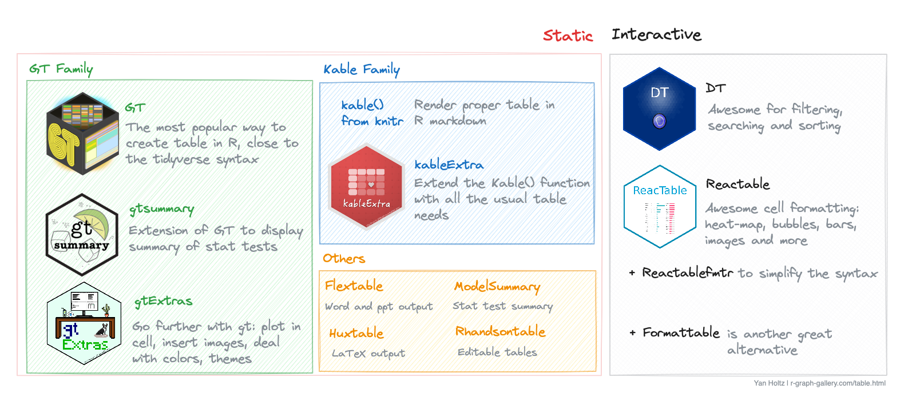
```{r }
library(tidyverse)
library(languageR)
data("lexdec")

# show chinese characters in ggplot
library(showtext)
showtext_auto()


```

## gt

The gt package in R is a powerful tool for creating elegant and customizable tables for data visualization and reporting.

It offers options for formatting, styling, and theming tables, as well as support for handling complex data structures and creating publication-ready tables with ease.

The GT package, stands for "Grammar of Tables". It was created by the RStudio team and first released in 2018. It offers an intuitive, tidyverse-inspired syntax, making table creation accessible, including for beginners.

GT's user-friendly design for handling complex formatting has quickly gained popularity in the R community. Its ease of use and readability make it a go-to choice for many R users seeking to create clear and aesthetically pleasing tables.

```{r}
library(gt)

lexdec%>% 
  group_by(Class, Correct, NativeLanguage)%>%
  summarise(mean = mean(RT))%>%
  ungroup()%>%
  gt()

lexdec%>% 
  group_by(Class, Correct, NativeLanguage)%>%
  summarise(mean = mean(RT))%>%
  #ungroup()%>%
  gt()  

# 添加表格标题和副标题
lexdec%>% 
  group_by(Class, Correct, NativeLanguage)%>%
  summarise(mean = mean(RT))%>%
  ungroup()%>%
  gt() %>%
    tab_header(title = md("词汇**反应时**"),
               subtitle = md("不同词汇 *不同语言背景*"))
# 添加脚注  
lexdec%>% 
  group_by(Class, Correct, NativeLanguage)%>%
  summarise(mean = mean(RT))%>%
  ungroup()%>%
  gt() %>%
  tab_footnote(
    footnote = "Source: lexdec package",
    locations = cells_body(columns = NativeLanguage, rows = 1)
  )


lexdec%>% 
  group_by(Class, Correct, NativeLanguage)%>%
  summarise(mean = mean(RT))%>%
  ungroup()%>%
  gt() %>%
   tab_spanner(
    label = "词汇特征",
    columns = c(Class, Correct)) 


```

### gtsummary
The gtsummary package lets you automatically summarize information about your dataset. In the following case, we use the tbl_summary() function to obtain the main information on the iris dataset. The package detects the variable type and generates the appropriate summary type.
```{r}
library(gtsummary)
lexdec%>% 
   tbl_summary()


lexdec %>%
  select(Class, Correct, NativeLanguage, RT)%>%
  tbl_summary(
    by=NativeLanguage, # group by the `vs` variable (dichotomous: 0 or 1)
    statistic = list(
      all_continuous() ~ "{mean} ({sd})", # will display: mean (standard deviation)
      all_categorical() ~ "{n} / {N} ({p}%)" # will display: n / N (percentage)
    )
  ) %>%
  add_overall() %>% # statistics for all observations
  add_p() %>% # add p-values
  bold_labels() %>% # make label in bold
  italicize_levels() # make categories in label in italic


```

### gtExtras
gtExtras augments and expands the functionalities of the gt package. It allows to create even more sophisticated and visually appealing tables.

It comes with a set of themes to make your table good-looking with just one more line of code. It provides functions to easily add plots in table cells. It also has helper functions to help with colors and icons.

```{r}
#install.packages("gtExtras")
library(gtExtras)

# create aggregated dataset
agg_iris = iris %>%
  group_by(Species) %>%
  summarize(
    Sepal.L = list(Sepal.Length),
    Sepal.W = list(Sepal.Width),
    Petal.L = list(Petal.Length),
    Petal.W = list(Petal.Width)
    )
agg_lexdec = lexdec %>%
  select( NativeLanguage, RT, Frequency, FamilySize)%>%
  group_by(NativeLanguage)%>%
   summarize(
    RT= list(RT),
    Frequency = list(Frequency),
    FamilySize = list(FamilySize)
    )
# display the table with default output with gt package
agg_lexdec  %>%
  gt()


agg_lexdec %>%
  gt() %>%
  gt_plt_sparkline(RT) %>%
  gt_plt_sparkline(Frequency) %>%
  gt_plt_sparkline(FamilySize)


agg_lexdec %>%
  gt() %>%
  gt_plt_dist(
   RT,
    type = "density" 
  ) %>%
  gt_plt_dist( 
    Frequency,
    type = "boxplot"
  ) %>%
  gt_plt_dist( 
    FamilySize,
    type = "histogram"
  ) 

head(lexdec) %>%
  select( NativeLanguage, RT, Frequency, FamilySize)%>%
  gt() %>%
  gt_plt_bar_pct(
    RT,
    labels = TRUE
  ) %>%
  gt_plt_bar_pct(
    Frequency,
    labels=FALSE,
    fill = "forestgreen"
  )

lexdec%>%
  select( NativeLanguage, RT, Frequency, FamilySize)%>%
  gt_plt_summary()
```

## DT: easy filtering & sorting
DT stands for "DataTables", the Javascript library it interacts with. DT stands out for its ability to handle large datasets efficiently and its rich array of features like searching, sorting, and pagination.

I love adding a DT table at the beginning of my data analysis Quarto report. It provides access to your raw data easily!

Please check my full introduction to DT for more! Oh and this is how a DT table looks like:
```{r}
library(DT)

lex.table <- 
  datatable(lexdec,
  filter = "top",
  class = 'cell-border stripe hover compact'
) # put it at the top of the table


```

flextable is another solid option to create very polish static tables. It supports a wide range of formatting options, including merging cells, rotating text, and conditional formatting.

It stands out due to its compatibility with various R Markdown formats, including Word, PowerPoint, and HTML.


```{r}
library(flextable)
set_flextable_defaults(
  font.family = "Arial", font.size = 10, 
  border.color = "gray", big.mark = "")

ft <- flextable(head(lexdec)) |> 
  bold(part = "header") 
ft

ft |> 
  highlight(i = ~ RT > 6.3, j = "RT", color = "#ffe842") |> 
  bg(j = c("Frequency", "FamilySize", "Length"), 
     bg = scales::col_quantile(palette = c("wheat", "red"), domain =NULL)) |> 
  add_footer_lines("The 'lexdec' dataset")


select(lexdec, c("Frequency", "FamilySize", 
                 "Length","NativeLanguage")) %>% 
  summarizor(by = c("NativeLanguage")) |> 
  flextable::as_flextable(spread_first_col = TRUE)
```

## modelsummary

```{r}
library(modelsummary)
library(tinytable)
datasummary_skim(lexdec)


datasummary_balance(~NativeLanguage, lexdec)

datasummary_correlation(lexdec)

mod <- lm(RT ~ NativeLanguage, data = lexdec)

modelsummary(mod, output = "table.docx")

modelsummary(mod)


```


<!--chapter:end:15-CH16-可视化表-V2.Rmd-->

# 附录3 R-markdown使用示例


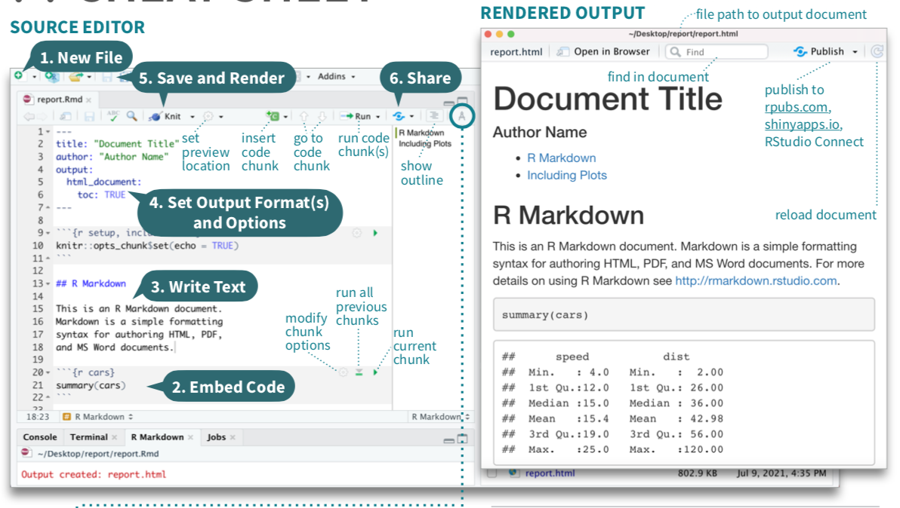
&emsp;&emsp;使用 R Markdown，可以轻松创建一个文档，将代码、代码结果以及任何与分析相关的文本或外部图像结合在一起。本教程大部分都是使用 R Markdown 创建的。

&emsp;&emsp;要创建一个新的 R Markdown 文件，在 R Studio 中选择“文件>新建文件>R Markdown…”。接着，会弹出一个名为“新建 R Markdown”的窗口。


&emsp;&emsp;在这里，可以指定要创建的文件类型。标准类型是文档（HTML、PDF 或 Word），但您也可以选择其他选项，例如创建幻灯片（演示文稿）。由于 HTML 文件不像 PDF 和 Word 那样有传统的“页面”分隔，因此一般推荐使用 HTML 格式。此时还可以在各自的字段中为您的文档选择标题和作者名。最后，选择“确定”以创建新 R Markdown 文件。新文件会像创建新脚本时一样出现在R Studio 会话中。


&emsp;&emsp;R Markdown 文档时，看起来类似于一个脚本编辑器。有三个主要部分：**前置部分**、**代码块**和**注释图文**。

## YAML前置部分

&emsp;&emsp;前置部分，为 R Markdown 指定设置和标题信息。例如，设置输出文档时使用的文件类型。

**1、题目**

YAML中定义

> title:"语言数据科学教程"

**2、作者、单位、时间**
，
> author: “XXX作者”。

若有多个作者，可用[]将多个作者包裹，作者间用逗号分隔。

> author: [XXX^1^,XXX^2^]，结果每个作者占一行。

> author:
> - name: "作者^1^,作者^2^"
>  affiliation: " ^1^XXX大学; \n ^2^XXX大学 "

> date: " `r format(Sys.time(), '%B %d, %Y')` "

**3、目录**
YAML中定义，常见参数如下：
- toc: yes 是所有输出格式的通用选项，用以自动生成目录。
- toc_depth: 4 通用选项，控制目录显示深度，即输出文档要显示的目录层级。
- toc_float(默认FALSE): true 适用于输出HTML格式文档。属性为true时，目录变为侧边栏，并固定在屏幕左侧。
- collapsed：false时折叠二级标题以下的标题。
- smooth_scroll(默认true)：是否在鼠标点击目录时添加平滑滚动。
- number_sections(默认FALSE)：若为true，自动添加目录序号。

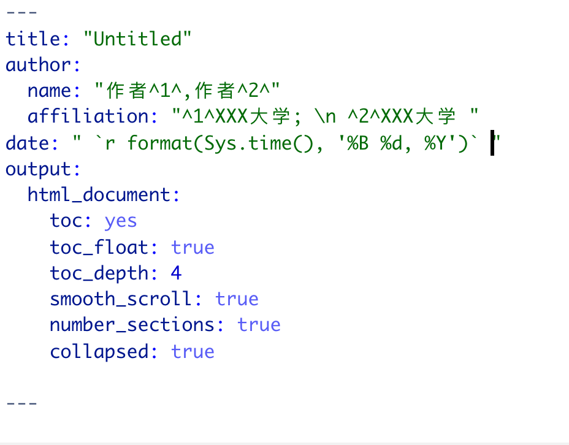
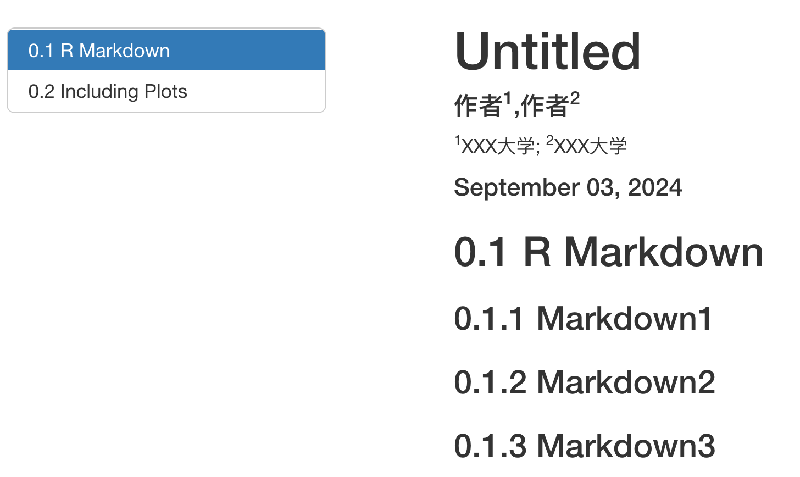

## 代码块


代码块用于放置要运行的 R 代码。通常，会在 Markdown 中包含多个代码块，代表分析的不同部分。当你创建 Markdown 文件并将其转化为文档时，这些代码块会按顺序运行，且它们的输出会按照对应代码块在文档中的位置依次显示。

&emsp;&emsp;一个代码块以 `{r name}` 开始，如以下示例所示：

&emsp;&emsp;你可以看到，代码块以灰色阴影显示，并在右上角显示了几个图标。代码块有几个组成部分。

&emsp;&emsp;首先，代码块命名，可以方便识别代码块的作用，并有助于文档的组织。注意，每个代码块必须有不同的名称，否则在编译 R Markdown 文件时会出现错误。

&emsp;&emsp;在 `{r ...}` 中指定代码块的多个选项，这些选项以逗号分隔。常见选项包括：

- `echo=TRUE` 或 `FALSE`：如果选择 TRUE，代码块中的实际代码会与其生成的结果一起显示在文档中。
```{r testing, echo=TRUE}
library(tidyverse)

```
如果选择 FALSE，代码不会显示，只有输出会显示。

```{r test, echo=FALSE}
library(tidyverse)

```

- `warning=TRUE` 或 `FALSE`：如果选择 TRUE（默认值），代码中的所有警告信息都会包含在文档中。如果选择 FALSE，这些警告信息将不会被包含。

```{r}

```

- `include=TRUE` 或 `FALSE`：如果选择 TRUE（默认值），代码的输出会包含在文档中。如果选择 FALSE，代码仍然会运行，但输出不会包含在文档中。这在某些情况下很有用，例如当你在后续代码块中使用此代码块的某些计算结果，但对该代码块的实际输出不感兴趣时。
```{r}

```
- `eval=` 默认TRUE，当FALSE，只显示代码，不运行代码。
- message = FALSE：不输出提示信息，比如包的载入信息。
- collapse = TRUE：代码块结果放在一个文本块。这个对于编写教程节省空间比较有用。
- cache = TRUE：缓存运行结果，能加速后续再编译。这个对于编写教材中包含运算量较大的模块比较有用。

&emsp;&emsp;右上角的图标中，最右侧的选项用于只运行当前代码块，这对于查看代码块的输出以及/或在创建 R Markdown 文档时验证代码块中的代码是否正确运行非常必要。注意，当你运行一个代码块时，它的输出会显示在该代码块的正下方。要获取代码块生成的所有内容（输出、警告、错误等）。


## Markdown区域

&emsp;&emsp;代码部分以外的空白区域是你放置文档中非 R 代码部分的地方。这个区域的工作方式与 Word 文档类似，你可以在其中放置文本、图像、表格等。这种将 R 代码、其结果与类似 Word 文档的功能结合在一起的方式，使你能够在一个文件中创建一个全面的分析报告。

你还可以格式化此区域内显示的文本。
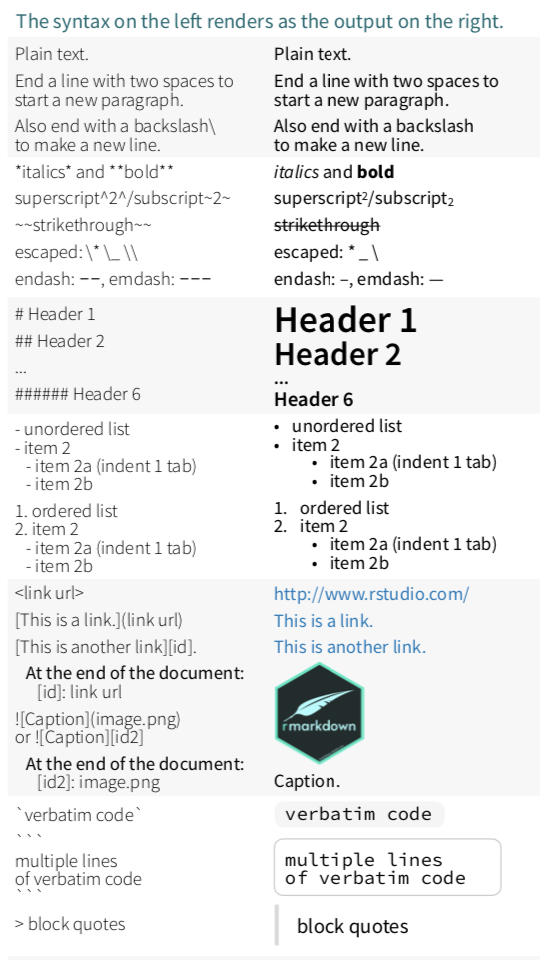

| 功能           | 代码示例                                                                                                                                          | 效果                                                                                                                                          |
| ------------ | --------------------------------------------------------------------------------------------------------------------------------------------- | ------------------------------------------------------------------------------------------------------------------------------------------- |
| **字体：宋体**    | `<font face="宋体">我是宋体</font>`                                                                                                                 | <font face="宋体">我是宋体</font>                                                                                                                 |
| **字体：楷体**    | `<font face="楷体">我是楷体</font>`                                                                                                                 | <font face="楷体">我是楷体</font>                                                                                                                 |
| **字号：5**     | `<font size=5>我是尺寸</font>`                                                                                                                    | <font size=5>我是尺寸</font>                                                                                                                    |
| **字号：10**    | `<font size=10>我是尺寸</font>`                                                                                                                   | <font size=10>我是尺寸</font>                                                                                                                   |
| **颜色：蓝色**    | `<font color=Blue>我是蓝色</font>`                                                                                                                | <font color=Blue>我是蓝色</font>                                                                                                                |
| **颜色：紫色**    | `<font color=#871F78>我是紫色</font>`                                                                                                             | <font color=#871F78>我是紫色</font>                                                                                                             |
| **背景色：黑底白字** | `<font style="background:Black;"color=White>黑色背景白字</font>`                                                                                    | \<font style="background\:Black;"color=White>黑色背景白字</font>                                                                                  |
| **居中对齐**     | `<p style="text-align:center;">这是居中对齐的段落</p>`                                                                                                 | <p style="text-align:center;">这是居中对齐的段落</p>                                                                                                 |
| **右对齐**      | `<p style="text-align:right;">这是右对齐的段落</p>`                                                                                                   | <p style="text-align:right;">这是右对齐的段落</p>                                                                                                   |
| **分散对齐**     | `<p style="text-align:justify">分散对齐</p>`                                                                                                      | <p style="text-align:justify">分散对齐</p>                                                                                                      |
| **首行缩进**     | `<p style="text-indent:32px;">首行缩进：这是一行以上的段落，第1行进行了缩进，之后所有行没有缩进。缩进的宽度是可以调节的，这里展示的常见的缩进两个汉字宽度的形式，可以设置为<code>2em</code>或<code>32px</code>。</p>` | |


```{r}

```


<!--chapter:end:16-CH17-markdown-V2.Rmd-->

